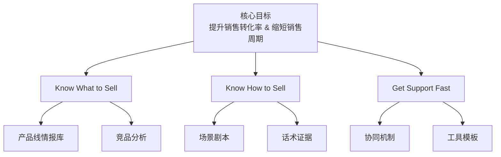

<!--
文件: 00_overview-intro.md
描述: 手册概览、使用说明、4C框架
原始行范围: 1-115
生成时间: 2025-11-20
来源: 比亚迪半导体销售情报支持手册
-->

# 📘 比亚迪半导体销售情报支持手册

**编制目的**：为销售团队提供系统化的市场情报、竞争分析和实战工具  
        **适用对象**：销售团队全体成员、市场部、技术支持团队  
        **更新周期**：季度更新市场数据，月度更新客户动态

---

## 📋 概览目录

第一部分：产品线情报库（Know What to Sell）

- 产品1：碳化硅（SiC）功率器件
- 产品2：IGBT（绝缘栅双极型晶体管）
- 产品3：摄像头模组
- 产品4：车规级LED
- 产品5：电流传感器
- 产品6：MCU（微控制单元）

第二部分：销售场景剧本（Know How to Sell）

- 场景1：客户砍价到底线以下
- 场景2：竞品挖墙脚，如何保住份额
- 场景3：大客户要求独家供应
- 场景4：技术测试不通过
- 场景5：客户投诉质量问题
- 场景6：新客户冷启动（0→1突破）
- 场景7：商务谈判僵局
- 场景8：丢单后复盘与二次进攻

第三部分：快速响应机制（Get Support Fast）

- 销售-市场协同SOP
- 获客渠道开发指南
- 紧急情报支持流程（30分钟响应机制）

第四部分：情报工具箱（Work Smart）

- 麦肯锡式分析模板
- Excel工具包（客户情报收集表、竞品对标分析表等）
- 信息源清单与使用指南

---

## 🎯 手册使用说明

#### 【定位】

本手册是销售团队的"战前准备清单" + "实战工具箱"，帮助销售人员：

- ✅ 快速了解产品的市场定位和竞争态势
- ✅ 掌握不同客户类型的决策链和切入策略  
- ✅ 获得应对典型销售场景的话术和证据链
- ✅ 在需要时快速获得市场部的情报支持

#### 【使用场景】

| 场景       | 使用方式                                         |
| ---------- | ------------------------------------------------ |
| 客户拜访前 | 查阅目标客户的情报卡片（决策链、痛点、竞争态势） |
| 竞标准备   | 使用竞品对标表和标准话术                         |
| 商机跟进   | 参考采购周期地图，制定阶段性策略                 |
| 异议处理   | 查找对应场景的应对话术和证据材料                 |
| 紧急求助   | 按照快速响应流程联系市场部获取支持               |

#### 【更新机制】

- 📅 **季度更新**：市场规模数据、技术趋势、竞品动态
- 📅 **月度更新**：客户情报、价格信息、标杆案例
- 📅 **实时更新**：重大市场事件、客户异动、竞品新品发布

---

🏗️ 手册总体框架（金字塔原理）

#### 四层结构说明

| 层级                                               | 核心问题                       | 方法论                                             | 输出物                 |
| -------------------------------------------------- | ------------------------------ | -------------------------------------------------- | ---------------------- |
| **第一层：产品线情报库** （Know What to Sell） | 我们卖什么，市场在哪，对手是谁 | 4C框架 （Context/Customer/Competitor/Company） | 每个产品的完整情报卡片 |
| **第二层：销售场景剧本** （Know How to Sell）  | 遇到XX情况怎么办               | 场景分类 + STAR案例 + 标准话术                     | 8大典型场景的应对指南  |
| **第三层：快速响应机制** （Get Support Fast）  | 需要帮助找谁，多快能拿到       | 销售-市场协同SOP                                   | 30分钟紧急响应流程     |
| **第四层：情报工具箱** （Work Smart）          | 用什么工具提升效率             | 麦肯锡分析框架 + Excel模板                         | 可直接使用的工具包     |

---

### 📊 4C情报框架说明

本手册采用麦肯锡4C竞争分析框架对每个产品进行结构化梳理：

| 维度                                | 核心内容                                                     | 分析工具                                     |
| ----------------------------------- | ------------------------------------------------------------ | -------------------------------------------- |
| **C1: Context** （市场环境）    | • 市场规模与增速（用数据说话） • 技术演进路线图（未来3年趋势） • 应用场景拆解（价值链分析） | 市场规模数据 技术路线图 价值链分析   |
| **C2: Customer** （客户情报）   | • 目标客户分级矩阵（优先级排序） • 客户决策链分析（找到关键人） • 客户采购周期地图（把握节奏） | 客户分级矩阵 决策链图谱 采购周期地图 |
| **C3: Competitor** （竞争分析） | • 竞争格局与市场份额 • 竞品深度对标（参数/价格/服务） • 竞争策略与应对话术 | 市场份额图 竞品对标表 应对话术库     |
| **C4: Company** （自身能力）    | • 差异化价值主张（3句话说清优势） • 标杆案例库（STAR格式） • 能力证明材料清单（随身携带） | 价值主张卡片 STAR案例库 证明材料清单 |

# 第一部分：产品线情报库

