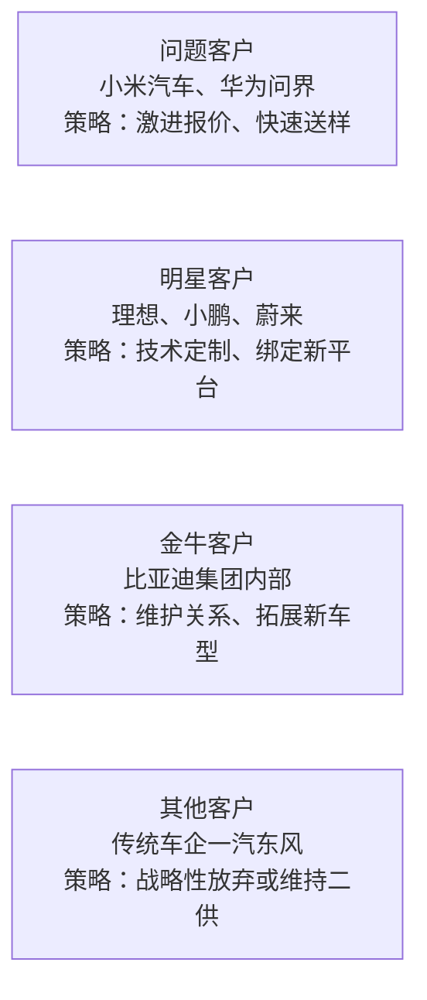
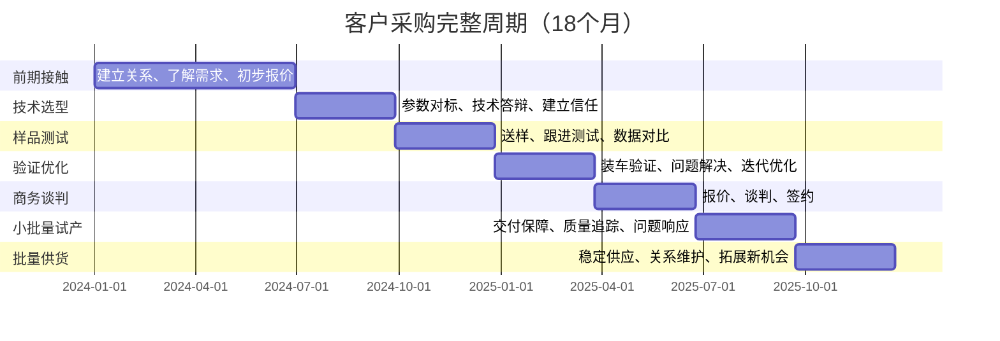
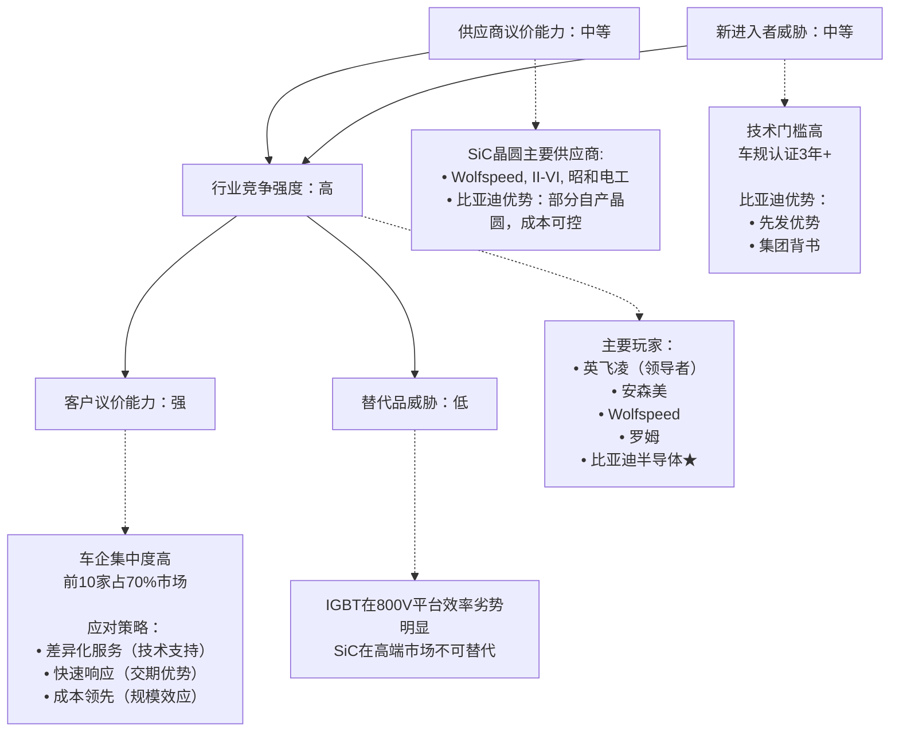

<!--
文件: 01_product-sic.md
描述: 产品1：碳化硅（SiC）功率器件
原始行范围: 116-918
生成时间: 2025-11-20
来源: 比亚迪半导体销售情报支持手册
-->

## 产品1：碳化硅（SiC）功率器件

---

### 📊 C1: Context - 市场环境情报

#### 市场规模与增速

**全球车规SiC市场：**

| 年份         | 市场规模               | 备注            |
| ------------ | ---------------------- | --------------- |
| 2024年       | $2.3B（约160亿人民币） | 当前市场        |
| 2027年       | $5.8B                  | 年复合增长率35% |
| 中国市场占比 | 40%（约64亿人民币）    | -               |

**数据来源：** Yole Intelligence 2024

---

**💡 销售洞察：**
- SiC是增速最快的功率器件赛道，窗口期2024-2026年
- 需要在这3年内快速抢占市场份额

---

#### 技术演进路线图

| 时间节点  | 技术趋势                    | 对销售的影响                         | 销售策略                   |
| --------- | --------------------------- | ------------------------------------ | -------------------------- |
| 2024-2025 | 800V平台渗透率： 15%→30% | SiC成为高端车标配 需求爆发期      | 重点攻坚 蔚小理等新势力 |
| 2026-2027 | SiC模块功率密度 提升50%  | 客户关注散热设计 技术支持需求增加 | 提供整套 热管理方案     |
| 2028+     | 1200V SiC进入 商用车领域 | 新市场打开                           | 提前布局 重卡/客车市场  |

---

### 应用场景拆解（价值链分析）

#### 车规SiC应用全景图

**主驱逆变器（70%需求量）- 核心战场**

| 车型级别              | SiC渗透率           | 单车价值     | 代表车型                    |
| --------------------- | ------------------- | ------------ | --------------------------- |
| 高端车型（>30万元）   | 80%（基本标配）     | ¥2,000-3,500 | 理想L9、蔚来ET7、比亚迪仰望 |
| 中端车型（15-30万元） | 35%（快速增长中）   | ¥1,500-2,200 | 小鹏P7、比亚迪海豹、零跑C11 |
| 经济车型（<15万元）   | <5%（仍以IGBT为主） | -            | 短期内不是SiC的目标市场     |

---

**车载充电OBC（20%需求量）- 增量市场**

| 应用                         | 单车价值   | 技术优势                  |
| ---------------------------- | ---------- | ------------------------- |
| 22kW+大功率快充：SiC模块需求 | ¥800-1,500 | 充电效率提升、体积减小40% |

---

**DC-DC转换器（10%需求量）- 补充市场**

| 应用                    | 单车价值 |
| ----------------------- | -------- |
| 800V→12V降压：SiC二极管 | ¥300-600 |

---

**💡 销售策略建议：**
1. **主攻方向：** 主驱逆变器（利润率高+技术门槛高）
2. **突破路径：** 先高端车型建立品牌→再向中端车型渗透
3. **打包销售：** 主驱+OBC+DC-DC整套方案（提升客单价）

---

### 🎯 C2: Customer - 客户情报

#### 目标客户分级矩阵（波士顿矩阵应用）

---

#### 客户类型详解

##### ⭐⭐⭐ 问题客户（优先级最高）

| 属性     | 内容                                                         |
| -------- | ------------------------------------------------------------ |
| 代表     | 小米汽车、华为问界、智己汽车                                 |
| 特征     | 高增长潜力，但当前份额低                                     |
| 机会     | 新车型窗口期，供应商尚未锁定                                 |
| 策略     | • 初期让利（前5K台车按成本价） • 快速响应（2周送样，行业通常4周） • 高层公关（利用比亚迪品牌背书） |
| 年需求量 | 单客户3-8万套                                                |
| 预期收益 | 3年累计营收¥3-8亿元                                          |

---

##### ⭐⭐ 明星客户（持续投入）

| 属性     | 内容                                                         |
| -------- | ------------------------------------------------------------ |
| 代表     | 理想、小鹏、蔚来                                             |
| 特征     | 已有一定份额，需求持续增长                                   |
| 机会     | 新平台定点、二供机会                                         |
| 策略     | • 联合开发（投入研发资源绑定） • 技术升级（提供下一代SiC方案） • 服务深化（驻场FAE、专属产线） |
| 年需求量 | 单客户5-15万套                                               |
| 预期收益 | 稳定增长，长期价值高                                         |

---

##### ⭐ 金牛客户（稳定维护）

| 属性     | 内容                                                         |
| -------- | ------------------------------------------------------------ |
| 代表     | 比亚迪集团内部                                               |
| 特征     | 份额稳定，增长放缓                                           |
| 机会     | 新车型拓展、产品升级                                         |
| 策略     | • 确保交付（优先级保障） • 持续降本（年降5-8%） • 挖掘新需求（商用车、混动等） |
| 年需求量 | 集团内部年100万套+                                           |
| 预期收益 | 稳定现金流，利润率中等                                       |

---

##### 其他客户（选择性放弃）

| 属性 | 内容                                                         |
| ---- | ------------------------------------------------------------ |
| 代表 | 一汽、东风等传统国企                                         |
| 特征 | 增长慢、份额低、决策周期长                                   |
| 机会 | 有限（技术路线保守、供应商关系固化）                         |
| 策略 | • 不主动投入资源 • 等待新平台窗口（每3-5年一次） • 或完全放弃（聚焦优质客户） |

---

### 客户决策链分析（DMU决策单元模型）

#### 案例：理想汽车的SiC采购决策链

**第一层：技术准入层（权重40%）- 门槛决策**

| 要素                        | 内容                                                         |
| --------------------------- | ------------------------------------------------------------ |
| 关键角色                    | 动力系统总工程师/电控部门技术负责人                          |
| 决策逻辑 （一票否决权） | ✓ 性能参数是否满足（Rdson、开关损耗、热阻） ✓ 可靠性如何保证（车规认证、实车验证里程） ✓ 技术支持能力（仿真模型、应用指导） |

**我们的渗透策略：**

1. **提供详细技术白皮书**
   - 对标英飞凌同等级产品
   - 参数差异<5%的说明

2. **邀请参观比亚迪应用案例**
   - 仰望U8实车演示（同样800V平台）
   - 提供实测数据（功率曲线、温升曲线）

3. **免费技术支持**
   - 送测样品10套
   - 应用工程师驻场3个月
   - 提供Saber/PLECS仿真模型

**标准话术模板：**

> "理想在开发新一代800V平台对吧？我们在比亚迪仰望U8（也是800V）上已经量产2年，累计装车5万辆，可靠性数据完全可以共享。您的性能指标是Rdson<3mΩ对吧？我们这款BYD-SiC-650V-300A完全满足，而且热设计余量更大。这是仿真对比报告..."

---

**第二层：商务决策层（权重40%）- 核心决策**

| 要素                        | 内容                                                         |
| --------------------------- | ------------------------------------------------------------ |
| 关键角色                    | 采购部品类经理/采购总监                                      |
| 决策逻辑 （最终决策权） | ✓ 价格是否有竞争力（需比现有供应商低10%+） ✓ 供应稳定性（产能、交期、备货能力） ✓ 商务条款（账期、VMI、年降承诺） |

**我们的渗透策略：**

1. **初期报价激进**
   - 比英飞凌低20-25%
   - 前期甚至可以零利润（后续订单补回）

2. **供应保障承诺**
   - 深圳+长沙双基地背书
   - 提供产能承诺函（盖章）
   - 理想专属安全库存（2周用量）

3. **灵活商务条款**
   - 账期Net 60天（行业通常30天）
   - 小批量起订（5K起，英飞凌要10K）
   - 年降承诺：5%/年（未来3年）

**标准话术模板：**

> "X总，我理解理想对成本的要求。您现在用英飞凌的价格大概¥420/套对吧？（如果对方不说，就用行业通常价格）我们初期可以给到¥336（低20%），后续3年每年降5%。为什么我们能做到？（展示成本结构图）
> 1）自有晶圆厂，少一层加价
> 2）规模效应，比亚迪集团年需求100万套
> 3）本土化运营，没有进口成本
> 这不是倾销，是商业模式优势。您可以看我们给吉利的报价历史，连续3年兑现了年降承诺..."

---

**第三层：高层背书层（权重20%）- 战略决策**

| 要素                      | 内容                                                         |
| ------------------------- | ------------------------------------------------------------ |
| 关键角色                  | 采购VP/供应链VP/分管副总裁                                   |
| 决策逻辑 （战略背书） | ✓ 供应商战略安全性（不能断供） ✓ 品牌背书（比亚迪集团是加分项） ✓ 长期合作价值（生态合作，非单一交易） |

**我们的渗透策略：**

1. **强调比亚迪集团背景**
   - 王传福支持国产半导体
   - 全球最大新能源车企背书

2. **提出生态合作**
   - 联合开发下一代产品
   - 技术共享（比亚迪应用经验开放）

3. **邀请高层互访**
   - 理想高层参观深圳/长沙工厂
   - 比亚迪高层拜访理想（释放重视信号）

**标准话术模板：**

> "X总您好，我们不仅是供应商，更希望成为理想的战略合作伙伴。比亚迪集团在新能源领域的积累，可以对理想开放。比如我们的800V SiC应用经验，是基于50万辆车的实际数据优化的，这些know-how可以共享给理想团队。另外，我们在IGBT、MCU、传感器都有布局，未来可以提供'one-stop'方案..."

---

### 客户采购周期地图

---

### 采购周期各阶段详解

#### 阶段1：前期接触（T-18 to T-12）

| 要素       | 内容                                                         |
| ---------- | ------------------------------------------------------------ |
| 客户状态   | 新平台立项，开始调研供应商                                   |
| 关键任务   | • 建立关系（技术交流会、展会接触） • 了解需求（平台参数、技术路线） • 初步报价（吸引客户兴趣） |
| 市场部输出 | ✓ 客户背景调研报告（公司、产品、技术路线） ✓ 竞品供应商分析（客户现在用谁的？） ✓ 初步技术方案（匹配客户需求） |
| 销售动作   | ✓ 拜访技术部门（建立信任） ✓ 提供技术白皮书 ✓ 邀请参观比亚迪应用案例 |
| 成功标志   | 被列入供应商候选清单                                         |

---

#### 阶段2：技术选型（T-12 to T-9）

| 要素       | 内容                                                         |
| ---------- | ------------------------------------------------------------ |
| 客户状态   | 对比3-5家供应商的技术方案                                    |
| 关键任务   | • 参数对标（证明我们不比竞品差） • 技术答辩（回答客户疑虑） • 建立技术信任 |
| 市场部输出 | ✓ 竞品详细对标表（参数/价格/服务） ✓ 比亚迪应用案例数据（可靠性证明） ✓ 技术支持计划（FAE/仿真/培训） |
| 销售动作   | ✓ 技术交流会（带技术专家） ✓ 提供仿真模型+参考设计 ✓ 承诺技术支持（驻场FAE） |
| 成功标志   | 技术方案通过客户评审                                         |

---

#### 阶段3：样品测试（T-9 to T-6）

| 要素       | 内容                                                         |
| ---------- | ------------------------------------------------------------ |
| 客户状态   | 实际测试样品，验证性能                                       |
| 关键任务   | • 送样（快速响应） • 跟进测试（及时解决问题） • 数据对比（vs竞品实测） |
| 市场部输出 | ✓ 样品快速生产（插队优先） ✓ 测试数据分析（帮客户解读） ✓ 问题快速响应（技术支持） |
| 销售动作   | ✓ 送样10-20套（免费） ✓ FAE驻场支持（实时答疑） ✓ 收集测试反馈（每周沟通） |
| 成功标志   | 测试数据达标，客户认可                                       |

---

#### 阶段4：验证优化（T-6 to T-3）

| 要素       | 内容                                                         |
| ---------- | ------------------------------------------------------------ |
| 客户状态   | 整车装车测试，发现问题优化                                   |
| 关键任务   | • 装车验证（20-50辆测试车） • 问题解决（EMC/散热/可靠性） • 迭代优化（2-3轮改进） |
| 市场部输出 | ✓ 技术问题响应（48小时内方案） ✓ 优化样品生产（快速迭代） ✓ 第三方测试报告（增强信任） |
| 销售动作   | ✓ 每周进度跟踪（主动沟通） ✓ 协调资源（技术/生产/质量） ✓ 准备商务谈判（价格/条款） |
| 成功标志   | 整车测试通过，准备定点                                       |

---

#### 阶段5：商务谈判（T-3 to T0）

| 要素       | 内容                                                         |
| ---------- | ------------------------------------------------------------ |
| 客户状态   | 技术通过，开始商务谈判                                       |
| 关键任务   | • 报价（平衡价格与利润） • 谈判（账期/MOQ/年降/质保） • 签约（框架协议） |
| 市场部输出 | ✓ 竞品价格情报（底价是多少？） ✓ 成本分析支持（我们底线在哪？） ✓ 商务条款建议（灵活空间） |
| 销售动作   | ✓ 正式报价（书面+详细说明） ✓ 多轮谈判（坚守底线，适度让步） ✓ 高层拍板（必要时请示总经理） |
| 成功标志   | 签订定点函/框架协议                                          |

---

#### 阶段6：小批量试产（T0 to T+3）

| 要素       | 内容                                                         |
| ---------- | ------------------------------------------------------------ |
| 客户状态   | 新车型SOP前小批量生产                                        |
| 关键任务   | • 交付保障（按时按质按量） • 质量追踪（每批次数据） • 问题响应（8小时内处理） |
| 市场部输出 | ✓ 产能协调（优先保障） ✓ 质量数据分析（每周报告） ✓ 应急预案（备用方案） |
| 销售动作   | ✓ 驻厂跟进（确保装车顺利） ✓ 每日沟通（产线反馈） ✓ 解决问题（现场决策） |
| 成功标志   | 小批量交付100%准时，零重大质量问题                           |

---

#### 阶段7：批量供货（T+3 onwards）

| 要素       | 内容                                                         |
| ---------- | ------------------------------------------------------------ |
| 客户状态   | 正式量产，稳定供货                                           |
| 关键任务   | • 按订单交付 • 维护关系（持续沟通） • 挖掘新机会（其他车型） |
| 市场部输出 | ✓ 客户满意度调查（季度） ✓ 竞品动态追踪（预警） ✓ 新产品推荐（技术升级） |
| 销售动作   | ✓ 月度回顾会议（客户关系维护） ✓ 年降谈判（按承诺执行） ✓ 拓展新车型（增加份额） |
| 成功标志   | 续约率>90%，份额持续提升                                     |

# ⚔️ C3: Competitor - 竞争情报

## 竞争格局分析（波特五力模型）

## 市场份额与趋势（2024年全球车规SiC市场）

### Tier 1 - 国际巨头（技术领先，份额下降中）

| 厂商               | 市场份额 | 年度变化 |
| ------------------ | -------- | -------- |
| 英飞凌（Infineon） | 38%      | -2% YoY  |
| 安森美（Onsemi）   | 16%      | -1% YoY  |
| Wolfspeed          | 12%      | 持平     |
| 罗姆（ROHM）       | 9%       | 持平     |
| **小计**           | **75%**  |          |

### Tier 2 - 本土挑战者（快速增长中）

| 厂商           | 市场份额 | 年度变化 |
| -------------- | -------- | -------- |
| 比亚迪半导体 ★ | 8%       | +3% YoY  |
| 斯达半导       | 6%       | +2% YoY  |
| 三安光电       | 4%       | +1% YoY  |
| 其他国产       | 7%       | +1% YoY  |
| **小计**       | **25%**  |          |

### 💡 市场洞察

**1️⃣ 国产替代窗口期：2024-2026年**
- 国际品牌份额下降（地缘政治+成本劣势）
- 本土品牌份额上升（性价比+供应安全）

**2️⃣ 我们的机会：**
- 3年内目标市占率从8%→15%（翻倍）
- 重点市场：中国（全球40%需求）
- 重点客户：新势力+自主品牌高端车型

**3️⃣ 竞争策略：**
- vs 国际巨头：打"性价比+本土化服务"
- vs 本土对手：打"比亚迪品牌背书+规模优势"

## 主要竞品深度对标

### 竞品1：英飞凌（Infineon）- 高端市场霸主

#### 全维度对比（⭐=1分，满分5分）

| 维度       | 英飞凌          | 比亚迪            | 差距分析                            |
| ---------- | --------------- | ----------------- | ----------------------------------- |
| 品牌力     | ⭐⭐⭐⭐⭐           | ⭐⭐⭐               | 他们领先2分 借比亚迪背书缩小差距 |
| 技术成熟度 | ⭐⭐⭐⭐⭐           | ⭐⭐⭐⭐              | 差距缩小到5%以内                    |
| 产品线宽度 | ⭐⭐⭐⭐⭐ 全系列 | ⭐⭐⭐⭐ 主流产品  | 覆盖90%需求                         |
| 价格竞争力 | ⭐⭐ 基准价    | ⭐⭐⭐⭐⭐ 低20-30% | **核心优势**                        |
| 交期保证   | ⭐⭐⭐ 16周     | ⭐⭐⭐⭐⭐ 10周     | **核心优势** 快6周               |
| 本土化服务 | ⭐⭐⭐ 标准化   | ⭐⭐⭐⭐⭐ 灵活定制 | **核心优势**                        |

#### 具体产品对标（650V/300A SiC模块）

| 参数                  | 英飞凌 HybridPACK | 比亚迪 BYD-SiC-650 | 差异                 |
| --------------------- | -------------------- | --------------------- | -------------------- |
| 额定电压              | 650V                 | 650V                  | 持平                 |
| 额定电流              | 300A                 | 300A                  | 持平                 |
| Rdson                 | 3.0mΩ                | 3.1mΩ                 | +3.3%                |
| 开关损耗              | 2.1mJ                | 2.3mJ                 | +9.5%                |
| 热阻Rth               | 0.18℃/W              | 0.19℃/W               | +5.6%                |
| 封装尺寸              | 122x62mm             | 125x65mm              | 略大                 |
| **批量价格** (5K+) | ¥420                 | ¥336                  | **-20%** **优势** |
| MOQ                   | 1000片               | 500片                 | 更灵活               |
| 交期                  | 16周                 | 10周                  | **快6周**            |
| 质保期                | 5年                  | 5年                   | 持平                 |

#### 💡 销售话术（应对"你们参数不如英飞凌"）

**Step 1 - 承认事实（诚实）：**
> "您说得对，实验室参数我们确实有5-10%的差距。"

**Step 2 - 转换维度（从器件级到系统级）：**
> "但我们要看实际应用效果。我们做过完整的系统仿真，在WLTC工况下，单个SiC模块的10%差异，反映到整车续航上只有0.8km（百公里电耗差0.15kWh）。"

**Step 3 - 给出证据+算TCO账：**
> "您看这是比亚迪仰望U8（用我们SiC）和Model X（用英飞凌）的能耗对比，百公里电耗分别是18.5kWh vs 18.7kWh，基本持平。
>
> 但采购成本上，我们比英飞凌低¥84/套，单车就省¥84，年产10万辆就是840万。这钱足够弥补0.8km续航差异的市场影响了（况且消费者根本感知不到0.8km的差异）。
>
> 您是要参数好看，还是要总成本最优？"

**Step 4 - 强化信任（比亚迪背书）：**
> "而且说实话，比亚迪300万辆车用的就是我们的SiC，如果真有问题，王传福第一个不答应。这是第三方机构的可靠性报告（出示文件），故障率和英飞凌持平。"

---

# 🏢 C4: Company - 自身能力证明

## 差异化价值主张（3×3矩阵）

**定位：性价比之王 + 本土化服务专家**

| 价值维度                | 具体体现                                                     | 证据链                                                       |
| ----------------------- | ------------------------------------------------------------ | ------------------------------------------------------------ |
| **1️⃣ 成本优势** ⭐⭐⭐⭐⭐ | 比国际品牌低20-30%  **为何能做到？** • 自有晶圆厂 • 规模效应 • 本土化运营 | • 垂直整合优势（自有晶圆厂） • 规模效应（年产100万套） • 成本结构透明化分析报告 |
| **2️⃣ 交期保证** ⭐⭐⭐⭐⭐ | 标准品8周 定制品12周  **vs竞品：** • 英飞凌16周 • Wolfspeed18周 | • 深圳+长沙双基地 • 安全库存策略 • 历史准时交付率98.5% • 产能承诺函（盖章版） |
| **3️⃣ 技术支持** ⭐⭐⭐⭐⭐ | 24小时响应 本土化团队  **服务内容：** • 免费仿真支持 • 驻场FAE • 联合开发 | • 12城市FAE团队 • 成功案例：某客户技术问题8小时解决 • 免费设计仿真支持协议 |
| **4️⃣ 品质保证** ⭐⭐⭐⭐  | 车规级认证 集团验证  **可靠性：** • 故障率<10ppm • 行业平均20ppm | • IATF 16949 • AEC-Q101认证 • 比亚迪300万辆车验证 • 故障率统计报告 |
| **5️⃣ 服务灵活** ⭐⭐⭐⭐  | 小批量起订 定制化方案  **优势：** • MOQ 500片 • 参考设计 • 联合开发 | • MOQ 500片（行业通常1000） • 提供参考设计 • 联合开发案例（某客户专属方案） |
| **6️⃣ 供应稳定** ⭐⭐⭐⭐⭐ | 不受国际形势影响  **保障：** • 全国产链 • 双基地布局 • 5年供货承诺 | • 全国产供应链 • 不存在"卡脖子"风险 • 长期供货承诺函（5年+） |

### 30秒电梯演讲（Elevator Pitch）

> "我们是比亚迪半导体，专注车规级SiC功率器件。比亚迪300万辆新能源车都在用我们的产品，可靠性等同国际一线。价格比进口品低20-30%，交期快6周，还有12城市本土化团队支持。如果您在做800V平台的新车型，我们可以提供从样品测试到量产的全程支持。要不我先送您10套样品测试一下？"

## 标杆案例库（STAR格式）

### 案例1：某新势力车企SiC紧急切换项目

**案例标题：3个月完成SiC供应商切换（创行业纪录）**

| 项目信息 | 详情                           |
| -------- | ------------------------------ |
| 客户类型 | 新势力头部车企（月销5000+）    |
| 项目时间 | 2023年Q2-Q4                    |
| 项目价值 | 年营收¥3,500万元，战略意义重大 |

#### 【S - Situation 情境】

**时间：** 2023年5月

**背景：**
客户原用Wolfspeed的SiC模块，因地缘政治因素，交期从12周延长至24周，严重影响新车型量产计划。客户高层要求采购部在3个月内找到替代方案。

**客户痛点：**
- 时间紧迫：新车型8月SOP，留给切换的时间只有3个月
- 风险巨大：切换失败会导致产线停工，损失数亿元
- 技术门槛：SiC模块需要整车级验证，通常需要6-12个月

**竞争态势：**
- 英飞凌：报价高，交期也要16周，无法满足时间要求
- 斯达半导：技术实力不足，客户不信任
- 我们：需要证明3个月能完成的能力

#### 【T - Task 任务】

**项目目标：**
- ✓ 3个月内完成供应商切换（通常需6个月）
- ✓ 性能不能低于Wolfspeed（客户底线）
- ✓ 价格比Wolfspeed低15%+（吸引力）
- ✓ 后续供货稳定（不能再出问题）

**销售挑战：**
- 如何证明我们3个月能做到？（客户最大疑虑）
- 如何在技术上快速追平Wolfspeed？
- 如何在商务上给出有吸引力的条件？

#### 【A - Action 行动】

**Week 1-2：紧急响应 & 建立信任**

| 团队           | 行动内容                                                     |
| -------------- | ------------------------------------------------------------ |
| **销售动作**   | • Day 1：接到客户求助，2小时内上报总经理 • Day 2：总经理亲自致电客户CEO（释放重视） • Day 3：组建8人专项小组（技术/供应链/质量） |
| **市场部动作** | • 紧急调研Wolfspeed产品参数（详细对标） • 调取比亚迪内部SiC应用数据（可靠性证明） • 准备快速切换方案（压缩时间的可行性） |
| **技术动作**   | • 对比我们产品与Wolfspeed的兼容性   └─ 结论：95%兼容，需微调5%参数 • 盘点库存：标准品有5K套现货（可应急） |
| **输出**       | 《3个月切换可行性方案》                                      |

**Week 3-6：快速送样 & 台架测试**

| 阶段         | 内容                                                         |
| ------------ | ------------------------------------------------------------ |
| **技术支持** | • 紧急空运50套样品到客户工厂 • 派3名FAE驻场（24小时待命） • 提供Saber仿真模型（加速客户验证） |
| **测试结果** | • 电气参数：Rdson 3.1mΩ vs Wolfspeed 3.0mΩ   └─ 差异3.3%，客户认为可接受 • 开关损耗：2.3mJ vs 2.1mJ（差异9.5%）   └─ 系统级影响<1%（仿真验证） • 热性能：通过温升测试（Tj<125℃） |
| **客户反馈** | "参数持平，可以进入下一阶段"                                 |

**Week 7-10：整车装车 & 路试验证**

| 阶段         | 内容                                                         |
| ------------ | ------------------------------------------------------------ |
| **验证方案** | • 装车10辆，跑2万公里路测 • 覆盖高温/高寒/高原场景 • 实时监控数据（与Wolfspeed方案对比） |
| **关键突破** | • Week 8发现问题：某工况下温升偏高5℃ • 48小时解决：优化散热基板设计 • 重新送样10套，问题解决 |
| **最终结果** | • 续航差异：<0.5km（客户满意） • 可靠性：零故障 • 客户评价："性能和Wolfspeed没区别" |

**Week 11-12：商务谈判 & 签约**

| 阶段         | 内容                                                         |
| ------------ | ------------------------------------------------------------ |
| **商务策略** | • 报价：¥336（比Wolfspeed低22%） • 让利：前期5K套按成本价供货（建立信任） • 承诺：10周标准交期，专属安全库存 • 质保：5年质保+终身技术支持 |
| **谈判过程** | • 客户初始目标：比Wolfspeed低30% • 我们底线：22%（再低无利润） • 最终成交：22% + 前期成本价（双方满意） |
| **签约成果** | • 获得50%份额（Wolfspeed保留50%作backup） • 3年框架协议（预计供货100万套） • 独家技术支持协议（深度绑定） |

#### 【R - Result 结果】

**商业成果：**
- 2023 Q4开始批量供货，月供3.5万套
- 2024年营收约¥1.37亿元（3.5万 × 12 × ¥336 × 50%）
- 2024年Q2份额提升至70%（客户主动增加）

**客户评价：**
> "比亚迪半导体是唯一能在3个月内完成切换的供应商，快速响应能力和技术支持能力远超预期。"

**战略意义：**
- ✓ 证明了我们的快速响应能力（3个月 vs 行业6个月）
- ✓ 打破"只能供比亚迪内部"的市场认知
- ✓ 树立标杆案例（对其他客户有示范效应）
- ✓ 建立深度绑定关系（客户高度依赖我们的技术支持）

#### 【可复用销售要素】

- ✅ 危机响应速度（2小时组建团队，48小时送样）
- ✅ 高层重视程度（总经理亲自致电，体现对客户的尊重）
- ✅ 技术兼容性设计（95%兼容，降低切换风险）
- ✅ 驻场FAE模式（24小时待命，快速解决问题）
- ✅ 初期让利策略（成本价供货，后续订单补回）
- ✅ 完整解决方案（不只是产品，还有技术支持/供应保障）

#### 【使用场景】

1️⃣ 当客户质疑"你们能否快速响应"时  
2️⃣ 当竞品出现供应问题，我们挖墙脚的时机  
3️⃣ 展示"不只是供应商，是战略合作伙伴"的定位  
4️⃣ 新客户冷启动，需要快速建立信任时

## 能力证明材料清单（销售随身携带）

### 📁 文件夹1：技术能力证明包

**1.1 车规认证证书**
- IATF 16949质量管理体系认证（彩色扫描件）
- AEC-Q101可靠性认证（中英文版）
- ISO 26262功能安全认证ASIL-D（最高等级）
- UL/TÜV第三方安全认证

**1.2 技术文档**
- 《SiC技术白皮书》（与英飞凌对标版，30页）
- Saber/PLECS仿真模型（可提供给客户）
- 《800V平台SiC应用指南》（技术手册，50页）
- FMEA失效模式与影响分析报告

**1.3 专利证书**
- SiC模块相关专利20+项（展示研发实力）

### 📁 文件夹2：质量可靠性证明包

**2.1 比亚迪集团应用数据**
- 历代车型SiC应用清单（15年历史）
- 累计装车量：300万+车辆
- 累计行驶里程：1500亿+公里
- 故障率统计：<10ppm（行业领先）
- 全气候验证报告（-40℃到85℃）

**2.2 第三方测试报告**
- 中汽研对比测试（vs英飞凌/Wolfspeed）
- TÜV可靠性测试报告
  - 温度循环：-40℃到150℃，1000次
  - 功率循环：0到额定功率，10万次
  - 湿热测试：85℃/85%RH，1000小时
- 百万公里路测报告（第三方机构）

**2.3 客户端验证数据**
- 标杆客户应用案例（含测试数据）
- 客户评价摘录（脱敏版）
- 客户满意度调查（NPS评分）

### 📁 文件夹3：商务能力证明包

**3.1 产能证明**
- 工厂产能证书（深圳50万套+长沙50万套）
- 产线照片+视频（展示自动化程度）
- 设备清单（进口高端设备占比80%）
- 产能利用率报告（当前70%，有余量）

**3.2 供应链证明**
- 垂直整合示意图（晶圆→封装→模块）
- 主要供应商清单（上游原材料）
- 备货策略说明（标准品4周安全库存）
- 2020-2024交付准时率（按月统计，平均98.5%）

**3.3 成本优势分析**
- 成本结构图（vs英飞凌/Wolfspeed）
- 规模效应说明（年产100万套带来的单位成本下降）
- 年降承诺模型（未来3年每年降价5%的可行性）

### 📁 文件夹4：服务能力证明包

**4.1 技术支持网络**
- FAE团队分布地图（12城市，30人团队）
  - 北京/上海/广州/深圳/重庆/武汉/长沙/西安/郑州/合肥/天津/宁波
- 工程师资质证书（硕士占比80%，平均经验6年）
- 响应时效承诺书（4小时电话，24小时现场）
- 技术支持案例集（典型问题解决时间<8小时）

**4.2 增值服务清单**
- 免费仿真服务（电磁兼容EMC/热仿真）
- 免费样品政策（首次合作提供20套）
- 定制化开发能力（成功案例3+项）
- 联合实验室方案（与重点客户共建）

**4.3 客户满意度数据**
- NPS（净推荐值）：75分（行业平均60分）
- 客户评价摘录（来自真实客户，脱敏处理）
- 续约率：92%（说明客户用后认可）

### 📁 文件夹5：战略合作证明包

**5.1 比亚迪集团背书材料**
- 集团简介（全球最大新能源车企）
- 王传福发言摘录（支持国产半导体）
- 比亚迪半导体独立上市材料（体现战略重视）

**5.2 生态合作案例**
- 与主机厂的联合开发协议（脱敏版）
- 与高校的产学研合作（技术储备）
- 行业协会任职（中国汽车工程学会委员等）

# 【SiC产品销售实战速查卡】

## 快速查询表：常见客户异议 × 标准回答话术

---

### 异议1："你们的参数不如英飞凌"

**背后原因**：技术不信任

**回答框架（3步骤）**：

**Step 1 - 承认事实：**
"您说得对，实验室参数我们确实有5-10%差距。"

**Step 2 - 转换维度（器件级→系统级）：**
"但在实际应用中，这个差异可忽略。比亚迪汉EV用我们的SiC，百公里电耗12.8kWh，Model 3用英飞凌，12.9kWh，基本持平。"

**Step 3 - 给出证据+算账：**
"采购成本上我们比英飞凌低¥84/套，单车省¥84，年产10万辆就是840万。这钱足够弥补0.8km续航差异（消费者感知不到）。您是要参数好看，还是要TCO最优？"

**证据支撑：**
- ✓ 整车测试报告
- ✓ 第三方验证数据
- ✓ 成本对比表

---

### 异议2："你们产能能保证吗？"

**背后原因**：供应链风险顾虑

**回答框架：**

"我们深圳+长沙双基地，年产能100万套，目前产能利用率70%，完全有余量。而且我们有安全库存机制，标准品常备2周库存。这是我们的产能承诺函（盖章版）。（出示文件）

比亚迪作为全球最大新能源车企，不可能让供应链出问题，这是对您的保障。"

**证据支撑：**
- ✓ 产能承诺函（盖章）
- ✓ 工厂参观邀请
- ✓ 历史交付准时率数据（98.5%）

---

### 异议3："价格为什么比英飞凌便宜这么多？"

**背后原因**：质疑低价=低质

**回答框架：**

"我们的成本优势来自三点：
1. 自有晶圆厂，少一层加价
2. 规模化生产，年产100万套（英飞凌中国产能有限）
3. 本土化运营，没有进口关税和物流成本

不是偷工减料，是商业模式不同。您看这是我们的成本结构图，每一项都有详细说明。"

**证据支撑：**
- ✓ 成本结构对比图
- ✓ 垂直整合示意图
- ✓ 质量数据（PPM<10，证明不是低质）

---

### 异议4："你们是新进入者，可靠性如何保证？"

**背后原因**：风险规避心理

**回答框架（FEAR法）**：

**Fear（理解恐惧）：**
"我完全理解您的顾虑。SiC是核心部件，出问题影响很大。"

**Evidence（提供证据）：**
"但我们不是新进入者，比亚迪2015年就开始研发SiC，已经9年了。累计装车300万辆，行驶里程1500亿公里，故障率<10ppm。"

**Action（行动方案）：**
"如果您还不放心，我们可以：
1. 先从OBC切入（风险小），主驱还用现有供应商
2. 小批量试装1000台，跑6个月验证
3. 提供驻场FAE，每周出测试报告
4. 如果出现质量问题，双倍赔偿"

**Result（预期结果）：**
"吉利、长城都是这样导入的，现在份额都到50%了。"

**证据支撑：**
- ✓ 比亚迪应用历史时间轴
- ✓ 故障率数据
- ✓ 客户成功案例

---

### 异议5："我们已经和Wolfspeed合作了，没必要换"

**背后原因**：转换成本顾虑

**回答框架（TAB策略）**：

**Together（认同）：**
"Wolfspeed确实是SiC领域的领导者，您选择他们说明您对技术有很高的要求。"

**Alternative（提供替代视角）：**
"不过从供应链管理角度，多一个备选供应商总是好的对吧？您不一定现在就切换，但至少有个Plan B。

而且，2023年Wolfspeed因为产能问题，交期延长到24周，很多客户被影响。我们10周交期，供应更稳定。"

**Bridge（搭建桥梁）：**
"我的建议是：主供还用Wolfspeed（不动），但新车型或者扩产部分可以考虑我们（给个30%的份额试试）。

这样您既保持了Wolfspeed的关系，又多了一个备选方案，而且两家供应商竞争，您还能获得更好的价格和服务。

要不我先送您20套样品，您测试一下？测试通过了再谈合作。"

**证据支撑：**
- ✓ 供应链风险案例（Wolfspeed 2023年产能问题）
- ✓ 双供策略的成功案例
- ✓ 免费样品承诺书

