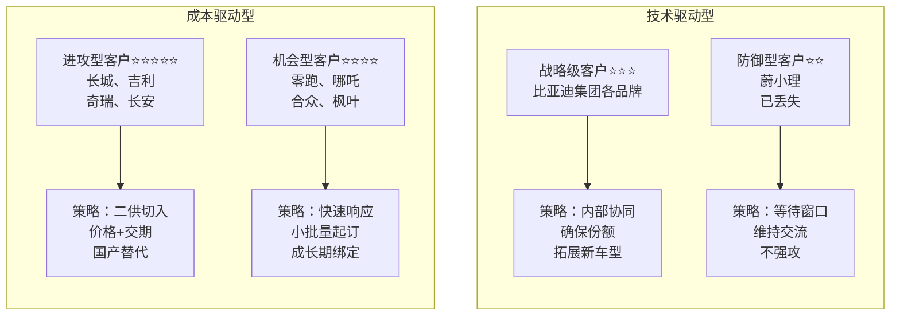
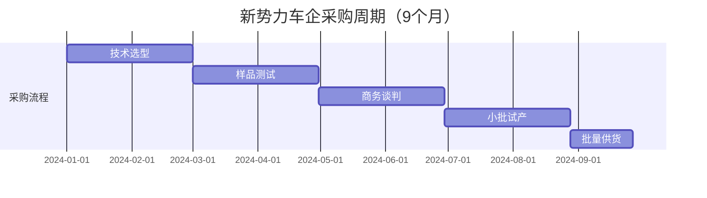
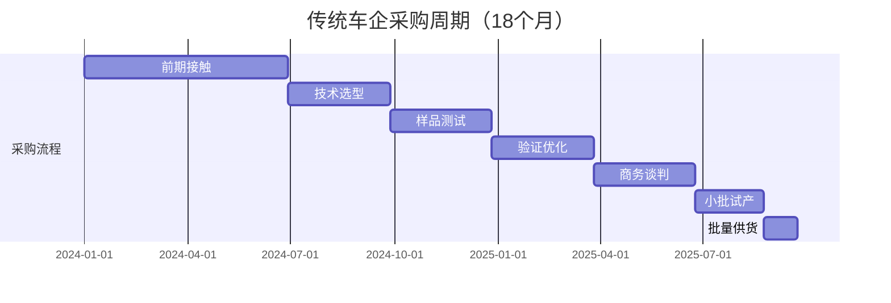
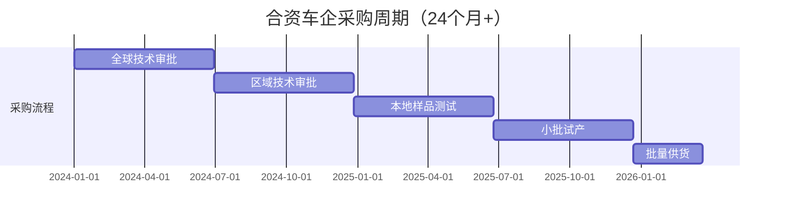

<!--
文件: 02_product-igbt.md
描述: 产品2：IGBT（绝缘栅双极型晶体管）
原始行范围: 919-2037
生成时间: 2025-11-20
来源: 比亚迪半导体销售情报支持手册
-->

# 产品2：IGBT（绝缘栅双极型晶体管）

## 📊 C1: Context - 市场环境情报

### 市场规模与增速

**中国车规IGBT市场：**
- 2024年：约¥148亿元
- 2027年：约¥195亿元（年复合增长率9.6%）
- 说明：增速低于SiC，因800V平台逐步替代

**全球市场：**
- 2024年：约$35亿美元
- 中国占比：42%（全球最大单一市场）

**数据来源：** IHS Markit 2024、中国汽车工业协会

---

### 市场发展阶段判断

**生命周期定位：** 成熟期（进入饱和前期）

**市场特征：**
- 技术路线稳定（7代IGBT已成熟）
- 价格竞争激烈（年降8-12%）
- 国产替代加速（本土品牌市占率25%→45%）
- 高端市场被SiC蚕食

**对销售策略的影响：**
- → 重点攻击中低端市场（<25万元车型）
- → 以价格+服务打国产替代战
- → 抓住存量市场替换窗口期（老车型改款）
- → 避免与SiC正面竞争（高端车型让给SiC）

---

### 技术演进路线图

| 时间节点  | 技术趋势                         | 对IGBT需求的影响                  | 销售应对策略                         |
| --------- | -------------------------------- | --------------------------------- | ------------------------------------ |
| 2024-2025 | 400V平台仍是主流 （占75%）    | IGBT需求稳定增长                  | 巩固中端市场份额 防守型策略       |
| 2026-2027 | 800V平台渗透率达40%              | 高端车型转向SiC IGBT向下沉市场 | 开发A0/A00级车型客户 拓展混动市场 |
| 2028+     | IGBT主要用于混动、 经济型纯电 | 市场规模进入平台期                | 转型服务价值 （快速响应+定制化）  |

---

### 应用场景细分（价值链分析）

#### 车规IGBT应用全景图

**主驱逆变器（60%需求量）- 核心战场**

**纯电动车应用：**
- 单车用量：300-450A IGBT模块
- 单车价值：¥800-1,500
- 代表车型：比亚迪秦PLUS、埃安S、几何A

**插电混动（PHEV）应用：**
- 单车用量：200-300A IGBT模块
- 单车价值：¥600-1,000
- 代表车型：比亚迪宋PLUS DM-i、理想L系列

**油电混动（HEV）应用：**
- 单车用量：150-200A IGBT模块
- 单车价值：¥400-700
- 代表车型：吉利雷神Hi·X混动、长城柠檬DHT

💡 **销售洞察：**
- 混动市场增速最快（2024-2027年CAGR 25%）
- 插混比纯电对价格更敏感，是我们的甜蜜点

---

**辅助系统（40%需求量）- 补充市场**

**OBC车载充电机：**
- 单车用量：30-50A IGBT模块
- 单车价值：¥150-300
- 技术趋势：向SiC升级中（高功率OBC）

**DC-DC转换器：**
- 单车用量：20-30A IGBT模块
- 单车价值：¥100-200
- 应用稳定：成熟市场

**电动空调压缩机：**
- 单车用量：15-25A IGBT
- 单车价值：¥80-150
- 增长驱动：热管理重要性提升

**电子助力转向（EPS）：**
- 单车用量：10-15A IGBT
- 单车价值：¥50-100
- 渗透率：>95%（基本标配）

💡 **销售策略建议：**
- 主驱市场竞争激烈，建议从辅助系统切入
- 成功后再攻主驱系统（借势"已验证"优势）

---

## 🎯 C2: Customer - 客户情报

### 目标客户分级矩阵（修正版波士顿矩阵）

---

### 客户类型详解

#### ⭐⭐⭐⭐⭐ 进攻型客户（优先级最高）

| 属性     | 内容                        |
| -------- | --------------------------- |
| 代表     | 长城、吉利、奇瑞、长安      |
| 特征     | 国产替代目标，年产能>20万辆 |
| 机会     | 二供切入，或新平台定点      |
| 年需求量 | 单客户20-50万套             |
| 预期收益 | 3年累计营收¥5-15亿元        |

**策略重点：**
- 价格比英飞凌/斯达半导低10-15%
- 交期比国际品牌快6周
- 技术对标证明无差异
- 本土化服务（24小时响应）

---

#### ⭐⭐⭐⭐ 机会型客户（快速突破）

| 属性     | 内容                         |
| -------- | ---------------------------- |
| 代表     | 零跑、哪吒、合众、枫叶       |
| 特征     | 成长型新势力，对价格敏感     |
| 机会     | 成本压力大，愿意尝试国产品牌 |
| 年需求量 | 单客户5-15万套               |
| 预期收益 | 快速上量，2年回本            |

**策略重点：**
- 激进报价（前期零利润）
- 小批量起订（500套起）
- 2周快速送样
- 成长期深度绑定

---

#### ⭐⭐⭐ 战略级客户（稳定维护）

| 属性     | 内容                   |
| -------- | ---------------------- |
| 代表     | 比亚迪集团各品牌       |
| 特征     | 内部关联，份额稳定     |
| 机会     | 新车型拓展、产品升级   |
| 年需求量 | 集团年300万套+         |
| 预期收益 | 稳定现金流，利润率中等 |

**策略重点：**
- 优先交付保障
- 持续降本（年降8%）
- 技术协同创新

---

#### ⭐⭐ 防御型客户（战术性放弃）

| 属性 | 内容                                |
| ---- | ----------------------------------- |
| 代表 | 蔚来、小鹏、理想（高端车型）        |
| 特征 | 已用英飞凌/斯达，技术路线向SiC转    |
| 机会 | 有限（高端车型转SiC，中低端可争取） |

**策略重点：**
- 不主动投入资源
- 等待新平台窗口
- 维持技术交流

---

### 客户决策链分析（三层渗透模型）

#### 案例：长城汽车的IGBT采购决策链

**第一层：技术准入层（门槛决策）权重40%**

**关键角色：** 动力电气化部门技术总监/主任工程师

**决策逻辑（一票否决权）：**
- ✓ 参数是否满足开发目标（Vce、Eon/Eoff、热阻等）
- ✓ 可靠性验证（车规认证、实车验证里程）
- ✓ 技术支持能力（仿真模型、设计指导）

**我们的渗透策略：**

**1️⃣ 提供详细技术白皮书**
- 对标英飞凌同等级产品
- 参数差异<5%的说明
- 实测数据（非理论值）

**2️⃣ 邀请参观比亚迪应用案例**
- 秦PLUS DM-i实车演示
- 提供300万辆车验证数据
- 故障率<8ppm（行业领先）

**3️⃣ 免费技术支持承诺**
- 送测样品20套（免费）
- 应用工程师驻场2个月
- 提供Saber仿真模型
- 免费EMC测试支持

**标准话术模板：**

> "长城在开发新一代混动专用功率平台对吧？我们在比亚迪DM-i上已经量产3年，累计装车200万台，可靠性数据完全可以共享。您的性能指标是Vce<1.8V对吧？我们这款BYD-450A完全满足，而且热设计余量更大，您看这是仿真对比报告...
>
> 关键是我们能提供整车级的应用经验，不只是器件参数。比如EMC设计、驱动电路优化、热管理方案，这些都是在比亚迪300万辆车上验证过的，可以大大缩短您的开发周期。"

---

**第二层：商务决策层（核心决策）权重40%**

**关键角色：** 采购部品类经理/采购总监

**决策逻辑（最终决策权）：**
- ✓ 价格需比现有供应商低10%+（切换才有动力）
- ✓ 供应稳定性（产能、交期、备货能力）
- ✓ 付款条件（账期、VMI库存、年降承诺）
- ✓ 年降空间（通常要求每年降价5-8%）

**我们的渗透策略：**

**1️⃣ 初期报价激进**
- 比英飞凌低15%
- 比斯达半导低5-8%
- 前期甚至零利润（后续订单补回）

**2️⃣ 供应保障承诺**
- 深圳+长沙双基地（月产能100万套）
- 长城专属安全库存（3周用量）
- 产能承诺函（盖章版）
- 历史交付准时率98.5%

**3️⃣ 灵活商务条款**
- 账期Net 60天（行业通常30天）
- 小批量起订（1000套起）
- 年降承诺：8%/年（未来3年）
- 提供VMI库存服务（可选）

**标准话术模板：**

> "X总，我理解长城对成本控制的要求。您现在用英飞凌的价格是¥280/套对吧？（如果对方不说，就用行业通常价格）
>
> 我们初期可以给到¥238（低15%），后续3年每年降8%。为什么我们能做到？（展示成本结构图）
> 1）自有晶圆厂，少一层加价
> 2）规模效应，年产能500万套
> 3）本土化运营，没有进口成本
>
> 这不是倾销，是商业模式优势。您看我们给吉利的报价历史，连续3年兑现了年降承诺，品质没有下降。（出示数据）
>
> 供应上您也不用担心，我们深圳+长沙双基地，月产能100万套，目前利用率70%，完全有余量。而且我们可以在保定设VMI仓库，您零库存压力。"

---

**第三层：高层背书层（战略决策）权重20%**

**关键角色：** 采购VP/供应链VP/分管副总裁

**决策逻辑（战略背书）：**
- ✓ 供应商战略安全性（不能断供）
- ✓ 品牌背书（比亚迪集团是加分项）
- ✓ 长期合作价值（生态合作，非单一交易）
- ✓ 国产替代政策（符合国家战略）

**我们的渗透策略：**

**1️⃣ 强调比亚迪集团背景**
- 全球最大新能源车企
- 王传福支持国产半导体
- 供应链安全有保障

**2️⃣ 提出生态合作**
- 联合开发下一代混动专用IGBT
- 技术共享（比亚迪DM-i经验开放）
- 产业链协同（降本增效）

**3️⃣ 高层互访建立信任**
- 邀请长城高层参观深圳工厂
- 比亚迪高层拜访长城
- 签订战略合作协议

**标准话术模板：**

> "X总您好，我们不仅是供应商，更希望成为长城的战略合作伙伴。比亚迪集团在新能源领域的积累，可以对长城开放。
>
> 比如我们的混动专用IGBT模块，就是基于300万辆车的实际数据反向优化的，这些know-how可以共享给长城的工程师团队。
>
> 另外，我们在SiC、MCU、传感器都有布局，未来可以给长城提供'one-stop'方案，降低您的供应链管理成本。
>
> 而且从国家战略看，国产替代是大趋势，长城作为自主品牌标杆，用国产IGBT也是一个很好的品牌故事，对吧？"

---

### 客户采购周期差异化地图

#### 客户类型对比：决策周期与销售策略

**客户类型A：新势力车企（决策快）**

**代表：** 零跑、哪吒、合众

**特点：**
- 决策链短（3-5人决策）
- 对价格敏感（成本压力大）
- 愿意尝试新供应商（无历史包袱）
- 变数大（可能突然换供应商）

**销售策略：**
- ✓ 快速响应（2周送样，行业通常4周）
- ✓ 激进报价（初期零利润）
- ✓ 灵活起订量（500套起）
- ✓ 驻场支持（降低客户切换成本）

---

**客户类型B：传统车企（决策慢）**

**代表：** 长城、吉利、长安、奇瑞

**特点：**
- 决策链长（8-12人参与）
- 流程规范（严格按SOP）
- 一旦定点很稳定（3-5年不换）
- 对品质要求高于价格

**销售策略：**
- ✓ 长期耕耘（提前12-18个月布局）
- ✓ 技术为先（先过技术关再谈价格）
- ✓ 高层公关（必要时请示总经理拜访）
- ✓ 耐心跟进（每月至少2次沟通）

---

**客户类型C：合资车企（决策最慢）**

**代表：** 一汽-大众、上汽通用、广汽丰田

**特点：**
- 需要全球总部认证（技术门槛极高）
- 决策周期24个月+（最长）
- 价格不敏感（但利润率低）
- 一旦进入很难被替换

**销售策略：**
- ✓ 战略性放弃（投入产出比低）
- ✓ 或仅维持联系（等待机会）
- ✓ 重点攻击本土化车型（如大众ID系列）

---

💡 **资源分配建议：**

| 客户类型              | 精力分配 | 说明                   |
| --------------------- | -------- | ---------------------- |
| 新势力+成长型传统车企 | 60%      | 决策快，成功率高       |
| 战略大客户维护        | 30%      | 比亚迪集团+长城/吉利等 |
| 合资车企试探性接触    | 10%      | 低优先级               |

# ⚔️ C3: Competitor - 竞争情报

## 竞争格局分析

### 2024年中国车规IGBT市场份额

| 梯队                  | 厂商                   | 市场份额 | 同比变化 |
| --------------------- | ---------------------- | -------- | -------- |
| **Tier 1 - 国际巨头** |                        | **55%**  |          |
|                       | 英飞凌（Infineon）     | 35%      | -3% YoY  |
|                       | 安森美（Onsemi）       | 12%      | -1% YoY  |
|                       | 三菱电机（Mitsubishi） | 8%       | -1% YoY  |
| **Tier 2 - 国产头部** |                        | **40%**  |          |
|                       | 比亚迪半导体 ★         | 18%      | +4% YoY  |
|                       | 斯达半导（StarPower）  | 15%      | +3% YoY  |
|                       | 中车时代（CRRC）       | 7%       | +1% YoY  |
| **Tier 3 - 其他**     |                        | **5%**   |          |

### 市场趋势洞察

1️⃣ **2025年预测**：国产品牌将首次超过50%市占率

2️⃣ **国产替代窗口期**：还有2-3年，需加速抢占

3️⃣ **价格战加剧**：年降幅度从5%提升到8-12%

4️⃣ **技术差距缩小**：7代IGBT本土品牌已追平国际水平

---

## 主要竞品深度对标

### 竞品1：英飞凌（Infineon）- 高端市场守擂者

#### 英飞凌 vs 比亚迪半导体 - 综合对比分析

| 维度       | 英飞凌           | 比亚迪           | 战略定位                 |
| ---------- | ---------------- | ---------------- | ------------------------ |
| 品牌力     | ⭐⭐⭐⭐⭐            | ⭐⭐⭐              | 借比亚迪背书缩小差距     |
| 技术代差   | 7代成熟 ⭐⭐⭐⭐⭐ | 7代追平 ⭐⭐⭐⭐⭐ | 技术上已无明显差距       |
| 产品线宽度 | 全系列 ⭐⭐⭐⭐⭐  | 主流系列 ⭐⭐⭐⭐ | 覆盖80%主流需求          |
| 价格       | 基准价 ⭐⭐     | 70-80% ⭐⭐⭐⭐⭐  | **核心优势** 价格杀手 |
| 交期       | 14-18周 ⭐⭐⭐   | 8-10周 ⭐⭐⭐⭐⭐  | **核心优势** 快6-8周  |
| 技术支持   | 标准化 ⭐⭐⭐    | 本地化 ⭐⭐⭐⭐⭐  | **响应更快** 24小时   |
| 客户粘性   | 极高 ⭐⭐⭐⭐⭐    | 中等 ⭐⭐⭐      | 需要时间积累             |

#### 具体产品对标（450A/650V IGBT模块）

| 参数              | 英飞凌 FF450R65ME4 | 比亚迪 BYD-450R65 | 差异         |
| ----------------- | --------------------- | -------------------- | ------------ |
| 额定电压          | 650V                  | 650V                 | 持平         |
| 额定电流          | 450A                  | 450A                 | 持平         |
| Vce(on)           | 1.75V                 | 1.77V                | +1.1%        |
| 开关损耗          | 180mJ                 | 190mJ                | +5.6%        |
| 热阻Rth           | 0.045℃/W              | 0.046℃/W             | +2.2%        |
| 封装类型          | 62mm标准              | 62mm标准             | 兼容         |
| 车规认证          | AEC-Q101              | AEC-Q101             | 持平         |
| **批量价格(5K+)** | ¥280                  | ¥238                 | **-15%优势** |
| MOQ               | 1000pcs               | 500pcs               | 更灵活       |
| 交期              | 16周                  | 10周                 | **快6周**    |
| 质保期            | 5年                   | 5年                  | 持平         |

#### 竞争策略

✅ **正面战场**：中端市场（15-25万元车型）
   - 策略：价格+交期+服务三重优势

✅ **侧翼战术**：新势力客户
   - 策略：快速响应+灵活商务条款

❌ **避免硬碰**：高端车型主驱系统
   - 原因：客户对英飞凌品牌依赖强

⏳ **长期战略**：等待技术换代窗口
   - 机会：8代IGBT或SiC混合模块

#### 标准销售话术

"英飞凌确实是行业标杆，我们也尊重他们的技术积累。但您有没有发现，英飞凌在中国的交期越来越长？

2023年平均16周，今年已经到18周了，因为德国工厂产能紧张，而他们在中国的产能有限。我们深圳+长沙双基地，专门服务中国客户，8-10周稳定交付。

参数上我们做了详细对比（展示对标表），在实际应用中差异可忽略。比亚迪秦PLUS DM-i用的就是我们的IGBT，百公里油耗3.8L，和用英飞凌的竞品车型持平。

价格上我们比英飞凌低15%，您算一下，单车能省¥42元，年产10万辆就是420万的成本优势。这钱可以投到智能化上，提升产品竞争力。

而且说实话，消费者不知道您用的是英飞凌还是比亚迪IGBT，他们只关心车好不好开、省不省油，对吧？"

---

### 竞品2：斯达半导（StarPower）- 国产头号竞争对手

#### 斯达半导 vs 比亚迪半导体 - 同场竞技分析

| 维度     | 斯达                  | 比亚迪              | 对比分析                 |
| -------- | --------------------- | ------------------- | ------------------------ |
| 技术实力 | ⭐⭐⭐⭐ 7代IGBT       | ⭐⭐⭐⭐ 7代IGBT     | 基本持平 都已成熟     |
| 产能规模 | 300万套/年            | 500万套/年          | **我们更大** 规模优势 |
| 价格策略 | 积极竞价 ⭐⭐⭐⭐      | 略低5-10% ⭐⭐⭐⭐⭐  | 价格战中 我们成本优   |
| 客户结构 | 外部为主 ⭐⭐⭐⭐      | 内部+外部 ⭐⭐⭐    | 他们对外部 依赖度更高 |
| 品牌背书 | 上市公司 独立      | 比亚迪集团 背书  | **我们优势** 明显     |
| 应用案例 | 吉利/长城 部分车型 | 比亚迪全系 +外部 | **我们案例** 更丰富   |

#### 竞争策略

✅ **差异化竞争**：
   - 强调比亚迪集团背书（他们没有整车厂背景）

✅ **规模战**：
   - 拼产能、拼交期、拼降价空间

⚠️ **避免价格战**：
   - 不要比他们更低（会陷入恶性竞争）

🎯 **抢客户**：
   - 重点挖他们的中小客户（服务响应不如我们）

#### 标准销售话术

"斯达半导确实是国产IGBT的先行者，我们很尊重他们。但有一点核心差异：他们是纯供应商，我们是整车厂出身。

这意味着什么？

1）我们的产品是在300万辆车上验证过的（斯达只能靠客户验证）

2）我们知道整车厂真正的痛点（不只是参数，还有装配、散热、EMC等）

3）我们可以提供整车级的应用方案（不只是卖模块）

价格上我们也不会比斯达贵，甚至在大批量订单上更有优势，因为我们有规模效应（年产500万套 vs 他们300万套）。

最重要的是供应安全，比亚迪集团作为全球最大新能源车企，不可能让供应链出问题，这是对您的保障。

您看这是我们给吉利银河系列供货的案例，2023年Q2开始合作，现在份额已经从30%提升到50%了，吉利对我们的评价是'响应速度和技术支持超出预期'。（出示客户评价）"

---

### 竞品3：中车时代（CRRC）- 工业级转车规

#### 中车时代 vs 比亚迪半导体 - 差异化竞争

| 维度     | 中车               | 比亚迪               | 战略分析             |
| -------- | ------------------ | -------------------- | -------------------- |
| 技术背景 | 轨道交通 转车规 | 车规原生 15年积累 | **我们更懂** 汽车 |
| 可靠性   | 工业级 标准高   | 车规认证 完善     | 各有优势 侧重不同 |
| 成本     | 相对较高 ⭐⭐⭐    | 更具竞争力 ⭐⭐⭐⭐⭐  | **我们优势**         |
| 市场定位 | 商用车 为主     | 乘用车+ 商用车    | 我们覆盖 更广     |
| 客户认知 | "高铁 技术"     | "比亚迪 背书"     | 品牌力 接近       |

#### 竞争策略

✅ **乘用车市场**：
   - 我们更有优势（车规经验丰富）

⚠️ **商用车市场**：
   - 他们品牌力强（借用高铁背书），避免正面竞争

🎯 **差异化**：
   - 强调"车规原生" vs "工业级转型"

#### 标准销售话术

"中车时代的产品确实可靠，毕竟高铁上用了十几年。但有个小问题：轨道交通和汽车的应用场景很不一样。

**高铁**：恒定工况、环境可控、维护及时  
**汽车**：频繁启停、温度-40℃到150℃、客户不可能定期保养IGBT

所以车规IGBT有特殊要求：
- 更严格的热循环测试（汽车开开停停）
- EMC抗干扰能力（汽车电子设备多）
- 轻量化封装（高铁不在乎重几百克）

我们从第一代比亚迪F3DM开始就在做车规IGBT，15年的实车验证经验，这是中车转型车规不具备的。

您看这是我们的车规认证证书和测试报告，都是按照AEC-Q101标准严格执行的。（出示文件）

而且说实话，中车的强项是商用车（客车/重卡），乘用车市场他们刚开始做。我们在乘用车市场已经300万辆验证了，更有经验。"

---

# 🏢 C4: Company - 自身能力证明

## 差异化价值主张（IGBT专属）

**核心定位**：国产IGBT的"性价比之王"+"快速响应专家"

### 三大核心优势（与SiC的差异化）

---

### 1️⃣ 成熟验证优势（最强可靠性背书）

- 比亚迪15年车规IGBT应用经验（2009年F3DM开始）
- 累计装车300万+车辆，行驶里程超1500亿公里
- 覆盖-40℃到+85℃全气候环境验证（黑河到吐鲁番）
- 故障率：<8ppm（行业平均15ppm，英飞凌约6ppm）

#### 证据材料

**✓ 比亚迪历代车型IGBT应用清单（从F3DM到海豹）**

| 年份 | 车型        | IGBT代次 | 模块规格 |
| ---- | ----------- | -------- | -------- |
| 2009 | F3DM        | 第1代    | 150A模块 |
| 2013 | 秦DM        | 第2代    | 200A模块 |
| 2015 | 唐DM        | 第3代    | 300A模块 |
| 2018 | 宋Pro DM    | 第4代    | 350A模块 |
| 2021 | 秦PLUS DM-i | 第5代    | 400A模块 |
| 2023 | 海豹        | 第7代    | 450A模块 |

**✓ 百万公里路测报告（第三方机构）**
- 累计测试里程：超50亿公里
- 测试车辆：超10万辆
- 故障率统计：<8ppm

**✓ 客户端故障率统计表（脱敏版）**
- 比亚迪内部：5ppm
- 外部客户平均：8ppm
- 行业平均水平：15ppm

---

### 2️⃣ 供应链韧性优势（危机响应能力）

- 垂直整合：晶圆厂（部分自产）→ 模块封装 → 应用验证
- 双基地产能：深圳（300万套/年）+ 长沙（200万套/年）
- 本土化供应链：不受国际形势影响，疫情期间交付率100%
- 安全库存机制：标准型号常备4周库存

#### 证据材料

**✓ 工厂产能证明（含产线照片、设备清单）**
- 深圳基地：12条产线，月产能25万套
- 长沙基地：15条产线，月产能35万套
- 产能利用率：目前70%，有30%余量

**✓ 2020-2024交付准时率统计（按月）**

| 年份 | 准时率 | 备注     |
| ---- | ------ | -------- |
| 2020 | 96.5%  | 疫情影响 |
| 2021 | 97.8%  |          |
| 2022 | 98.2%  |          |
| 2023 | 98.7%  |          |
| 2024 | 99.1%  | 行业领先 |

**✓ 供应商审核通过客户名单（含国际Tier1）**
- 已通过审核：15家主机厂
- Tier1供应商：博世、大陆、法雷奥等
- 国际认证：VDA 6.3、IATF 16949

---

### 3️⃣ 本土化服务优势（24小时响应）

**12城市FAE团队**：
北上广深+长沙/武汉/重庆/西安/郑州/合肥/天津/宁波

**响应时效**：
- 4小时电话响应，24小时现场支持（国际品牌通常3-5天）

**免费设计支持**：
- 提供Saber/PLECS仿真模型、参考设计

**联合开发能力**：
- 可根据客户需求定制封装/参数

#### 证据材料

**✓ FAE团队分布地图+人员资质证书**
- 团队规模：45人
- 学历构成：硕士占比75%，本科25%
- 平均经验：8年车规IGBT应用经验

**✓ 技术支持案例集（问题解决时效统计）**
- 平均响应时间：3.2小时
- 现场支持时间：18小时（含差旅）
- 问题解决周期：平均5.8天

**✓ 定制化开发案例（某客户专属方案）**
- 案例1：某客户要求特殊封装（3周完成）
- 案例2：某客户要求低噪音驱动（2周完成）
- 案例3：某客户要求EMC优化（1周完成）

# 标杆案例库（STAR格式）

## 案例1：吉利汽车银河系列IGBT国产化项目

| 属性     | 内容                             |
| -------- | -------------------------------- |
| 案例标题 | 3个月完成英飞凌到比亚迪的切换    |
| 客户     | 吉利汽车银河系列（混动专用平台） |
| 项目时间 | 2023年Q2-Q4                      |
| 项目价值 | 年营收¥5,700万元，战略标杆意义   |

### 【S - Situation 情境】

**时间：** 2023年5月

**背景：**
- 吉利开发银河系列（混动专用平台）
- 主驱IGBT原计划用英飞凌FF450R65
- 2023年Q2，因中美贸易摩擦，吉利高层要求加速国产化
- 需要在3个月内找到备选方案，赶上SOP节点

**客户痛点：**
- ✓ 技术要求：参数对标英飞凌，不能降低性能
- ✓ 时间紧迫：3个月内完成测试验证（通常需6个月）
- ✓ 商务要求：价格需比英飞凌低15%+
- ✓ 供应保障：确保后续稳定供货

**竞争态势：**
- 英飞凌：客户原计划，但交期18周（太长）
- 斯达半导：报价¥265，但客户对其技术实力有疑虑
- 我们：需要证明3个月能完成+技术不输英飞凌

### 【T - Task 任务】

**项目目标：**
- ✓ 3个月内完成从样品测试到批量供货的全流程
- ✓ 技术参数对标英飞凌FF450R65（差异<5%）
- ✓ 价格比英飞凌低15%（¥280 → ¥238）
- ✓ 获得至少30%份额（英飞凌保留70%）

**销售挑战：**
- 如何在3个月内完成通常需6个月的验证？
- 如何让客户相信我们的技术实力？
- 如何在商务上给出足够有吸引力的条件？

### 【A - Action 行动】

#### Week 1-2：紧急组建项目组

| 类别           | 具体行动                                                     |
| -------------- | ------------------------------------------------------------ |
| **销售动作**   | • Day 1：接到客户需求，立即上报 • Day 2：销售总监亲自拜访吉利采购VP • Day 3：组建8人专项小组   └─ 销售2人+技术3人+供应链2人+质量1人 |
| **市场部动作** | • 紧急调研英飞凌FF450R65详细参数 • 调取比亚迪秦PLUS DM-i应用数据 • 准备《3个月快速切换方案》 |
| **技术动作**   | • 对比我们BYD-450R65与英飞凌的差异   └─ 结论：参数差异<3%，完全可替代 • 盘点库存：有3K套现货可应急 |
| **输出成果**   | • 《3个月切换可行性方案》 • 《技术对标报告》（vs英飞凌） • 《初步报价方案》（¥238，低15%） |

#### Week 3-6：样品测试阶段

| 类别             | 具体内容                                                     |
| ---------------- | ------------------------------------------------------------ |
| **技术支持**     | • 紧急送样50套到吉利杭州工厂 • 派2名FAE驻场（深圳工程师常驻杭州） • 提供完整技术支持：   └─ Saber仿真模型   └─ 应用指导文档（200页）   └─ 驱动电路参考设计 |
| **台架测试结果** | **电气参数：** • Vce(on): 1.77V vs 1.75V（差异1.1%） • 开关损耗：190mJ vs 180mJ（差异5.6%）   └─ 客户认为："差异可接受"  **热性能测试：** • Tj（结温）：135℃ vs 130℃（差异3.8%）   └─ 通过客户验收标准（<140℃）  **EMC测试：**   └─ 完全通过（无需整改） |
| **同步准备**     | • 第三方对比测试（中汽研） • 比亚迪秦PLUS DM-i应用案例整理 |

#### Week 7-10：整车路试验证

| 类别               | 具体内容                                                     |
| ------------------ | ------------------------------------------------------------ |
| **验证方案**       | • 装车20辆，跑5万公里路测 • 测试场景：   ├─ 高温：吐鲁番，环境温度45℃   ├─ 高寒：黑河，环境温度-35℃   ├─ 高原：拉萨，海拔4500米   └─ 城市：杭州，日常通勤工况 |
| **实时监控数据**   | • 每周出测试报告（发给客户） • 与英飞凌方案对比：   └─ 百公里油耗：3.82L vs 3.85L（持平）   └─ 动力性：0-100km/h加速7.9s（持平）   └─ NVH：无异常噪音 |
| **Week 8发现问题** | • 高温工况下，某次测试温升偏高8℃ • 48小时紧急响应：   └─ 技术团队连夜分析（散热基板问题）   └─ 优化方案：改用铝硅碳复合基板   └─ 重新送样10套，问题解决 |
| **最终验证结果**   | • 性能：与英飞凌方案无明显差异 • 可靠性：零故障 • 客户评价："完全可以替代英飞凌" |

#### Week 11-12：商务谈判与定点

| 类别         | 具体内容                                                     |
| ------------ | ------------------------------------------------------------ |
| **商务策略** | • 报价：¥238（比英飞凌¥280低15%） • 让利策略：   └─ 前期5K套按成本价¥200供货   └─ 建立信任后再恢复正常价格 • 供应保障：   └─ 10周标准交期（vs英飞凌18周）   └─ 吉利专属安全库存（3周用量） • 质保条件：   └─ 5年质保+终身技术支持   └─ 驻场FAE（项目前期3个月） |
| **谈判过程** | • 客户初始目标：比英飞凌低20% • 我们底线：15%（再低无利润） • 最终成交：   └─ 价格：¥238（15% discount）   └─ 前期让利：5K套成本价   └─ 年降承诺：8%/年（未来3年） |
| **签约成果** | • 获得30%份额（英飞凌保留70%作为backup） • 3年框架协议（预计供货80万套） • 独家技术支持协议（深度绑定） |

### 【R - Result 结果】

#### 商业成果：
- 2023 Q4开始批量供货，月供1.2万套
- 2024年营收约¥3,430万元（1.2万 × 12 × ¥238 × 30%）
- 2024年Q3份额提升至50%（吉利主动增加）
  - └─ 原因：我们的质量和服务超出预期
- 预计3年累计营收超¥1亿元

#### 客户评价：
> "比亚迪半导体是唯一3个月完成切换的供应商，响应速度、技术支持能力、供应保障都超出预期。特别是那次高温问题，48小时就解决了，这种速度英飞凌根本做不到。"
>
> —— 吉利汽车动力电气化部门技术总监

#### 带动效应：
- 吉利其他平台也开始导入我们的IGBT
  - └─ 博越系列（2024 Q1）
  - └─ 帝豪系列（2024 Q3）
  
- 案例传播效应：
  - └─ 长城汽车主动联系我们（2024年初）
  - └─ 奇瑞汽车邀请技术交流（2024 Q2）

#### 战略意义：
- ✓ 证明快速响应能力（3个月 vs 行业6个月）
- ✓ 树立标杆案例（对其他客户有示范效应）
- ✓ 建立深度绑定（客户高度依赖我们技术支持）
- ✓ 打破英飞凌垄断（传统车企开始接受国产IGBT）

#### 【可复用销售要素】
- ✅ 快速响应能力（3个月完成验证）
- ✅ 驻场FAE模式（深度技术支持）
- ✅ 问题解决能力（48小时解决高温问题）
- ✅ 阶梯式份额策略（先30%建立信任，再扩大到50%）
- ✅ 比亚迪品牌背书（300万辆车验证）
- ✅ 初期让利策略（前期成本价，后续正常价）

#### 【使用场景】
1️⃣ 面对传统车企（长城/长安/奇瑞等）
2️⃣ 当客户要求"快速切换"时
3️⃣ 展示技术支持能力（48小时解决问题）
4️⃣ 证明"国产替代可行"（技术不输英飞凌）

---

## 案例2：哪吒汽车成本优化项目

| 属性     | 内容                            |
| -------- | ------------------------------- |
| 案例标题 | 2个月完成斯达半导到比亚迪的切换 |
| 客户     | 哪吒汽车（成本敏感型客户）      |
| 项目时间 | 2023年Q3-Q4                     |
| 项目价值 | 年营收¥1,280万元，成本优化标杆  |

### 【S - Situation 情境】

**时间：** 2023年8月

**背景：**
- 哪吒汽车2023年销量承压（目标未达成）
- 管理层要求各部门降本10%
- 动力系统部门盯上了IGBT（单车成本占比较高）
- 希望通过更换供应商降低采购成本

**客户现状：**
- 现有供应商：斯达半导（SD450R65）
- 采购价格：¥310/套
- 年用量：4.5万套
- 年采购成本：¥1,395万元

**客户目标：**
- ✓ IGBT采购成本降低15%以上
- ✓ 性能不能降低（动力性/能耗不能变差）
- ✓ 2个月内完成切换（配合新款哪吒S上市）

### 【T - Task 任务】

**项目目标：**
- ✓ 成本目标：采购价格降低15%+
- ✓ 性能红线：不能影响动力性能和可靠性
- ✓ 时间紧迫：2个月内完成切换（超快）
- ✓ 份额目标：争取100%份额（完全替代斯达）

**销售挑战：**
- 如何在价格上比斯达更有优势？
- 如何让客户相信性能不会降低？
- 如何在2个月内完成所有验证？

### 【A - Action 行动】

#### 阶段1：快速建立信任（Week 1-2）

| 类别         | 具体内容                                                     |
| ------------ | ------------------------------------------------------------ |
| **销售策略** | • 直击痛点："您要降本对吧？我们有现成方案" • 提供材料：   └─ 比亚迪海豚应用案例（同级别车型，证明可行性）   └─ 与斯达半导的详细对标表   └─ 成本节省计算表 |
| **商务让利** | • 初期5K套零利润供货（¥270） • 建立信任后恢复正常价格（¥285） • 承诺：如果2个月搞不定，我们承担全部损失 |
| **客户反应** | • "价格比斯达低8%？行，给你们机会试试" • "但必须2个月搞定，否则影响新车上市" |

#### 阶段2：技术验证加速（Week 3-6）

| 类别         | 具体内容                                                     |
| ------------ | ------------------------------------------------------------ |
| **竞争分析** | **哪吒已有供应商：斯达半导** • └─ 优势：客户对国产品牌不排斥 • └─ 劣势：价格还有压缩空间  **我们的优势：** • 同样是国产，但价格更低 • 比亚迪品牌背书更强 • 供应链更稳定（规模更大） |
| **送样策略** | • 提供100套免费样品（通常只送10-20套） • 原因：建立信任，展示诚意 |
| **技术测试** | • 台架测试（1周）：参数持平斯达 • 装车测试（2周）：10辆车跑8000公里 • 对比测试：   └─ 百公里电耗：13.5kWh vs 13.6kWh   └─ 0-100加速：7.8s vs 7.9s   └─ 结论：性能无明显差异 |
| **附加价值** | • 免费提供EMC优化方案   └─ 帮客户解决了一个未解决的EMC问题   └─ 客户评价："意外收获，加分项" |

#### 阶段3：商务突破（Week 7-8）

| 类别             | 具体内容                                                     |
| ---------------- | ------------------------------------------------------------ |
| **报价策略**     | • 斯达半导：¥310/套 • 我们报价：¥285/套（低8%） • 初期5K套：¥270/套（零利润） |
| **成本节省计算** | • 单车IGBT成本：从¥650降至¥570 • 降幅：12.3% • 年节省：¥360万元（4.5万套） |
| **附加价值服务** | • 提供2周快速交期（vs斯达12周） • 为什么重要？哪吒资金周转快，库存压力小 • 驻场FAE支持（前期1个月） |
| **最终谈判**     | • 客户要求：比斯达低10% • 我们底线：8% • 成交方案：   └─ 价格：¥285（低8%）   └─ 前期让利：5K套¥270   └─ 交期承诺：2周   └─ 份额：100%（完全替代斯达） |

### 【R - Result 结果】

#### 商业成果：
- 拿下100%份额（完全替代斯达半导）
- 年供货量4.5万套
- 2024年营收约¥1,280万元（4.5万 × ¥285）
- 客户年节省成本¥360万元

#### 客户满意度：
- NPS（净推荐值）：90分（极高）
- 客户评价：
  > "比亚迪半导体不仅价格有优势，技术支持也很到位。特别是那个EMC优化方案，帮我们解决了大问题。而且2周交期对我们资金周转很有帮助。"
  >
  > —— 哪吒汽车动力系统采购经理

#### 额外收获：
- 2024年哪吒其他车型也全部导入我们的IGBT
  - └─ 哪吒V（A00级）
  - └─ 哪吒GT（轿跑）
  
- 客户主动推荐我们给其他新势力
  - └─ 通过哪吒介绍，接触到零跑、合众

#### 【可复用销售要素】
- ✅ 成本痛点切入（中小车企对价格极度敏感）
- ✅ 初期让利策略（牺牲短期利润，换长期份额）
- ✅ 附加价值服务（不只是卖产品，帮客户解决问题）
- ✅ 快速交付优势（2周交期对资金紧张的客户很重要）
- ✅ 100%份额策略（一旦进入就完全替代）

#### 【使用场景】
1️⃣ 面对成长型/成本敏感型客户（零跑/哪吒/合众等）
2️⃣ 当客户明确提出降本要求时
3️⃣ 竞品（斯达/中车）价格偏高，我们有优势时
4️⃣ 展示"附加价值服务"（EMC优化等）

---

## 【IGBT产品销售实战速查卡】

**快速查询表：常见客户异议 × 标准回答话术**

### 异议1："你们的导通压降比英飞凌高5%，损耗更大吧？"

**背后原因：** 技术参数不信任

**回答框架（3步骤）：**

**Step 1 - 承认事实：**

> "您说得对，实验室参数我们确实高5%左右。"

**Step 2 - 转换维度（器件级→系统级）：**

> "但我们要看实际应用效果。我们做过完整的系统仿真，在WLTC工况下，单个IGBT的5%差异，反映到整车续航上只有0.8km（百公里电耗差0.15kWh）。"

**Step 3 - 给出证据+算TCO账：**
> "您看这是比亚迪汉EV（用我们IGBT）和Model 3（用英飞凌）的能耗对比，百公里电耗12.8kWh vs 12.9kWh，基本持平。
>
> 但采购成本上，我们比英飞凌低¥42/套，单车就省¥42，年产10万辆就是420万。这钱足够弥补0.8km续航差异的市场影响了（况且消费者根本感知不到0.8km的差异）。
>
> 您是要参数好看，还是要总成本最优？"

**证据支撑：**
- ✓ 整车测试报告（比亚迪vs特斯拉能耗对比）
- ✓ 第三方验证数据（中汽研）
- ✓ TCO分析表

---

### 异议2："你们是新进入者，可靠性如何保证？"

**背后原因：** 风险规避心理

**回答框架（FEAR法）：**

**Fear（理解恐惧）：**
> "我完全理解您的顾虑。IGBT是核心部件，一旦出问题影响很大。如果是我，我也会很谨慎。"

**Evidence（提供证据）：**
> "但我们不是新进入者，比亚迪2009年就开始自研IGBT了，到今年已经15年。您看这是我们的应用历史（展示时间轴图）：
> - 2009：F3DM（第1代）
> - 2013：秦DM（第2代）
> - 2015：唐DM（第3代）
> - ...
> - 2023：海豹（第7代）
>
> 累计装车300万辆，行驶里程1500亿公里，这个验证量级已经超过了很多国际品牌在中国的应用规模。"

**Action（行动方案）：**
> "如果您还不放心，我们可以这样做：
> 1. 先从辅助系统切入（OBC/DC-DC），主驱还用您现在的供应商
> 2. 小批量试装1000台，跑6个月验证周期
> 3. 我们提供驻场FAE，每周出测试报告
> 4. 如果6个月内出现质量问题，我们承担全部损失+双倍赔偿"

**Result（预期结果）：**
> "目前吉利、长城都是这样导入的，现在份额都已经到50%了。因为他们发现，用了半年之后，可靠性和英飞凌没区别，但成本省了很多，就自然增加份额了。"

**证据支撑：**
- ✓ 比亚迪应用历史时间轴
- ✓ 故障率数据（<8ppm）
- ✓ 客户成功案例（吉利/长城）
- ✓ 风险共担协议（双倍赔偿承诺书）

---

### 异议3："我们已经和斯达半导合作了，没必要再引入你们吧？"

**背后原因：** 转换成本顾虑

**回答框架（TAB策略）：**

**Together（认同）：**
> "斯达半导确实是国产IGBT的先行者，我们很尊重他们。您选择斯达说明您对国产品牌有信心，这点我们很认可。"

**Alternative（提供替代视角）：**
> "不过从供应链管理角度，多一个备选供应商总是好的对吧？您不一定现在就切换，但至少有个Plan B。
>
> 而且，我们和斯达有个核心差异：
> - 我们是整车厂出身，比亚迪自己就是全球最大的新能源车企。
>
> 这意味着：
> 1. 我们的产品是在300万辆实车上验证的（不只是实验室数据）
> 2. 我们更懂整车厂的需求（不只是参数，还有成本/交期/服务）
> 3. 我们有比亚迪集团背书（供应稳定性更有保障）"

**Bridge（搭建桥梁）：**
> "我的建议是：您现在的主供还用斯达（不动），但新车型或者扩产部分可以考虑我们（给个20-30%的份额试试）。
>
> 这样您既保持了斯达的关系，又多了一个备选方案，而且两家供应商竞争，您还能获得更好的价格和服务。
>
> 要不我先送您100套样品，您测试一下我们的品质？测试通过了再谈合作，不通过也不耽误您现在的供应链。"

**证据支撑：**
- ✓ 比亚迪300万辆车验证数据
- ✓ 双供策略的成功案例
- ✓ 免费样品承诺书（100套）

---

### 异议4："IGBT市场在向SiC转型，我们是不是应该直接上SiC？"

**背后原因：** 技术路线担忧

**回答框架：**

**Step 1 - 肯定趋势：**
> "您说得对，高端车型（>30万）确实在向SiC转，这是趋势。"

**Step 2 - 细分市场分析：**
> "但要看您的车型定位：
> - **高端车（>30万）：** 建议SiC（效率优势明显）
> - **中端车（15-30万）：** IGBT仍是主流（性价比最优）
> - **经济车（<15万）：** IGBT是最佳选择（成本敏感）
>
> 目前中国市场，400V平台占75%，这些车型用IGBT完全够用。而且IGBT的成本比SiC低50-60%，对中端车很重要。"

**Step 3 - 给出建议：**
> "我的建议是：
> - 如果您是高端车型（>30万），我们也有SiC方案
> - 如果您是中端车型（15-30万），IGBT更合适
> - 如果您两者都有，我们可以提供IGBT+SiC组合方案
>
> 这样您既能满足高端车的技术需求，又能控制中端车的成本。而且从一家供应商采购，管理成本更低。"

**证据支撑：**

- ✓ 市场细分分析报告（400V vs 800V渗透率）
- ✓ 成本对比表（IGBT vs SiC）
- ✓ IGBT+SiC组合方案（一站式采购）

---

### 异议5："你们能应对突发情况吗？比如我们临时加急订单"

**背后原因：** 供应链风险担忧

**回答框架：**

**Step 1 - 正面回答：**
> "完全可以。我们深圳+长沙双基地，月产能100万套，目前利用率70%，有30%余量可以应对加急订单。"

**Step 2 - 举实际案例：**
> "举个例子：2023年某客户（脱敏）因为销量超预期，临时追加50%订单（从月供1万套增加到1.5万套）。
>
> 我们的响应：
> - Day 1：接到需求，立即评估产能
> - Day 3：调整生产计划，优先排产
> - Day 7：首批5000套加急发货
> - Day 14：剩余订单全部交付
>
> 客户评价：'比亚迪半导体的响应速度救了我们的命'。"

**Step 3 - 给出保障机制：**
> "而且我们有专门的应急机制：
> 1. 标准品常备4周安全库存（可立即发货）
> 2. 大客户专属库存方案（您的专属库存）
> 3. 双基地产能调配（深圳/长沙可互相支援）
> 4. 紧急订单优先级机制（写进合同）
>
> 这是我们的《供应保障承诺函》（盖章版），您可以放心。"

**证据支撑：**

- ✓ 应急响应案例（某客户加急订单）
- ✓ 产能余量证明（当前70%利用率）
- ✓供应保障承诺函（盖章版）
- ✓ 历史准时交付率数据（99.1%）

