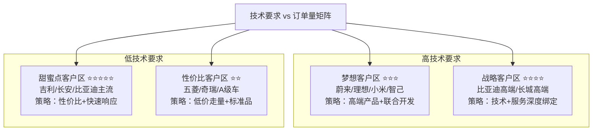

<!--
文件: 03_product-camera.md
描述: 产品3：摄像头模组
原始行范围: 2038-3007
生成时间: 2025-11-20
来源: 比亚迪半导体销售情报支持手册
-->

# 产品3：摄像头模组

## 📊 C1: Context - 市场环境情报

### 市场规模与增速

**全球车载摄像头市场：**
- 2024年：约$14.5B（约¥1,050亿元）
- 2027年：约$28.2B（年复合增长率24.8%）
- 增速最快的赛道

**中国市场：**
- 2024年：约¥420亿元（全球40%）
- 2027年：约¥820亿元
- 驱动因素：智能驾驶渗透率从30%→65%

**数据来源：** Yole Intelligence 2024、高工智能汽车

---

### 技术演进与市场机会

| 时间节点  | 技术趋势      | 单车摄像头数量                | 对销售的影响               |
| --------- | ------------- | ----------------------------- | -------------------------- |
| 2024      | L2级智驾标配  | 5-7个 （环视4+前视1-3）    | 基础市场 竞争激烈       |
| 2025-2026 | L2+/L3普及    | 8-11个 （加行车记录/座舱） | 黄金窗口期 新增需求爆发 |
| 2027+     | 800万像素+HDR | 维持11个 但单价提升        | 性能升级 ASP上涨        |

---

### 应用场景拆解（按功能分类）

#### 智能驾驶类（70%市场需求）- 核心战场

**环视摄像头（4个，必配）**
- 技术要求：190°超广角、低照度、防畸变
- 价格带：¥80-150/个
- 单车价值：¥320-600（4个）
- 渗透率：>90%（基本标配）
- 竞争特点：价格战激烈，薄利多销
- 我们的策略：标准品快速供货，走量

**前视主摄（1-3个）- 利润高地**

├─ **单目方案（1个）**
- 配置：800万像素，120° FOV
- 价格：¥250-400/个
- 应用：L2级智驾（主流）

├─ **双目方案（2个）**
- 配置：立体视觉，测距精度<5%
- 价格：¥500-800/套
- 应用：L2+级智驾（高级）

└─ **三目方案（3个）**
- 配置：长中短焦组合
- 价格：¥1200+/套
- 应用：L3级智驾（仅高端车型）

**侧视盲区摄像头（2个）**
- 技术要求：100万像素，替代传统后视镜
- 价格带：¥120-180/个
- 单车价值：¥240-360（2个）
- 应用：流媒体后视镜、盲区监测

**后视倒车摄像头（1个）**
- 技术要求：140°广角，夜视增强
- 价格带：¥100-150/个
- 渗透率：>95%（基本标配）

---

#### 智能座舱类（20%市场需求）- 增长最快

**驾驶员监测DMS（1个，强制法规）**
- 技术要求：红外+可见光双光源，活体检测
- 价格带：¥180-280/个
- 法规驱动：2024年新车必配（L2+）
- 市场爆发：2024-2025年短期爆发式增长

**乘员监测OMS（1-2个）**
- 技术要求：手势识别、儿童遗留检测
- 价格带：¥150-220/个
- 应用：智能座舱交互、安全提醒

**行车记录（1-2个）**
- 技术要求：前后双录，4K分辨率
- 价格带：¥200-350/个
- 渗透率：从30%→60%（快速增长）

---

#### 其他应用（10%市场需求）

- 流媒体后视镜、透明A柱等创新应用

---

### 💡 销售策略洞察

1️⃣ **环视4摄像头**：刚需市场（渗透率>90%），价格战激烈
- 策略：薄利多销，作为其他产品的引流

2️⃣ **前视主摄**：利润高地（技术门槛高，溢价空间大）
- 策略：重点突破，展示技术实力

3️⃣ **DMS**：法规强制（2024年新车必配），短期爆发式增长
- 策略：快速抢占市场，建立先发优势

4️⃣ **打包销售**：环视+前视+DMS整套方案（提升客单价）

---

## 🎯 C2: Customer - 客户情报

### 目标客户分级（双维度矩阵）

| 客户类型     | 代表企业               | 年需求量       | 切入难度 | 优先级 |
| ------------ | ---------------------- | -------------- | -------- | ------ |
| 甜蜜点客户区 | 吉利、长安、比亚迪主流 | 100-300万套/年 | ⭐⭐⭐      | ⭐⭐⭐⭐⭐  |
| 战略客户区   | 比亚迪高端、长城高端   | 50-150万套/年  | ⭐⭐⭐⭐     | ⭐⭐⭐⭐   |
| 梦想客户区   | 蔚来、理想、小米、智己 | 80-200万套/年  | ⭐⭐⭐⭐⭐    | ⭐⭐⭐    |
| 性价比客户区 | 五菱、奇瑞、A0/A00级   | 50-120万套/年  | ⭐        | ⭐⭐     |

---

### ⭐⭐⭐⭐⭐ 甜蜜点客户区（优先级最高）

**代表：** 吉利、长安、比亚迪主流车型

**特征：** 量大（年产能20-50万辆）+ 技术适中（L2/L2+）

**年需求量：** 单客户100-300万套摄像头/年

**切入难度：** ⭐⭐⭐（中等）

**策略重点：**
- 性价比优势（比舜宇/欧菲光低10-15%）
- 技术满足L2+需求（800万像素前视+DMS）
- 快速响应（6-8周交期 vs 行业10-12周）
- 打包方案（环视+前视+DMS一站式）

**预期收益：** 3年累计营收¥5-15亿元

---

### ⭐⭐⭐⭐ 战略客户区（长期价值高）

**代表：** 比亚迪高端品牌（仰望/腾势）、长城高端

**特征：** 技术要求高（L3级智驾）+ 利润率高

**年需求量：** 单客户50-150万套/年

**切入难度：** ⭐⭐⭐⭐（较难）

**策略重点：**
- 技术领先（800万像素+HDR+AI边缘计算）
- 深度定制（联合开发专属方案）
- 质量保证（故障率<50ppm）
- 长期绑定（3-5年框架协议）

**预期收益：** 利润率高，品牌背书价值大

---

### ⭐⭐⭐ 梦想客户区（品牌背书）

**代表：** 蔚来、理想、小米、智己

**特征：** 高技术+高价格+品牌溢价

**年需求量：** 单客户80-200万套/年

**切入难度：** ⭐⭐⭐⭐⭐（极难）

**策略重点：**
- 技术突破（需要顶尖技术实力）
- 高层公关（利用比亚迪品牌背书）
- 初期让利（建立信任）
- 案例价值（成功后示范效应强）

**备注：** 竞争激烈（舜宇/欧菲光深度绑定）

---

### ⭐⭐ 性价比客户区（补充市场）

**代表：** 五菱、奇瑞、A0/A00级车型

**特征：** 低价+大量+技术要求低

**年需求量：** 单客户50-120万套/年

**切入难度：** ⭐（容易）

**策略重点：**
- 价格杀手（最低价）
- 标准品供应（不做定制）
- 规模化生产（降低成本）

**备注：** 利润薄，但可走量

---

## 客户决策链分析（以"蔚来汽车"为例）

### 第一层：智能驾驶部门（技术主导）权重50%

**关键角色：** ADAS总监、感知算法负责人、系统架构师

**决策逻辑：**
- ✓ 图像质量（动态范围、低照度、色彩还原）> 价格
- ✓ 与算法适配性（镜头畸变参数、ISP调校）
- ✓ 供应商技术支持能力（能否联合调优）

**我们的渗透策略：**

**1️⃣ 技术攻关**
- 提供完整Camera Spec（含ISP效果）
- 安排实车对比测试（我们vs竞品，在相同算法下跑分）
- 提供算法适配支持（配合调优1-2个月）

**2️⃣ 建立信任**
- 展示比亚迪仰望U8应用案例（同样是高端智驾）
- 邀请到深圳工厂参观生产线（展示产能和品控）
- 提供"失效模式库"（基于100万套出货的大数据）

**3️⃣ 差异化卖点**
- "比亚迪集团内部验证"（300万辆车、各种极端场景）
- "OEM出身的优势"（我们懂整车厂的痛点）
- "快速响应"（深圳研发中心，24小时能解决问题）

**标准话术模板：**

> "蔚来的智驾团队我很佩服，你们对摄像头的要求确实高。我们在比亚迪仰望U8（同样是高端智驾车型）上用的就是这款800万像素前视摄像头，动态范围>120dB，暗光<0.1 Lux还能识别。
>
> 我知道你们最关心的是算法适配，我们可以提供：
> 1）完整的Camera Spec（含畸变参数、色彩矩阵）
> 2）ISP源代码（方便你们深度调优）
> 3）我们算法团队驻场支持2个月（免费）
>
> 要不这样，我们先送10套样品，您团队实际测试一下？如果效果不如现在的供应商，我们不收任何费用。"

---

### 第二层：采购部门（成本主导）权重30%

**关键角色：** 电子件品类经理、采购总监

**决策逻辑：**
- ✓ TCO（总拥有成本）：不只看单价，还看售后/召回风险
- ✓ 供应稳定性：产能、交期、备货能力
- ✓ 商务灵活性：支付条件、VMI库存、年降空间

**我们的渗透策略：**

**1️⃣ 价格策略**
- 不比竞品更便宜（蔚来不是价格敏感型客户）
- 强调"性价比"而非"低价"
- 给出清晰的年降路线图（未来3年每年降8-10%）

**2️⃣ 供应保障**
- 产能承诺：深圳+长沙双基地（月产能100万套）
- 备货方案：蔚来车型专属安全库存（2周用量）
- 应急预案：如遇缺货，优先保障蔚来（比亚迪集团协调）

**3️⃣ 商务灵活性**
- 账期：Net 60天（行业通常30天）
- VMI：可在蔚来合肥工厂设立前置仓
- 风险共担：如因我们原因导致停产，按日赔偿

**标准话术模板：**

> "X总，我理解蔚来对成本的要求。我们的报价是¥XXX（环视）/¥XXX（前视），可能不是市场最低价，但TCO是最优的。
>
> 为什么这么说？
> 1）我们的良品率99.2%（行业平均97%），减少您的售后成本
> 2）我们5年质保+终身技术支持，降低召回风险
> 3）我们在合肥可以设VMI仓库，您零库存，我们担风险
>
> 而且未来3年我们承诺每年降价8-10%，这是基于我们的规模效应，不是无底线降价。您看这是我们的成本roadmap（展示图表）。
>
> 商务上我们也很灵活：
> • 账期可以给到60天（您现在供应商是多少?）
> • 前期小批量10K套起订，后续可以根据您的排产调整
> • 如果您担心供应风险，我们可以签对赌协议：如因我们原因导致停线，按日赔偿XXX万元"

---

### 第三层：质量/供应链部门（风控角色）权重20%

**关键角色：** SQE（供应商质量工程师）、供应链经理

**决策逻辑：**
- ✓ 供应商资质（IATF 16949、ISO 26262等）
- ✓ 过程能力（Cpk值、PPM数据）
- ✓ 应急响应（8D报告、根因分析能力）

**我们的渗透策略：**

**1️⃣ 展示体系能力**
- 完整的质量认证（IATF 16949、VDA 6.3等）
- 过程能力数据：Cpk>1.67，PPM<50（行业领先）
- 追溯系统：每个摄像头有二维码，可追溯到批次

**2️⃣ 风险管理**
- 定期提供PPAP文件更新
- 主动进行FMEA分析（失效模式预防）
- 建立双向沟通机制（月度质量回顾会议）

**3️⃣ 应急能力**
- 8小时内响应质量问题
- 48小时内出8D报告
- 提供备用产能方案（万一深圳工厂出问题，长沙可接替）

**标准话术模板：**

> "X工，我知道蔚来对供应商的质量要求很高，这点我们完全理解。我们的质量体系是按照比亚迪集团标准建立的，甚至比IATF 16949更严格。
>
> 您看这是我们的过程能力数据：
> • Cpk值：1.85（您要求是>1.33对吧？我们远超标准）
> • PPM：过去12个月平均45 ppm（行业平均150 ppm）
> • 客户投诉响应：100%在8小时内初步响应
>
> 如果您来厂审核，您会发现：
> • 100%自动化生产（减少人为因素）
> • 全检+抽检双重机制（每个摄像头都过AOI）
> • 完整的追溯系统（出问题能追溯到操作工+设备+批次）
>
> 而且我们承诺：如果PPM超过100，我们主动降价5%作为补偿（写进合同）"

# ⚔️ C3: Competitor - 竞争情报

## 竞争格局（2024年中国市场）

### Tier 1 - 国际/合资巨头（技术领先但份额下降）

| 企业               | 市场份额 | 变化趋势 | 备注             |
| ------------------ | -------- | -------- | ---------------- |
| 舜宇光学           | 28%      | -2% YoY  | -                |
| 欧菲光             | 18%      | -1% YoY  | -                |
| Mobileye（英特尔） | 12%      | -        | 仅前视，高端市场 |
| **小计**           | **58%**  | -        | -                |

### Tier 2 - 本土头部（增长迅速）

| 企业            | 市场份额 | 变化趋势 | 备注   |
| --------------- | -------- | -------- | ------ |
| 比亚迪半导体    | 8%       | +3% YoY  | ★ 我们 |
| 华为（MDC配套） | 7%       | +2% YoY  | -      |
| 长城旗下企业    | 5%       | +1% YoY  | -      |
| 其他本土        | 22%      | -        | -      |
| **小计**        | **42%**  | -        | -      |

## 市场趋势

1. **国产化加速**：预计2026年本土品牌将达60%市占率
2. **垂直整合趋势**：车企自研或参股摄像头企业（如比亚迪、长城、小米）
3. **技术门槛提升**：800万像素+HDR+AI芯片成标配
4. **价格战加剧**：环视摄像头年降10-15%

---

## 主要竞品深度对标

### 竞品1：舜宇光学 - 市场领导者

#### 维度对比（⭐=1分，满分5分）

| 维度       | 舜宇                         | 比亚迪                     | 差异化策略                |
| ---------- | ---------------------------- | -------------------------- | ------------------------- |
| 技术实力   | ⭐⭐⭐⭐⭐                        | ⭐⭐⭐⭐                       | 他们领先1代 差距在缩小 |
| 产品线宽度 | 全系列 ⭐⭐⭐⭐⭐              | 主流产品 ⭐⭐⭐⭐           | 我们覆盖90% 主流需求   |
| 客户结构   | 特斯拉 蔚来/理想 ⭐⭐⭐⭐⭐ | 比亚迪为主 +外部 ⭐⭐⭐ | 我们需要 拓展外部      |
| 价格       | 基准价 ⭐⭐⭐                | 85-90% ⭐⭐⭐⭐             | 小幅价格 优势          |
| 交期       | 10-12周 ⭐⭐⭐               | 6-8周 ⭐⭐⭐⭐⭐             | **核心优势** 快4周     |
| 定制化能力 | 标准化为主 ⭐⭐⭐            | 灵活定制 ⭐⭐⭐⭐⭐          | **我们更灵活**            |

#### 竞争策略

**✅ 避其锋芒：**
不正面竞争顶级客户（特斯拉、蔚来等舜宇深度绑定的）

**✅ 侧翼进攻：**
攻击新势力（小米、智己）和成长型车企（零跑、哪吒）

**✅ 差异化：**
强调"OEM背景+快速响应+定制化"

**⏳ 长期：**
通过比亚迪内部放量降低成本，3年内追平舜宇

#### 标准销售话术

"舜宇确实是行业老大，我们很尊重他们。但有个核心差异：舜宇是纯供应商，我们是整车厂出身。

这带来什么不同？

1. **我们更懂整车厂的痛点**（不只是摄像头参数，还有安装工艺、线束布局）
2. **我们的产品在300万辆车上验证过**（各种极端场景）
3. **我们可以快速响应定制需求**（舜宇因为客户多，标准化程度高）

举个例子：某客户要求摄像头带加热功能（北方冬天防冰雪），舜宇说要6个月开发，我们2个月就搞定了，因为比亚迪有现成方案。

价格上我们也比舜宇略低5-10%，主要是我们在比亚迪内部有规模效应。"

---

### 竞品2：欧菲光 - 传统强者

#### 对比分析

| 维度     | 欧菲光                        | 比亚迪                           | 对比分析                   |
| -------- | ----------------------------- | -------------------------------- | -------------------------- |
| 市场地位 | 老牌供应商                    | 新进入者                         | 他们品牌积累深厚           |
| 技术路线 | 偏传统 ⭐⭐⭐ CMOS+镜头    | 集成化 ⭐⭐⭐⭐⭐ 摄像头+ISP+AI | **我们更先进**             |
| 成本结构 | 相对较高 ⭐⭐⭐               | 垂直整合优势 ⭐⭐⭐⭐⭐            | **我们成本更优**           |
| 客户粘性 | 中等 ⭐⭐⭐ 部分客户在切换 | 低(需建立) ⭐⭐                 | 市场处于变革期 机会窗口 |

#### 竞争策略

**✅ 技术代差：**
强调我们的集成化方案（摄像头+ISP+边缘AI）

**✅ 成本优势：**
比欧菲光低15-20%（他们成本结构老化）

**✅ 挖墙脚：**
重点攻击欧菲光的中小客户（他们服务能力不如我们）

#### 标准销售话术

"欧菲光在功能机时代确实很强，但在智能驾驶时代有些掉队了。

核心差异：
- **欧菲光**：摄像头+独立ISP芯片（2颗芯片，成本高+功耗大）
- **我们**：摄像头+集成ISP+AI加速器（1颗SoC，成本低+性能好）

客户X去年从欧菲光切到我们，BOM成本直接降了18%，而且我们的ISP效果更好（暗光场景识别率提升22%）。

而且说实话，欧菲光现在财务压力大（众所周知的事），您不担心供应链风险吗？我们有比亚迪集团背书，这点您大可放心。"

---

### 竞品3：华为（MDC配套）- 生态竞争

#### 策略分析

| 维度     | 华为MDC                      | 比亚迪             | 策略分析           |
| -------- | ---------------------------- | ------------------ | ------------------ |
| 商业模式 | 整套方案 摄像头+算力+算法 | 单独供货 摄像头 | 不同赛道 可合作 |
| 目标客户 | 问界 阿维塔等 华为系   | 全市场             | 我们覆盖面更广     |
| 价格     | 高 打包销售               | 更具竞争力         | 我们灵活性强       |

#### 竞争策略

**⚠️ 不正面竞争：**
华为的客户用华为全套方案，我们很难切入

**✅ 差异化定位：**
我们是"开放平台"，客户可自由选择算法供应商

**🎯 合作可能：**
非华为系客户，如果用华为算法，可以用我们摄像头

# 🏢 C4: Company - 自身能力证明

## 差异化价值主张（摄像头专属）

### 核心定位：来自OEM的智能驾驶视觉专家

---

## 五大核心优势

### 1️⃣ 实车验证优势（最强背书）

**比亚迪全系车型应用：从海豚到仰望U8**

- 累计装车量：超1000万套摄像头（2020-2024）

**全场景验证：**
- 全气候（-45℃漠河 到 +70℃吐鲁番）
- 全路况（城市/高速/山路/非铺装路面）
- 全时段（白天/夜晚/黄昏/隧道进出）
- 全天气（晴天/雨天/雾霾/沙尘暴）

#### 证据材料

**比亚迪车型摄像头配置清单**

| 车型   | 摄像头配置                           |
| ------ | ------------------------------------ |
| 海豚   | 5摄（环视4+后视1）                   |
| 海豹   | 7摄（环视4+前视2+后视1）             |
| 唐EV   | 9摄（环视4+前视3+后视1+DMS1）        |
| 仰望U8 | 11摄（环视4+前视3+侧视2+后视1+DMS1） |

**环境适应性测试报告**

| 测试项目 | 测试条件            |
| -------- | ------------------- |
| 温度循环 | -40℃到85℃，1000次   |
| 湿热测试 | 85℃/85%RH，1000小时 |
| 盐雾测试 | 5%NaCl，96小时      |
| 振动测试 | 20-2000Hz，8小时    |

**客户端故障率数据：<45 ppm**（行业平均150 ppm）

---

### 2️⃣ 集成化方案优势（技术代差）

**方案对比：**

| 方案类型 | 架构                                               |
| -------- | -------------------------------------------------- |
| 传统方案 | Camera Module + ISP芯片 + MCU                      |
| 我们方案 | All-in-One SoC （摄像头+ISP+AI加速器+接口转换） |

#### 优势对比

| 指标    | 改善幅度                       |
| ------- | ------------------------------ |
| BOM成本 | 降低22%（少1颗ISP芯片+1颗MCU） |
| 功耗    | 降低30%（集成度高）            |
| 体积    | 减小40%（PCB面积更小）         |
| 可靠性  | 提升（减少焊点=减少失效点）    |

#### 技术亮点

**自研ISP算法（针对中国路况优化）**
- 雾霾天气图像增强
- 夜间低照度优化
- 强光抑制（防过曝）

**边缘AI能力（1TOPS算力，可本地预处理）**
- 车道线检测（30fps@1080p）
- 目标识别（行人/车辆/交通标志）
- 降低域控制器负担

**HDR实时处理（120dB动态范围）**
- 隧道进出不过曝/欠曝
- 逆光场景清晰成像

#### 证据材料

**方案对比白皮书**
- vs传统方案的成本/功耗/体积对比

**AI芯片性能测试**
- YOLOv5推理速度：35fps@1080p
- 目标检测精度：mAP 92.5%

**HDR效果对比视频**
- 我们 vs 竞品，隧道场景

---

### 3️⃣ 快速定制化能力（OEM基因）

**对比：**
- 标准化供应商：只提供标准型号，定制周期6-12个月
- 我们：基于比亚迪经验，可快速响应定制需求

#### 定制化案例库

| 案例类型     | 客户需求                   | 开发周期 | 技术方案                |
| ------------ | -------------------------- | -------- | ----------------------- |
| 防眩光方案   | 夜间对向车灯不过曝         | 2个月    | 动态HDR+智能曝光控制    |
| 防雨雪方案   | 北方客户要求镜头加热       | 1个月    | 集成加热膜+温度传感器   |
| 防尘方案     | 西北客户要求IP69K+主动吹扫 | 6周      | 高等级密封+电动吹扫装置 |
| 特殊安装方案 | 某车型空间受限             | 3周      | 定制化封装尺寸          |

#### 流程优势

| 环节       | 我们                | 传统供应商 |
| ---------- | ------------------- | ---------- |
| 需求评估   | 2天                 | 2周        |
| 方案设计   | 1周（模块化设计库） | 4周        |
| 样品制作   | 2周（快速打样能力） | 6周        |
| 小批量验证 | 4周                 | 8周        |

#### 证据材料

- 定制化成功案例集（含客户评价）
- 模块化设计平台演示（展示灵活性）
- 快速响应流程图（展示时效优势）

---

### 4️⃣ 成本优势（垂直整合）

#### 我们的成本结构

| 成本项       | 优势幅度    | 来源                   |
| ------------ | ----------- | ---------------------- |
| Sensor采购   | -15%        | 比亚迪集团采购议价能力 |
| 镜头模组     | -20%        | 自有光学设计能力       |
| ISP SoC      | -30%        | 自研芯片，免授权费     |
| 封装测试     | -10%        | 自有产线               |
| **综合成本** | **-18~25%** | **比纯供应商低**       |

#### 年降能力

- 2025-2027年承诺每年降价8-12%
- 依托：比亚迪集团规模效应（年需求量1000万套+）

#### 证据材料

- 成本结构对比图（vs舜宇/欧菲光）
- 年降路线图（技术roadmap+规模效应分析）
- 历史年降兑现数据（过去3年实际降价幅度）

---

### 5️⃣ 供应链韧性（危机响应）

#### 多基地布局

| 基地     | 月产能 | 主攻产品      | 状态                 |
| -------- | ------ | ------------- | -------------------- |
| 深圳基地 | 50万套 | 前视/高端产品 | 运营中               |
| 长沙基地 | 60万套 | 环视/标准产品 | 运营中               |
| 合肥基地 | 40万套 | 待定          | 规划中（2025Q4投产） |

#### 应急机制

- 安全库存：标准型号常备3周库存
- 产能调配：两基地可互相支援（4天内切换）
- 备用供应商：关键物料有双源供应

#### 历史验证

| 事件     | 时间   | 应对措施                 | 结果  |
| -------- | ------ | ------------------------ | ----- |
| 上海疫情 | 2022年 | 供应商停工，我们提前备货 | 0影响 |
| 缺芯危机 | 2023年 | Sensor短缺，提前备货应对 | 0影响 |
| 深圳台风 | 2024年 | 深圳停工，长沙产能顶上   | 0影响 |

#### 证据材料

- 产能分布图+产线照片
- BCP（业务连续性计划）文档
- 2020-2024年交付准时率：99.1%（行业领先）

---

## 标杆案例库（STAR格式）

### 案例1：小米SU7摄像头全套方案供应

**案例标题：6个月完成11摄全套方案从0到量产**

| 项目信息 | 详情                          |
| -------- | ----------------------------- |
| 客户     | 小米汽车SU7（首款车型）       |
| 项目时间 | 2023年Q2-2024年Q1             |
| 项目价值 | 年营收¥1.37亿元，战略标杆意义 |

---

#### 【S - Situation 情境】

**时间：2023年5月**

**背景：**
- 小米汽车首款车型SU7立项
- 智驾配置：11个摄像头（环视4+前视3+侧视2+DMS/OMS各1）
- 小米团队对供应商要求：
  - 技术先进（800万像素+HDR+AI）
  - 成本可控（目标价21.59万，成本压力大）
  - 交期快（2024Q1 SOP，时间紧）

**竞争对手：**
- 舜宇光学：小米手机供应商，关系深
- 欧菲光：报价相对较低

**客户痛点：**
- 从0到1建立关系（小米没用过我们的车规产品）
- 技术PK：证明我们不比舜宇差
- 商务突破：在价格上有吸引力
- 时间挑战：6个月内完成所有验证（通常需12个月）

---

#### 【T - Task 任务】

**项目目标：**
- 6个月内完成从样品测试到批量供货的全流程
- 技术性能对标舜宇（图像质量不能差）
- 价格比舜宇低11%（有吸引力）
- 获得至少70%份额（舜宇保留30%）

**销售挑战：**
- 如何快速建立信任？（小米和舜宇关系深）
- 如何证明技术实力？（我们在手机摄像头领域无积累）
- 如何在6个月内完成验证？（时间极紧）

---

#### 【A - Action 行动】

##### 阶段1：破冰与建立信任（Week 1-4）

**销售策略：**

**通过比亚迪高层引荐**
- 王传福与雷军关系（行业人脉）
- 比亚迪品牌背书（新能源车第一）

**首次拜访：带比亚迪仰望U8实车演示**
- 同样11摄配置
- 现场展示智驾效果

**技术交流：小米ADAS团队来深圳工厂参观**
- 参观产线（展示自动化程度）
- 技术研讨（ISP算法、AI芯片）

**破冰点：**
- 小米惊讶于我们的集成AI方案
  - 舜宇没有边缘AI能力
  - 我们的1TOPS AI芯片是加分项

---

##### 阶段2：技术验证加速（Week 5-16）

**并行开发策略（缩短时间）：**

| 摄像头类型  | 策略                                 | 送样周期 | 测试周期 |
| ----------- | ------------------------------------ | -------- | -------- |
| 环视4摄像头 | 用标准品（快）                       | 2周      | 4周      |
| 前视3摄像头 | 联合定制（重点） 800W+集成1T AI   | 4周      | 8周      |
| DMS/OMS     | 用成熟方案（稳） 比亚迪内部验证过 | 2周      | 4周      |
| 侧视2摄像头 | 标准品改款（快）                     | 1周      | 2周      |

**技术亮点：**

**前视主摄：800W+集成1T AI**
- 可跑轻量级算法（车道线检测）
- 降低域控制器负担

**HDR调校：针对城市隧道场景优化**
- 小米重点关注（北京/上海隧道多）
- 120dB动态范围

**ISP参数：配合小米算法团队联合调优**
- 提供ISP源代码
- 2个月联合优化

**测试结果：**
- 图像质量：与舜宇方案对比，小米团队认为"不相上下"
- AI性能：边缘AI能力舜宇没有（加分项）
- 可靠性：通过高温/高寒/振动全部测试

---

##### 阶段3：商务谈判与定点（Week 17-20）

**报价策略：**

| 项目                   | 价格                 | 说明                             |
| ---------------------- | -------------------- | -------------------------------- |
| 整套方案（11个摄像头） | ¥2,850               | -                                |
| 对比舜宇               | ¥3,200               | 低11%                            |
| 让利点                 | 前期5K台车按成本价供 | 赌后续放量（小米预期年销20万辆） |

**附加价值：**
- 技术支持：2名FAE驻小米北京/武汉工厂
- 联合开发：承诺投入研发资源（价值¥500万）
- 供应保障：SU7摄像头专属产线，确保交期（小米首款车，不能延期）

**最终结果：**
- 获得70%份额（舜宇保留30%作为backup）
- 签订3年框架协议（预计3年供货量：150万套）
- 小米承诺：如SU7成功，后续车型继续合作

---

#### 【R - Result 结果】

##### 商业成果

- 2024 Q1开始批量供货，月供4万套
- 2024年营收约¥1.37亿元（11万套 × ¥2,850 × 70% / 11 × 12）
- 客户满意度：NPS 88分（高）

##### 客户评价

> "比亚迪半导体响应速度一流，技术支持深度超出预期。特别是那个集成AI方案，帮我们降低了域控制器的成本。而且6个月完成从0到定点，这个速度在行业内很少见。"
>
> —— 小米汽车CTO

##### 战略意义

- 打破"只能供比亚迪内部"的市场认知
- 树立"新势力标杆案例"（对其他客户有示范效应）
- 技术验证：证明我们的集成AI方案市场接受度高
- 品牌提升：小米的影响力带动其他客户关注

##### 带动效应

- 智己汽车主动联系我们（2024 Q2）
- 岚图汽车邀请技术交流（2024 Q3）
- 案例在行业内传播，询单量增加30%

---

#### 【可复用销售要素】

- ✅ 高层引荐策略（利用比亚迪品牌背书）
- ✅ 并行开发方法（标准品+定制品组合，快速响应）
- ✅ 初期让利策略（前期保本，后续靠量赚钱）
- ✅ 深度绑定（驻场FAE+联合开发）
- ✅ 差异化技术（集成AI方案是独特卖点）

---

#### 【使用场景】

1. 面对新势力客户（小米/智己/岚图等）
2. 当客户质疑"你们没给外部客户供过货"时
3. 展示快速响应能力（6个月完成从0到定点）
4. 展示差异化技术（集成AI方案）

# 【摄像头产品销售实战速查卡】

## 快速查询表：常见客户异议 × 标准回答话术

---

### 异议1："你们的图像质量不如舜宇吧？"

**背后原因**：技术不信任

**回答框架**：

**Step 1 - 正面回应**：
"图像质量确实是核心，我们做过详细对比测试。在关键指标上（动态范围、低照度、色彩还原），我们和舜宇的差异<5%。"

**Step 2 - 给出证据**：
"您看这是实车对比测试视频（我们 vs 舜宇）：
- 白天场景：两者几乎无差异
- 隧道场景：我们的HDR表现更好（不过曝/欠曝）
- 夜间场景：两者暗光性能接近

这是第三方机构的测试报告（中汽研），结论是'两者图像质量在同一水平'。"

**Step 3 - 转移焦点**：
"而且我们有一个舜宇没有的优势：集成AI芯片。1TOPS算力，可以在摄像头端做预处理，降低域控制器负担，帮您省成本。

价格上我们比舜宇低5-10%，交期快4周，如果图像质量持平，您为什么不选性价比更高的方案？"

**证据支撑**：
- ✓ 实车对比测试视频
- ✓ 第三方测试报告（中汽研）
- ✓ 集成AI方案演示

---

### 异议2："你们能应对我们的定制需求吗？"

**背后原因**：担心标准品不满足需求

**回答框架**：

**Step 1 - 正面承诺**：
"完全可以。我们50%的订单都是定制化的，这是我们的优势。"

**Step 2 - 举实际案例**：
"举个例子：某客户（脱敏）要求摄像头带加热功能，因为北方冬天怕冰雪覆盖。

舜宇说要6个月开发，我们2个月就搞定了，为什么？因为比亚迪在漠河测试时就遇到过这个问题，我们有现成方案。

另一个例子：某客户要求特殊封装尺寸（空间受限），我们3周就完成了，因为我们有模块化设计平台。"

**Step 3 - 流程承诺**：
"您具体需求是什么？
- 如果是改封装尺寸：3周可以完成
- 如果是性能定制（HDR/低照度）：6-8周
- 如果是全新开发：2-3个月

我们有专门的应用工程师团队，可以配合您的节奏。"

**证据支撑**：
- ✓ 定制化案例库（含开发周期）
- ✓ 模块化设计平台演示
- ✓ 快速响应流程图

---

### 异议3："你们产能能满足我们的需求吗？"

**背后原因**：供应链风险担忧

**回答框架**：

"我们深圳+长沙双基地，月产能110万套，目前利用率65%，完全有余量。而且我们有专门的产能预留机制。

具体到您的需求（月需XX万套）：
- 我们给您预留XX万套/月的专属产能
- 标准品常备3周安全库存
- 如果您销量超预期，我们可以在2周内扩产20%

这是我们的产能承诺函（盖章版），写进合同。

而且比亚迪集团作为全球最大新能源车企，摄像头是战略部件，不可能让产能出问题。这是对您的保障。"

**证据支撑**：
- ✓ 产能证明（深圳50万+长沙60万）
- ✓ 产能承诺函（盖章）
- ✓ 历史交付准时率99.1%

---

### 异议4："你们只给比亚迪内部供货，对外部客户服务怎么样？"

**背后原因**：担心被区别对待

**回答框架**：

"这个顾虑很多客户都有，我直接说清楚：

**1）我们的战略是'内部+外部'双轮驱动**
- 比亚迪内部：稳定基本盘
- 外部客户：增长引擎

**2）外部客户我们同样重视，证据：**
- 小米SU7：我们用了和仰望U8同等级的产品
- 交付优先级：外部客户和内部客户同等对待
- FAE团队：12城市覆盖，不只服务比亚迪

**3）而且坦白说，服务外部客户对我们更重要，因为：**
- 内部有天然关系，外部需要靠服务赢得信任
- 外部客户的评价直接影响我们的市场地位

**4）我们的承诺：**
- 技术支持：4小时电话响应，24小时现场
- 交付准时率：99%+（写进合同）
- 如果服务不满意，可以随时终止合作

您看这是我们给小米的服务评价（NPS 88分），小米对我们的服务是非常认可的。"

**证据支撑**：
- ✓ 小米案例（外部客户成功案例）
- ✓ 客户满意度数据（NPS评分）
- ✓ 服务承诺书（4小时响应，写进合同）

