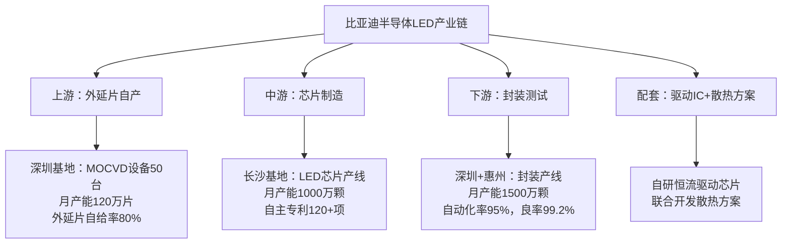

<!--
文件: 04_product-led.md
描述: 产品4：车规级LED
原始行范围: 3008-3848
生成时间: 2025-11-20
来源: 比亚迪半导体销售情报支持手册
-->

# 产品4：车规级LED

## 📊 C1: Context - 市场环境情报

### 市场规模与增速

**全球车规级LED市场：**
- 2024年：约$7.8B（约¥565亿元）
- 2027年：约$11.2B（年复合增长率12.8%）
- 稳定增长赛道

**中国市场：**
- 2024年：约¥195亿元（全球34.5%）
- 2027年：约¥285亿元
- 驱动因素：智能化照明渗透率从35%→68%

**数据来源：** Yole Intelligence 2024、高工LED

### 技术演进与市场机会

| 时间节点  | 技术趋势                      | 单车LED用量               | 对销售的影响           |
| --------- | ----------------------------- | ------------------------- | ---------------------- |
| 2024      | 传统卤素向LED替换             | 150-250颗 （基础照明） | 存量市场 价格战激烈 |
| 2025-2026 | 智能大灯普及 矩阵/像素大灯 | 300-500颗 （含氛围灯） | 黄金窗口期 ASP提升  |
| 2027+     | Mini LED大灯 可编程灯语    | 500-800颗 但单价持平   | 技术升级 差异化竞争 |

### 应用场景拆解（按功能分类）

#### 车规级LED应用全景图：

---

#### 外部照明类（65%市场需求）- 核心战场

**前大灯系统（最高价值区）**

**传统LED大灯（基础型）**
- 配置：远近光共用8-12颗LED
- 光效：≥150lm/W
- 价格：¥15-25/颗
- 单侧价值：¥120-300
- 应用：15万以下车型（主流）

**矩阵式LED大灯（中高端）**
- 配置：24-84颗独立控制LED
- 功能：自适应远光、弯道补光
- 价格：¥20-35/颗
- 单侧价值：¥480-2,940
- 应用：20-35万车型（快速增长）
- 渗透率：2024年18% → 2027年45%

**像素/Mini LED大灯（旗舰）**
- 配置：100-200+颗微型LED阵列
- 功能：路面投影、动态显示、智能避让
- 价格：¥25-50/颗
- 单侧价值：¥2,500-10,000
- 应用：35万以上旗舰车型
- 渗透率：2024年3% → 2027年12%

**尾灯系统**

**传统尾灯**
- 配置：刹车灯8-12颗，位置灯4-8颗
- 价格：¥8-15/颗
- 单车价值：¥96-300

**贯穿式尾灯（高端标配）**
- 配置：80-150颗LED灯带
- 功能：动态点亮、呼吸效果
- 价格：¥10-20/颗
- 单车价值：¥800-3,000
- 渗透率：2024年25% → 2027年55%

**智能交互尾灯**
- 配置：集成显示模块（200+颗）
- 功能：显示文字/图案（如"谢谢"、距离提示）
- 价格：¥15-30/颗
- 单车价值：¥3,000-6,000+

**日间行车灯DRL**
- 配置：12-24颗高亮LED
- 光通量：≥800cd
- 价格：¥12-20/颗
- 单车价值：¥288-480
- 法规：强制配置（100%渗透率）

**转向灯/雾灯**
- 配置：转向灯6-10颗/侧，雾灯4-8颗
- 价格：¥8-12/颗
- 单车价值：¥112-216

---

#### 内饰氛围照明类（35%市场需求）- 增长最快

**氛围灯系统（利润高地）**

**单色氛围灯（基础）**
- 配置：30-60颗/车
- 点位：门板、仪表台、脚坑
- 价格：¥5-8/颗
- 单车价值：¥150-480
- 应用：15万以下车型

**RGB氛围灯（主流）**
- 配置：60-120颗/车
- 功能：256色可调、音乐律动
- 价格：¥8-15/颗
- 单车价值：¥480-1,800
- 应用：15-30万车型（标配化）
- 渗透率：2024年42% → 2027年75%

**高端多色氛围灯**
- 配置：120-200+颗/车
- 功能：分区控制、场景模式（运动/舒适）
- 价格：¥12-25/颗
- 单车价值：¥1,440-5,000
- 应用：30万以上豪华车型

**屏幕背光**
- 配置：中控屏20-40颗，仪表盘15-30颗
- 要求：高均匀性、低功耗
- 价格：¥6-10/颗
- 单车价值：¥210-700

**开关按键背光**
- 配置：20-40颗（门窗、空调、方向盘）
- 价格：¥4-7/颗
- 单车价值：¥80-280

---

### 💡 市场机会洞察

**高价值赛道识别（按ASP×增速排序）：**

| 赛道       | ASP    | CAGR | 渗透率变化 | 备注           |
| ---------- | ------ | ---- | ---------- | -------------- |
| 矩阵式大灯 | ¥20-35 | 35%  | 18%→45%    | 量大+增速快    |
| 贯穿式尾灯 | ¥10-20 | 28%  | 25%→55%    | 量大+增速快    |
| RGB氛围灯  | ¥8-15  | 22%  | 42%→75%    | 门槛低、切入快 |
| 像素大灯   | ¥25-50 | 45%  | 3%→12%     | 体量小但增速高 |

**销售策略建议：**
- → 主攻矩阵式大灯+贯穿式尾灯（量大+增速快）
- → 氛围灯走量市场（门槛低、切入快）
- → 像素大灯卡位未来（高端品牌形象建设）

### 🎯 C2: Customer - 客户情报

#### **目标客户分级矩阵（波士顿矩阵）**

| 客户类型                        | 代表企业                                   | 年需求量                   | 切入难度 | 优先级 | 进攻策略                                     |
| ------------------------------- | ------------------------------------------ | -------------------------- | -------- | ------ | -------------------------------------------- |
| 战略级客户 （集团关联）      | 比亚迪各品牌 （王朝、海洋、腾势、仰望） | 800万套/年 （含氛围灯） | ⭐        | ⭐⭐⭐    | 内部协同 确保份额稳定 新车型首发导入   |
| 进攻型客户 （国产替代目标）  | 吉利、长城 奇瑞、长安                   | 单客户50-150万套/年        | ⭐⭐⭐      | ⭐⭐⭐⭐   | 二供切入 性价比+快速响应 氛围灯先行    |
| 机会型客户 （新势力/成长中） | 零跑、哪吒 深蓝、启源                   | 单客户10-50万套/年         | ⭐⭐       | ⭐⭐⭐⭐⭐  | 小批量起订 定制化设计 成长期绑定       |
| 高端客户 （品牌背书）        | 蔚小理、极氪 智己、阿维塔               | 单客户20-80万套/年         | ⭐⭐⭐⭐     | ⭐⭐⭐    | 智能大灯突破 技术对标国际 联合开发     |
| 战术型客户 （合资/外资）     | 一汽-大众 上汽通用                      | 单客户30-100万套/年        | ⭐⭐⭐⭐⭐    | ⭐⭐     | 战略性放弃 或仅维持联系 （认证周期长） |

## 客户决策链分析（三层渗透模型）

以吉利汽车为例（典型的国产替代目标）：

### 第一层：技术准入（门槛层）

**关键角色**：车身电气部 / 照明工程师  
**决策权重**：35%（技术否决权）

**关注点**：
- ✓ 光学参数（光效、色温、显色指数CRI）
- ✓ 可靠性（AEC-Q102认证、热循环、湿热测试）
- ✓ 一致性（色容差≤3 SDCM、亮度一致性±5%）
- ✓ EMC兼容性（CISPR 25 Class 5）

**我们的渗透策略**：
- → 提供完整光学测试报告（第三方实验室盖章）
- → 邀请参观比亚迪应用案例（汉/唐矩阵大灯）
- → 免费送样+提供光学仿真支持
- → 强调AEC-Q102认证+5年15万公里车规验证

**话术模板**：
"吉利在开发星越L高配版的智能矩阵大灯对吧？我们在比亚迪汉上已经量产矩阵大灯3年，累计装车80万台，PPM不良率<10ppm。您关注的光效指标是≥180lm/W对吧？我们这款（型号）达到190lm/W，而且色温一致性控制在±150K以内，这是对比实测数据..."

---

### 第二层：商务决策（核心层）

**关键角色**：采购部 品类经理 / 采购总监  
**决策权重**：45%（最终决策权）

**关注点**：
- ✓ 价格竞争力（需比现有供应商低12-15%）
- ✓ 供应稳定性（产能、交期、备货能力）
- ✓ 付款条件（账期、VMI库存模式）
- ✓ 年降承诺（每年降价6-10%）

**我们的渗透策略**：
- → 初期报价激进（比欧司朗低15-18%）
- → 提供灵活商务条款（60天账期、JIT交付）
- → 强调供应链安全（不受国际形势影响）
- → 承诺合理年降（6-8%，低于国际品牌10-12%）

**话术模板**：
"我理解吉利对成本控制的要求。您现在用欧司朗的价格是XXX对吧？（如果对方不透露）我们估算应该在¥28-32/颗这个区间。

我们的报价策略：
- • 首单报价：¥24-26/颗（低15-18%）
- • 量产稳定后：¥22-24/颗
- • 年降承诺：每年6-8%（合理可控）

为什么能做到这个价格？
1. 芯片自产（比亚迪半导体自有产线）
2. 封装规模效应（月产能1000万颗+）
3. 供应链整合（外延/金线/荧光粉直采）

而且我们承诺：
- ✓ 60天账期（标准）
- ✓ JIT交付（提前3天通知即可）
- ✓ 专属备货（您的安全库存）"

---

### 第三层：应用支持（价值增值层）

**关键角色**：总成供应商（灯具厂）  
**决策权重**：20%（推荐权）

**关注点**：
- ✓ 易用性（贴片兼容性、散热设计）
- ✓ 技术支持（光学设计、驱动匹配）
- ✓ 交付配合（响应速度、变更管理）

**我们的渗透策略**：
- → 与灯具厂建立战略合作（如华域视觉、星宇股份）
- → 提供"交钥匙"方案（LED+透镜+散热一体化设计）
- → 工程师驻场支持（解决贴片/调试问题）

**话术模板**：
"我们已经和星宇股份合作3年了，他们的反馈非常好。您的主要灯具供应商是XXX对吧？我们可以直接对接：

1. 免费提供LED光学模型（LDT文件）
2. 配套驱动方案推荐（TI/MPS芯片）
3. 热仿真支持（确保结温≤105°C）
4. 贴片工艺培训（SMT参数优化）

而且我们有专门的大客户团队：
- • 技术总监XXX（手机：XXX）
- • 应用工程师XXX（微信：XXX）
- • 24小时响应机制"

#### **典型客户画像卡片**

**客户A：零跑汽车**（机会型客户 - 优先级⭐⭐⭐⭐⭐）

**客户B：长城汽车**（进攻型客户 - 优先级⭐⭐⭐⭐）

| 维度           | 客户A：零跑汽车（机会型客户 - 优先级⭐⭐⭐⭐⭐）                  | 客户B：长城汽车（进攻型客户 - 优先级⭐⭐⭐⭐）                   |
| -------------- | ------------------------------------------------------------ | ------------------------------------------------------------ |
| **企业背景**   | 新势力，2024年销量目标35万台 定位：10-20万价格带，性价比路线 | 传统车企，2024年销量目标120万台 定位：15-30万价格带，SUV强势 |
| **LED需求**    | • 氛围灯：80-120颗RGB/车（标配） • 贯穿式尾灯：100-150颗/车 • 大灯：传统LED 8-12颗/车 总需求：4,200-6,300万颗/年 | • 矩阵式大灯：30-60颗/车（高端车型） • 贯穿式尾灯：80-120颗/车 • 氛围灯：60-100颗RGB/车 总需求：1.5-2.0亿颗/年 |
| **现有供应商** | • 三安光电（主供，氛围灯+尾灯） • 鸿利智汇（二供，部分氛围灯） • 大灯LED：欧司朗/亿光 | • 欧司朗（主供，矩阵大灯50%） • 三安光电（主供，尾灯+氛围灯60%） • 晶电/亿光（二供） |
| **痛点**       | ✓ 成本压力大（毛利率仅12-15%） ✓ 交期不稳（三安优先供货大客户） ✓ 需要快速响应（车型迭代快） | ✓ 国产化率要求（2025年目标65%） ✓ 成本压力（欧司朗价格高） ✓ 供应链安全（中美关系影响） |
| **决策链**     | • 技术负责人：李工（车身电气部） • 采购负责人：王经理（采购部） • 灯具供应商：常州星宇 | • 技术负责人：张总工（研发中心） • 采购负责人：刘总监（集团采购） • 灯具供应商：华域视觉、法雷奥 |
| **切入策略**   | **第1步：从氛围灯切入（门槛低，量大）** • 报价：¥7-9/颗（比三安低10-12%） • 小批量起订（1万颗起） • 快速交付（7天发货）  **第2步：拓展到贯穿式尾灯** • 与常州星宇联合开发 • 提供一体化方案（LED+透镜+散热）  **第3步：渗透到大灯** • 联合开发下一代矩阵大灯 • 2026年新车型首发导入 | **第1步：矩阵大灯二供（10-15%份额）** • 对标欧司朗Oslon系列 • 价格低15-18%（¥22-26 vs ¥28-32） • 通过华域视觉认证  **第2步：氛围灯替换三安** • RGB方案更有性价比 • 提供音乐律动控制算法  **第3步：新车型首发导入** • 联合开发像素大灯（2027年旗舰SUV） • 绑定长期战略协议 |
| **预期成果**   | • 2026年：份额20%，销售额0.5-0.8亿元 • 2027年：份额40%，销售额1.2-1.8亿元 • 2028年：份额60%，销售额2.0-3.0亿元 | • 2026年：份额10%，销售额2.0-3.0亿元 • 2027年：份额25%，销售额5.0-7.5亿元 • 2028年：份额40%，销售额8.0-12.0亿元 |

# 💼 C3: Competitor - 竞争情报

## 中国车规级LED市场竞争格局（2024）

### 市场份额分布（按销售额）

#### 国际品牌：45%

| 品牌                       | 市场份额 | 优势                           | 弱势                       | 主打产品         | 主要客户               |
| -------------------------- | -------- | ------------------------------ | -------------------------- | ---------------- | ---------------------- |
| 欧司朗Osram（德国）        | 22%      | 技术领先、品牌强、高端车型首选 | 价格高、交期长、本土化不足 | Oslon、Duris系列 | BBA、大众、通用        |
| 日亚化学Nichia（日本）     | 10%      | 光效最高、寿命长、专利壁垒     | 价格最贵、产能有限         | 757系列          | 丰田、本田、日产       |
| 科锐Cree/Wolfspeed（美国） | 6%       | SiC衬底、高可靠性              | 退出LED照明、聚焦SiC功率   | -                | 市场地位：逐步萎缩     |
| 亿光电子（台湾）           | 7%       | 性价比高、产品线全             | 品牌力弱、技术落后         | -                | 合资车企、部分自主品牌 |

#### 国产品牌：55%（快速增长）

| 品牌                 | 市场份额 | 优势                                   | 弱势                           | 主打产品                         | 主要客户                   | 市占率趋势                                |
| -------------------- | -------- | -------------------------------------- | ------------------------------ | -------------------------------- | -------------------------- | ----------------------------------------- |
| 三安光电（厦门）     | 28%      | 产能最大、垂直整合、车规认证全         | 技术对标国际一线仍有差距       | AS系列（氛围灯）、AH系列（大灯） | 比亚迪、吉利、长城、蔚小理 | 2022年20% → 2024年28% → 2027年35%（预测） |
| 华灿光电（张家港）   | 12%      | 成本控制强、中低端车型主力             | 高端产品不足                   | -                                | 长安、奇瑞、零跑           | -                                         |
| 比亚迪半导体（深圳） | 8%       | 比亚迪集团支持、车规验证丰富、快速响应 | 外部客户开拓不足、品牌认知度低 | -                                | 比亚迪各品牌（内部为主）   | **战略目标**：2025年外部销售占比从20%→40% |
| 鸿利智汇、瑞丰光电等 | 7%       | -                                      | -                              | -                                | -                          | 定位：中低端市场、跟随策略                |

---

## 竞品对标矩阵（Benchmarking）

| 维度         | 欧司朗 | 三安光电 | 比亚迪半导体 | 我们的定位           |
| ------------ | ------ | -------- | ------------ | -------------------- |
| 技术水平     | ⭐⭐⭐⭐⭐  | ⭐⭐⭐⭐     | ⭐⭐⭐⭐         | 跟随者（缩小差距中） |
| 价格竞争力   | ⭐⭐     | ⭐⭐⭐⭐     | ⭐⭐⭐⭐⭐        | 核心优势             |
| 交期保证     | ⭐⭐⭐    | ⭐⭐⭐      | ⭐⭐⭐⭐⭐        | 核心优势             |
| 本土化服务   | ⭐⭐     | ⭐⭐⭐⭐     | ⭐⭐⭐⭐⭐        | 核心优势             |
| 品牌认知度   | ⭐⭐⭐⭐⭐  | ⭐⭐⭐⭐     | ⭐⭐⭐          | 亟需提升             |
| 产品线丰富度 | ⭐⭐⭐⭐⭐  | ⭐⭐⭐⭐⭐    | ⭐⭐⭐⭐         | 持续扩充             |
| 车规认证     | ⭐⭐⭐⭐⭐  | ⭐⭐⭐⭐⭐    | ⭐⭐⭐⭐⭐        | 齐全                 |
| 定制化能力   | ⭐⭐⭐    | ⭐⭐⭐⭐     | ⭐⭐⭐⭐⭐        | 核心优势             |

---

## 💡 竞争策略定位

### 我们的差异化卖点

- **价格+服务双优势**：比欧司朗低15-20%，比三安快3倍响应
- **车规验证背书**：比亚迪百万台车实车验证
- **一站式方案**：LED+驱动IC+散热+光学设计
- **定制化响应**：7天打样，30天量产

### 竞争策略矩阵

| 车型级别     | 高端车型 （35万+）              | 中端车型 （15-35万）           | 入门车型 （<15万）              |
| ------------ | ---------------------------------- | --------------------------------- | ---------------------------------- |
| **主要竞品** | 欧司朗/日亚 技术+品牌           | 三安光电 性价比+产能           | 华灿/鸿利 低价走量              |
| **我们策略** | 🎯 战略渗透 联合开发 品牌背书 | 🎯 主战场 国产替代 价格+服务 | 🎯 防守阵地 保持份额 成本控制 |
| **目标**     | 份额10% 品牌形象建设            | 份额30% 销售额主来源           | 份额20% 产能保底                |

---

## 对标分析表（矩阵式大灯LED为例）

| 参数        | 欧司朗 Oslon Black | 三安光电 AS5050                | 比亚迪半导体 BYLED-M30 | 优势/劣势   |
| ----------- | --------------------- | --------------------------------- | ------------------------- | ----------- |
| 光效        | 190lm/W               | 180lm/W                           | 185lm/W                   | 中等（✓）   |
| 色温        | 5700±200K             | 5700±300K                         | 5700±150K                 | 领先（✓✓）  |
| 显色指数CRI | >70                   | >70# 🏢 C4: Company - 公司能力展示 | >72                       | 持平（✓）   |
| 寿命L70     | 3,000h                | ## 比亚迪半导体LED产品矩阵2,500h  | 2,800h                    | 中等（✓）   |
| AEC-Q102    | 通过                  | ### 产品线全景图通过              | 通过                      | 齐全（✓）   |
| 封装尺寸    | 3.0×3.0mm             | #### 外部照明LED5.0×5.0mm         | 3.0×3.0mm                 | 领先（✓✓）  |
| 价格（¥）   | 28-32                 | 产品类型                          | 型号                      | 规格参数    |
| MOQ         | 10,000颗              | 产品类型                          | 型号                      | 规格参数    |
| 交期        | 8-12周                | ## 核心竞争优势6-8周              | 4-6周                     | 领先（✓✓✓） |

### 总结

- ✅ **性能对标**：与三安持平，接近欧司朗（90-95%水平）
- ✅ **价格优势**：比欧司朗低20-25%，比三安贵5-10%但服务更好
- ✅ **灵活性优势**：MOQ最低、交期最快、定制化强

# 🏢 C4: Company - 公司能力展示

## 比亚迪半导体LED产品矩阵

### 产品线全景图

#### 外部照明LED

| 产品类型          | 型号          | 规格参数                                                     | 应用场景             | 价格      | 典型客户              |
| ----------------- | ------------- | ------------------------------------------------------------ | -------------------- | --------- | --------------------- |
| **矩阵式大灯LED** | BYLED-M30系列 | • 3.0×3.0mm • 185lm/W • 5700K • 认证：AEC-Q102，LM-80 | 20万以上车型矩阵大灯 | ¥22-26/颗 | 比亚迪汉/唐、零跑C11  |
| **传统大灯LED**   | BYLED-H50系列 | • 5.0×5.0mm • 170lm/W • 6000K                          | 15万以下车型基础大灯 | ¥15-20/颗 | 比亚迪秦/宋、长安深蓝 |
| **日间行车灯DRL** | BYLED-D35系列 | • 3.5×3.5mm • ≥800cd                                      | 所有车型DRL          | ¥12-18/颗 | -                     |
| **贯穿式尾灯LED** | BYLED-T28系列 | • 2.8×3.5mm • 120lm/W • 红光                           | 中高端车型贯穿式尾灯 | ¥10-15/颗 | 比亚迪海洋系列、极氪  |

#### 内饰照明LED

| 产品类型        | 型号          | 规格参数                                                | 应用场景               | 价格     | 典型客户               |
| --------------- | ------------- | ------------------------------------------------------- | ---------------------- | -------- | ---------------------- |
| **RGB氛围灯**   | BYLED-RGB5050 | • 5.0×5.0mm • 三合一封装 • 256级调色 • PWM调光 | 15万以上车型氛围灯     | ¥8-12/颗 | 比亚迪全系、零跑、哪吒 |
| **单色氛围灯**  | BYLED-W3528   | • 3.5×2.8mm • 白光/冰蓝光                            | 15万以下车型基础氛围灯 | ¥5-8/颗  | -                      |
| **屏幕背光LED** | BYLED-BL2835  | • 2.8×3.5mm • 侧发光                                 | 中控屏、仪表盘背光     | ¥6-9/颗  | -                      |

---

## 核心竞争优势

### 优势1：车规级验证背书

**比亚迪LED在集团内部的验证数据：**

| 验证维度 | 数据                             |
| -------- | -------------------------------- |
| 装车量   | 累计超过500万台车（2021-2024）   |
| 运行里程 | 累计超过800亿公里                |
| 实车验证 | 5年15万公里全生命周期            |
| 不良率   | <10ppm（行业平均20-30ppm）       |
| 应用车型 | 汉、唐、宋、海豹、护卫舰07等全系 |

**典型验证案例：**
- **比亚迪汉DM-p**：矩阵式大灯，30颗BYLED-M30，3年0故障
- **海豹**：贯穿式尾灯，120颗BYLED-T28，2年PPM<5
- **唐**：RGB氛围灯，80颗BYLED-RGB5050，4年色温一致性<±100K

**销售话术：**
> "我们的LED已经在比亚迪500万台车上验证过了，累计运行800亿公里，不良率<10ppm。您用我们的产品，等于用了一个已经通过市场检验的成熟方案，风险几乎为零。"

---

### 优势2：全产业链整合

**比亚迪半导体LED产业链布局：**

**成本优势：**

| 环节     | 成本优势                     |
| -------- | ---------------------------- |
| 外延片   | 自产成本比外采低25-30%       |
| 芯片     | 规模效应成本比同行低15-20%   |
| 封装     | 自动化率高成本比同行低10-15% |
| **综合** | **比纯组装厂低35-40%**       |

**销售话术：**
> "我们从外延片到芯片到封装全产业链自主，成本比纯组装厂低35%以上。这个成本优势不是靠压榨利润，而是靠技术和规模效应。所以我们能给您更有竞争力的价格，同时保证品质和供应稳定性。"

---

### 优势3：快速响应能力

**比亚迪半导体LED快速响应机制：**

| 阶段           | 交付周期                                                     |
| -------------- | ------------------------------------------------------------ |
| **打样阶段**   | • 标准品：3天出样 • 定制品：7天出样（光学参数调整） • 全新开发：30天出样（需重新设计） |
| **小批量试产** | • 1,000-10,000颗：10天交付 • 10,000-100,000颗：20天交付   |
| **量产阶段**   | • 标准品：4-6周交付 • 定制品：6-8周交付 • 紧急加急：+30%价格，减半交期 |
| **技术支持**   | • 客户专属FAE工程师（24小时响应） • 光学仿真支持（3天出报告） • 驱动方案推荐（配套驱动IC选型） • 驻场支持（大客户可申请驻场） |

**对比竞争对手：**

| 供应商           | 打样周期 | 量产周期      |
| ---------------- | -------- | ------------- |
| 欧司朗           | 4-6周    | 8-12周        |
| 三安光电         | 2-3周    | 6-8周         |
| **比亚迪半导体** | **1周**  | **4-6周** ✓✓✓ |

**销售话术：**
> "我们最快3天就能出样，量产交期4-6周，比欧司朗快一半，比三安也快25%。而且我们有24小时响应的FAE团队，您有任何问题随时找我们。这个响应速度，在行业里是数一数二的。"

---

### 优势4：定制化设计能力

**比亚迪半导体LED定制化服务：**

| 定制类型     | 定制内容                                                     |
| ------------ | ------------------------------------------------------------ |
| **光学定制** | • 色温定制：3000K-7000K任意色温 • 显色指数定制：CRI 70-90可调 • 光型定制：配光曲线定制（Lambertian/Batwing等） |
| **电学定制** | • 工作电压：2.8V-3.6V可选 • 驱动电流：150mA-1500mA可选 • 调光方式：PWM调光/模拟调光 |
| **机械定制** | • 封装尺寸：2835-5050任意尺寸 • 引脚定义：客户指定引脚布局 • 散热设计：根据客户PCB优化 |
| **方案定制** | • LED+透镜一体化设计 • LED+驱动IC套片方案 • LED+散热器组合方案 |

**典型定制案例：**
- **零跑C11**：定制5500K色温氛围灯（非标色温）
- **哪吒S**：定制侧发光LED用于贯穿式尾灯
- **深蓝SL03**：定制小尺寸高亮度DRL（特殊封装）

**销售话术：**
> "我们不是简单卖标准品，而是根据您的需求定制方案。您的车型有什么特殊要求？色温、亮度、封装尺寸？我们都可以定制。而且定制周期只需30天，不会拖延您的项目进度。"

---

## 典型应用案例展示

### 案例1：比亚迪汉 - 矩阵式大灯标杆案例

| 项目信息       | 详情                                                         |
| -------------- | ------------------------------------------------------------ |
| **客户/车型**  | 比亚迪汉DM-p / EV（2021款起）                                |
| **应用场景**   | 矩阵式LED大灯（24颗LED/侧）                                  |
| **产品型号**   | BYLED-M30（3.0×3.0mm）                                       |
| **关键参数**   | 光效185lm/W，色温5700K，CRI>72                               |
| **项目规模**   | 2021-2024累计装车80万台 单车价值：¥1,200（48颗×¥25）      |
| **客户痛点**   | • 需要高亮度（满足自适应远光） • 需要快速响应（新车型窗口期紧） • 需要可靠性（高端车型品牌形象） |
| **我们的方案** | • 定制开发5700K色温（匹配欧洲法规） • 优化封装散热（结温≤100°C） • 30天完成从打样到量产 • 提供光学仿真支持 |
| **项目成果**   | ✓ 3年0故障，PPM<5 ✓ 客户满意度评分：9.5/10 ✓ 成为比亚迪全系矩阵大灯标准方案 ✓ 外部客户参观背书：超过20家车企参观 |
| **可复制点**   | • 技术对标欧司朗（性能达到95%） • 价格优势20-25% • 快速响应+定制化 |

**销售话术：**
> "比亚迪汉的矩阵大灯用的就是我们的LED，已经3年80万台车验证过了，PPM不良率<5，远低于行业平均20-30ppm。欧司朗能做到的，我们也能做到，而且价格比欧司朗低25%。您要不要来比亚迪参观一下实车效果？"

---

### 案例2：零跑C11 - 快速响应制胜案例

| 项目信息       | 详情                                                         |
| -------------- | ------------------------------------------------------------ |
| **客户/车型**  | 零跑C11（2022款）                                            |
| **应用场景**   | RGB氛围灯（80颗/车）+ 贯穿式尾灯（120颗/车）                 |
| **产品型号**   | BYLED-RGB5050 + BYLED-T28                                    |
| **项目规模**   | 2022-2024累计装车15万台 单车价值：¥2,400（200颗×¥12平均） |
| **客户痛点**   | • 时间紧（距离SOP仅剩4个月） • 原供应商（三安）产能不足，交期延迟 • 需要定制5500K色温氛围灯（非标色温） |
| **我们的方案** | • 7天完成定制打样（5500K色温） • 14天完成小批量试产（10,000颗） • 30天完成量产爬坡 • FAE工程师驻场支持（解决贴片问题） |
| **项目成果**   | ✓ 成功赶上SOP，零跑避免延迟上市 ✓ 客户评价："比亚迪半导体救了我们的命" ✓ 份额从0%→40%（2023年）→60%（2024年） ✓ 建立长期战略合作，锁定2025-2027年订单 |
| **可复制点**   | • 快速响应（7天打样） • 定制化能力（非标色温） • 驻场支持（解决现场问题） |

**销售话术：**
> "零跑C11的项目，原供应商交期延迟，我们7天就完成了定制打样，30天量产，帮他们赶上了SOP。现在我们已经是零跑的主力供应商，份额60%。您要是有紧急项目，我们这个响应速度绝对靠谱。"

# 📚 C5: 销售工具与证据材料

## 工具1：LED产品对比表（给客户看）

### 比亚迪半导体 vs 欧司朗 vs 三安光电（矩阵大灯LED）

| 参数           | 欧司朗 Oslon Black | 三安光电 AS5050 | 比亚迪半导体 BYLED-M30 |
| -------------- | --------------------- | ------------------ | ------------------------- |
| 光效（lm/W）   | 190                   | 180                | 185                       |
| 色温（K）      | 5700±200              | 5700±300           | 5700±150                  |
| 显色指数CRI    | >70                   | >70                | >72                       |
| 寿命L70（h）   | 3,000                 | 2,500              | 2,800                     |
| AEC-Q102认证   | ✓                     | ✓                  | ✓                         |
| 封装尺寸（mm） | 3.0×3.0               | 5.0×5.0            | 3.0×3.0                   |
| 价格（¥/颗）   | 28-32                 | 20-24              | 22-26                     |
| MOQ（颗）      | 10,000                | 5,000              | 1,000                     |
| 交期（周）     | 8-12                  | 6-8                | 4-6                       |
| 技术支持       | 标准                  | 标准               | 24h响应+驻场              |
| 性价比评分     | ⭐⭐⭐                   | ⭐⭐⭐⭐               | ⭐⭐⭐⭐⭐                     |

**使用场景**：客户询价阶段，展示综合竞争力

---

## 工具2：LED异议处理话术库

### 异议1："你们的技术能跟欧司朗比吗？"

**背后原因**：对国产LED技术信心不足

**回答框架**：

**Step 1 - 正面回答**：
"我们的技术水平已经达到欧司朗的90-95%，核心参数基本持平：

参数对比（BYLED-M30 vs Oslon Black）：
- 光效：185 vs 190lm/W（差距3%）
- 色温一致性：±150K vs ±200K（我们更好✓）
- 寿命：2,800h vs 3,000h（差距7%）
- CRI显色指数：>72 vs >70（我们更好✓）

3%的光效差距，在实际应用中几乎感觉不到。"

**Step 2 - 给证据**：
"而且我们有实车验证数据：
比亚迪汉的矩阵大灯，用的就是我们这款LED，已经3年80万台车了，
PPM不良率<5，这个可靠性数据不比欧司朗差。

您要不要来比亚迪参观一下实车效果？看看光型、亮度、一致性，
跟欧司朗对比一下，我相信您会满意的。"

**Step 3 - 转移到价值**：
"而且我们有三个欧司朗做不到的优势：
1. 价格低20-25%（¥22-26 vs ¥28-32）
2. 交期快一半（4-6周 vs 8-12周）
3. 定制化响应（7天打样 vs 4-6周）

您的产品定位是什么？如果是20-30万车型，用我们的方案性价比更高。
如果是50万以上旗舰车型，我们可以联合开发定制方案。"

**证据支撑**：
- ✓ 参数对比表（实测数据）
- ✓ AEC-Q102认证证书
- ✓ 比亚迪汉应用案例（PPM<5）
- ✓ 客户参观邀请函

---

### 异议2："你们的价格比三安还贵，凭什么？"

**背后原因**：价格敏感，只看报价

**回答框架**：

**Step 1 - 承认差距**：
"确实，我们的报价¥22-26/颗，比三安的¥20-24/颗贵5-10%左右。
但您如果只看报价，可能会忽略总拥有成本TCO。"

**Step 2 - 拆解TCO**：
"我们算一笔账，以矩阵大灯项目为例（每车48颗LED）：

**三安方案**：
- LED成本：48颗 × ¥22 = ¥1,056
- 不良率：20-30ppm → 每10万台车需召回2-3台
- 召回成本：3台 × ¥5,000（换灯+工时） = ¥15,000
- 技术支持：标准支持，问题响应2-3天
- 总成本：¥1,056 + ¥0.15（分摊召回）= ¥1,056.15

**比亚迪方案**：
- LED成本：48颗 × ¥24 = ¥1,152
- 不良率：<10ppm → 每10万台车召回<1台
- 召回成本：1台 × ¥5,000 = ¥5,000
- 技术支持：24h响应+驻场支持
- 总成本：¥1,152 + ¥0.05（分摊召回）= ¥1,152.05

单车多花：¥96
但不良率降低，召回成本减少：¥10,000/10万台 = ¥0.1/台
实际总成本：基本持平，甚至更低

而且您还得到：
- ✓ 更快的交期（省时间成本）
- ✓ 更好的技术支持（省人力成本）
- ✓ 更低的项目风险（省延迟成本）"

**Step 3 - 强调差异化价值**：
"所以我们贵的不是LED本身，而是：
1. 更高的可靠性（PPM<10 vs 20-30）
2. 更快的响应速度（4-6周 vs 6-8周）
3. 更强的定制化能力（7天打样 vs 2-3周）
4. 更好的技术支持（24h响应+驻场）

您要的是LED，还是一个可靠的解决方案？"

**证据支撑**：
- ✓ TCO对比表（详细计算）
- ✓ 不良率数据（PPM<10 vs 20-30）
- ✓ 响应速度对比（时间轴图）
- ✓ 客户证言（零跑："比亚迪半导体救了我们的命"）

---

### 异议3："我们已经有两家供应商了，不需要第三家"

**背后原因**：不想增加供应商管理成本

**回答框架**：

**Step 1 - 理解客户**：
"我理解您的考虑。多一家供应商，确实会增加管理成本：
- 需要重新认证
- 需要协调产能
- 需要管理多个联系人

但您有没有考虑过，两家供应商可能还不够？"

**Step 2 - 提出风险**：
"我们看到很多客户在供应链上吃过亏：

**案例1：某客户（脱敏）**
- 主供应商：欧司朗（份额70%）
- 二供：三安光电（份额30%）
- 2023年疫情：欧司朗德国工厂停产2个月
- 三安光电产能有限，无法补位
- 结果：客户被迫停产1个月，损失¥5亿+

**案例2：某客户（脱敏）**
- 主供应商：三安光电（份额100%）
- 2024年Q2：三安优先供货大客户（比亚迪）
- 客户交期延迟，新车型上市推迟1个月
- 市场份额被竞品抢走

这两个案例说明：两家供应商仍有单点风险。"

**Step 3 - 提出方案**：
"我们不是要替换您现有的供应商，而是做备份：

**分工方案**：
- 主供（欧司朗/三安）：70-80%份额，标准产品
- 二供（三安/欧司朗）：15-20%份额，标准产品
- 备份（比亚迪）：5-10%份额，定制产品+应急产能

**我们的角色**：
1. 定制化产品开发（主供不愿意做的小项目）
2. 应急产能储备（主供缺货时顶上）
3. 价格锚点（帮您制衡主供价格）

这样您的供应链更稳健，而且管理成本增加很少（我们提供一站式支持）。"

**证据支撑**：
- ✓ 供应链风险案例（脱敏）
- ✓ 三供战略白皮书（参考文档）
- ✓ 应急响应承诺函（盖章版）
- ✓ 一站式支持方案（FAE+驻场）

---

### 异议4："你们主要给比亚迪供货,能保证我们的交期吗？"

**背后原因**：担心产能被比亚迪占用

**回答框架**：

**Step 1 - 正面回答**：
"这是个非常合理的担心。我们确实70%的产能供给比亚迪集团，
但我们有明确的产能规划和保障机制。"

**Step 2 - 展示产能**：
"我们的产能布局：

**总产能**：
- 深圳基地：月产能800万颗（LED芯片）
- 惠州基地：月产能700万颗（封装）
- 合计：月产能1500万颗

**产能分配**：
- 比亚迪集团：1050万颗/月（70%）
- 外部客户：450万颗/月（30%）
- 产能利用率：目前75%（还有25%余量）

**而且我们有扩产计划**：
- 2025年Q2：新增300万颗/月产能
- 2026年：新增500万颗/月产能
→ 外部客户产能将从450万→1250万颗/月"

**Step 3 - 给保障机制**：
"而且我们有专门的外部客户保障机制：

**1）独立产能池**：
- 外部客户有独立的产能预留（450万颗/月）
- 不会被比亚迪挤占

**2）优先级管理**：
- 长期协议客户：优先级P0（最高）
- 战略客户：优先级P1
- 普通客户：优先级P2

**3）应急机制**：
- 如遇突发需求，可调用比亚迪备用产能
- 加急订单：+30%价格，优先排产

**4）合同保障**：
- 写进供货合同（交期承诺+违约责任）
- 如我们延迟交付，赔偿违约金

您看这样的保障机制，能让您放心吗？"

**证据支撑**：
- ✓ 产能分配表（产能池管理）
- ✓ 扩产计划（2025-2026）
- ✓ 供货保障承诺函（盖章版）
- ✓ 历史准时交付率（99.2%）

---

### 异议5："LED不是你们的核心业务，你们能做好吗？"

**背后原因**：对比亚迪半导体定位不清楚

**回答框架**：

**Step 1 - 澄清定位**：
"这个理解可能有偏差。LED确实不是我们的第一大业务（IGBT占比更高），
但LED是我们战略性的核心业务之一。"

**Step 2 - 展示投入**：
"我们在LED上的投入：

**研发投入**：
- 研发团队：120+人（光学/芯片/封装）
- 研发投入：年投入¥2亿+（占LED业务收入15%）
- 专利：累计LED相关专利120+项

**产线投入**：
- 深圳外延片产线：MOCVD设备50台，投资¥8亿
- 长沙芯片产线：投资¥10亿
- 惠州封装产线：投资¥6亿
→ 总投资¥24亿

**认证投入**：
- AEC-Q102车规认证：全系列产品通过
- LM-80寿命认证：3,000小时+
- ISO/TS 16949体系认证

这个投入规模，在国内LED厂商中排前三。"

**Step 3 - 展示成果**：
"而且我们已经有成功案例：
- 比亚迪集团：累计装车500万台，3-5年0重大质量问题
- 外部客户：零跑、哪吒、深蓝等，份额稳步提升
- 市场份额：从2022年5% → 2024年8% → 2027年目标15%

LED不是我们的副业，而是我们的战略业务。我们有决心、有投入、有成果。"

**证据支撑**：
- ✓ 研发投入数据（年报）
- ✓ 产线投资清单
- ✓ AEC-Q102认证证书
- ✓ 装车量数据（500万台）
- ✓ 市场份额趋势图

# 工具3：LED项目推进检查清单（内部用）

## LED项目推进检查清单（比亚迪半导体销售团队）

### 【阶段1：客户开发（0-3个月）】
- [ ] 完成客户基本情报收集（公司背景、车型规划、销量预测）
- [ ] 识别LED需求场景（大灯/尾灯/氛围灯/背光）
- [ ] 获取现有供应商信息（主供/二供、价格区间、痛点）
- [ ] 绘制决策链地图（技术/采购/应用三层角色）
- [ ] 完成首次拜访（建立初步信任）
- [ ] 发送产品资料包（产品矩阵+认证证书+案例）
- [ ] 邀请客户参观比亚迪应用案例（实车体验）

### 【阶段2：技术对接（3-6个月）】
- [ ] 完成技术需求确认（光效/色温/封装/数量）
- [ ] 提供技术方案（选型推荐+光学仿真）
- [ ] 发送样品（标准品3天/定制品7天）
- [ ] 跟进样品测试（热循环/光衰/EMC）
- [ ] 解决技术异议（性能对标/可靠性证明）
- [ ] 完成小批量试产（1,000-10,000颗）
- [ ] 获得技术认可（工程师签字确认）

### 【阶段3：商务谈判（6-9个月）】
- [ ] 提交正式报价（价格+交期+付款条件）
- [ ] 对比竞品报价（价格对标+TCO分析）
- [ ] 解决价格异议（成本拆解+价值论证）
- [ ] 谈判商务条款（账期/VMI/年降/违约责任）
- [ ] 获得采购部签字（商务协议）
- [ ] 签订框架协议（3年长期协议）

### 【阶段4：量产导入（9-12个月）】
- [ ] 完成产能规划（月需求量×12个月）
- [ ] 建立专属产能池（预留产能）
- [ ] 完成首批量产交付（按时按质）
- [ ] 跟进量产爬坡（逐步提升供货量）
- [ ] 建立质量反馈机制（周报+月度review）
- [ ] 客户满意度评分（≥8分/10分）

### 【阶段5：份额提升（12-24个月）】
- [ ] 稳定供货（PPM<10，准时交付率>99%）
- [ ] 拓展新车型（从单一车型→多车型）
- [ ] 提升份额（从10%→30%→50%）
- [ ] 建立战略合作（签订长期协议）
- [ ] 联合开发新产品（下一代技术储备）

---

**项目负责人：________________    日期：________________**

