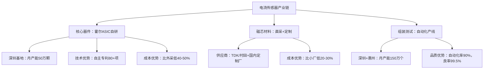

<!--
文件: 05_product-current-sensor.md
描述: 产品5：电流传感器
原始行范围: 3849-4327
生成时间: 2025-11-20
来源: 比亚迪半导体销售情报支持手册
-->

# 产品5：电流传感器

## 📊 C1: Context - 市场环境情报

### 市场规模与增速

**全球车载电流传感器市场：**
- 2024年：约$2.8B（约¥203亿元）
- 2027年：约$4.5B（年复合增长率17.2%）
- 新能源车驱动高增长

**中国市场：**
- 2024年：约¥85亿元（全球42%）
- 2027年：约¥155亿元
- 驱动因素：电池管理精细化+800V平台

*数据来源：Markets and Markets 2024、高工锂电*

---

### 技术演进与市场机会

| 时间节点  | 技术趋势                    | 单车传感器数量           | 对销售的影响                 |
| --------- | --------------------------- | ------------------------ | ---------------------------- |
| 2024      | 基础BMS电流检测             | 3-5个 （主电流+分路） | 基础市场 低端饱和         |
| 2025-2026 | 800V平台普及 精细化管理  | 8-12个 （多点监测）   | 黄金窗口期 单车价值量提升 |
| 2027+     | 双向充电V2G 热管理智能化 | 12-18个 但集成度提升  | 技术升级 ASP下降压力      |

---

### 应用场景拆解（按功能域分类）

#### **动力电池管理（50%市场需求）- 核心战场**

**主电流传感器（Pack级）**
- **应用位置**：电池包主正极/主负极
- **技术要求**：
  - 量程：±1000A（800V平台）/ ±600A（400V平台）
  - 精度：±0.5%（精度要求最高）
  - 响应时间：<1ms
  - 工作温度：-40°C~+125°C
- **技术路线**：
  - 霍尔效应式：主流（占比70%）
  - 分流器式：低成本方案（占比25%）
  - 磁阻式（AMR/GMR）：高精度方案（占比5%）
- **价格带**：¥150-300/个（霍尔式）
- **单车用量**：2个（充电1个+放电1个，或双向1个）
- **单车价值**：¥300-600
- **主要供应商**：LEM、Melexis、Allegro、比亚迪半导体

**分支电流传感器（模组级）**
- **应用位置**：电池模组内部（监测单个模组电流）
- **技术要求**：
  - 量程：±200A~±500A
  - 精度：±1%（要求次于主传感器）
  - 响应时间：<5ms
  - 小型化要求（模组内空间有限）
- **单车用量**：0-6个（取决于BMS架构）
  - 简单BMS：0个（仅主传感器）
  - 中级BMS：2-4个（重要分支监测）
  - 高级BMS：6+个（全分支监测）
- **价格带**：¥80-150/个
- **单车价值**：¥0-900
- **趋势**：800V平台+精细化管理→需求增加

---

#### **电驱系统（30%市场需求）- 高性能战场**

**三相电流传感器（电机控制）**
- **应用位置**：电机控制器（逆变器输出侧）
- **技术要求**：
  - 量程：±600A~±1200A（视电机功率）
  - 精度：±1%
  - 响应时间：<0.5ms（FOC矢量控制需要）
  - 带宽：>100kHz
- **单车用量**：
  - 单电机：3个（UVW三相）
  - 双电机：6个
  - 四电机：12个
- **价格带**：¥120-250/个
- **单车价值**：¥360-3,000（视电机数量）
- **主要供应商**：LEM、TDK、Allegro

**直流母线电流传感器**
- **应用位置**：电机控制器输入侧（DC Bus）
- **技术要求**：
  - 量程：±1000A
  - 精度：±1%
  - 快速过流保护（<1μs）
- **单车用量**：1-2个/电机
- **价格带**：¥150-300/个

---

#### **充电/电源系统（15%市场需求）**

**OBC电流传感器（车载充电机）**
- **应用位置**：AC输入侧+DC输出侧
- **量程**：AC侧±32A/80A，DC侧±200A
- **单车用量**：2-3个
- **价格带**：¥80-150/个

**DC-DC电流传感器**
- **应用位置**：高压→低压转换器
- **量程**：±100A
- **单车用量**：1-2个
- **价格带**：¥60-120/个

---

#### **其他应用（5%市场需求）**

**空调压缩机电流传感器**
- **量程**：±50A
- **单车用量**：1个
- **价格带**：¥50-100/个

**PTC加热器电流传感器**
- **量程**：±100A
- **单车用量**：1个（北方车型）
- **价格带**：¥50-100/个

---

## 💡 市场机会洞察

### 单车价值量分析（按车型分级）

| 车型档位              | BMS传感器                 | 电驱传感器               | 充电/电源         | 其他            | 合计         | 典型车型                   |
| --------------------- | ------------------------- | ------------------------ | ----------------- | --------------- | ------------ | -------------------------- |
| 入门级 （<15万）   | 2个主电流 ¥300-600     | 3个三相 ¥360-750      | 3个 ¥240-450   | 1个 ¥50-100  | ¥950-1,900   | 五菱宏光MINI、长安Lumin    |
| 主流级 （15-30万） | 2主+2分支 ¥600-1,200   | 6个三相 ¥720-1,500    | 3个 ¥240-450   | 2个 ¥100-200 | ¥1,660-3,350 | 比亚迪秦/宋、零跑C11       |
| 高端级 （30-50万） | 2主+4分支 ¥900-1,800   | 6-12个三相 ¥720-3,000 | 3-4个 ¥300-600 | 2个 ¥100-200 | ¥2,020-5,600 | 蔚小理、极氪001            |
| 旗舰级 （>50万）   | 2主+6分支 ¥1,200-2,400 | 12个三相 ¥1,440-3,000 | 4-5个 ¥360-750 | 3个 ¥150-300 | ¥3,150-6,450 | 保时捷Taycan、比亚迪仰望U8 |

---

### 高价值赛道识别

1. **BMS主电流传感器**：单价高（¥150-300），100%渗透率，技术壁垒高

2. **电机三相传感器**：单车用量多（6-12个），ASP高（¥120-250）

3. **800V平台分支传感器**：新增需求，2024年渗透率15%→2027年45%

---

### 销售策略建议

→ 主攻BMS主电流传感器（毛利高+技术背书）  
       → 拓展电驱三相传感器（量大+绑定电机控制器）  
       → 布局800V分支传感器（未来增长点）

# 🎯 C2: Customer - 客户情报

## 目标客户分级矩阵

| 客户类型                        | 代表企业                             | 年需求量            | 切入难度 | 优先级 | 进攻策略                                         |
| ------------------------------- | ------------------------------------ | ------------------- | -------- | ------ | ------------------------------------------------ |
| 战略级客户 （集团关联）      | 比亚迪各品牌 （王朝、海洋、腾势） | 600万个/年          | ⭐        | ⭐⭐⭐    | 内部协同 确保份额稳定 新技术首发           |
| 进攻型客户 （国产替代目标）  | 长城、吉利 奇瑞、长安             | 单客户80-200万个/年 | ⭐⭐⭐      | ⭐⭐⭐⭐   | 二供切入 BMS主传感器突破 性价比+快速响应   |
| 机会型客户 （新势力/成长中） | 零跑、哪吒 深蓝、启源             | 单客户20-80万个/年  | ⭐⭐       | ⭐⭐⭐⭐⭐  | 小批量起订 定制化方案 成长期绑定           |
| 高端客户 （品牌背书）        | 蔚小理、极氪 智己、阿维塔         | 单客户30-120万个/年 | ⭐⭐⭐⭐     | ⭐⭐⭐    | 高精度产品 技术联合开发 800V平台卡位       |
| 战术型客户 （合资/外资）     | 一汽-大众 上汽通用                | 单客户40-150万个/年 | ⭐⭐⭐⭐⭐    | ⭐⭐     | 战略性放弃 或仅维持联系 （外资供应链封闭） |

## 客户决策链分析（三层渗透模型）

**以零跑汽车为例（机会型客户 - 优先级⭐⭐⭐⭐⭐）：**

### 第一层：技术准入（门槛层）

**关键角色：** 电池/电驱部门 主任工程师  
**决策权重：** 40%（技术否决权）

**关注点：**
- ✓ 精度（BMS主传感器±0.5%，电驱±1%）
- ✓ 响应时间（<1ms for BMS，<0.5ms for FOC）
- ✓ 可靠性（AEC-Q100认证、热冲击、EMC）
- ✓ 线性度（全量程线性度±1%）
- ✓ 温漂（温度系数<50ppm/°C）

**我们的渗透策略：**
- → 提供详细技术白皮书（霍尔式 vs 分流器式对比）
- → 免费送样+提供测试支持（实验室测试+台架测试）
- → 邀请参观比亚迪应用案例（BMS系统实车验证）
- → 强调AEC-Q100认证+5年15万公里车规验证

**话术模板：**
> "零跑的C11用的是宁德时代CTP电池包对吧？主电流传感器量程需要±1000A？我们在比亚迪的BMS上已经量产3年，精度±0.5%，温漂<50ppm/°C，完全满足您的要求。这是我们的实测数据报告，您看一下..."

---

### 第二层：商务决策（核心层）

**关键角色：** 采购部 品类经理  
**决策权重：** 45%（最终决策权）

**关注点：**
- ✓ 价格竞争力（需比LEM/Melexis低20-25%）
- ✓ 供应稳定性（产能、交期、备货能力）
- ✓ 付款条件（账期、VMI库存模式）
- ✓ 年降承诺（每年降价5-8%）

**我们的渗透策略：**
- → 初期报价激进（比LEM低25-30%）
- → 提供灵活商务条款（60天账期、小批量起订）
- → 强调供应链安全（不受国际形势影响）
- → 承诺合理年降（5-7%，低于外资品牌8-10%）

**话术模板：**
> "我理解零跑对成本控制的要求。您现在用LEM的价格是XXX对吧？（如果对方不透露）我们估算应该在¥200-250/个这个区间。
>
> **我们的报价策略：**
> - 首单报价：¥150-180/个（低25-30%）
> - 量产稳定后：¥140-170/个
> - 年降承诺：每年5-7%
>
> **为什么能做到这个价格？**
> 1. 霍尔芯片自产（比亚迪半导体自有产线）
> 2. 规模效应（比亚迪集团年用量600万个）
> 3. 供应链整合（磁芯/ASIC直采）
>
> **而且我们承诺：**
> - ✓ 60天账期（标准）
> - ✓ 小批量起订（1,000个起）
> - ✓ 专属备货（您的安全库存）"

---

### 第三层：应用支持（价值增值层）

**关键角色：** BMS/电驱系统集成商  
**决策权重：** 15%（推荐权）

**关注点：**
- ✓ 易用性（接口标准化、PCB布局）
- ✓ 技术支持（标定/补偿算法、EMC设计）
- ✓ 交付配合（响应速度、变更管理）

**我们的渗透策略：**
- → 与BMS/电驱供应商建立战略合作（如欣旺达、汇川技术）
- → 提供"交钥匙"方案（传感器+ASIC+算法）
- → 工程师驻场支持（解决集成/调试问题）

**话术模板：**
> "我们已经和欣旺达合作多年了，他们的BMS系统集成我们的传感器没有任何问题。您的BMS供应商是XXX对吧？我们可以直接对接：
>
> 1. 免费提供接口协议文档（CAN/LIN）
> 2. 配套ASIC方案推荐（TI/ADI芯片）
> 3. EMC设计指南（避免干扰问题）
> 4. 标定工具和算法（温度补偿/线性化）
>
> **而且我们有专门的应用工程师团队：**
> - FAE经理XXX（手机：XXX）
> - 应用工程师XXX（微信：XXX）
> - 24小时响应机制"

---

## 典型客户画像卡片

### 客户A：零跑汽车（机会型客户 - 优先级⭐⭐⭐⭐⭐）

| 维度       | 详细信息                                                     |
| ---------- | ------------------------------------------------------------ |
| 企业背景   | 新势力，2024年销量目标35万台 定位：10-20万价格带，性价比路线 自研三电系统（电池/电驱/电控） |
| 传感器需求 | • BMS主电流：2个/车（±1000A霍尔式） • BMS分支电流：2-4个/车（±200A霍尔式） • 电驱三相：6个/车（双电机） • OBC/DC-DC：3个/车 总需求：420-525万个/年 |
| 现有供应商 | • LEM（瑞士）：主供，BMS主电流50% • Melexis（比利时）：二供，电驱三相40% • Allegro（美国）：小批量，BMS分支10% |
| 痛点       | ✓ 成本压力大（外资品牌价格高） ✓ 交期不稳（LEM欧洲工厂产能有限） ✓ 需要快速响应（车型迭代快，新平台开发周期短） |
| 决策链     | • 技术负责人：李工（电池部）/ 王工（电驱部） • 采购负责人：张经理（采购部） • BMS供应商：欣旺达 / 电驱：汇川技术 |
| 切入策略   | **第1步：从BMS分支电流切入（门槛低，LEM不重视）** • 报价：¥80-100/个（比LEM低30%） • 小批量起订（1,000个起） • 快速交付（4周发货）  **第2步：拓展到BMS主电流** • 对标LEM HAL系列 • 价格低25%（¥150-180 vs ¥200-250） • 提供比亚迪实车验证数据  **第3步：渗透到电驱三相** • 与汇川技术联合开发 • 提供FOC控制算法支持 • 2026年新车型首发导入 |
| 预期成果   | • 2026年：份额10%，销售额0.4-0.5亿元 • 2027年：份额30%，销售额1.2-1.6亿元 • 2028年：份额50%，销售额2.0-2.6亿元 |

---

### 客户B：长城汽车（进攻型客户 - 优先级⭐⭐⭐⭐）

| 维度       | 详细信息                                                     |
| ---------- | ------------------------------------------------------------ |
| 企业背景   | 传统车企，2024年新能源销量目标60万台 定位：15-30万价格带，SUV强势 自研BMS，电驱外采（汇川/博世） |
| 传感器需求 | • BMS主电流：2个/车 • BMS分支电流：4个/车（高端车型） • 电驱三相：6个/车 • OBC/DC-DC：3个/车 总需求：900-1,050万个/年 |
| 现有供应商 | • LEM（瑞士）：主供，BMS主电流70% • TDK（日本）：主供，电驱三相60% • Melexis：二供，BMS分支20% |
| 痛点       | ✓ 国产化率要求（2025年目标65%） ✓ 成本压力（LEM/TDK价格高） ✓ 供应链安全（中美关系影响） |
| 决策链     | • 技术负责人：张总工（研发中心） • 采购负责人：刘总监（集团采购） • BMS供应商：蜂巢能源（自有） |
| 切入策略   | **第1步：BMS主电流二供（10-15%份额）** • 对标LEM HAL系列 • 价格低25%（¥150-180 vs ¥200-250） • 通过蜂巢能源认证  **第2步：BMS分支电流替换Melexis** • 价格更有竞争力 • 提供定制化量程方案  **第3步：新车型首发导入** • 联合开发800V平台传感器（2026年） • 绑定长期战略协议 |
| 预期成果   | • 2026年：份额10%，销售额1.5-2.0亿元 • 2027年：份额25%，销售额3.5-5.0亿元 • 2028年：份额40%，销售额5.5-8.0亿元 |

# 💼 C3: Competitor - 竞争情报

## 中国车载电流传感器市场竞争格局（2024）

### 市场份额分布（按销售额）

#### 国际品牌：65%

| 品牌                  | 市场份额 | 优势                         | 弱势                         | 主打产品                 | 主要客户                |
| --------------------- | -------- | ---------------------------- | ---------------------------- | ------------------------ | ----------------------- |
| **LEM（瑞士）**       | 30%      | 技术领先、精度最高、品牌强   | 价格最贵、交期长、本土化不足 | HAL系列（霍尔闭环）      | BBA、大众、蔚小理、长城 |
| **Melexis（比利时）** | 18%      | 集成度高、小型化、汽车电子强 | 价格高、产能有限             | MLX91210系列（集成ASIC） | 博世、大陆、吉利        |
| **Allegro（美国）**   | 10%      | 性价比高、霍尔芯片自产       | 高精度产品不足               | ACS系列                  | 日韩车企、部分自主品牌  |
| **TDK（日本）**       | 7%       | 磁性材料强、可靠性高         | 价格较高                     | -                        | 丰田、本田              |

#### 国产品牌：35%（快速增长）

| 品牌                     | 市场份额 | 优势                                   | 弱势                               | 主要客户                 | 市占率趋势                           |
| ------------------------ | -------- | -------------------------------------- | ---------------------------------- | ------------------------ | ------------------------------------ |
| **比亚迪半导体（深圳）** | 12%      | 比亚迪集团背书、车规验证丰富、性价比高 | 外部客户开拓不足、高精度产品待提升 | 比亚迪各品牌（内部为主） | 2022年8% → 2024年12% → 2027年目标20% |
| **芯海科技（深圳）**     | 10%      | ASIC自研、方案灵活                     | 传感器本体外采                     | 长安、奇瑞               | -                                    |
| **启碁微电子（上海）**   | 8%       | BMS系统集成、一站式方案                | 传感器性能一般                     | 二三线车企               | -                                    |
| **森萨塔（苏州）**       | 5%       | 跨国公司本土化生产                     | -                                  | 合资车企                 | -                                    |

---

## 竞品对标矩阵（Benchmarking）

| 维度         | LEM   | Melexis | 比亚迪半导体 | 我们的定位           |
| ------------ | ----- | ------- | ------------ | -------------------- |
| 技术水平     | ⭐⭐⭐⭐⭐ | ⭐⭐⭐⭐⭐   | ⭐⭐⭐⭐         | 跟随者（缩小差距中） |
| 精度         | ±0.3% | ±0.5%   | ±0.5%        | 持平Melexis          |
| 价格竞争力   | ⭐⭐    | ⭐⭐      | ⭐⭐⭐⭐⭐        | 核心优势             |
| 交期保证     | ⭐⭐    | ⭐⭐⭐     | ⭐⭐⭐⭐⭐        | 核心优势             |
| 本土化服务   | ⭐⭐    | ⭐⭐⭐     | ⭐⭐⭐⭐⭐        | 核心优势             |
| 品牌认知度   | ⭐⭐⭐⭐⭐ | ⭐⭐⭐⭐    | ⭐⭐⭐          | 亟需提升             |
| 产品线丰富度 | ⭐⭐⭐⭐⭐ | ⭐⭐⭐⭐    | ⭐⭐⭐⭐         | 持续扩充             |
| 车规认证     | ⭐⭐⭐⭐⭐ | ⭐⭐⭐⭐⭐   | ⭐⭐⭐⭐⭐        | 齐全                 |
| 定制化能力   | ⭐⭐    | ⭐⭐⭐     | ⭐⭐⭐⭐⭐        | 核心优势             |

---

## 对标分析表（BMS主电流传感器为例）

| 参数      | LEM HAL 1000-S | Melexis MLX91210 | 比亚迪半导体 BYCS-H1000 | 优势/劣势        |
| --------- | ----------------- | ------------------- | -------------------------- | ---------------- |
| 量程      | ±1000A            | ±1000A              | ±1000A                     | 持平（✓）        |
| 精度      | ±0.3%             | ±0.5%               | ±0.5%                      | 持平Melexis（✓） |
| 线性度    | ±0.5%             | ±1%                 | ±1%                        | 持平（✓）        |
| 响应时间  | <1μs              | <1μs                | <1μs                       | 持平（✓）        |
| 温漂      | <25ppm/°C         | <50ppm/°C           | <50ppm/°C                  | 持平（✓）        |
| 工作温度  | -40~+85°C         | -40~+125°C          | -40~+125°C                 | 领先（✓✓）       |
| AEC-Q100  | Grade 1           | Grade 0             | Grade 0                    | 领先（✓✓）       |
| 封装尺寸  | 40×30×15mm        | 35×25×12mm          | 38×28×14mm                 | 中等（✓）        |
| 价格（¥） | 220-250           | 180-220             | 150-180                    | 领先（✓✓✓）      |
| MOQ       | 1,000个           | 1,000个             | 500个                      | 领先（✓✓）       |
| 交期      | 10-12周           | 8-10周              | 6-8周                      | 领先（✓✓）       |

### 总结

✅ **性能对标**：与Melexis持平，接近LEM（85-90%水平）  
        ✅ **价格优势**：比LEM低30-35%，比Melexis低15-20%  
        ✅ **灵活性优势**：MOQ最低、交期最快、定制化强

# 🏢 C4: Company - 公司能力展示

## 比亚迪半导体电流传感器产品矩阵

### 产品线全景图

#### BMS电流传感器（Pack/模组级）

| 产品类型 | 型号 | 技术 | 量程 | 精度 | 应用 | 价格 | 认证 | 客户 |
|---------|------|------|------|------|------|------|------|------|
| **主电流传感器（Pack级）** | BYCS-H1000系列 | 闭环霍尔效应 | ±1000A / ±1500A / ±2000A | ±0.5% | 400V/800V电池包主电流 | ¥150-250/个 | AEC-Q100 Grade 0 | 比亚迪全系、零跑 |
| **分支电流传感器（模组级）** | BYCS-H500系列 | - | ±200A / ±500A | ±1% | 电池模组分支监测 | ¥80-150/个 | - | 比亚迪高端车型 |
| **小电流传感器（辅助回路）** | BYCS-H100系列 | - | ±50A / ±100A | ±1% | OBC/DC-DC/PTC | ¥50-100/个 | - | - |

#### 电驱电流传感器（电机控制）

| 产品类型 | 型号 | 技术 | 量程 | 精度 | 响应时间 | 带宽 | 应用 | 价格 | 客户 |
|---------|------|------|------|------|---------|------|------|------|------|
| **三相电流传感器** | BYCS-M600系列 | 开环霍尔效应 | ±600A / ±1000A / ±1200A | ±1% | <0.5ms | >100kHz | 电机FOC控制 | ¥120-250/个 | 比亚迪电驱系统 |
| **母线电流传感器** | BYCS-DC1000系列 | - | ±1000A | - | - | - | 电机控制器DC Bus | ¥150-280/个 | - |

#### 配套产品

- 霍尔ASIC芯片：自研，可单独对外销售
- 标定/补偿算法：温度补偿、线性化
- EMC滤波方案：配套PCB设计指南

---

## 核心竞争优势

### 优势1：车规级验证背书

**比亚迪电流传感器在集团内部的验证数据：**

| 验证维度 | 数据 |
|---------|------|
| 装车量 | 累计超过600万台车（2020-2024） |
| 运行里程 | 累计超过1000亿公里 |
| 实车验证 | 5年15万公里全生命周期 |
| 不良率 | <5ppm（行业平均10-15ppm） |
| 应用车型 | 汉、唐、宋、海豹、腾势等全系 |

**典型验证案例：**

| 车型 | 应用产品 | 验证成果 |
|------|---------|---------|
| 比亚迪汉 | BMS主电流传感器 | 4年0故障 |
| 唐DM-p | 电驱三相传感器 | 3年PPM<3 |
| 腾势N7 | 800V平台，分支电流传感器 | 2年稳定运行 |

**销售话术：**
> "我们的电流传感器已经在比亚迪600万台车上验证过了，累计运行1000亿公里，不良率<5ppm。您用我们的产品，等于用了一个已经通过市场检验的成熟方案。"

---

### 优势2：霍尔芯片自主可控

**比亚迪半导体电流传感器产业链布局：**

**成本优势分析：**

| 环节         | 优势来源               | 成本降低幅度 |
| ------------ | ---------------------- | ------------ |
| 霍尔ASIC     | 自研成本比外采低       | 40-50%       |
| 磁芯         | 规模采购成本比小厂低   | 20-30%       |
| 组装         | 自动化率高成本比同行低 | 15-20%       |
| **综合成本** | **比纯组装厂低**       | **50-60%**   |

**销售话术：**
> "我们的核心器件霍尔ASIC是自研的，不依赖外部供应链，所以成本和供应稳定性都有保障。这个成本优势不是靠压榨利润，而是靠技术自主和规模效应。"

---

### 优势3：一站式解决方案

**比亚迪半导体电流传感器一站式方案：**

| 方案类别     | 提供内容                                                     |
| ------------ | ------------------------------------------------------------ |
| **硬件方案** | • 传感器本体（霍尔/分流器/磁阻式可选） • 配套ASIC芯片（信号调理+ADC） • PCB布局指南（EMC优化） • 连接器/线束方案 |
| **软件方案** | • 标定算法（温度补偿、线性化） • 通讯协议（CAN/LIN/SPI） • 故障诊断算法（过流/短路/开路检测） • Simulink模型（便于系统仿真） |
| **测试验证** | • 标定设备（提供租赁/代测服务） • 测试夹具（定制化设计） • EMC测试支持（预扫描服务） • 实车验证支持（提供测试车辆） |
| **技术支持** | • 24小时FAE响应 • 驻场支持（大客户） • 培训服务（使用/标定/故障诊断） |

**销售话术：**
> "我们不是简单卖传感器，而是提供一站式方案。从硬件到软件，从标定到测试，我们都能支持。您不需要自己摸索，我们有成熟的方案和工具，帮您快速完成集成。"

---

## 典型应用案例展示

### 案例1：比亚迪汉 - BMS标杆案例

| 项目信息       | 详情                                                         |
| -------------- | ------------------------------------------------------------ |
| **客户/车型**  | 比亚迪汉DM-p / EV（2021款起）                                |
| **应用场景**   | BMS主电流传感器（Pack级，2个/车）                            |
| **产品型号**   | BYCS-H1000（±1000A，闭环霍尔）                               |
| **关键参数**   | 精度±0.5%，线性度±1%，温漂<50ppm/°C                          |
| **项目规模**   | 2021-2024累计装车80万台 单车价值：¥350（2个×¥175）        |
| **客户痛点**   | • 需要高精度（SOC估算要求±0.5%） • 需要高可靠性（高端车型，零故障要求） • 需要快速响应（新车型窗口期紧） |
| **我们的方案** | • 定制开发±1000A量程（匹配刀片电池） • 优化温度补偿算法（温漂<50ppm/°C） • 30天完成从打样到量产 • 提供Simulink模型支持BMS开发 |
| **项目成果**   | ✓ 4年0故障，PPM<3 ✓ SOC估算精度±1%（行业领先） ✓ 成为比亚迪全系BMS标准方案 ✓ 外部客户参观背书：超过15家车企参观 |
| **可复制点**   | • 技术对标LEM（性能达到90%） • 价格优势30% • 快速响应+定制化 |

**销售话术：**
> "比亚迪汉的BMS用的就是我们的电流传感器，已经4年80万台车验证过了，PPM<3，SOC估算精度±1%，比很多用LEM的车型还精准。LEM能做到的，我们也能做到，而且价格比LEM低30%。"

