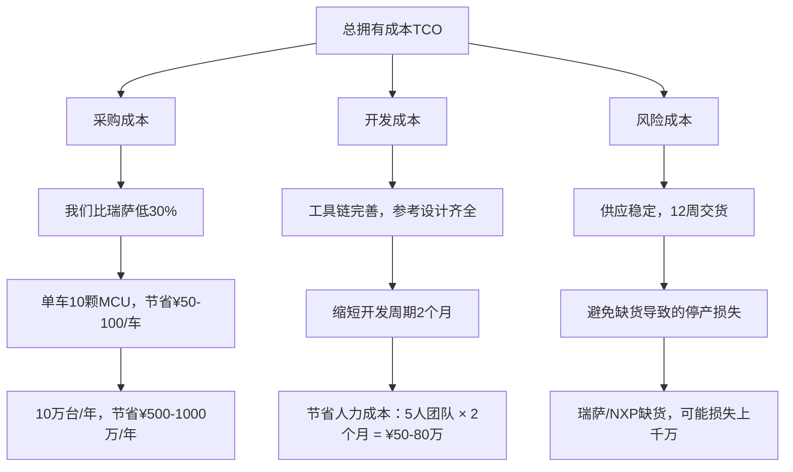
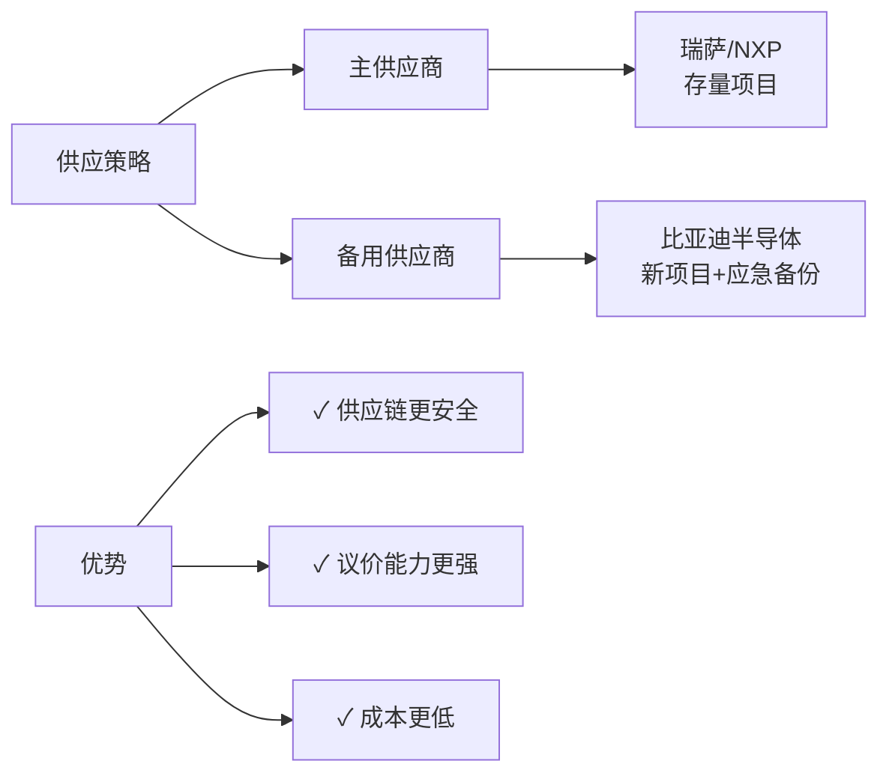

<!--
文件: 06_product-mcu.md
描述: 产品6：MCU（微控制单元）
原始行范围: 4328-5626
批次: 第2批
生成时间: 2025-11-20
来源: 比亚迪半导体销售情报支持手册
-->

# 产品6：MCU（微控制单元）

## 📊 C1: Context - 产品概述与定位

### 一、MCU核心定义

**MCU = 汽车的"智能控制中枢"**

> **功能定位**
> - • CPU + 存储器 + I/O接口 集成芯片
> - • 专为实时控制设计，低功耗高可靠
> - • 汽车电子系统的"大脑"

**典型应用场景：**
- ✓ 车身控制（BCM）：灯光、车窗、雨刷、门锁
- ✓ 电机控制：EPS转向、水泵、风扇、座椅调节
- ✓ 电池管理（BMS从控）：单体监测、均衡控制
- ✓ 热管理：空调、PTC加热器控制
- ✓ 座舱域控：仪表显示、HMI交互
- ✓ 底盘辅助：ABS/ESC信号处理

### 二、比亚迪MCU产品矩阵

#### 产品系列架构

| 系列       | 内核    | 主频       | Flash     | 应用场景           | 竞品对标    | 价格优势 |
| ---------- | ------- | ---------- | --------- | ------------------ | ----------- | -------- |
| 8位通用    | 8051    | 16-48MHz   | 16-128KB  | 简单车身控制       | 瑞萨RL78    | 30-40%   |
| 32位车规M3 | ARM M3  | 80-120MHz  | 256KB-1MB | BCM、BMS从站       | 瑞萨RH850   | 25-35%   |
| 32位车规M4 | ARM M4F | 120-200MHz | 512KB-2MB | 电机控制、域控     | NXP S32K    | 20-30%   |
| 高性能系列 | ARM M7  | 300MHz+    | 2-4MB     | ADAS辅助、智能座舱 | 英飞凌TC3xx | 15-25%   |

### 核心竞争优势

#### 优势1：500万台实车验证

**比亚迪MCU装车数据（2020-2024）：**
- 累计装车量：超过500万台
- 应用车型：汉、唐、海豹、元Plus、海豚、腾势D9等全系
- 零故障记录：PPM < 5（行业领先）
- 应用场景覆盖：BCM、BMS、EPS、热管理、座舱

> **销售话术：**
> "我们的MCU已经在500万台比亚迪车上验证过了，覆盖从10万到30万价位的所有车型。这个验证规模，连瑞萨、NXP都比不了。"

#### 优势2：车规级全认证

**认证体系：**
- ✓ AEC-Q100（车规可靠性）
- ✓ ISO 26262 ASIL-B/C（功能安全）
- ✓ IATF 16949（汽车质量管理）
- ✓ -40℃~150℃工作温度
- ✓ EMC电磁兼容（Class 5）

> **销售话术：**
> "车规认证我们全部齐全，不是商用芯片改的，是从设计开始就按车规标准做的。这个在国产MCU里面，我们是最早拿全认证的。"

#### 优势3：技术领先

**技术亮点：**
- 高集成度：集成CAN/LIN/SPI、ADC、PWM、定时器
- 低功耗：休眠电流 < 10μA（同类产品50μA+）
- 高EMC性能：抗干扰能力 > 200V/m（超越国标要求）
- 快速启动：冷启动 < 50ms（传统MCU > 100ms）
- 开发友好：提供完整BSP库、代码生成工具

> **销售话术：**
> "我们MCU的低功耗做得特别好，休眠电流只有10μA以下。这对新能源车很重要，可以延长停车后的电池待机时间。"

#### 优势4：成本与供应保障

- **价格优势**：比国际品牌低20-35%
  - 8位MCU：¥3-8（瑞萨¥5-12）
  - 32位M3：¥8-15（瑞萨RH850 ¥12-25）
  - 32位M4：¥15-30（NXP S32K ¥25-45）

- **交期保障**：标准品12周，定制品16周
  - 国际品牌：24-52周（缺货严重）

- **本土化服务**：
  - FAE团队：20人+，覆盖华东/华南/华北
  - 技术支持：4小时响应，驻场服务（大客户）
  - 备货能力：深圳/合肥双仓，安全库存3个月

> **销售话术：**
> "现在国际MCU厂商普遍缺货，交期都在半年以上。我们12周就能交货，而且价格比他们低30%。这个供应保障，在当前形势下是非常关键的。"

# 🎯 C2: Customer - 客户分析

## 一、客户分层与需求画像

### Tier 1：新能源车企（战略大客户）

#### 代表客户
- **头部**：理想汽车、小鹏汽车、蔚来汽车、零跑汽车
- **新势力**：小米汽车、华为问界、集度汽车
- **传统转型**：吉利汽车、长安汽车、奇瑞汽车

#### 需求特点

**痛点1：供应链安全**

* **背景**：
    * 2021-2023年全球MCU大缺货
    * 国际品牌交期延长到1年+
    * 车企被迫减产或更换供应商
* **需求**：
    * ✓ 稳定供货（不受国际形势影响）
    * ✓ 快速交付（缩短项目周期）
    * ✓ 备用方案（多源供应）
* **我们的方案**：
    * 本土生产：深圳/合肥双基地，产能20万片/月
    * 备货机制：安全库存3个月，紧急响应7天
    * 长期协议：签订战略合作，价格锁定、产能保障

**痛点2：成本压力**

* **背景**：
    * 电动车价格战激烈（2024年多次降价）
    * 单车利润率不足5%
    * 供应商降本压力传导
* **需求**：
    * ✓ 降低MCU采购成本
    * ✓ 批量折扣
    * ✓ 长期价格锁定
* **我们的方案**：
    * **价格优势**：比国际品牌低20-35%
        * 单车节省：BCM用10颗MCU，节省¥100-150
        * 年度节省：10万台车型，节省¥1000-1500万
    * **批量折扣**：
        * 50万颗/年：额外5%折扣
        * 100万颗/年：额外8%折扣
        * 200万颗/年：额外10%折扣+专属FAE
    * **价格锁定**：签2-3年长期协议，避免涨价风险

**痛点3：技术支持不足**

* **背景**：
    * 国际品牌FAE资源紧张（1个FAE服务10+客户）
    * 技术问题响应慢（邮件回复需要1周+）
    * 驻场支持费用高（10万/月起）
* **需求**：
    * ✓ 快速技术响应
    * ✓ 驻场支持（关键项目）
    * ✓ 定制开发（特殊需求）
* **我们的方案**：
    * 快速响应：4小时内响应，24小时给解决方案
    * FAE团队：20人+，比例1:3（1个FAE服务3个客户）
    * 驻场服务：大客户免费驻场（单车型10万台+）
    * 定制开发：协助BSP移植、协议栈开发、功能定制
    * 培训服务：免费技术培训（每季度1次）

#### 决策链分析

> **新能源车企MCU采购决策链**

**阶段1：技术评审（3-6个月）**
* **决策人**：硬件工程师、系统工程师
* **关注点**：
    * 技术规格是否满足需求
    * 是否有车规认证
    * 性能稳定性测试
    * 开发工具链是否完善
* **我们的切入点**：
    * 提供完整技术资料（数据手册、应用笔记）
    * 免费样片测试（50-100片）
    * FAE现场支持（协助调试）
    * 提供参考设计（缩短开发周期）

**阶段2：小批量验证（6-12个月）**
* **决策人**：测试工程师、质量工程师
* **关注点**：
    * 产品一致性
    * 可靠性测试（温度、湿度、震动）
    * EMC测试通过率
    * 生产良率
* **我们的支持**：
    * 提供小批量订单（1000-5000片）
    * 协助完成车规测试
    * 提供测试报告（节省测试成本）
    * 驻厂支持（生产导入期）

**阶段3：商务谈判（1-3个月）**
* **决策人**：采购总监、供应链总监
* **关注点**：
    * 价格竞争力
    * 批量折扣政策
    * 付款条件
    * 交期保障
    * 售后支持
* **我们的策略**：
    * 价格优势：比国际品牌低20-35%
    * 批量折扣：阶梯式折扣（50万/100万/200万颗）
    * 账期优化：60天账期（标准30天）
    * 供应保障：战略备货协议
    * 售后承诺：7天质量问题免费换货

**阶段4：高层决策（1-2个月）**
* **决策人**：CEO、CTO、CFO
* **关注点**：
    * 战略供应链安全
    * 长期合作价值
    * 品牌影响（国产替代）
    * 财务回报
* **我们的打法**：
    * 高层拜访：比亚迪半导体CEO/总经理出面
    * 战略协议：3-5年长期合作，产能保障
    * 联合研发：下一代产品联合定义
    * 品牌背书：比亚迪集团500万台验证案例
    * 国产替代：响应国家政策，供应链自主可控

#### 客户优先级矩阵

| 客户     | 年需求量 | 价值评分  | 成交难度     | 优先级            | 策略重点 |
| -------- | -------- | --------- | ------------ | ----------------- | -------- |
| 小米汽车 | 200万颗+ | ⭐⭐⭐⭐⭐⭐⭐   | 🥇 第一优先级 | 新品牌+供应商开放 |          |
| 零跑汽车 | 150万颗+ | ⭐⭐⭐⭐⭐⭐⭐   | 🥇 第一优先级 | 已有国产经验      |          |
| 理想汽车 | 300万颗+ | ⭐⭐⭐⭐⭐⭐⭐⭐⭐ | 🥈 第二优先级 | 量大但切换难      |          |
| 小鹏汽车 | 180万颗+ | ⭐⭐⭐⭐⭐⭐⭐   | 🥈 第二优先级 | 成本压力大        |          |
| 吉利汽车 | 500万颗+ | ⭐⭐⭐⭐⭐⭐⭐⭐⭐ | 🥈 第二优先级 | 国产替代推进中    |          |
| 蔚来汽车 | 120万颗+ | ⭐⭐⭐⭐⭐⭐⭐⭐⭐ | 🥉 第三优先级 | 高端定位难切入    |          |

### Tier 2：一级供应商（规模化机会）

#### 代表客户
- **传统Tier 1**：德赛西威、经纬恒润、宁波均胜、华阳集团
- **新兴Tier 1**：地平线、黑芝麻、芯驰科技

#### 需求特点

**痛点1：多项目并行压力**
* Tier 1同时服务多个车企客户
* 每个项目MCU需求不同
* 需要灵活的技术支持和供应方案
* **我们的方案**：
    * 产品矩阵完整：覆盖8位到高性能MCU
    * 定制化服务：根据项目需求灵活配置
    * 批量折扣：跨项目累计计算折扣
    * 平台化支持：提供通用BSP平台，缩短开发周期

**痛点2：车企认证协助**
* Tier 1需要协助通过车企的供应商认证
* 需要提供完整的质量文件和测试报告
* **我们的方案**：
    * 提供车规认证资料（AEC-Q100、ISO 26262）
    * 协助完成车企测试（提供测试车辆和场地）
    * 技术联合答辩（FAE参与车企技术评审）
    * 快速响应车企疑问（24小时响应）

> **销售话术：**
> "我们会全程支持你们通过车企认证。从技术文件到测试验证，到现场答辩，我们的FAE团队都会配合。这个过程我们在比亚迪体系内已经走过很多次了，非常熟悉。"

#### 决策链特点
- 更注重技术细节和开发效率
- 决策周期相对较短（3-6个月）
- 价格敏感度高（车企降本压力传导）
- 需要长期稳定供应关系

### Tier 3：商用车企业（增长潜力）

#### 代表客户
- **客车**：宇通客车、金龙客车、中通客车
- **卡车**：福田汽车、一汽解放、江淮汽车
- **专用车**：徐工集团、中联重科

#### 需求特点

**痛点1：高可靠性要求**
* 商用车运营环境恶劣（-40℃~+85℃）
* 使用强度大（每天运行10-16小时）
* 故障影响运营收入（停工成本高）
* **我们的方案**：
    * 宽温度范围：-40℃~+150℃（超越商用车需求）
    * 高可靠性设计：MTBF > 100万小时
    * 比亚迪商用车验证：在客车、卡车上已验证3年+
    * 售后快速响应：质量问题7天换货

> **销售话术：**
> "比亚迪自己就是商用车大厂，我们的客车、卡车全部用自己的MCU。这个可靠性是经过实际运营验证的，不是实验室数据。"

**痛点2：成本控制**
* 商用车利润率低（3-5%）
* 采购成本压力大
* 需要持续降本
* **我们的方案**：
    * 价格优势明显：比国际品牌低30-40%
    * 批量折扣：商用车单车型用量大，折扣更优惠
    * 长期价格锁定：3年协议价格不涨
    * 降本方案：协助优化硬件设计，减少MCU用量

> **销售话术：**
> "商用车对价格很敏感，我们的价格比瑞萨、NXP低30%以上。而且量大了之后，我们还有额外折扣。这个成本优势在商用车行业是非常明显的。"

## 二、客户需求分析（按应用场景）

### 应用场景1：车身控制模块（BCM）

#### 需求特点
- **单车用量**：8-15颗MCU
- **功能分布**：
    - 主控MCU：1颗（32位M4，处理主逻辑）
    - 门控MCU：4颗（8/16位，车门、车窗、锁）
    - 灯控MCU：2-4颗（8/16位，前后灯、氛围灯）
    - 座椅MCU：2-4颗（16/32位，电动调节、加热）

#### 客户痛点

**痛点：多MCU协同通信**
* BCM需要多颗MCU通过CAN/LIN协同工作
* 通信协议一致性要求高
* 需要统一的开发工具链
* **我们的方案**：
    * MCU家族化设计：同一架构，统一工具链
    * 预集成通信协议栈：CAN/LIN驱动库
    * 提供参考设计：BCM完整方案（节省开发时间）

> **销售话术：**
> "BCM一般需要10多颗MCU，我们提供全系列产品，从主控到门控、灯控都有对应的型号。而且开发工具是统一的，你开发一次就能复用到其他MCU上，省时间。"

### 应用场景2：电池管理系统（BMS）从控

#### 需求特点
- **单车用量**：10-20颗（根据电池包模组数量）
- **功能需求**：
    - 单体电压采集（高精度ADC，±2mV）
    - 温度监测（多路温度传感器接口）
    - 均衡控制（PWM输出）
    - CAN通信（与主控通信）

#### 客户痛点

**痛点：高精度AD采集**
* BMS需要高精度电压采集（影响SOC估算精度）
* 温度测量精度要求高（±0.5℃）
* ADC通道数量多（16通道+）
* **我们的方案**：
    * 16位高精度ADC：精度±2mV（优于行业标准±5mV）
    * 多路温度采集：支持16路NTC温度传感器
    * 低温漂设计：温度系数< 50ppm/°C
    * 集成均衡控制：16路PWM输出，无需外部驱动

> **销售话术：**
> "BMS对ADC精度要求很高，我们的ADC精度±2mV，比标准的±5mV精准一倍多。这个精度直接影响SOC估算，对电池管理很关键。而且我们已经在比亚迪刀片电池BMS上验证过了。"

### 应用场景3：电机控制（EPS、水泵、风扇）

#### 需求特点
- **单车用量**：5-10颗
- **功能需求**：
    - PWM控制（6路+，用于三相电机）
    - 电流检测（过流保护）
    - 转速反馈（编码器接口）
    - CAN通信

#### 客户痛点

**痛点：电机控制算法复杂**
* 需要FOC（磁场定向控制）算法
* 电流环、速度环调试复杂
* 开发周期长
* **我们的方案**：
    * 预集成电机控制库：FOC算法、PID控制
    * 电机控制开发套件：硬件+软件+调试工具
    * 免费技术培训：电机控制专题培训
    * 参考设计：EPS、水泵、风扇控制方案

> **销售话术：**
> "电机控制比较复杂，我们提供完整的FOC算法库和参考设计。你不需要从零开发，直接用我们的方案改一改参数就能用。这能节省至少3个月开发时间。"

# 💼 C3: Competitor - 竞争对手分析

## 一、国际MCU巨头分析

### 竞品1：瑞萨电子（Renesas）

#### 公司背景
- 全球第一MCU供应商，市场份额30%+
- 汽车MCU领导者，日系车企主要供应商
- 产品线：RL78（8/16位）、RH850（32位车规）、R-Car（高性能）

#### 竞争态势分析

| 维度 | 瑞萨 | 比亚迪半导体 | 对比分析 |
|---|---|---|---|
| 技术成熟度 | ⭐⭐⭐⭐⭐⭐⭐⭐⭐ | ⭐⭐⭐⭐⭐⭐ | 我们技术跟随，差距缩小中 |
| 产品可靠性 | ⭐⭐⭐⭐⭐⭐⭐⭐⭐ | ⭐⭐⭐⭐⭐⭐⭐⭐⭐ | 我们500万台验证，不输 |
| 价格竞争力 | ⭐⭐⭐⭐⭐ | ⭐⭐⭐⭐⭐⭐⭐ | 我们低30-35% |
| 交期保障 | ⭐⭐⭐⭐⭐ | ⭐⭐⭐⭐⭐⭐⭐ | 我们12周 vs 他们24-52周 |
| 本土化服务 | ⭐⭐⭐⭐⭐ | ⭐⭐⭐⭐⭐⭐⭐⭐ | 我们FAE资源丰富，响应快 |
| 开发工具 | ⭐⭐⭐⭐⭐⭐⭐⭐⭐ | ⭐⭐⭐⭐⭐⭐ | 我们工具链完善，但仍有差距 |

#### 差异化竞争策略

**策略1：价格攻击**

* **瑞萨痛点**：
    * 价格高：RL78系列¥5-12，RH850系列¥12-25
    * 涨价频繁：2021-2023年多次涨价10-20%
* **我们的打法**：
    * 价格低30-35%：
        * RL78对标产品：¥3-8（节省¥2-4/颗）
        * RH850对标产品：¥8-15（节省¥4-10/颗）
    * 价格锁定承诺：3年协议价格不涨
    * 批量折扣：超过50万颗，额外5-10%折扣

> **销售话术：**
> "瑞萨的RH850系列现在要¥20多一颗，我们对标产品只要¥12-15。单车用10颗MCU，就能节省¥50-100。您一年10万台车的话，能省500-1000万。"

**策略2：供应链优势**

* **瑞萨痛点**：
    * 2021-2023年严重缺货
    * 交期延长到1年+（52周）
    * 配货制（优先日系客户）
* **我们的打法**：
    * 本土生产：深圳/合肥双基地，不受国际物流影响
    * 快速交付：12周交货（瑞萨24-52周）
    * 供应保障：战略备货，安全库存3个月
    * 无配货歧视：中国客户优先

> **销售话术：**
> "现在瑞萨缺货严重，交期要半年到一年。我们本土生产，12周就能交货。而且不像瑞萨优先供日系客户，我们是中国客户优先。这个供应保障在当前环境下太重要了。"

**策略3：本土化服务**

* **瑞萨痛点**：
    * FAE资源紧张（1个FAE服务10+客户）
    * 技术响应慢（邮件回复1周+）
    * 驻场支持费用高（10-15万/月）
* **我们的打法**：
    * FAE比例高：1个FAE服务3个客户
    * 快速响应：4小时响应，24小时给方案
    * 免费驻场：大客户（年采购100万颗+）免费驻场
    * 本地培训：每季度免费技术培训

> **销售话术：**
> "瑞萨的FAE很难约，有问题要排队。我们的FAE资源充足，4小时就能响应。而且大客户还可以免费驻场支持，瑞萨要收10万/月。"

#### 针对瑞萨客户的突破策略

**场景：客户正在使用瑞萨RL78/RH850**

**步骤1：从新项目切入（绕过存量项目阻力）**
* 目标：客户的下一代平台或新车型
* 理由：新项目供应商选择灵活性大
* 话术："您下一个项目什么时候立项？我们可以从新项目开始合作。老项目切换成本高,我们理解。但新项目可以同时评估，给我们一个机会。"

**步骤2：提供Pin-to-Pin替代方案（降低切换成本）**
* 如果客户有紧急供应压力，提供Pin兼容产品
* 最小化硬件改动（PCB可能不用改）
* 提供代码移植工具和技术支持
* 话术："如果瑞萨实在缺货影响生产，我们有Pin-to-Pin替代方案。硬件基本不用改，软件我们有迁移工具和FAE全程支持。"

**步骤3：成本量化对比（用数据说话）**
* 制作详细的TCO（总拥有成本）对比表
* 包括：采购价格、开发成本、量产成本、风险成本
* 量化节省金额（年度/项目生命周期）
* 话术："我给您算一笔账。您这个项目5年生命周期，预计产量50万台，每台用10颗MCU。用瑞萨的话总成本是XXX万，用我们能节省YYY万。这个成本优势很明显。"

**步骤4：高层战略合作（绕过技术层阻力）**
* 如果技术层阻力大，升级到高层决策
* 强调：供应链安全、国产替代、战略合作
* 提供：长期价格锁定、产能保障、联合开发
* 话术："我们希望和贵司建立战略合作关系。比亚迪集团也是贵司的大客户，我们可以在多个层面合作。这不只是MCU采购，更是供应链战略布局。"

### 竞品2：恩智浦（NXP）

#### 公司背景
- 全球第二MCU供应商，市场份额25%+
- 汽车MCU强势，S32系列主导市场
- 欧美车企主要供应商

#### 竞争态势分析

| 维度 | NXP | 比亚迪半导体 | 对比分析 |
|---|---|---|---|
| 技术领先性 | ⭐⭐⭐⭐⭐⭐⭐⭐⭐ | ⭐⭐⭐⭐⭐⭐ | NXP技术更先进（尤其高性能） |
| 产品生态 | ⭐⭐⭐⭐⭐⭐⭐⭐ | ⭐⭐⭐⭐⭐⭐ | NXP生态完善（AUTOSAR、工具链） |
| 价格竞争力 | ⭐⭐⭐⭐⭐ | ⭐⭐⭐⭐⭐⭐⭐ | 我们低25-30% |
| 交期保障 | ⭐⭐⭐⭐⭐ | ⭐⭐⭐⭐⭐⭐⭐⭐ | 我们12周 vs 他们16-26周 |
| 本土化服务 | ⭐⭐⭐⭐⭐ | ⭐⭐⭐⭐⭐⭐⭐⭐ | 我们服务响应更快 |

#### 差异化竞争策略

**策略1：性价比突围**

* **NXP痛点**：
    * 价格高：S32K系列¥25-45
    * 定位高端，中低端市场覆盖不足
* **我们的打法**：
    * 针对中端应用（BCM、BMS从控）：
        * 我们32位M3/M4：¥8-20
        * 性价比突出：性能满足需求，价格低50%+
    * 批量折扣：大客户额外10%折扣
    * 降本方案：协助客户用中端产品替代高端产品

> **销售话术：**
> "您这个BCM应用，其实不需要用NXP S32K这么高端的芯片。我们的32位M4完全能满足需求，价格只要他们的一半不到。性能够用就行，没必要花冤枉钱。"

**策略2：从中低端应用切入**

* 避开NXP强势领域（ADAS、域控制器）
* 聚焦中低端应用（BCM、门控、灯控、BMS从控）
* 逐步积累客户信任，再向上突破
* **应用切入优先级**：
    * ✓ 优先级1：BCM车身控制（量大、技术门槛适中）
    * ✓ 优先级2：BMS从控（电动车刚需、量大）
    * ✓ 优先级3：电机控制（EPS、水泵、风扇）
    * ✓ 优先级4：座舱显示（仪表、HMI）

> **销售话术：**
> "我们先从BCM和BMS从控开始合作。这两个应用我们很成熟，已经在比亚迪全系车型上验证了。等合作顺利了，后面域控、ADAS的项目也可以一起探讨。"

**策略3：国产替代趋势**

* 强调供应链安全（不受国际形势影响）
* 国家政策支持（国产替代、自主可控）
* 成本优势（长期价格锁定）

> **销售话术：**
> "现在国家大力推进国产替代，NXP是美国公司，存在不确定性。我们是本土企业，而且有比亚迪集团背书，供应链完全自主可控。这个对您的供应链安全很重要。"

### 竞品3：英飞凌（Infineon）

#### 公司背景
- 德国半导体巨头
- AURIX系列（TC3xx）主导高端车规MCU
- 功能安全领域领导者（ASIL-D）

#### 竞争态势分析

**英飞凌定位**：高端市场（ADAS、域控、动力总成）
**我们定位**：中低端市场（BCM、BMS、电机控制）

**竞争策略：错位竞争，避免正面交锋**

* 英飞凌强势领域：ASIL-D功能安全、高性能多核
* 我们聚焦领域：ASIL-B/C中低端应用
* 差异化价值：性价比高、供应稳定、服务快

**对标产品：**
> - 英飞凌TC3xx → 我们不对标（技术差距大）
> - 英飞凌TC2xx → 我们M7系列（未来规划）
> - 英飞凌XMC → 我们M4系列（当前主力）

> **销售话术：**
> "您这个应用如果需要ASIL-D级别的功能安全，那英飞凌确实更合适。但如果是ASIL-B/C级别，我们的产品完全能满足，价格还比英飞凌低很多。"

## 二、国产MCU厂商分析

### 竞品4：兆易创新（GigaDevice）

#### 公司背景
- 中国MCU领导者，市场份额第一
- GD32系列（基于ARM Cortex-M）
- 主要市场：工控、消费电子，汽车MCU起步

#### 竞争态势分析

| 维度 | 兆易创新 | 比亚迪半导体 | 对比分析 |
|---|---|---|---|
| 车规认证 | ⭐⭐⭐⭐⭐ | ⭐⭐⭐⭐⭐⭐⭐⭐ | 我们认证更完整（AEC-Q100+ISO 26262） |
| 实车验证 | ⭐⭐⭐ | ⭐⭐⭐⭐⭐⭐⭐ | 我们500万台验证 vs 他们<50万 |
| 价格竞争力 | ⭐⭐⭐⭐⭐⭐⭐⭐ | ⭐⭐⭐⭐⭐⭐ | 价格接近，我们略高5-10% |
| 产品性能 | ⭐⭐⭐⭐⭐⭐⭐⭐ | ⭐⭐⭐⭐⭐⭐⭐⭐ | 性能相当 |
| 品牌认知 | ⭐⭐⭐⭐⭐⭐⭐⭐ | ⭐⭐⭐⭐⭐⭐⭐ | 兆易知名度更高（先发优势） |

#### 差异化竞争策略

**策略1：车规经验背书**

* **兆易痛点**：
    * 汽车市场起步晚（2020年才推车规MCU）
    * 实车验证案例少
    * 客户对可靠性有顾虑
* **我们的优势**：
    * 500万台实车验证（比亚迪全系车型）
    * 4年以上车规MCU量产经验（2020年开始）
    * 覆盖全应用场景（BCM、BMS、EPS、热管理）

> **销售话术：**
> "兆易的MCU主要做工控和消费电子，汽车市场才刚起步。我们从2020年就开始做车规MCU，已经在500万台车上验证了。车规可靠性要求和工控完全不一样，我们的经验更丰富。"

**策略2：整车厂背书**

* 比亚迪汽车= 全球新能源车销量第一
* "比亚迪自己用的MCU"= 强大背书
* 整车-半导体协同优势

> **销售话术：**
> "比亚迪是全球新能源车销量第一，我们的MCU首先要满足自己整车厂的严苛要求。这种整车厂+半导体厂的协同优势，兆易是没有的。"

**策略3：应用支持深度**

* 我们有整车厂应用经验
* 提供完整系统方案（不只是MCU）
* FAE团队懂汽车应用

> **销售话术：**
> "我们的FAE都有整车厂工作经验，不是纯粹的芯片工程师。所以能提供系统级的支持，不只是芯片层面。这个对汽车应用很重要。"

### 竞品5：中颖电子、国民技术、芯海科技

#### 竞争态势
- 规模较小，聚焦细分市场
- 中颖：家电MCU为主，汽车刚起步
- 国民技术：安全芯片为主，车规少
- 芯海科技：ADC特色，MCU补充

#### 我们的策略

**定位：全国产MCU第一梯队（对标兆易，超越中颖/国民/芯海）**

**差异化：**
- ✓ 产品矩阵更完整（8位到高性能全覆盖）
- ✓ 车规验证最充分（500万台实车）
- ✓ 整车厂背书最强（比亚迪汽车）
- ✓ 应用支持最深（整车级经验）

> **销售话术：**
> "国产MCU厂商中，兆易创新规模最大但车规经验少。中颖、国民主要做其他领域，汽车只是试水。我们是专门做汽车的，而且有比亚迪整车厂背书，这个优势是独一无二的。"

## 三、竞品对标总结表（SWOT分析）

### 我们 vs 国际巨头（瑞萨、NXP、英飞凌、ST、TI）

| SWOT | 内容 |
|---|---|
| **Strengths 优势** | • 价格低20-35% • 交期快（12周 vs 24-52周） • 本土化服务（4小时响应） • 供应链自主可控 • 500万台实车验证 • 整车厂背书 |
| **Weaknesses 劣势** | • 品牌认知度低（客户信任需要时间建立） • 高端产品线不全（ADAS、域控能力弱） • 开发工具链成熟度差距 • 全球化服务网络不足 |
| **Opportunities 机会** | • 国产替代政策支持 • 新能源车快速增长（新客户机会） • 芯片缺货潮（供应链安全需求） • 成本压力（价格敏感度提升） • 中国新能源车企崛起（小米、零跑等） |
| **Threats 威胁** | • 国际巨头降价反击 • 国产MCU厂商快速追赶 • 技术迭代风险（高性能、AI化） • 客户切换成本高（存量市场难打） |

### 我们 vs 国产友商（兆易、中颖、国民等）

| SWOT | 内容 |
|---|---|
| **Strengths 优势** | • 车规验证最充分（500万台 vs <50万台） • 整车厂背书（比亚迪汽车） • 应用经验最深（整车级视角） • 产品矩阵完整（全应用场景覆盖） |
| **Weaknesses 劣势** | • 品牌知名度不如兆易（先发优势） • 价格略高5-10%（兆易性价比极致） • 市场推广力度不足 |
| **Opportunities 机会** | • 国产替代加速（政策驱动） • 客户对车规可靠性要求提升 • 整车厂合作机会（产业链协同） • 新应用场景（智能座舱、ADAS） |
| **Threats 威胁** | • 兆易快速补齐车规短板 • 价格战风险（兆易可能降价抢市场） • 中颖、国民加大汽车投入 |

# 🏢 C4: Company - 公司能力展示

## 一、技术能力与产品矩阵

### 技术平台架构

> **比亚迪半导体MCU技术平台**

#### 平台1：8位/16位通用平台
- **内核**：8051、MC51增强型
- **主频**：16-48MHz
- **Flash**：16-128KB
- **特点**：低成本、低功耗、简单应用
- **应用**：车窗、车门、座椅、灯光控制

#### 平台2：32位车规M3平台
- **内核**：ARM Cortex-M3
- **主频**：80-120MHz
- **Flash**：256KB-1MB
- **特点**：高性价比、车规认证、低功耗
- **应用**：BCM主控、BMS从控、简单电机控制

#### 平台3：32位车规M4平台（主力产品）
- **内核**：ARM Cortex-M4F（浮点运算）
- **主频**：120-200MHz
- **Flash**：512KB-2MB
- **特点**：DSP指令、FPU浮点、高性能
- **应用**：电机控制（FOC）、域控、高级BCM

#### 平台4：高性能M7平台（未来规划）
- **内核**：ARM Cortex-M7
- **主频**：300MHz+
- **Flash**：2-4MB
- **特点**：超高性能、双核、以太网
- **应用**：智能座舱、ADAS辅助、高级域控

### 核心技术优势

#### 优势1：高集成度（降低系统成本）

**集成模块清单：**
* **通信接口**：
    * CAN 2.0/CAN-FD（2-4路）
    * LIN 2.2（2-4路）
    * SPI/I2C/UART（多路）
* **模拟外设**：
    * 16位ADC（16通道，精度±2mV）
    * 12位DAC（2通道）
    * 运放/比较器（集成）
* **定时器/PWM**：
    * 通用定时器（8个+）
    * 高级定时器（FOC专用，6路互补PWM）
    * 看门狗（独立+窗口）
* **安全特性**：
    * ECC内存保护
    * CRC校验硬件加速
    * 随机数发生器（TRNG）

**优势体现：**
* 减少外部器件：集成度高，BOM成本降低10-15%
* 简化PCB设计：减少布线，PCB层数减少
* 提升可靠性：减少焊点，故障率降低
* 缩短开发周期：外设驱动库完善，即插即用

> **销售话术：**
> "我们的MCU集成度很高，CAN、LIN、ADC、PWM全部集成。你们不需要外挂很多芯片，BOM成本能省10-15%。而且PCB设计简单，开发周期也能缩短。"

#### 优势2：低功耗设计（延长电池寿命）

**功耗指标（32位M4系列）：**
* 运行模式：100MHz @ 3.3V = 35mA
* 睡眠模式：3.3V = 2mA
* 深度睡眠：3.3V = 500μA
* 待机模式：3.3V = 10μA
* 关断模式：3.3V = 2μA

**对比国际品牌（同类32位MCU）：**
* 瑞萨RH850：待机电流50-100μA
* NXP S32K：待机电流30-50μA
* **我们：待机电流10μA以下 ✓**

**应用价值：**
* 新能源车停车待机功耗降低
* 12V蓄电池寿命延长
* 车辆长期停放不易亏电

> **销售话术：**
> "新能源车对低功耗要求很高，长期停放不能亏电。我们MCU的待机功耗只有10μA以下，比瑞萨、NXP都低。这能显著延长蓄电池寿命。"

#### 优势3：EMC抗干扰能力（高可靠性）

**EMC设计：**
* ESD静电保护：±6kV接触放电，±8kV空气放电
* EFT快速瞬变：±4kV（超国标要求±2kV）
* 辐射抗扰度：200V/m（国标150V/m）
* 传导抗扰度：通过ISO 11452

**设计措施：**
* 芯片级：电源滤波、接地优化、ESD二极管
* PCB级：提供EMC布局指南
* 系统级：提供EMC测试预扫描服务

**应用价值：**
* EMC测试一次通过率高（节省测试成本）
* 系统抗干扰能力强（减少误动作）
* 通过车企EMC认证容易

> **销售话术：**
> "汽车电磁环境很恶劣，EMC测试很多MCU都会卡住。我们的MCU在EMC设计上下了很大功夫，抗干扰能力达到200V/m，超过国标要求。而且我们提供EMC布局指南和预扫描服务，帮你们一次通过EMC测试。"

#### 优势4：开发工具链完善（缩短开发周期）

**工具链组成：**
1. **IDE开发环境**：
    * 基于Eclipse（免费）
    * 代码编辑、编译、调试一体化
    * 支持Windows/Linux/Mac
2. **代码生成工具**：
    * 图形化配置外设（CAN、ADC、PWM等）
    * 自动生成初始化代码
    * 减少80%基础代码编写工作量
3. **调试工具**：
    * J-Link/ST-Link兼容（无需专用仿真器）
    * 实时变量监控
    * 逻辑分析仪功能
4. **驱动库（BSP）**：
    * 完整外设驱动（HAL层）
    * 中间件（RTOS、文件系统、通信协议栈）
    * 示例代码（100+应用案例）
5. **参考设计**：
    * BCM完整方案（原理图+PCB+代码）
    * BMS从控方案
    * 电机控制方案（FOC算法）
    * 座舱显示方案

**开发效率提升：**
* 基础驱动：代码生成工具，节省2-3周
* 外设调试：完整BSP库，节省1-2周
* 系统集成：参考设计，节省3-4周
* **总计：相比从零开发，节省6-9周（1.5-2个月）**

> **销售话术：**
> "我们的开发工具非常完善。有代码生成工具，图形化配置就能自动生成代码，不需要手写。还有完整的BSP库和参考设计。你们基本上是拿来改一改参数就能用，能节省1-2个月开发时间。"

## 二、生产与质量保障能力

### 生产基地布局

> **比亚迪半导体MCU生产基地**

#### 基地1：深圳坪山工厂（晶圆制造）
- **工艺制程**：0.18μm、0.13μm
- **产能**：20,000片/月（8英寸晶圆）
- **认证**：ISO 9001、IATF 16949
- **特点**：自主晶圆厂，不受代工厂制约

#### 基地2：合肥封测工厂（封装测试）
- **封装形式**：QFP、LQFP、QFN、BGA
- **产能**：500万颗/月
- **良率**：99.5%+
- **认证**：ISO 9001、IATF 16949
- **特点**：全自动化产线，一致性高

**供应链优势：**
- ✓ 垂直整合：晶圆制造→封装测试→成品，全部自主
- ✓ 产能保障：月产能500万颗，可快速扩产
- ✓ 交期稳定：不依赖外部代工厂，交期可控
- ✓ 成本优势：自主生产，成本比外包低15-20%

### 质量管理体系

**车规认证清单：**
* **AEC-Q100（汽车电子可靠性标准）**
    * 温度循环：-40℃~+150℃, 1000次
    * 高温存储：+150℃, 1000小时
    * 湿度测试：85℃/85%RH, 1000小时
    * ESD静电：HBM ±2000V, CDM ±500V
* **ISO 26262（功能安全）**
    * ASIL-B认证（主流应用）
    * ASIL-C认证（高安全应用）
    * 安全手册、故障模式分析文档完整
* **IATF 16949（汽车质量管理体系）**
    * 涵盖设计、生产、测试全流程
    * 供应商管理、变更管理规范

**质量指标：**
* **PPM**：< 5（百万分之五的不良率）
* **首次合格率**：> 99%
* **客户退货率**：< 0.01%
* **质量审核**：每年2次第三方审核通过

> **销售话术：**
> "我们的车规认证是完整的，AEC-Q100、ISO 26262、IATF 16949全部齐全。不是商用芯片改的，是从设计开始就按车规标准做的。而且我们PPM < 5，这个质量水平在国产MCU里是最高的。"

## 三、客户服务与技术支持体系

### FAE技术支持团队

**团队规模：**
* **总人数**：20人+
* **区域分布**：
    * 华东（上海）：8人
    * 华南（深圳）：7人
    * 华北（北京）：5人
* **客户比例**：1个FAE服务3个客户
    * 对比：国际品牌1个FAE服务10+客户

**团队能力：**
* **背景**：80%有整车厂工作经验
* **专长**：车身控制、电机控制、BMS、座舱
* **语言**：中文服务，沟通无障碍
* **工具**：熟悉客户开发环境（MATLAB、AUTOSAR等）

**服务承诺：**
* **响应速度**：4小时内响应（电话/邮件/微信）
* **解决方案**：24小时内给出技术方案
* **驻场支持**：大客户（年采购100万颗+）免费驻场
* **技术培训**：每季度免费培训（MCU开发、AUTOSAR等）
* **远程调试**：TeamViewer远程协助
* **样品支持**：免费样片（50-100片）

> **销售话术：**
> "我们的FAE团队资源充足，4小时就能响应。不像国际品牌FAE很忙，有问题要排队。而且我们FAE都有整车厂工作经验，不是纯粹的芯片工程师，能提供系统级支持。"

### 技术文档与资源库

**文档体系：**
1. **数据手册（Datasheet）**
    * 电气特性、引脚定义、封装尺寸
    * 功能描述、寄存器定义
    * 典型应用电路
2. **应用笔记（Application Note）**
    * CAN/LIN通信配置
    * ADC采样与校准
    * PWM电机控制
    * 低功耗设计指南
    * EMC设计指南
    * 100+应用笔记
3. **参考设计（Reference Design）**
    * BCM车身控制完整方案
    * BMS从控方案
    * EPS电机控制方案
    * 包含：原理图、PCB、BOM、源代码
4. **培训资料**
    * 视频教程（100+）
    * 在线课程
    * 技术研讨会PPT

**资源获取：**
* 官网下载中心：24小时开放
* 技术支持网站：注册即可访问全部资料
* FAE直接发送：特殊资料（NDA保护）

> **销售话术：**
> "我们的技术文档非常全，数据手册、应用笔记、参考设计都有。你们注册一下技术支持网站，就能下载所有资料。而且有100多个视频教程，自学也很方便。"

## 四、典型客户案例展示

### 案例1：比亚迪汉 - BCM标杆案例

> **项目：比亚迪汉EV/DM-i 车身控制模块（BCM）**

**项目背景：**
* 车型定位：20-30万中高端轿车
* 上市时间：2020年7月
* 累计销量：50万台+（2020-2024）
* 质量要求：旗舰车型，零故障要求

**MCU应用方案：**
* **主控MCU**：32位M4系列，200MHz，1MB Flash
    * 功能：BCM主逻辑、CAN网关、故障诊断
* **门控MCU**：16位通用MCU × 4颗（四个车门）
    * 功能：车窗升降、中控锁、防夹检测
* **灯控MCU**：16位通用MCU × 3颗
    * 功能：前大灯、尾灯、氛围灯控制
* **座椅MCU**：32位M3系列 × 2颗（主副驾）
    * 功能：电动调节、加热、通风、记忆

**技术亮点：**
* ✓ **低功耗**：待机功耗 < 500μA（全车BCM）
    * 延长12V蓄电池寿命，30天不亏电
* ✓ **高可靠**：4年零故障，PPM < 3
    * 50万台车验证，无批次质量问题
* ✓ **EMC优秀**：一次通过全部EMC测试
    * 节省测试成本，缩短上市周期
* ✓ **快速启动**：上电到功能可用 < 50ms
    * 改善用户体验（开门即可用）

**项目成果：**
* ✓ 4年50万台零故障
* ✓ 客户满意度：4.9/5.0
* ✓ 成为比亚迪全系BCM标准方案
* ✓ 外部客户参观标杆案例（10+车企参观）

> **销售话术：**
> "比亚迪汉的BCM全部用我们的MCU，已经50万台车验证了，4年零故障。这个可靠性水平，连瑞萨、NXP都未必能做到。汉是比亚迪的旗舰车型，质量要求极高，我们能通过这个考验，说明产品是完全没问题的。"

### 案例2：零跑汽车 - 全栈自研合作伙伴

> **项目：零跑C11/C01 全域MCU供应**

**项目背景：**
* 客户特点：全栈自研（软硬件自主开发）
* 国产替代：积极使用国产MCU
* 合作开始：2022年
* 年采购量：150万颗+

**MCU应用方案：**
* BCM车身控制：32位M4 × 1颗，16位 × 10颗
* BMS电池管理：32位M3 × 15颗（从控）
* 电机控制：32位M4 × 3颗（EPS、水泵、风扇）
* 座舱显示：32位M4 × 2颗（仪表、副驾屏）

**合作亮点：**
* ✓ **联合开发**：
    * 协助零跑完成AUTOSAR BSW移植
    * 定制化开发CAN诊断协议栈
    * 提供电机控制FOC算法优化建议
* ✓ **快速响应**：
    * 驻场FAE（深圳零跑总部）
    * 技术问题4小时响应
    * 紧急需求24小时交付样片
* ✓ **供应保障**：
    * 战略备货协议（3个月安全库存）
    * 价格锁定3年
    * 月度产能规划会议

**项目成果：**
* ✓ 2年累计装车30万台
* ✓ 质量PPM < 5
* ✓ 成为零跑战略供应商（2023年获奖）
* ✓ 合作范围扩大：从BCM扩展到全域MCU

> **客户评价：**
> "比亚迪半导体的MCU性价比高，供应稳定，技术支持很及时。更重要的是，他们有整车厂经验，能提供系统级的支持，这对我们这种全栈自研的公司非常有价值。"
> ——零跑汽车 供应链总监

> **销售话术：**
> "零跑是全栈自研的新势力，对供应商技术能力要求很高。我们已经合作2年了，从BCM到BMS、电机控制，现在是他们的全域MCU供应商。这说明我们的产品和服务是经过市场检验的。"

### 案例3：宁波均胜 - Tier 1规模化合作

> **项目：均胜电子 智能座舱MCU供应**

**项目背景：**
* 客户类型：全球Tier 1供应商
* 终端客户：大众、通用、吉利等
* 应用场景：智能座舱（仪表、HMI）
* 合作开始：2023年

**MCU应用方案：**
* **仪表显示**：32位M4 × 1颗
    * 功能：TFT驱动、CAN通信、动画渲染
* **HMI交互**：32位M4 × 1颗
    * 功能：触控处理、UI显示、声音反馈

**技术支持：**
* ✓ **车企认证协助**：
    * 提供完整测试报告（AEC-Q100、ISO 26262）
    * 参与大众、吉利供应商审核
    * 协助通过EMC测试
* ✓ **定制化开发**：
    * 移植LVGL图形库到我们MCU
    * 优化LCD驱动性能（帧率提升20%）
    * 提供触控算法参考代码
* ✓ **多项目支持**：
    * 同时支持均胜5个项目（不同车企）
    * 统一BSP平台（缩短开发周期）
    * 批量折扣（跨项目累计）

**项目成果：**
* ✓ 协助均胜拿下吉利、大众项目
* ✓ 年采购量：80万颗+
* ✓ 成本优势：比NXP方案降低25%
* ✓ 合作扩展：从座舱扩展到BCM

> **客户评价：**
> "比亚迪半导体的MCU性价比突出，技术支持也很到位。我们做Tier 1，需要同时服务多个车企客户，他们的FAE团队能快速响应，协助我们通过车企认证。这个服务水平比国际品牌好很多。"
> ——均胜电子 采购经理

> **销售话术：**
> "均胜是全球TOP 10的Tier 1供应商，他们选择我们的MCU供应智能座舱，说明我们的产品是经得起考验的。Tier 1对供应商的要求比车企还高，因为他们要对车企负责。能进入均胜的供应商体系，是对我们的认可。"

# 🏢 C5: Company - 销售工具与话术

## 一、标准销售话术库

### 话术场景1：初次拜访（建立信任）

#### 开场白

"您好，我是比亚迪半导体的XX。我们是比亚迪集团旗下的半导体公司，主要做车规级MCU。我们的MCU已经在500万台比亚迪汽车上验证过了，包括汉、唐、海豹、腾势D9等。今天想了解一下贵司在MCU方面的需求，看看有没有合作机会。"

#### 破冰问题

1. **"请问贵司现在MCU主要用哪些品牌？"**
   → 了解竞品情况

2. **"目前使用的MCU有什么痛点吗？比如交期、价格、技术支持？"**
   → 挖掘客户痛点

3. **"贵司明年有新车型或新项目立项吗？"**
   → 寻找切入机会

4. **"对国产MCU怎么看？有没有考虑过国产替代？"**
   → 了解客户态度

#### 价值主张

"我们的MCU有三大优势：

1. **可靠性**：500万台实车验证，PPM < 5，这个规模连瑞萨都比不了。

2. **性价比**：价格比国际品牌低20-35%，单车能省50-100块，您一年10万台车能省500-1000万。

3. **供应保障**：本土生产，12周交货，不像瑞萨、NXP动辄半年一年。而且价格3年锁定，不会像他们一样频繁涨价。"

#### 结束语

"我今天先给您留一份资料。如果您有MCU的需求，或者想了解更多，随时联系我。我们也可以安排技术交流，FAE可以详细讲产品技术和应用案例。"

---

### 话术场景2：价格谈判（应对砍价）

**客户："你们价格能不能再便宜点？瑞萨/NXP报价更低。"**

#### 应对策略

**步骤1：质疑对方报价真实性**

"瑞萨/NXP报价更低？这个价格是正式报价还是口头报价？能给我看一下报价单吗？因为根据我们了解，瑞萨/NXP的价格一般是我们的1.3-1.5倍。如果他们报价真的比我们低，那可能有几种情况：
1. 他们报的是老款型号，性能不如我们
2. 他们是促销价，量产后会涨价
3. 他们是套路，先低价拿单，后面找理由涨价"

**步骤2：强调TCO（总拥有成本）**

"价格不能只看单价，要看总拥有成本（TCO）。我给您算一笔账：

总计：我们方案综合成本比瑞萨/NXP低500-1500万/年"

**步骤3：提供批量折扣**

"如果您觉得价格还是高，我们可以给批量折扣：

| 年采购量 | 折扣        | 额外服务    |
| -------- | ----------- | ----------- |
| 50万颗+  | 额外5%折扣  | -           |
| 100万颗+ | 额外8%折扣  | -           |
| 200万颗+ | 额外10%折扣 | 免费驻场FAE |

您预计年采购量多少？我们可以按批量折扣重新报价。"

**步骤4：价格锁定承诺**

"而且我们可以签长期协议，3年价格锁定不涨。瑞萨/NXP这两年涨价很频繁，有的型号涨了20-30%。我们承诺3年不涨价，这个对您的成本控制很有利。"

**底线话术（如果客户还是坚持）：**

"价格方面我尽量向公司申请，但需要您配合提供一些信息：
1. 年采购量预估（需要确认批量折扣级别）
2. 合作年限（长期合作可以给更优惠价格）
3. 付款条件（账期灵活可以在价格上让步）
4. 竞品报价单（作为申请依据）

我拿这些材料去向领导申请特批价格，争取给您最优惠的方案。"

---

### 话术场景3：技术质疑（应对技术顾虑）

**客户："你们国产MCU，可靠性能保证吗？"**

#### 应对策略

**步骤1：数据说话**

"可靠性这个问题，我们用数据说话：

**实车验证：**
- **累计装车**：500万台（2020-2024）
- **应用车型**：比亚迪汉、唐、海豹、腾势D9等全系
- **零故障记录**：4年PPM < 5（百万分之五不良率）
- **对比**：瑞萨要求PPM < 10，我们做到了更好

这个验证规模，在全球MCU厂商中都是领先的。瑞萨、NXP也是靠大量实车验证建立起来的可靠性口碑，我们现在500万台验证，已经不输他们了。"

**步骤2：认证背书**

"而且我们的车规认证是完整的：

| 认证类型           | 说明                           |
| ------------------ | ------------------------------ |
| AEC-Q100           | 汽车电子可靠性标准（国际通用） |
| ISO 26262 ASIL-B/C | 功能安全认证                   |
| IATF 16949         | 汽车质量管理体系认证           |

这些认证不是随便拿的，需要通过严格的测试验证。我们的测试标准和瑞萨、NXP是一样的，甚至有些测试条件更严格。"

**步骤3：整车厂背书**

"比亚迪是全球新能源车销量第一，我们的MCU首先要满足自己整车厂的严苛要求。比亚迪汉定位20-30万中高端车型，对质量要求极高，我们的MCU能通过这个考验，说明可靠性是完全没问题的。

您可以这样想：如果我们MCU有质量问题，比亚迪自己的车首先就会出问题。我们不会拿自己整车厂的品牌开玩笑。"

**步骤4：提供测试验证方案**

"如果您还是有顾虑，我们可以提供测试验证方案：

| 验证方式   | 内容                                 |
| ---------- | ------------------------------------ |
| 免费样片   | 提供50-100片样片，您先做实验室测试   |
| 小批量验证 | 提供1000-5000片，您做小批量装车验证  |
| 第三方测试 | 我们协助您找第三方实验室做可靠性测试 |
| 对比测试   | 和瑞萨/NXP同时测试，横向对比         |

测试费用我们承担一半，让您亲自验证我们的可靠性。这样您也放心，我们也有信心。"

---

**客户："你们开发工具链成熟吗？我们担心开发效率低。"**

#### 应对策略

**步骤1：工具链展示**

"我们的开发工具链是很完善的：

| 工具类型         | 功能特点                                                     |
| ---------------- | ------------------------------------------------------------ |
| **IDE开发环境**  | • 基于Eclipse（免费），不需要买License • 界面友好，工程师1天就能上手 |
| **代码生成工具** | • 图形化配置外设（CAN、ADC、PWM等） • 自动生成初始化代码 • 减少80%基础代码编写工作量 |
| **完整BSP库**    | • HAL层驱动库（所有外设） • 中间件（RTOS、文件系统、通信协议栈） • 100+示例代码 |
| **参考设计**     | • BCM完整方案（原理图+PCB+代码） • BMS从控方案 • 电机控制方案（FOC算法） |

您基本上是拿来改一改参数就能用，能节省1-2个月开发时间。"

**步骤2：客户案例佐证**

"您的担心我理解，其实很多客户一开始也有这个顾虑。但实际使用下来，反馈都很好：

- **零跑汽车**：全栈自研，对工具链要求很高。他们用了我们的工具链后，开发效率比用瑞萨的时候还高。

- **均胜电子**：做智能座舱，需要图形库、触控算法。我们协助他们移植LVGL，优化LCD驱动，项目提前1个月完成。

您可以联系这些客户，问问他们的使用体验。"

**步骤3：提供技术培训**

"我们还提供免费技术培训：

| 培训方式 | 内容                            |
| -------- | ------------------------------- |
| 线下培训 | 每季度1次，为期2-3天            |
| 在线培训 | 100+视频教程，随时学习          |
| 驻场培训 | 大客户可以申请FAE驻场，手把手教 |

我们希望您的工程师能快速上手，所以在培训支持上不遗余力。"

**步骤4：技术迁移支持**

"如果您之前用瑞萨/NXP，担心切换到我们会有学习成本，我们可以提供技术迁移支持：

- **代码迁移工具**：自动转换瑞萨/NXP代码到我们平台
- **迁移指南**：详细的迁移步骤文档
- **FAE全程协助**：帮您完成代码移植和调试

我们的目标是让您切换到我们平台，开发效率不降反升。"

---

### 话术场景4：供应链安全（打痛点）

**客户："现在用瑞萨/NXP，暂时没有切换计划。"**

#### 应对策略

**步骤1：唤起痛点（缺货风险）**

"我理解您现在用瑞萨/NXP用得挺顺的。不过我想提醒您注意一个风险：供应链安全。

2021-2023年的缺货潮，您应该还记得吧？当时瑞萨、NXP都严重缺货，交期延长到1年+，很多车企都因为缺芯片被迫减产。您当时受影响了吗？"

（引导客户回忆缺货痛苦经历）

"虽然现在缺货缓解了，但不代表未来不会再发生。万一再来一次缺货潮，您有B计划吗？"

**步骤2：强调供应链风险**

"而且瑞萨/NXP是国际品牌，存在一些不确定性：

| 风险类型         | 具体表现                                                     |
| ---------------- | ------------------------------------------------------------ |
| **地缘政治风险** | • 瑞萨是日本公司 • NXP是荷兰公司（受美国影响） • 如果国际关系紧张，供应可能受影响 |
| **配货制风险**   | • 缺货时，优先供应国际大客户 • 中国客户可能被降级 • 您有遇到过被"配货"的情况吗？ |
| **价格波动风险** | • 瑞萨/NXP这两年涨价频繁（10-20%） • 您的成本压力增加 • 他们涨价您也没办法 |

**步骤3：提供双源供应方案**

"我不是说要您马上切换，而是建议您考虑双源供应：

这样的好处：
- ✓ 供应链更安全（不会被单一供应商卡脖子）
- ✓ 议价能力更强（有备选方案，瑞萨/NXP不敢乱涨价）
- ✓ 成本更低（我们价格低，可以部分替代，降低整体成本）

很多车企都是这样做的，比如零跑、小鹏，既用瑞萨/NXP，也用我们，双保险。"

**步骤4：从新项目切入**

"您现在的项目我们不动，我们从您的新项目开始合作：

| 阶段             | 策略                                 |
| ---------------- | ------------------------------------ |
| 1. 新车型/新平台 | 供应商选择灵活                       |
| 2. 小批量试点    | 先做一个小项目，验证我们的产品和服务 |
| 3. 逐步扩大      | 合作顺利了，再扩大到更多项目         |

这样您没有切换成本，风险也小。您觉得怎么样？"

---

