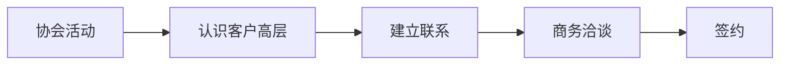
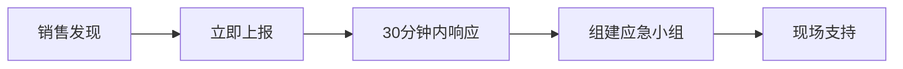
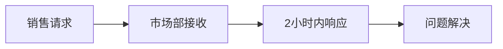

<!--
文件: 13_rapid-response-mechanism.md
描述: 第三部分：快速响应机制
原始行范围: 7278-7759
批次: 第4批
生成时间: 2025-11-20
来源: 比亚迪半导体销售情报支持手册
-->

# 第三部分：快速响应机制

## 一、销售-市场协同SOP

### 【协同原则】

**核心理念：**

市场部 = 销售部的"情报参谋部"和"火力支援部"

**市场部职责：**
- ✓ 提供市场情报（竞品、客户、行业趋势）
- ✓ 制作销售工具（PPT、方案、案例）
- ✓ 支持大客户攻坚（高端材料、定制方案）
- ✓ 品牌宣传（案例推广、展会、公关）

**销售部职责：**
- ✓ 反馈一线情报（客户需求、竞品动态）
- ✓ 提出支持需求（需要什么材料、什么数据）
- ✓ 验证市场策略（市场部的方案是否有效）

### 【协同流程】

#### 场景1：新客户开发支持

**销售请求：**

"市场部，我准备拜访小米汽车，需要一套针对性的方案。"

**市场部响应（48小时内）：**

**1. 客户情报包（4小时内）**

| 项目       | 内容                 |
| ---------- | -------------------- |
| 公司概况   | 成立时间、融资、估值 |
| 车型规划   | SU7/SU8/SUV等        |
| MCU需求    | 预估200万颗/年       |
| 现有供应商 | 瑞萨（猜测）         |
| 决策链     | CEO雷军、CTO/采购VP  |
| 痛点分析   | 供应链安全、成本     |
| 切入点     | 新平台、国产替代     |

**2. 定制化方案PPT（24小时内）**
- 封面：比亚迪半导体 × 小米汽车战略合作方案
- 第1部分：小米汽车行业地位分析（展示我们了解客户）
- 第2部分：MCU市场趋势与国产替代机遇
- 第3部分：比亚迪半导体MCU产品矩阵
- 第4部分：针对小米的定制化方案
  - BCM方案：节省¥80/车
  - BMS方案：提升精度±0.5%
  - 供应保障：12周交期，3个月库存
- 第5部分：成功案例（零跑汽车、理想汽车）
- 第6部分：合作路线图（3个阶段，18个月）

**3. 技术白皮书（48小时内）**
- 车规MCU技术趋势报告
- 比亚迪MCU技术优势详解
- 500万台实车验证数据分析

**4. 竞品对比表**
- 比亚迪 vs 瑞萨 vs NXP
- 性能、价格、交期、服务对比

**协同要点：**
- ✓ 市场部材料，销售部修改（加入个性化内容）
- ✓ 首次拜访用标准版，后续拜访根据反馈定制
- ✓ 市场部跟进效果（销售反馈客户对材料的评价）

#### 场景2：商务谈判支持

**销售请求：**

"市场部，客户说瑞萨报价¥10，我们报¥12，客户要求降价。能否给我一些谈判支持？"

**市场部响应（4小时内）：**

**1. 竞品价格真实性分析**

| 分析项                 | 内容                                                         |
| ---------------------- | ------------------------------------------------------------ |
| 瑞萨RL78官方价格       | ¥12-15                                                       |
| 大批量折扣（100万颗+） | 10%                                                          |
| 最低可能价格           | ¥10.8                                                        |
| 结论                   | ¥10不太可能，除非： • 临时促销（不可持续） • 老款型号（性能不对标） • 客户谈判技巧（虚报价格） |

**2. TCO总拥有成本对比表（Excel）**
- 采购成本：我们vs瑞萨
- 开发成本：我们vs瑞萨
- 风险成本：我们vs瑞萨
- 总成本：我们比瑞萨低¥320万/年

**3. 谈判话术库**
- 应对"竞品更便宜"的10种话术
- 应对"降价要求"的阶梯式让步策略
- 守住底线的5个技巧

**4. 紧急授权**
- 如确实需要特批价格，市场部协助申请
- 准备材料：客户采购意向书、竞品报价单
- 审批流程：销售总监→市场VP→CEO（24小时）

#### 场景3：技术问题支持

**销售请求：**

"市场部，客户说我们MCU的EMC测试没通过，需要技术支持。"

**市场部响应（2小时内）：**

**1. 立即联系FAE团队（30分钟内）**
- 通知FAE紧急支援
- 安排最快航班/高铁到客户现场
- 准备测试设备和工具

**2. 提供技术资料包（2小时内）**
- EMC设计指南
- 常见EMC问题及解决方案
- 成功通过EMC测试的参考设计

**3. 协调内部资源**
- 实验室资源（如需复现问题）
- 专家资源（EMC专家远程支持）
- 物料资源（EMC器件样品）

**4. 后续跟进**
- 问题解决进展报告（每日）
- 客户满意度回访
- 经验教训总结（内部分享）

### 【协同工具】

#### 工具1：销售-市场协同工作台

**在线协作系统（企业微信/飞书/钉钉）**

**功能模块：**

| 模块        | 功能                                                         |
| ----------- | ------------------------------------------------------------ |
| 1. 需求提交 | • 销售填写支持需求单 • 选择需求类型（客户开发/商务谈判/技术支持/市场活动） • 填写紧急程度（紧急/重要/一般） |
| 2. 任务分配 | • 市场部接收需求 • 自动分配负责人 • 设定完成时限       |
| 3. 进度跟踪 | • 实时查看任务进展 • 阶段性成果展示 • 延期预警         |
| 4. 成果交付 | • 文件在线共享 • 销售反馈评价 • 归档知识库             |

**响应时限SLA：**
- 紧急需求：2小时响应，24小时交付
- 重要需求：4小时响应，48小时交付
- 一般需求：8小时响应，72小时交付

#### 工具2：周例会机制

**销售-市场周会（每周五下午）**

**议程：**

1. **上周重点项目进展（15分钟）**
   - 销售：汇报关键客户进展
   - 市场：汇报支持效果

2. **竞品动态分享（10分钟）**
   - 销售：一线竞品情报
   - 市场：公开渠道竞品信息

3. **下周重点客户攻坚（20分钟）**
   - 销售：列出下周重点客户
   - 市场：承诺支持方案

4. **问题与改进（15分钟）**
   - 销售：反馈市场部支持不足之处
   - 市场：反馈销售需要改进之处
   - 双方：讨论解决方案

**会议纪要：**
- ✓ 当天发送会议纪要（邮件）
- ✓ 任务清单明确（责任人、时限）
- ✓ 下周一跟进执行

## 二、获客渠道开发指南

### 【线上渠道】

#### 渠道1：官网SEO优化

**目标：** 让客户搜索"车规MCU"时，我们排名前3

**行动计划：**

**1. 关键词优化**

高价值关键词：
- "车规级MCU"
- "汽车MCU供应商"
- "国产车规MCU"
- "比亚迪MCU"
- "新能源汽车MCU"

**2. 内容营销**

每月发布：
- 技术博客×4（MCU技术解析、应用案例）
- 白皮书×1（行业趋势报告）
- 成功案例×2（客户使用案例）

**3. 效果追踪**
- 官网访问量（月度）
- 关键词排名（周度）
- 询盘转化率（月度）

**预期效果：**
- ✓ 3个月内，核心关键词进入百度前10
- ✓ 6个月内，官网月访问量达到50000+
- ✓ 每月自然获客10-20个潜在客户

#### 渠道2：行业垂直媒体

**目标媒体清单：**

| 类别           | 媒体                                                         |
| -------------- | ------------------------------------------------------------ |
| 半导体行业媒体 | • 芯智讯 • 半导体行业观察 • 集微网 • 与非网         |
| 汽车行业媒体   | • 汽车之家（商用频道） • 盖世汽车 • 车云网 • 电动汽车资源网 |
| 科技媒体       | • 36氪（产业频道） • 钛媒体 • 雷锋网（新智驾）         |

**合作方式：**
- 每月发布1-2篇专业文章
- 每季度接受1次深度专访
- 每半年发布1次重大新闻（新产品、新客户、新融资）

**内容方向：**
- ✓ 技术科普（MCU工作原理、车规认证）
- ✓ 趋势分析（国产替代、新能源汽车）
- ✓ 案例分享（客户成功案例）
- ✓ 高管观点（CEO/CTO专访）

**预期效果：**
- ✓ 提升品牌知名度（行业第一梯队）
- ✓ 吸引潜在客户主动咨询
- ✓ 增强客户信任度（媒体背书）

#### 渠道3：社交媒体运营

**平台策略：**

**1. 微信公众号（主阵地）**
- 定位：专业技术内容+企业动态
- 更新频率：每周2-3篇
- 内容类型：
  - 技术干货（MCU应用案例、设计指南）
  - 行业洞察（市场趋势、政策解读）
  - 公司动态（新产品、新客户、展会）

**2. 知乎（技术影响力）**
- 定位：技术专家形象
- 重点回答：车规MCU相关问题
- 发布专栏文章：深度技术解析

**3. 领英LinkedIn（国际化）**
- 定位：面向海外客户
- 英文内容：公司介绍、产品更新
- 互动：与海外客户/合作伙伴交流

**运营要点：**
- ✓ 内容专业、有价值（不是硬广）
- ✓ 定期更新（建立关注习惯）
- ✓ 互动回复（增强用户粘性）
- ✓ 数据分析（优化内容策略）

### 【线下渠道】

#### 渠道4：行业展会

**必参展会清单：**

| 展会                 | 时间     | 规模                  | 展位           | 展示内容                    |
| -------------------- | -------- | --------------------- | -------------- | --------------------------- |
| 慕尼黑上海电子展     | 每年3月  | 10万+专业观众         | 36平米标准展位 | MCU产品线、演示板、案例视频 |
| 中国汽车供应链峰会   | 每年6月  | 5000+汽车行业专业人士 | 展位+演讲      | 与整车厂采购对接            |
| 中国国际半导体博览会 | 每年10月 | 5万+专业观众          | 54平米         | 新品发布会、技术研讨会      |

**展会策略：**

**展前（1个月）：**
- ✓ 邀请重点客户参观（发邀请函）
- ✓ 媒体预热（提前发新闻稿）
- ✓ 准备物料（产品手册、宣传品、礼品）

**展中（3天）：**
- ✓ 收集名片（扫码留资，目标200+）
- ✓ 产品演示（实物展示+视频）
- ✓ 媒体采访（安排CEO/CTO接受采访）
- ✓ 现场商务洽谈（预约重点客户）

**展后（2周内）：**
- ✓ 线索分类（A/B/C级，重点跟进A级）
- ✓ 48小时内联系A级客户
- ✓ 1周内联系B级客户
- ✓ 2周内群发邮件给C级客户

**ROI评估：**
- ✓ 获客数量：目标200+潜在客户
- ✓ 转化率：目标10%（20个意向客户）
- ✓ 成交率：目标20%（4个签约客户）
- ✓ 投入产出比：目标1:5（投入¥50万，产出¥250万订单）

#### 渠道5：行业协会/联盟

**重点加入组织：**

| 组织                     | 会员级别 | 好处                       | 活动                   |
| ------------------------ | -------- | -------------------------- | ---------------------- |
| 中国汽车芯片产业创新联盟 | 理事单位 | 与整车厂、Tier 1近距离接触 | 季度理事会、技术研讨会 |
| 中国汽车工程学会         | 企业会员 | 技术标准制定、行业交流     | 年会、专题研讨会       |
| 中国半导体行业协会       | 常务理事 | 政策资源、行业影响力       | 半导体大会、产业论坛   |

**参与策略：**
- ✓ 积极参与标准制定（体现技术实力）
- ✓ 主动承办活动（扩大影响力）
- ✓ 高管担任职务（理事、副秘书长等）
- ✓ 发布行业报告（建立thought leadership）

**获客路径：**

#### 渠道6：客户推荐

**老客户转介绍计划：**

**激励政策：**

推荐成功（签约），推荐人获得：
- 现金奖励：新客户首年采购额的2%
- 或价格折扣：本人下批订单额外5%折扣
- 或优先权：产能紧张时优先供应

**操作流程：**

1. 识别推荐人（合作良好的老客户）
2. 说明推荐计划（非正式场合提及）
3. 提供推荐工具（电子版推荐函模板）
4. 推荐人引荐（微信介绍、邀请参观等）
5. 跟进转化（销售及时跟进）
6. 兑现奖励（签约后1个月内）

**话术示例：**

"X总，我们最近想开拓一些新客户。您在行业里人脉广，能否帮忙推荐几个合适的客户？

如果推荐成功，我们有感谢政策：新客户首年采购额的2%现金奖励，或者您下批订单给额外5%折扣。

不知道您方不方便帮这个忙？"

**预期效果：**
- ✓ 每季度通过老客户推荐2-3个新客户
- ✓ 转化率高（有推荐人背书，信任度高）
- ✓ 成本低（相比展会、广告，ROI更高）

## 三、30分钟紧急响应机制

### 【紧急情况定义】

**什么算"紧急"？**

| 级别       | 响应时间           | 情况                                                         |
| ---------- | ------------------ | ------------------------------------------------------------ |
| 🔴 超级紧急 | 立即响应，30分钟内 | • 大客户质量投诉（批次不良、安全隐患） • 重大商机（短时间内需要决策支持） • 竞品恶性竞争（抹黑、不正当手段） • 媒体负面报道（需要紧急公关） |
| 🟡 紧急     | 2小时内响应        | • 客户技术问题（影响生产） • 商务谈判支持（需要数据、材料） • 竞品价格战（需要应对策略） • 重要客户拜访支持 |
| 🟢 重要     | 24小时内响应       | • 常规技术咨询 • 销售材料需求 • 客户背景调研 • 行业信息查询 |

### 【响应流程】

#### 超级紧急情况响应（30分钟）

**响应链：**

**步骤1：销售发现并上报（5分钟内）**

行动：
- 立即电话通知市场总监（不是微信，是电话！）
- 简要说明情况（谁、什么问题、多紧急）
- 发送书面情况说明（微信/邮件，附照片/录音）

话术：
"王总您好！我是XX，有紧急情况向您汇报。客户YY刚才反馈我们MCU有批次质量问题，已经影响到他们生产线，情况非常紧急。我需要技术支持和高层协调。"

**步骤2：市场总监评估（10分钟内）**

行动：
- 判断紧急程度（是否真的超级紧急）
- 决定响应级别（是否启动应急机制）
- 通知相关人员（FAE、质量、高层）

决策树：
- 如果是质量问题 → 启动质量应急预案
- 如果是商务问题 → 高层介入谈判
- 如果是公关危机 → 启动危机公关预案

**步骤3：组建应急小组（15分钟内）**

人员配置：
- 销售负责人×1（一线协调）
- FAE工程师×2（技术支持）
- 质量工程师×1（质量问题分析）
- 市场总监×1（资源协调）
- 高层×1（CEO/VP，必要时）

任务分工：
- 销售：客户沟通、现场协调
- FAE：技术问题诊断、解决方案
- 质量：质量问题调查、报告
- 市场：资源调配、媒体应对
- 高层：客户高层沟通、决策授权

**步骤4：现场支持（30分钟内出发）**

行动：
- 最近的FAE立即出发（自驾/打车/包车）
- 准备应急物资（测试设备、备品备件）
- 预订最快交通（飞机/高铁）
- 目标：6小时内到达客户现场（国内）

同步行动：
- 电话安抚客户（"我们非常重视，团队正在路上"）
- 准备应急方案（在路上就开始分析问题）
- 准备赔偿方案（预估损失，准备补偿）

#### 紧急情况响应（2小时）

**简化流程：**

**示例：客户需要技术方案支持商务谈判**

销售请求（微信/邮件）：
"市场部，客户明天要决策，今晚需要一套技术对比方案。对比对象：瑞萨RH850 vs 我们M4系列。重点强调性价比。"

市场部响应（2小时内）：
- 调出标准对比表模板
- 根据客户需求定制（突出性价比）
- 补充最新数据（价格、交期）
- 发送给销售（PPT+Excel）

销售使用：
- 当晚修改完善（加入客户特定需求）
- 第二天谈判使用
- 谈判后反馈效果

### 【应急资源库】

**市场部常备资源：**

| 资源类别                    | 内容                                                         |
| --------------------------- | ------------------------------------------------------------ |
| 1. 标准材料库（随时可调用） | • 产品介绍PPT（6个产品） • 竞品对比表（vs 瑞萨/NXP/英飞凌等） • 成功案例（10+案例，Word/PDF） • 技术白皮书（5份） • 公司介绍视频（3分钟/10分钟版本） |
| 2. FAE资源池                | • 华东FAE：8人（上海、苏州、杭州） • 华南FAE：7人（深圳、广州、东莞） • 华北FAE：5人（北京、天津、西安） • 24小时on-call（轮班制） |
| 3. 实物资源                 | • 样片库存：每个型号1000片（深圳/上海仓） • 开发板：50套（可快递） • 演示设备：10套（可携带） |
| 4. 资金授权                 | • 市场总监授权：单笔¥10万以内 • VP授权：单笔¥50万以内 • CEO授权：¥50万以上 • 应急情况：先执行后补审批 |
| 5. 合作伙伴资源             | • 第三方测试实验室（EMC、可靠性） • 物流合作伙伴（紧急配送） • 媒体资源（危机公关） |

---

