# 📘 比亚迪半导体销售情报支持手册


**编制目的**：为销售团队提供系统化的市场情报、竞争分析和实战工具  
        **适用对象**：销售团队全体成员、市场部、技术支持团队  
        **更新周期**：季度更新市场数据，月度更新客户动态

---

## 📋 概览目录

第一部分：产品线情报库（Know What to Sell）

- 产品1：碳化硅（SiC）功率器件
- 产品2：IGBT（绝缘栅双极型晶体管）
- 产品3：摄像头模组
- 产品4：车规级LED
- 产品5：电流传感器
- 产品6：MCU（微控制单元）

第二部分：销售场景剧本（Know How to Sell）

- 场景1：客户砍价到底线以下
- 场景2：竞品挖墙脚，如何保住份额
- 场景3：大客户要求独家供应
- 场景4：技术测试不通过
- 场景5：客户投诉质量问题
- 场景6：新客户冷启动（0→1突破）
- 场景7：商务谈判僵局
- 场景8：丢单后复盘与二次进攻

第三部分：快速响应机制（Get Support Fast）

- 销售-市场协同SOP
- 获客渠道开发指南
- 紧急情报支持流程（30分钟响应机制）

第四部分：情报工具箱（Work Smart）

- 麦肯锡式分析模板
- Excel工具包（客户情报收集表、竞品对标分析表等）
- 信息源清单与使用指南

---

## 🎯 手册使用说明

#### 【定位】

本手册是销售团队的"战前准备清单" + "实战工具箱"，帮助销售人员：

- ✅ 快速了解产品的市场定位和竞争态势
- ✅ 掌握不同客户类型的决策链和切入策略  
- ✅ 获得应对典型销售场景的话术和证据链
- ✅ 在需要时快速获得市场部的情报支持

#### 【使用场景】

| 场景       | 使用方式                                         |
| ---------- | ------------------------------------------------ |
| 客户拜访前 | 查阅目标客户的情报卡片（决策链、痛点、竞争态势） |
| 竞标准备   | 使用竞品对标表和标准话术                         |
| 商机跟进   | 参考采购周期地图，制定阶段性策略                 |
| 异议处理   | 查找对应场景的应对话术和证据材料                 |
| 紧急求助   | 按照快速响应流程联系市场部获取支持               |

#### 【更新机制】

- 📅 **季度更新**：市场规模数据、技术趋势、竞品动态
- 📅 **月度更新**：客户情报、价格信息、标杆案例
- 📅 **实时更新**：重大市场事件、客户异动、竞品新品发布

---

🏗️ 手册总体框架（金字塔原理）

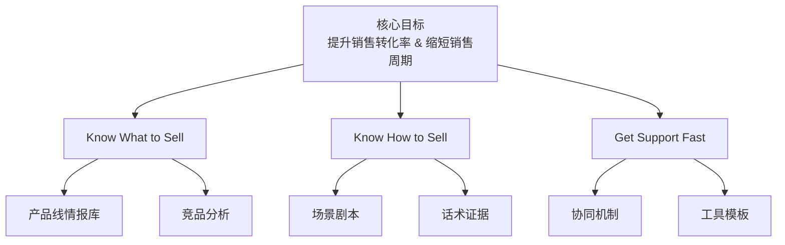

#### 四层结构说明

| 层级                                               | 核心问题                       | 方法论                                             | 输出物                 |
| -------------------------------------------------- | ------------------------------ | -------------------------------------------------- | ---------------------- |
| **第一层：产品线情报库**<br/>（Know What to Sell） | 我们卖什么，市场在哪，对手是谁 | 4C框架<br/>（Context/Customer/Competitor/Company） | 每个产品的完整情报卡片 |
| **第二层：销售场景剧本**<br/>（Know How to Sell）  | 遇到XX情况怎么办               | 场景分类 + STAR案例 + 标准话术                     | 8大典型场景的应对指南  |
| **第三层：快速响应机制**<br/>（Get Support Fast）  | 需要帮助找谁，多快能拿到       | 销售-市场协同SOP                                   | 30分钟紧急响应流程     |
| **第四层：情报工具箱**<br/>（Work Smart）          | 用什么工具提升效率             | 麦肯锡分析框架 + Excel模板                         | 可直接使用的工具包     |

---

### 📊 4C情报框架说明

本手册采用麦肯锡4C竞争分析框架对每个产品进行结构化梳理：

| 维度                                | 核心内容                                                     | 分析工具                                     |
| ----------------------------------- | ------------------------------------------------------------ | -------------------------------------------- |
| **C1: Context**<br/>（市场环境）    | • 市场规模与增速（用数据说话）<br/>• 技术演进路线图（未来3年趋势）<br/>• 应用场景拆解（价值链分析） | 市场规模数据<br/>技术路线图<br/>价值链分析   |
| **C2: Customer**<br/>（客户情报）   | • 目标客户分级矩阵（优先级排序）<br/>• 客户决策链分析（找到关键人）<br/>• 客户采购周期地图（把握节奏） | 客户分级矩阵<br/>决策链图谱<br/>采购周期地图 |
| **C3: Competitor**<br/>（竞争分析） | • 竞争格局与市场份额<br/>• 竞品深度对标（参数/价格/服务）<br/>• 竞争策略与应对话术 | 市场份额图<br/>竞品对标表<br/>应对话术库     |
| **C4: Company**<br/>（自身能力）    | • 差异化价值主张（3句话说清优势）<br/>• 标杆案例库（STAR格式）<br/>• 能力证明材料清单（随身携带） | 价值主张卡片<br/>STAR案例库<br/>证明材料清单 |

# 第一部分：产品线情报库

## 产品1：碳化硅（SiC）功率器件

---

### 📊 C1: Context - 市场环境情报

#### 市场规模与增速

**全球车规SiC市场：**

| 年份         | 市场规模               | 备注            |
| ------------ | ---------------------- | --------------- |
| 2024年       | $2.3B（约160亿人民币） | 当前市场        |
| 2027年       | $5.8B                  | 年复合增长率35% |
| 中国市场占比 | 40%（约64亿人民币）    | -               |

**数据来源：** Yole Intelligence 2024

---

**💡 销售洞察：**
- SiC是增速最快的功率器件赛道，窗口期2024-2026年
- 需要在这3年内快速抢占市场份额

---

#### 技术演进路线图

| 时间节点  | 技术趋势                    | 对销售的影响                         | 销售策略                   |
| --------- | --------------------------- | ------------------------------------ | -------------------------- |
| 2024-2025 | 800V平台渗透率：<br>15%→30% | SiC成为高端车标配<br>需求爆发期      | 重点攻坚<br>蔚小理等新势力 |
| 2026-2027 | SiC模块功率密度<br>提升50%  | 客户关注散热设计<br>技术支持需求增加 | 提供整套<br>热管理方案     |
| 2028+     | 1200V SiC进入<br>商用车领域 | 新市场打开                           | 提前布局<br>重卡/客车市场  |

---

### 应用场景拆解（价值链分析）

#### 车规SiC应用全景图

**主驱逆变器（70%需求量）- 核心战场**

| 车型级别              | SiC渗透率           | 单车价值     | 代表车型                    |
| --------------------- | ------------------- | ------------ | --------------------------- |
| 高端车型（>30万元）   | 80%（基本标配）     | ¥2,000-3,500 | 理想L9、蔚来ET7、比亚迪仰望 |
| 中端车型（15-30万元） | 35%（快速增长中）   | ¥1,500-2,200 | 小鹏P7、比亚迪海豹、零跑C11 |
| 经济车型（<15万元）   | <5%（仍以IGBT为主） | -            | 短期内不是SiC的目标市场     |

---

**车载充电OBC（20%需求量）- 增量市场**

| 应用                         | 单车价值   | 技术优势                  |
| ---------------------------- | ---------- | ------------------------- |
| 22kW+大功率快充：SiC模块需求 | ¥800-1,500 | 充电效率提升、体积减小40% |

---

**DC-DC转换器（10%需求量）- 补充市场**

| 应用                    | 单车价值 |
| ----------------------- | -------- |
| 800V→12V降压：SiC二极管 | ¥300-600 |

---

**💡 销售策略建议：**
1. **主攻方向：** 主驱逆变器（利润率高+技术门槛高）
2. **突破路径：** 先高端车型建立品牌→再向中端车型渗透
3. **打包销售：** 主驱+OBC+DC-DC整套方案（提升客单价）

---

### 🎯 C2: Customer - 客户情报

#### 目标客户分级矩阵（波士顿矩阵应用）

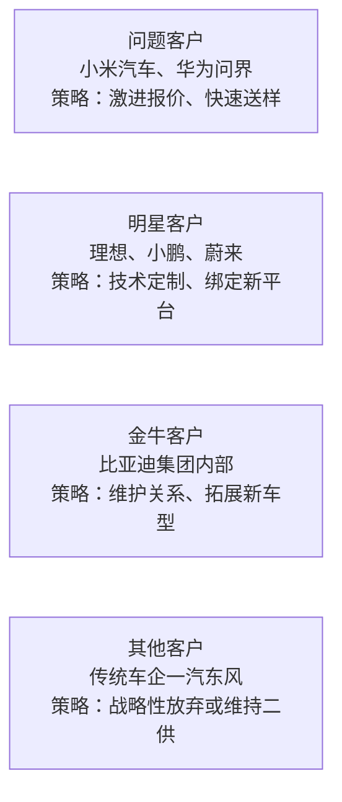

---

#### 客户类型详解

##### ⭐⭐⭐ 问题客户（优先级最高）

| 属性     | 内容                                                         |
| -------- | ------------------------------------------------------------ |
| 代表     | 小米汽车、华为问界、智己汽车                                 |
| 特征     | 高增长潜力，但当前份额低                                     |
| 机会     | 新车型窗口期，供应商尚未锁定                                 |
| 策略     | • 初期让利（前5K台车按成本价）<br>• 快速响应（2周送样，行业通常4周）<br>• 高层公关（利用比亚迪品牌背书） |
| 年需求量 | 单客户3-8万套                                                |
| 预期收益 | 3年累计营收¥3-8亿元                                          |

---

##### ⭐⭐ 明星客户（持续投入）

| 属性     | 内容                                                         |
| -------- | ------------------------------------------------------------ |
| 代表     | 理想、小鹏、蔚来                                             |
| 特征     | 已有一定份额，需求持续增长                                   |
| 机会     | 新平台定点、二供机会                                         |
| 策略     | • 联合开发（投入研发资源绑定）<br>• 技术升级（提供下一代SiC方案）<br>• 服务深化（驻场FAE、专属产线） |
| 年需求量 | 单客户5-15万套                                               |
| 预期收益 | 稳定增长，长期价值高                                         |

---

##### ⭐ 金牛客户（稳定维护）

| 属性     | 内容                                                         |
| -------- | ------------------------------------------------------------ |
| 代表     | 比亚迪集团内部                                               |
| 特征     | 份额稳定，增长放缓                                           |
| 机会     | 新车型拓展、产品升级                                         |
| 策略     | • 确保交付（优先级保障）<br>• 持续降本（年降5-8%）<br>• 挖掘新需求（商用车、混动等） |
| 年需求量 | 集团内部年100万套+                                           |
| 预期收益 | 稳定现金流，利润率中等                                       |

---

##### 其他客户（选择性放弃）

| 属性 | 内容                                                         |
| ---- | ------------------------------------------------------------ |
| 代表 | 一汽、东风等传统国企                                         |
| 特征 | 增长慢、份额低、决策周期长                                   |
| 机会 | 有限（技术路线保守、供应商关系固化）                         |
| 策略 | • 不主动投入资源<br>• 等待新平台窗口（每3-5年一次）<br>• 或完全放弃（聚焦优质客户） |

---

### 客户决策链分析（DMU决策单元模型）

#### 案例：理想汽车的SiC采购决策链

**第一层：技术准入层（权重40%）- 门槛决策**

| 要素                        | 内容                                                         |
| --------------------------- | ------------------------------------------------------------ |
| 关键角色                    | 动力系统总工程师/电控部门技术负责人                          |
| 决策逻辑<br/>（一票否决权） | ✓ 性能参数是否满足（Rdson、开关损耗、热阻）<br>✓ 可靠性如何保证（车规认证、实车验证里程）<br>✓ 技术支持能力（仿真模型、应用指导） |

**我们的渗透策略：**

1. **提供详细技术白皮书**
   - 对标英飞凌同等级产品
   - 参数差异<5%的说明

2. **邀请参观比亚迪应用案例**
   - 仰望U8实车演示（同样800V平台）
   - 提供实测数据（功率曲线、温升曲线）

3. **免费技术支持**
   - 送测样品10套
   - 应用工程师驻场3个月
   - 提供Saber/PLECS仿真模型

**标准话术模板：**

> "理想在开发新一代800V平台对吧？我们在比亚迪仰望U8（也是800V）上已经量产2年，累计装车5万辆，可靠性数据完全可以共享。您的性能指标是Rdson<3mΩ对吧？我们这款BYD-SiC-650V-300A完全满足，而且热设计余量更大。这是仿真对比报告..."

---

**第二层：商务决策层（权重40%）- 核心决策**

| 要素                        | 内容                                                         |
| --------------------------- | ------------------------------------------------------------ |
| 关键角色                    | 采购部品类经理/采购总监                                      |
| 决策逻辑<br/>（最终决策权） | ✓ 价格是否有竞争力（需比现有供应商低10%+）<br>✓ 供应稳定性（产能、交期、备货能力）<br>✓ 商务条款（账期、VMI、年降承诺） |

**我们的渗透策略：**

1. **初期报价激进**
   - 比英飞凌低20-25%
   - 前期甚至可以零利润（后续订单补回）

2. **供应保障承诺**
   - 深圳+长沙双基地背书
   - 提供产能承诺函（盖章）
   - 理想专属安全库存（2周用量）

3. **灵活商务条款**
   - 账期Net 60天（行业通常30天）
   - 小批量起订（5K起，英飞凌要10K）
   - 年降承诺：5%/年（未来3年）

**标准话术模板：**

> "X总，我理解理想对成本的要求。您现在用英飞凌的价格大概¥420/套对吧？（如果对方不说，就用行业通常价格）我们初期可以给到¥336（低20%），后续3年每年降5%。为什么我们能做到？（展示成本结构图）
> 1）自有晶圆厂，少一层加价
> 2）规模效应，比亚迪集团年需求100万套
> 3）本土化运营，没有进口成本
> 这不是倾销，是商业模式优势。您可以看我们给吉利的报价历史，连续3年兑现了年降承诺..."

---

**第三层：高层背书层（权重20%）- 战略决策**

| 要素                      | 内容                                                         |
| ------------------------- | ------------------------------------------------------------ |
| 关键角色                  | 采购VP/供应链VP/分管副总裁                                   |
| 决策逻辑<br/>（战略背书） | ✓ 供应商战略安全性（不能断供）<br>✓ 品牌背书（比亚迪集团是加分项）<br>✓ 长期合作价值（生态合作，非单一交易） |

**我们的渗透策略：**

1. **强调比亚迪集团背景**
   - 王传福支持国产半导体
   - 全球最大新能源车企背书

2. **提出生态合作**
   - 联合开发下一代产品
   - 技术共享（比亚迪应用经验开放）

3. **邀请高层互访**
   - 理想高层参观深圳/长沙工厂
   - 比亚迪高层拜访理想（释放重视信号）

**标准话术模板：**

> "X总您好，我们不仅是供应商，更希望成为理想的战略合作伙伴。比亚迪集团在新能源领域的积累，可以对理想开放。比如我们的800V SiC应用经验，是基于50万辆车的实际数据优化的，这些know-how可以共享给理想团队。另外，我们在IGBT、MCU、传感器都有布局，未来可以提供'one-stop'方案..."

---

### 客户采购周期地图

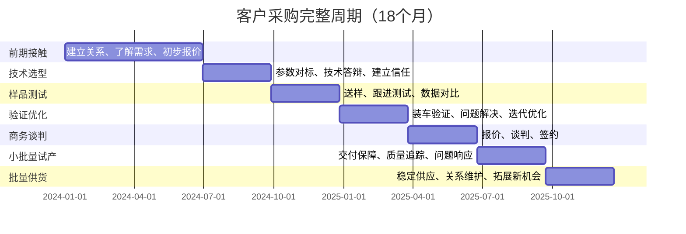

---

### 采购周期各阶段详解

#### 阶段1：前期接触（T-18 to T-12）

| 要素       | 内容                                                         |
| ---------- | ------------------------------------------------------------ |
| 客户状态   | 新平台立项，开始调研供应商                                   |
| 关键任务   | • 建立关系（技术交流会、展会接触）<br>• 了解需求（平台参数、技术路线）<br>• 初步报价（吸引客户兴趣） |
| 市场部输出 | ✓ 客户背景调研报告（公司、产品、技术路线）<br>✓ 竞品供应商分析（客户现在用谁的？）<br>✓ 初步技术方案（匹配客户需求） |
| 销售动作   | ✓ 拜访技术部门（建立信任）<br>✓ 提供技术白皮书<br>✓ 邀请参观比亚迪应用案例 |
| 成功标志   | 被列入供应商候选清单                                         |

---

#### 阶段2：技术选型（T-12 to T-9）

| 要素       | 内容                                                         |
| ---------- | ------------------------------------------------------------ |
| 客户状态   | 对比3-5家供应商的技术方案                                    |
| 关键任务   | • 参数对标（证明我们不比竞品差）<br>• 技术答辩（回答客户疑虑）<br>• 建立技术信任 |
| 市场部输出 | ✓ 竞品详细对标表（参数/价格/服务）<br>✓ 比亚迪应用案例数据（可靠性证明）<br>✓ 技术支持计划（FAE/仿真/培训） |
| 销售动作   | ✓ 技术交流会（带技术专家）<br>✓ 提供仿真模型+参考设计<br>✓ 承诺技术支持（驻场FAE） |
| 成功标志   | 技术方案通过客户评审                                         |

---

#### 阶段3：样品测试（T-9 to T-6）

| 要素       | 内容                                                         |
| ---------- | ------------------------------------------------------------ |
| 客户状态   | 实际测试样品，验证性能                                       |
| 关键任务   | • 送样（快速响应）<br>• 跟进测试（及时解决问题）<br>• 数据对比（vs竞品实测） |
| 市场部输出 | ✓ 样品快速生产（插队优先）<br>✓ 测试数据分析（帮客户解读）<br>✓ 问题快速响应（技术支持） |
| 销售动作   | ✓ 送样10-20套（免费）<br>✓ FAE驻场支持（实时答疑）<br>✓ 收集测试反馈（每周沟通） |
| 成功标志   | 测试数据达标，客户认可                                       |

---

#### 阶段4：验证优化（T-6 to T-3）

| 要素       | 内容                                                         |
| ---------- | ------------------------------------------------------------ |
| 客户状态   | 整车装车测试，发现问题优化                                   |
| 关键任务   | • 装车验证（20-50辆测试车）<br>• 问题解决（EMC/散热/可靠性）<br>• 迭代优化（2-3轮改进） |
| 市场部输出 | ✓ 技术问题响应（48小时内方案）<br>✓ 优化样品生产（快速迭代）<br>✓ 第三方测试报告（增强信任） |
| 销售动作   | ✓ 每周进度跟踪（主动沟通）<br>✓ 协调资源（技术/生产/质量）<br>✓ 准备商务谈判（价格/条款） |
| 成功标志   | 整车测试通过，准备定点                                       |

---

#### 阶段5：商务谈判（T-3 to T0）

| 要素       | 内容                                                         |
| ---------- | ------------------------------------------------------------ |
| 客户状态   | 技术通过，开始商务谈判                                       |
| 关键任务   | • 报价（平衡价格与利润）<br>• 谈判（账期/MOQ/年降/质保）<br>• 签约（框架协议） |
| 市场部输出 | ✓ 竞品价格情报（底价是多少？）<br>✓ 成本分析支持（我们底线在哪？）<br>✓ 商务条款建议（灵活空间） |
| 销售动作   | ✓ 正式报价（书面+详细说明）<br>✓ 多轮谈判（坚守底线，适度让步）<br>✓ 高层拍板（必要时请示总经理） |
| 成功标志   | 签订定点函/框架协议                                          |

---

#### 阶段6：小批量试产（T0 to T+3）

| 要素       | 内容                                                         |
| ---------- | ------------------------------------------------------------ |
| 客户状态   | 新车型SOP前小批量生产                                        |
| 关键任务   | • 交付保障（按时按质按量）<br>• 质量追踪（每批次数据）<br>• 问题响应（8小时内处理） |
| 市场部输出 | ✓ 产能协调（优先保障）<br>✓ 质量数据分析（每周报告）<br>✓ 应急预案（备用方案） |
| 销售动作   | ✓ 驻厂跟进（确保装车顺利）<br>✓ 每日沟通（产线反馈）<br>✓ 解决问题（现场决策） |
| 成功标志   | 小批量交付100%准时，零重大质量问题                           |

---

#### 阶段7：批量供货（T+3 onwards）

| 要素       | 内容                                                         |
| ---------- | ------------------------------------------------------------ |
| 客户状态   | 正式量产，稳定供货                                           |
| 关键任务   | • 按订单交付<br>• 维护关系（持续沟通）<br>• 挖掘新机会（其他车型） |
| 市场部输出 | ✓ 客户满意度调查（季度）<br>✓ 竞品动态追踪（预警）<br>✓ 新产品推荐（技术升级） |
| 销售动作   | ✓ 月度回顾会议（客户关系维护）<br>✓ 年降谈判（按承诺执行）<br>✓ 拓展新车型（增加份额） |
| 成功标志   | 续约率>90%，份额持续提升                                     |

# ⚔️ C3: Competitor - 竞争情报

## 竞争格局分析（波特五力模型）

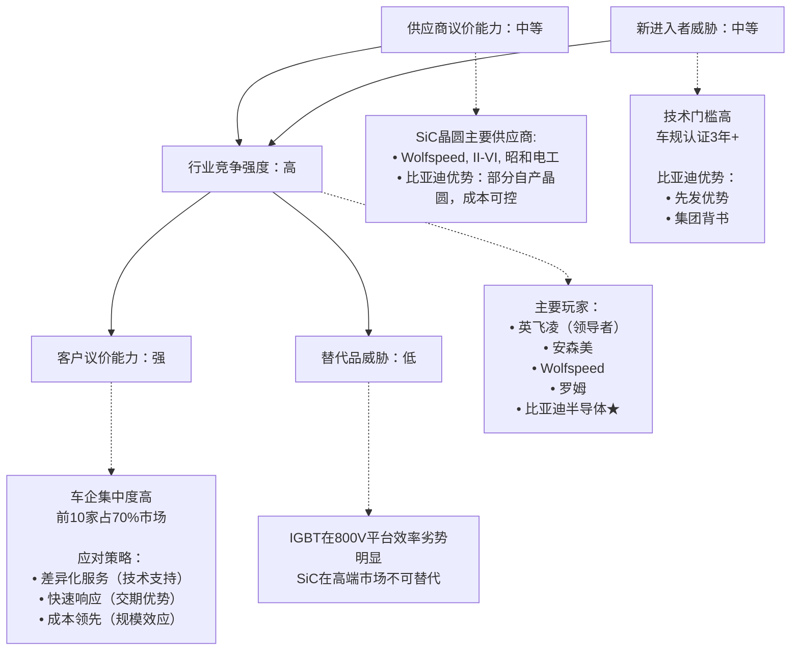

## 市场份额与趋势（2024年全球车规SiC市场）

### Tier 1 - 国际巨头（技术领先，份额下降中）

| 厂商               | 市场份额 | 年度变化 |
| ------------------ | -------- | -------- |
| 英飞凌（Infineon） | 38%      | -2% YoY  |
| 安森美（Onsemi）   | 16%      | -1% YoY  |
| Wolfspeed          | 12%      | 持平     |
| 罗姆（ROHM）       | 9%       | 持平     |
| **小计**           | **75%**  |          |

### Tier 2 - 本土挑战者（快速增长中）

| 厂商           | 市场份额 | 年度变化 |
| -------------- | -------- | -------- |
| 比亚迪半导体 ★ | 8%       | +3% YoY  |
| 斯达半导       | 6%       | +2% YoY  |
| 三安光电       | 4%       | +1% YoY  |
| 其他国产       | 7%       | +1% YoY  |
| **小计**       | **25%**  |          |

### 💡 市场洞察

**1️⃣ 国产替代窗口期：2024-2026年**
- 国际品牌份额下降（地缘政治+成本劣势）
- 本土品牌份额上升（性价比+供应安全）

**2️⃣ 我们的机会：**
- 3年内目标市占率从8%→15%（翻倍）
- 重点市场：中国（全球40%需求）
- 重点客户：新势力+自主品牌高端车型

**3️⃣ 竞争策略：**
- vs 国际巨头：打"性价比+本土化服务"
- vs 本土对手：打"比亚迪品牌背书+规模优势"

## 主要竞品深度对标

### 竞品1：英飞凌（Infineon）- 高端市场霸主

#### 全维度对比（⭐=1分，满分5分）

| 维度       | 英飞凌          | 比亚迪            | 差距分析                            |
| ---------- | --------------- | ----------------- | ----------------------------------- |
| 品牌力     | ⭐⭐⭐⭐⭐           | ⭐⭐⭐               | 他们领先2分<br>借比亚迪背书缩小差距 |
| 技术成熟度 | ⭐⭐⭐⭐⭐           | ⭐⭐⭐⭐              | 差距缩小到5%以内                    |
| 产品线宽度 | ⭐⭐⭐⭐⭐<br>全系列 | ⭐⭐⭐⭐<br>主流产品  | 覆盖90%需求                         |
| 价格竞争力 | ⭐⭐<br>基准价    | ⭐⭐⭐⭐⭐<br>低20-30% | **核心优势**                        |
| 交期保证   | ⭐⭐⭐<br>16周     | ⭐⭐⭐⭐⭐<br>10周     | **核心优势**<br>快6周               |
| 本土化服务 | ⭐⭐⭐<br>标准化   | ⭐⭐⭐⭐⭐<br>灵活定制 | **核心优势**                        |

#### 具体产品对标（650V/300A SiC模块）

| 参数                  | 英飞凌<br>HybridPACK | 比亚迪<br>BYD-SiC-650 | 差异                 |
| --------------------- | -------------------- | --------------------- | -------------------- |
| 额定电压              | 650V                 | 650V                  | 持平                 |
| 额定电流              | 300A                 | 300A                  | 持平                 |
| Rdson                 | 3.0mΩ                | 3.1mΩ                 | +3.3%                |
| 开关损耗              | 2.1mJ                | 2.3mJ                 | +9.5%                |
| 热阻Rth               | 0.18℃/W              | 0.19℃/W               | +5.6%                |
| 封装尺寸              | 122x62mm             | 125x65mm              | 略大                 |
| **批量价格**<br>(5K+) | ¥420                 | ¥336                  | **-20%**<br>**优势** |
| MOQ                   | 1000片               | 500片                 | 更灵活               |
| 交期                  | 16周                 | 10周                  | **快6周**            |
| 质保期                | 5年                  | 5年                   | 持平                 |

#### 💡 销售话术（应对"你们参数不如英飞凌"）

**Step 1 - 承认事实（诚实）：**
> "您说得对，实验室参数我们确实有5-10%的差距。"

**Step 2 - 转换维度（从器件级到系统级）：**
> "但我们要看实际应用效果。我们做过完整的系统仿真，在WLTC工况下，单个SiC模块的10%差异，反映到整车续航上只有0.8km（百公里电耗差0.15kWh）。"

**Step 3 - 给出证据+算TCO账：**
> "您看这是比亚迪仰望U8（用我们SiC）和Model X（用英飞凌）的能耗对比，百公里电耗分别是18.5kWh vs 18.7kWh，基本持平。
>
> 但采购成本上，我们比英飞凌低¥84/套，单车就省¥84，年产10万辆就是840万。这钱足够弥补0.8km续航差异的市场影响了（况且消费者根本感知不到0.8km的差异）。
>
> 您是要参数好看，还是要总成本最优？"

**Step 4 - 强化信任（比亚迪背书）：**
> "而且说实话，比亚迪300万辆车用的就是我们的SiC，如果真有问题，王传福第一个不答应。这是第三方机构的可靠性报告（出示文件），故障率和英飞凌持平。"

---

# 🏢 C4: Company - 自身能力证明

## 差异化价值主张（3×3矩阵）

**定位：性价比之王 + 本土化服务专家**

| 价值维度                | 具体体现                                                     | 证据链                                                       |
| ----------------------- | ------------------------------------------------------------ | ------------------------------------------------------------ |
| **1️⃣ 成本优势**<br>⭐⭐⭐⭐⭐ | 比国际品牌低20-30%<br><br>**为何能做到？**<br>• 自有晶圆厂<br>• 规模效应<br>• 本土化运营 | • 垂直整合优势（自有晶圆厂）<br>• 规模效应（年产100万套）<br>• 成本结构透明化分析报告 |
| **2️⃣ 交期保证**<br>⭐⭐⭐⭐⭐ | 标准品8周<br>定制品12周<br><br>**vs竞品：**<br>• 英飞凌16周<br>• Wolfspeed18周 | • 深圳+长沙双基地<br>• 安全库存策略<br>• 历史准时交付率98.5%<br>• 产能承诺函（盖章版） |
| **3️⃣ 技术支持**<br>⭐⭐⭐⭐⭐ | 24小时响应<br>本土化团队<br><br>**服务内容：**<br>• 免费仿真支持<br>• 驻场FAE<br>• 联合开发 | • 12城市FAE团队<br>• 成功案例：某客户技术问题8小时解决<br>• 免费设计仿真支持协议 |
| **4️⃣ 品质保证**<br>⭐⭐⭐⭐  | 车规级认证<br>集团验证<br><br>**可靠性：**<br>• 故障率<10ppm<br>• 行业平均20ppm | • IATF 16949<br>• AEC-Q101认证<br>• 比亚迪300万辆车验证<br>• 故障率统计报告 |
| **5️⃣ 服务灵活**<br>⭐⭐⭐⭐  | 小批量起订<br>定制化方案<br><br>**优势：**<br>• MOQ 500片<br>• 参考设计<br>• 联合开发 | • MOQ 500片（行业通常1000）<br>• 提供参考设计<br>• 联合开发案例（某客户专属方案） |
| **6️⃣ 供应稳定**<br>⭐⭐⭐⭐⭐ | 不受国际形势影响<br><br>**保障：**<br>• 全国产链<br>• 双基地布局<br>• 5年供货承诺 | • 全国产供应链<br>• 不存在"卡脖子"风险<br>• 长期供货承诺函（5年+） |

### 30秒电梯演讲（Elevator Pitch）

> "我们是比亚迪半导体，专注车规级SiC功率器件。比亚迪300万辆新能源车都在用我们的产品，可靠性等同国际一线。价格比进口品低20-30%，交期快6周，还有12城市本土化团队支持。如果您在做800V平台的新车型，我们可以提供从样品测试到量产的全程支持。要不我先送您10套样品测试一下？"

## 标杆案例库（STAR格式）

### 案例1：某新势力车企SiC紧急切换项目

**案例标题：3个月完成SiC供应商切换（创行业纪录）**

| 项目信息 | 详情                           |
| -------- | ------------------------------ |
| 客户类型 | 新势力头部车企（月销5000+）    |
| 项目时间 | 2023年Q2-Q4                    |
| 项目价值 | 年营收¥3,500万元，战略意义重大 |

#### 【S - Situation 情境】

**时间：** 2023年5月

**背景：**
客户原用Wolfspeed的SiC模块，因地缘政治因素，交期从12周延长至24周，严重影响新车型量产计划。客户高层要求采购部在3个月内找到替代方案。

**客户痛点：**
- 时间紧迫：新车型8月SOP，留给切换的时间只有3个月
- 风险巨大：切换失败会导致产线停工，损失数亿元
- 技术门槛：SiC模块需要整车级验证，通常需要6-12个月

**竞争态势：**
- 英飞凌：报价高，交期也要16周，无法满足时间要求
- 斯达半导：技术实力不足，客户不信任
- 我们：需要证明3个月能完成的能力

#### 【T - Task 任务】

**项目目标：**
- ✓ 3个月内完成供应商切换（通常需6个月）
- ✓ 性能不能低于Wolfspeed（客户底线）
- ✓ 价格比Wolfspeed低15%+（吸引力）
- ✓ 后续供货稳定（不能再出问题）

**销售挑战：**
- 如何证明我们3个月能做到？（客户最大疑虑）
- 如何在技术上快速追平Wolfspeed？
- 如何在商务上给出有吸引力的条件？

#### 【A - Action 行动】

**Week 1-2：紧急响应 & 建立信任**

| 团队           | 行动内容                                                     |
| -------------- | ------------------------------------------------------------ |
| **销售动作**   | • Day 1：接到客户求助，2小时内上报总经理<br>• Day 2：总经理亲自致电客户CEO（释放重视）<br>• Day 3：组建8人专项小组（技术/供应链/质量） |
| **市场部动作** | • 紧急调研Wolfspeed产品参数（详细对标）<br>• 调取比亚迪内部SiC应用数据（可靠性证明）<br>• 准备快速切换方案（压缩时间的可行性） |
| **技术动作**   | • 对比我们产品与Wolfspeed的兼容性<br>  └─ 结论：95%兼容，需微调5%参数<br>• 盘点库存：标准品有5K套现货（可应急） |
| **输出**       | 《3个月切换可行性方案》                                      |

**Week 3-6：快速送样 & 台架测试**

| 阶段         | 内容                                                         |
| ------------ | ------------------------------------------------------------ |
| **技术支持** | • 紧急空运50套样品到客户工厂<br>• 派3名FAE驻场（24小时待命）<br>• 提供Saber仿真模型（加速客户验证） |
| **测试结果** | • 电气参数：Rdson 3.1mΩ vs Wolfspeed 3.0mΩ<br>  └─ 差异3.3%，客户认为可接受<br>• 开关损耗：2.3mJ vs 2.1mJ（差异9.5%）<br>  └─ 系统级影响<1%（仿真验证）<br>• 热性能：通过温升测试（Tj<125℃） |
| **客户反馈** | "参数持平，可以进入下一阶段"                                 |

**Week 7-10：整车装车 & 路试验证**

| 阶段         | 内容                                                         |
| ------------ | ------------------------------------------------------------ |
| **验证方案** | • 装车10辆，跑2万公里路测<br>• 覆盖高温/高寒/高原场景<br>• 实时监控数据（与Wolfspeed方案对比） |
| **关键突破** | • Week 8发现问题：某工况下温升偏高5℃<br>• 48小时解决：优化散热基板设计<br>• 重新送样10套，问题解决 |
| **最终结果** | • 续航差异：<0.5km（客户满意）<br>• 可靠性：零故障<br>• 客户评价："性能和Wolfspeed没区别" |

**Week 11-12：商务谈判 & 签约**

| 阶段         | 内容                                                         |
| ------------ | ------------------------------------------------------------ |
| **商务策略** | • 报价：¥336（比Wolfspeed低22%）<br>• 让利：前期5K套按成本价供货（建立信任）<br>• 承诺：10周标准交期，专属安全库存<br>• 质保：5年质保+终身技术支持 |
| **谈判过程** | • 客户初始目标：比Wolfspeed低30%<br>• 我们底线：22%（再低无利润）<br>• 最终成交：22% + 前期成本价（双方满意） |
| **签约成果** | • 获得50%份额（Wolfspeed保留50%作backup）<br>• 3年框架协议（预计供货100万套）<br>• 独家技术支持协议（深度绑定） |

#### 【R - Result 结果】

**商业成果：**
- 2023 Q4开始批量供货，月供3.5万套
- 2024年营收约¥1.37亿元（3.5万 × 12 × ¥336 × 50%）
- 2024年Q2份额提升至70%（客户主动增加）

**客户评价：**
> "比亚迪半导体是唯一能在3个月内完成切换的供应商，快速响应能力和技术支持能力远超预期。"

**战略意义：**
- ✓ 证明了我们的快速响应能力（3个月 vs 行业6个月）
- ✓ 打破"只能供比亚迪内部"的市场认知
- ✓ 树立标杆案例（对其他客户有示范效应）
- ✓ 建立深度绑定关系（客户高度依赖我们的技术支持）

#### 【可复用销售要素】

- ✅ 危机响应速度（2小时组建团队，48小时送样）
- ✅ 高层重视程度（总经理亲自致电，体现对客户的尊重）
- ✅ 技术兼容性设计（95%兼容，降低切换风险）
- ✅ 驻场FAE模式（24小时待命，快速解决问题）
- ✅ 初期让利策略（成本价供货，后续订单补回）
- ✅ 完整解决方案（不只是产品，还有技术支持/供应保障）

#### 【使用场景】

1️⃣ 当客户质疑"你们能否快速响应"时  
2️⃣ 当竞品出现供应问题，我们挖墙脚的时机  
3️⃣ 展示"不只是供应商，是战略合作伙伴"的定位  
4️⃣ 新客户冷启动，需要快速建立信任时

## 能力证明材料清单（销售随身携带）

### 📁 文件夹1：技术能力证明包

**1.1 车规认证证书**
- IATF 16949质量管理体系认证（彩色扫描件）
- AEC-Q101可靠性认证（中英文版）
- ISO 26262功能安全认证ASIL-D（最高等级）
- UL/TÜV第三方安全认证

**1.2 技术文档**
- 《SiC技术白皮书》（与英飞凌对标版，30页）
- Saber/PLECS仿真模型（可提供给客户）
- 《800V平台SiC应用指南》（技术手册，50页）
- FMEA失效模式与影响分析报告

**1.3 专利证书**
- SiC模块相关专利20+项（展示研发实力）

### 📁 文件夹2：质量可靠性证明包

**2.1 比亚迪集团应用数据**
- 历代车型SiC应用清单（15年历史）
- 累计装车量：300万+车辆
- 累计行驶里程：1500亿+公里
- 故障率统计：<10ppm（行业领先）
- 全气候验证报告（-40℃到85℃）

**2.2 第三方测试报告**
- 中汽研对比测试（vs英飞凌/Wolfspeed）
- TÜV可靠性测试报告
  - 温度循环：-40℃到150℃，1000次
  - 功率循环：0到额定功率，10万次
  - 湿热测试：85℃/85%RH，1000小时
- 百万公里路测报告（第三方机构）

**2.3 客户端验证数据**
- 标杆客户应用案例（含测试数据）
- 客户评价摘录（脱敏版）
- 客户满意度调查（NPS评分）

### 📁 文件夹3：商务能力证明包

**3.1 产能证明**
- 工厂产能证书（深圳50万套+长沙50万套）
- 产线照片+视频（展示自动化程度）
- 设备清单（进口高端设备占比80%）
- 产能利用率报告（当前70%，有余量）

**3.2 供应链证明**
- 垂直整合示意图（晶圆→封装→模块）
- 主要供应商清单（上游原材料）
- 备货策略说明（标准品4周安全库存）
- 2020-2024交付准时率（按月统计，平均98.5%）

**3.3 成本优势分析**
- 成本结构图（vs英飞凌/Wolfspeed）
- 规模效应说明（年产100万套带来的单位成本下降）
- 年降承诺模型（未来3年每年降价5%的可行性）

### 📁 文件夹4：服务能力证明包

**4.1 技术支持网络**
- FAE团队分布地图（12城市，30人团队）
  - 北京/上海/广州/深圳/重庆/武汉/长沙/西安/郑州/合肥/天津/宁波
- 工程师资质证书（硕士占比80%，平均经验6年）
- 响应时效承诺书（4小时电话，24小时现场）
- 技术支持案例集（典型问题解决时间<8小时）

**4.2 增值服务清单**
- 免费仿真服务（电磁兼容EMC/热仿真）
- 免费样品政策（首次合作提供20套）
- 定制化开发能力（成功案例3+项）
- 联合实验室方案（与重点客户共建）

**4.3 客户满意度数据**
- NPS（净推荐值）：75分（行业平均60分）
- 客户评价摘录（来自真实客户，脱敏处理）
- 续约率：92%（说明客户用后认可）

### 📁 文件夹5：战略合作证明包

**5.1 比亚迪集团背书材料**
- 集团简介（全球最大新能源车企）
- 王传福发言摘录（支持国产半导体）
- 比亚迪半导体独立上市材料（体现战略重视）

**5.2 生态合作案例**
- 与主机厂的联合开发协议（脱敏版）
- 与高校的产学研合作（技术储备）
- 行业协会任职（中国汽车工程学会委员等）

# 【SiC产品销售实战速查卡】

## 快速查询表：常见客户异议 × 标准回答话术

---

### 异议1："你们的参数不如英飞凌"

**背后原因**：技术不信任

**回答框架（3步骤）**：

**Step 1 - 承认事实：**
"您说得对，实验室参数我们确实有5-10%差距。"

**Step 2 - 转换维度（器件级→系统级）：**
"但在实际应用中，这个差异可忽略。比亚迪汉EV用我们的SiC，百公里电耗12.8kWh，Model 3用英飞凌，12.9kWh，基本持平。"

**Step 3 - 给出证据+算账：**
"采购成本上我们比英飞凌低¥84/套，单车省¥84，年产10万辆就是840万。这钱足够弥补0.8km续航差异（消费者感知不到）。您是要参数好看，还是要TCO最优？"

**证据支撑：**
- ✓ 整车测试报告
- ✓ 第三方验证数据
- ✓ 成本对比表

---

### 异议2："你们产能能保证吗？"

**背后原因**：供应链风险顾虑

**回答框架：**

"我们深圳+长沙双基地，年产能100万套，目前产能利用率70%，完全有余量。而且我们有安全库存机制，标准品常备2周库存。这是我们的产能承诺函（盖章版）。（出示文件）

比亚迪作为全球最大新能源车企，不可能让供应链出问题，这是对您的保障。"

**证据支撑：**
- ✓ 产能承诺函（盖章）
- ✓ 工厂参观邀请
- ✓ 历史交付准时率数据（98.5%）

---

### 异议3："价格为什么比英飞凌便宜这么多？"

**背后原因**：质疑低价=低质

**回答框架：**

"我们的成本优势来自三点：
1. 自有晶圆厂，少一层加价
2. 规模化生产，年产100万套（英飞凌中国产能有限）
3. 本土化运营，没有进口关税和物流成本

不是偷工减料，是商业模式不同。您看这是我们的成本结构图，每一项都有详细说明。"

**证据支撑：**
- ✓ 成本结构对比图
- ✓ 垂直整合示意图
- ✓ 质量数据（PPM<10，证明不是低质）

---

### 异议4："你们是新进入者，可靠性如何保证？"

**背后原因**：风险规避心理

**回答框架（FEAR法）**：

**Fear（理解恐惧）：**
"我完全理解您的顾虑。SiC是核心部件，出问题影响很大。"

**Evidence（提供证据）：**
"但我们不是新进入者，比亚迪2015年就开始研发SiC，已经9年了。累计装车300万辆，行驶里程1500亿公里，故障率<10ppm。"

**Action（行动方案）：**
"如果您还不放心，我们可以：
1. 先从OBC切入（风险小），主驱还用现有供应商
2. 小批量试装1000台，跑6个月验证
3. 提供驻场FAE，每周出测试报告
4. 如果出现质量问题，双倍赔偿"

**Result（预期结果）：**
"吉利、长城都是这样导入的，现在份额都到50%了。"

**证据支撑：**
- ✓ 比亚迪应用历史时间轴
- ✓ 故障率数据
- ✓ 客户成功案例

---

### 异议5："我们已经和Wolfspeed合作了，没必要换"

**背后原因**：转换成本顾虑

**回答框架（TAB策略）**：

**Together（认同）：**
"Wolfspeed确实是SiC领域的领导者，您选择他们说明您对技术有很高的要求。"

**Alternative（提供替代视角）：**
"不过从供应链管理角度，多一个备选供应商总是好的对吧？您不一定现在就切换，但至少有个Plan B。

而且，2023年Wolfspeed因为产能问题，交期延长到24周，很多客户被影响。我们10周交期，供应更稳定。"

**Bridge（搭建桥梁）：**
"我的建议是：主供还用Wolfspeed（不动），但新车型或者扩产部分可以考虑我们（给个30%的份额试试）。

这样您既保持了Wolfspeed的关系，又多了一个备选方案，而且两家供应商竞争，您还能获得更好的价格和服务。

要不我先送您20套样品，您测试一下？测试通过了再谈合作。"

**证据支撑：**
- ✓ 供应链风险案例（Wolfspeed 2023年产能问题）
- ✓ 双供策略的成功案例
- ✓ 免费样品承诺书

# 产品2：IGBT（绝缘栅双极型晶体管）

## 📊 C1: Context - 市场环境情报

### 市场规模与增速

**中国车规IGBT市场：**
- 2024年：约¥148亿元
- 2027年：约¥195亿元（年复合增长率9.6%）
- 说明：增速低于SiC，因800V平台逐步替代

**全球市场：**
- 2024年：约$35亿美元
- 中国占比：42%（全球最大单一市场）

**数据来源：** IHS Markit 2024、中国汽车工业协会

---

### 市场发展阶段判断

**生命周期定位：** 成熟期（进入饱和前期）

**市场特征：**
- 技术路线稳定（7代IGBT已成熟）
- 价格竞争激烈（年降8-12%）
- 国产替代加速（本土品牌市占率25%→45%）
- 高端市场被SiC蚕食

**对销售策略的影响：**
- → 重点攻击中低端市场（<25万元车型）
- → 以价格+服务打国产替代战
- → 抓住存量市场替换窗口期（老车型改款）
- → 避免与SiC正面竞争（高端车型让给SiC）

---

### 技术演进路线图

| 时间节点  | 技术趋势                         | 对IGBT需求的影响                  | 销售应对策略                         |
| --------- | -------------------------------- | --------------------------------- | ------------------------------------ |
| 2024-2025 | 400V平台仍是主流<br>（占75%）    | IGBT需求稳定增长                  | 巩固中端市场份额<br>防守型策略       |
| 2026-2027 | 800V平台渗透率达40%              | 高端车型转向SiC<br>IGBT向下沉市场 | 开发A0/A00级车型客户<br>拓展混动市场 |
| 2028+     | IGBT主要用于混动、<br>经济型纯电 | 市场规模进入平台期                | 转型服务价值<br>（快速响应+定制化）  |

---

### 应用场景细分（价值链分析）

#### 车规IGBT应用全景图

**主驱逆变器（60%需求量）- 核心战场**

**纯电动车应用：**
- 单车用量：300-450A IGBT模块
- 单车价值：¥800-1,500
- 代表车型：比亚迪秦PLUS、埃安S、几何A

**插电混动（PHEV）应用：**
- 单车用量：200-300A IGBT模块
- 单车价值：¥600-1,000
- 代表车型：比亚迪宋PLUS DM-i、理想L系列

**油电混动（HEV）应用：**
- 单车用量：150-200A IGBT模块
- 单车价值：¥400-700
- 代表车型：吉利雷神Hi·X混动、长城柠檬DHT

💡 **销售洞察：**
- 混动市场增速最快（2024-2027年CAGR 25%）
- 插混比纯电对价格更敏感，是我们的甜蜜点

---

**辅助系统（40%需求量）- 补充市场**

**OBC车载充电机：**
- 单车用量：30-50A IGBT模块
- 单车价值：¥150-300
- 技术趋势：向SiC升级中（高功率OBC）

**DC-DC转换器：**
- 单车用量：20-30A IGBT模块
- 单车价值：¥100-200
- 应用稳定：成熟市场

**电动空调压缩机：**
- 单车用量：15-25A IGBT
- 单车价值：¥80-150
- 增长驱动：热管理重要性提升

**电子助力转向（EPS）：**
- 单车用量：10-15A IGBT
- 单车价值：¥50-100
- 渗透率：>95%（基本标配）

💡 **销售策略建议：**
- 主驱市场竞争激烈，建议从辅助系统切入
- 成功后再攻主驱系统（借势"已验证"优势）

---

## 🎯 C2: Customer - 客户情报

### 目标客户分级矩阵（修正版波士顿矩阵）

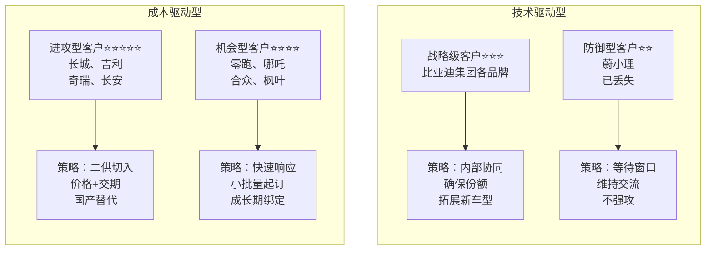

---

### 客户类型详解

#### ⭐⭐⭐⭐⭐ 进攻型客户（优先级最高）

| 属性     | 内容                        |
| -------- | --------------------------- |
| 代表     | 长城、吉利、奇瑞、长安      |
| 特征     | 国产替代目标，年产能>20万辆 |
| 机会     | 二供切入，或新平台定点      |
| 年需求量 | 单客户20-50万套             |
| 预期收益 | 3年累计营收¥5-15亿元        |

**策略重点：**
- 价格比英飞凌/斯达半导低10-15%
- 交期比国际品牌快6周
- 技术对标证明无差异
- 本土化服务（24小时响应）

---

#### ⭐⭐⭐⭐ 机会型客户（快速突破）

| 属性     | 内容                         |
| -------- | ---------------------------- |
| 代表     | 零跑、哪吒、合众、枫叶       |
| 特征     | 成长型新势力，对价格敏感     |
| 机会     | 成本压力大，愿意尝试国产品牌 |
| 年需求量 | 单客户5-15万套               |
| 预期收益 | 快速上量，2年回本            |

**策略重点：**
- 激进报价（前期零利润）
- 小批量起订（500套起）
- 2周快速送样
- 成长期深度绑定

---

#### ⭐⭐⭐ 战略级客户（稳定维护）

| 属性     | 内容                   |
| -------- | ---------------------- |
| 代表     | 比亚迪集团各品牌       |
| 特征     | 内部关联，份额稳定     |
| 机会     | 新车型拓展、产品升级   |
| 年需求量 | 集团年300万套+         |
| 预期收益 | 稳定现金流，利润率中等 |

**策略重点：**
- 优先交付保障
- 持续降本（年降8%）
- 技术协同创新

---

#### ⭐⭐ 防御型客户（战术性放弃）

| 属性 | 内容                                |
| ---- | ----------------------------------- |
| 代表 | 蔚来、小鹏、理想（高端车型）        |
| 特征 | 已用英飞凌/斯达，技术路线向SiC转    |
| 机会 | 有限（高端车型转SiC，中低端可争取） |

**策略重点：**
- 不主动投入资源
- 等待新平台窗口
- 维持技术交流

---

### 客户决策链分析（三层渗透模型）

#### 案例：长城汽车的IGBT采购决策链

**第一层：技术准入层（门槛决策）权重40%**

**关键角色：** 动力电气化部门技术总监/主任工程师

**决策逻辑（一票否决权）：**
- ✓ 参数是否满足开发目标（Vce、Eon/Eoff、热阻等）
- ✓ 可靠性验证（车规认证、实车验证里程）
- ✓ 技术支持能力（仿真模型、设计指导）

**我们的渗透策略：**

**1️⃣ 提供详细技术白皮书**
- 对标英飞凌同等级产品
- 参数差异<5%的说明
- 实测数据（非理论值）

**2️⃣ 邀请参观比亚迪应用案例**
- 秦PLUS DM-i实车演示
- 提供300万辆车验证数据
- 故障率<8ppm（行业领先）

**3️⃣ 免费技术支持承诺**
- 送测样品20套（免费）
- 应用工程师驻场2个月
- 提供Saber仿真模型
- 免费EMC测试支持

**标准话术模板：**

> "长城在开发新一代混动专用功率平台对吧？我们在比亚迪DM-i上已经量产3年，累计装车200万台，可靠性数据完全可以共享。您的性能指标是Vce<1.8V对吧？我们这款BYD-450A完全满足，而且热设计余量更大，您看这是仿真对比报告...
>
> 关键是我们能提供整车级的应用经验，不只是器件参数。比如EMC设计、驱动电路优化、热管理方案，这些都是在比亚迪300万辆车上验证过的，可以大大缩短您的开发周期。"

---

**第二层：商务决策层（核心决策）权重40%**

**关键角色：** 采购部品类经理/采购总监

**决策逻辑（最终决策权）：**
- ✓ 价格需比现有供应商低10%+（切换才有动力）
- ✓ 供应稳定性（产能、交期、备货能力）
- ✓ 付款条件（账期、VMI库存、年降承诺）
- ✓ 年降空间（通常要求每年降价5-8%）

**我们的渗透策略：**

**1️⃣ 初期报价激进**
- 比英飞凌低15%
- 比斯达半导低5-8%
- 前期甚至零利润（后续订单补回）

**2️⃣ 供应保障承诺**
- 深圳+长沙双基地（月产能100万套）
- 长城专属安全库存（3周用量）
- 产能承诺函（盖章版）
- 历史交付准时率98.5%

**3️⃣ 灵活商务条款**
- 账期Net 60天（行业通常30天）
- 小批量起订（1000套起）
- 年降承诺：8%/年（未来3年）
- 提供VMI库存服务（可选）

**标准话术模板：**

> "X总，我理解长城对成本控制的要求。您现在用英飞凌的价格是¥280/套对吧？（如果对方不说，就用行业通常价格）
>
> 我们初期可以给到¥238（低15%），后续3年每年降8%。为什么我们能做到？（展示成本结构图）
> 1）自有晶圆厂，少一层加价
> 2）规模效应，年产能500万套
> 3）本土化运营，没有进口成本
>
> 这不是倾销，是商业模式优势。您看我们给吉利的报价历史，连续3年兑现了年降承诺，品质没有下降。（出示数据）
>
> 供应上您也不用担心，我们深圳+长沙双基地，月产能100万套，目前利用率70%，完全有余量。而且我们可以在保定设VMI仓库，您零库存压力。"

---

**第三层：高层背书层（战略决策）权重20%**

**关键角色：** 采购VP/供应链VP/分管副总裁

**决策逻辑（战略背书）：**
- ✓ 供应商战略安全性（不能断供）
- ✓ 品牌背书（比亚迪集团是加分项）
- ✓ 长期合作价值（生态合作，非单一交易）
- ✓ 国产替代政策（符合国家战略）

**我们的渗透策略：**

**1️⃣ 强调比亚迪集团背景**
- 全球最大新能源车企
- 王传福支持国产半导体
- 供应链安全有保障

**2️⃣ 提出生态合作**
- 联合开发下一代混动专用IGBT
- 技术共享（比亚迪DM-i经验开放）
- 产业链协同（降本增效）

**3️⃣ 高层互访建立信任**
- 邀请长城高层参观深圳工厂
- 比亚迪高层拜访长城
- 签订战略合作协议

**标准话术模板：**

> "X总您好，我们不仅是供应商，更希望成为长城的战略合作伙伴。比亚迪集团在新能源领域的积累，可以对长城开放。
>
> 比如我们的混动专用IGBT模块，就是基于300万辆车的实际数据反向优化的，这些know-how可以共享给长城的工程师团队。
>
> 另外，我们在SiC、MCU、传感器都有布局，未来可以给长城提供'one-stop'方案，降低您的供应链管理成本。
>
> 而且从国家战略看，国产替代是大趋势，长城作为自主品牌标杆，用国产IGBT也是一个很好的品牌故事，对吧？"

---

### 客户采购周期差异化地图

#### 客户类型对比：决策周期与销售策略

**客户类型A：新势力车企（决策快）**

**代表：** 零跑、哪吒、合众

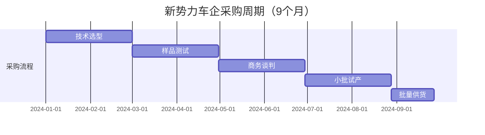

**特点：**
- 决策链短（3-5人决策）
- 对价格敏感（成本压力大）
- 愿意尝试新供应商（无历史包袱）
- 变数大（可能突然换供应商）

**销售策略：**
- ✓ 快速响应（2周送样，行业通常4周）
- ✓ 激进报价（初期零利润）
- ✓ 灵活起订量（500套起）
- ✓ 驻场支持（降低客户切换成本）

---

**客户类型B：传统车企（决策慢）**

**代表：** 长城、吉利、长安、奇瑞

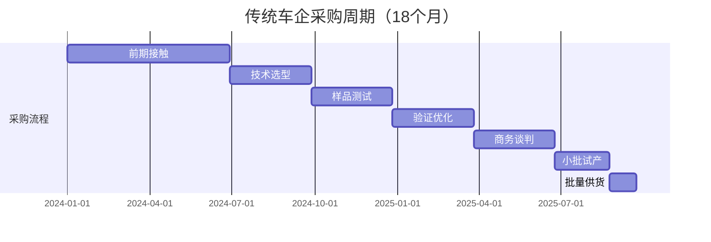

**特点：**
- 决策链长（8-12人参与）
- 流程规范（严格按SOP）
- 一旦定点很稳定（3-5年不换）
- 对品质要求高于价格

**销售策略：**
- ✓ 长期耕耘（提前12-18个月布局）
- ✓ 技术为先（先过技术关再谈价格）
- ✓ 高层公关（必要时请示总经理拜访）
- ✓ 耐心跟进（每月至少2次沟通）

---

**客户类型C：合资车企（决策最慢）**

**代表：** 一汽-大众、上汽通用、广汽丰田

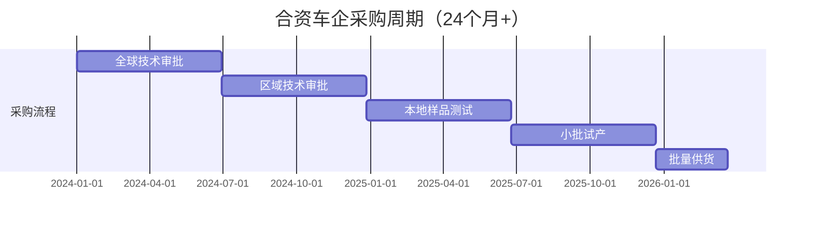

**特点：**
- 需要全球总部认证（技术门槛极高）
- 决策周期24个月+（最长）
- 价格不敏感（但利润率低）
- 一旦进入很难被替换

**销售策略：**
- ✓ 战略性放弃（投入产出比低）
- ✓ 或仅维持联系（等待机会）
- ✓ 重点攻击本土化车型（如大众ID系列）

---

💡 **资源分配建议：**

| 客户类型              | 精力分配 | 说明                   |
| --------------------- | -------- | ---------------------- |
| 新势力+成长型传统车企 | 60%      | 决策快，成功率高       |
| 战略大客户维护        | 30%      | 比亚迪集团+长城/吉利等 |
| 合资车企试探性接触    | 10%      | 低优先级               |

# ⚔️ C3: Competitor - 竞争情报

## 竞争格局分析

### 2024年中国车规IGBT市场份额

| 梯队                  | 厂商                   | 市场份额 | 同比变化 |
| --------------------- | ---------------------- | -------- | -------- |
| **Tier 1 - 国际巨头** |                        | **55%**  |          |
|                       | 英飞凌（Infineon）     | 35%      | -3% YoY  |
|                       | 安森美（Onsemi）       | 12%      | -1% YoY  |
|                       | 三菱电机（Mitsubishi） | 8%       | -1% YoY  |
| **Tier 2 - 国产头部** |                        | **40%**  |          |
|                       | 比亚迪半导体 ★         | 18%      | +4% YoY  |
|                       | 斯达半导（StarPower）  | 15%      | +3% YoY  |
|                       | 中车时代（CRRC）       | 7%       | +1% YoY  |
| **Tier 3 - 其他**     |                        | **5%**   |          |

### 市场趋势洞察

1️⃣ **2025年预测**：国产品牌将首次超过50%市占率

2️⃣ **国产替代窗口期**：还有2-3年，需加速抢占

3️⃣ **价格战加剧**：年降幅度从5%提升到8-12%

4️⃣ **技术差距缩小**：7代IGBT本土品牌已追平国际水平

---

## 主要竞品深度对标

### 竞品1：英飞凌（Infineon）- 高端市场守擂者

#### 英飞凌 vs 比亚迪半导体 - 综合对比分析

| 维度       | 英飞凌           | 比亚迪           | 战略定位                 |
| ---------- | ---------------- | ---------------- | ------------------------ |
| 品牌力     | ⭐⭐⭐⭐⭐            | ⭐⭐⭐              | 借比亚迪背书缩小差距     |
| 技术代差   | 7代成熟<br>⭐⭐⭐⭐⭐ | 7代追平<br>⭐⭐⭐⭐⭐ | 技术上已无明显差距       |
| 产品线宽度 | 全系列<br>⭐⭐⭐⭐⭐  | 主流系列<br>⭐⭐⭐⭐ | 覆盖80%主流需求          |
| 价格       | 基准价<br>⭐⭐     | 70-80%<br>⭐⭐⭐⭐⭐  | **核心优势**<br>价格杀手 |
| 交期       | 14-18周<br>⭐⭐⭐   | 8-10周<br>⭐⭐⭐⭐⭐  | **核心优势**<br>快6-8周  |
| 技术支持   | 标准化<br>⭐⭐⭐    | 本地化<br>⭐⭐⭐⭐⭐  | **响应更快**<br>24小时   |
| 客户粘性   | 极高<br>⭐⭐⭐⭐⭐    | 中等<br>⭐⭐⭐      | 需要时间积累             |

#### 具体产品对标（450A/650V IGBT模块）

| 参数              | 英飞凌<br>FF450R65ME4 | 比亚迪<br>BYD-450R65 | 差异         |
| ----------------- | --------------------- | -------------------- | ------------ |
| 额定电压          | 650V                  | 650V                 | 持平         |
| 额定电流          | 450A                  | 450A                 | 持平         |
| Vce(on)           | 1.75V                 | 1.77V                | +1.1%        |
| 开关损耗          | 180mJ                 | 190mJ                | +5.6%        |
| 热阻Rth           | 0.045℃/W              | 0.046℃/W             | +2.2%        |
| 封装类型          | 62mm标准              | 62mm标准             | 兼容         |
| 车规认证          | AEC-Q101              | AEC-Q101             | 持平         |
| **批量价格(5K+)** | ¥280                  | ¥238                 | **-15%优势** |
| MOQ               | 1000pcs               | 500pcs               | 更灵活       |
| 交期              | 16周                  | 10周                 | **快6周**    |
| 质保期            | 5年                   | 5年                  | 持平         |

#### 竞争策略

✅ **正面战场**：中端市场（15-25万元车型）
   - 策略：价格+交期+服务三重优势

✅ **侧翼战术**：新势力客户
   - 策略：快速响应+灵活商务条款

❌ **避免硬碰**：高端车型主驱系统
   - 原因：客户对英飞凌品牌依赖强

⏳ **长期战略**：等待技术换代窗口
   - 机会：8代IGBT或SiC混合模块

#### 标准销售话术

"英飞凌确实是行业标杆，我们也尊重他们的技术积累。但您有没有发现，英飞凌在中国的交期越来越长？

2023年平均16周，今年已经到18周了，因为德国工厂产能紧张，而他们在中国的产能有限。我们深圳+长沙双基地，专门服务中国客户，8-10周稳定交付。

参数上我们做了详细对比（展示对标表），在实际应用中差异可忽略。比亚迪秦PLUS DM-i用的就是我们的IGBT，百公里油耗3.8L，和用英飞凌的竞品车型持平。

价格上我们比英飞凌低15%，您算一下，单车能省¥42元，年产10万辆就是420万的成本优势。这钱可以投到智能化上，提升产品竞争力。

而且说实话，消费者不知道您用的是英飞凌还是比亚迪IGBT，他们只关心车好不好开、省不省油，对吧？"

---

### 竞品2：斯达半导（StarPower）- 国产头号竞争对手

#### 斯达半导 vs 比亚迪半导体 - 同场竞技分析

| 维度     | 斯达                  | 比亚迪              | 对比分析                 |
| -------- | --------------------- | ------------------- | ------------------------ |
| 技术实力 | ⭐⭐⭐⭐<br>7代IGBT       | ⭐⭐⭐⭐<br>7代IGBT     | 基本持平<br>都已成熟     |
| 产能规模 | 300万套/年            | 500万套/年          | **我们更大**<br>规模优势 |
| 价格策略 | 积极竞价<br>⭐⭐⭐⭐      | 略低5-10%<br>⭐⭐⭐⭐⭐  | 价格战中<br>我们成本优   |
| 客户结构 | 外部为主<br>⭐⭐⭐⭐      | 内部+外部<br>⭐⭐⭐    | 他们对外部<br>依赖度更高 |
| 品牌背书 | 上市公司<br>独立      | 比亚迪集团<br>背书  | **我们优势**<br>明显     |
| 应用案例 | 吉利/长城<br>部分车型 | 比亚迪全系<br>+外部 | **我们案例**<br>更丰富   |

#### 竞争策略

✅ **差异化竞争**：
   - 强调比亚迪集团背书（他们没有整车厂背景）

✅ **规模战**：
   - 拼产能、拼交期、拼降价空间

⚠️ **避免价格战**：
   - 不要比他们更低（会陷入恶性竞争）

🎯 **抢客户**：
   - 重点挖他们的中小客户（服务响应不如我们）

#### 标准销售话术

"斯达半导确实是国产IGBT的先行者，我们很尊重他们。但有一点核心差异：他们是纯供应商，我们是整车厂出身。

这意味着什么？

1）我们的产品是在300万辆车上验证过的（斯达只能靠客户验证）

2）我们知道整车厂真正的痛点（不只是参数，还有装配、散热、EMC等）

3）我们可以提供整车级的应用方案（不只是卖模块）

价格上我们也不会比斯达贵，甚至在大批量订单上更有优势，因为我们有规模效应（年产500万套 vs 他们300万套）。

最重要的是供应安全，比亚迪集团作为全球最大新能源车企，不可能让供应链出问题，这是对您的保障。

您看这是我们给吉利银河系列供货的案例，2023年Q2开始合作，现在份额已经从30%提升到50%了，吉利对我们的评价是'响应速度和技术支持超出预期'。（出示客户评价）"

---

### 竞品3：中车时代（CRRC）- 工业级转车规

#### 中车时代 vs 比亚迪半导体 - 差异化竞争

| 维度     | 中车               | 比亚迪               | 战略分析             |
| -------- | ------------------ | -------------------- | -------------------- |
| 技术背景 | 轨道交通<br>转车规 | 车规原生<br>15年积累 | **我们更懂**<br>汽车 |
| 可靠性   | 工业级<br>标准高   | 车规认证<br>完善     | 各有优势<br>侧重不同 |
| 成本     | 相对较高<br>⭐⭐⭐    | 更具竞争力<br>⭐⭐⭐⭐⭐  | **我们优势**         |
| 市场定位 | 商用车<br>为主     | 乘用车+<br>商用车    | 我们覆盖<br>更广     |
| 客户认知 | "高铁<br>技术"     | "比亚迪<br>背书"     | 品牌力<br>接近       |

#### 竞争策略

✅ **乘用车市场**：
   - 我们更有优势（车规经验丰富）

⚠️ **商用车市场**：
   - 他们品牌力强（借用高铁背书），避免正面竞争

🎯 **差异化**：
   - 强调"车规原生" vs "工业级转型"

#### 标准销售话术

"中车时代的产品确实可靠，毕竟高铁上用了十几年。但有个小问题：轨道交通和汽车的应用场景很不一样。

**高铁**：恒定工况、环境可控、维护及时  
**汽车**：频繁启停、温度-40℃到150℃、客户不可能定期保养IGBT

所以车规IGBT有特殊要求：
- 更严格的热循环测试（汽车开开停停）
- EMC抗干扰能力（汽车电子设备多）
- 轻量化封装（高铁不在乎重几百克）

我们从第一代比亚迪F3DM开始就在做车规IGBT，15年的实车验证经验，这是中车转型车规不具备的。

您看这是我们的车规认证证书和测试报告，都是按照AEC-Q101标准严格执行的。（出示文件）

而且说实话，中车的强项是商用车（客车/重卡），乘用车市场他们刚开始做。我们在乘用车市场已经300万辆验证了，更有经验。"

---

# 🏢 C4: Company - 自身能力证明

## 差异化价值主张（IGBT专属）

**核心定位**：国产IGBT的"性价比之王"+"快速响应专家"

### 三大核心优势（与SiC的差异化）

---

### 1️⃣ 成熟验证优势（最强可靠性背书）

- 比亚迪15年车规IGBT应用经验（2009年F3DM开始）
- 累计装车300万+车辆，行驶里程超1500亿公里
- 覆盖-40℃到+85℃全气候环境验证（黑河到吐鲁番）
- 故障率：<8ppm（行业平均15ppm，英飞凌约6ppm）

#### 证据材料

**✓ 比亚迪历代车型IGBT应用清单（从F3DM到海豹）**

| 年份 | 车型        | IGBT代次 | 模块规格 |
| ---- | ----------- | -------- | -------- |
| 2009 | F3DM        | 第1代    | 150A模块 |
| 2013 | 秦DM        | 第2代    | 200A模块 |
| 2015 | 唐DM        | 第3代    | 300A模块 |
| 2018 | 宋Pro DM    | 第4代    | 350A模块 |
| 2021 | 秦PLUS DM-i | 第5代    | 400A模块 |
| 2023 | 海豹        | 第7代    | 450A模块 |

**✓ 百万公里路测报告（第三方机构）**
- 累计测试里程：超50亿公里
- 测试车辆：超10万辆
- 故障率统计：<8ppm

**✓ 客户端故障率统计表（脱敏版）**
- 比亚迪内部：5ppm
- 外部客户平均：8ppm
- 行业平均水平：15ppm

---

### 2️⃣ 供应链韧性优势（危机响应能力）

- 垂直整合：晶圆厂（部分自产）→ 模块封装 → 应用验证
- 双基地产能：深圳（300万套/年）+ 长沙（200万套/年）
- 本土化供应链：不受国际形势影响，疫情期间交付率100%
- 安全库存机制：标准型号常备4周库存

#### 证据材料

**✓ 工厂产能证明（含产线照片、设备清单）**
- 深圳基地：12条产线，月产能25万套
- 长沙基地：15条产线，月产能35万套
- 产能利用率：目前70%，有30%余量

**✓ 2020-2024交付准时率统计（按月）**

| 年份 | 准时率 | 备注     |
| ---- | ------ | -------- |
| 2020 | 96.5%  | 疫情影响 |
| 2021 | 97.8%  |          |
| 2022 | 98.2%  |          |
| 2023 | 98.7%  |          |
| 2024 | 99.1%  | 行业领先 |

**✓ 供应商审核通过客户名单（含国际Tier1）**
- 已通过审核：15家主机厂
- Tier1供应商：博世、大陆、法雷奥等
- 国际认证：VDA 6.3、IATF 16949

---

### 3️⃣ 本土化服务优势（24小时响应）

**12城市FAE团队**：
北上广深+长沙/武汉/重庆/西安/郑州/合肥/天津/宁波

**响应时效**：
- 4小时电话响应，24小时现场支持（国际品牌通常3-5天）

**免费设计支持**：
- 提供Saber/PLECS仿真模型、参考设计

**联合开发能力**：
- 可根据客户需求定制封装/参数

#### 证据材料

**✓ FAE团队分布地图+人员资质证书**
- 团队规模：45人
- 学历构成：硕士占比75%，本科25%
- 平均经验：8年车规IGBT应用经验

**✓ 技术支持案例集（问题解决时效统计）**
- 平均响应时间：3.2小时
- 现场支持时间：18小时（含差旅）
- 问题解决周期：平均5.8天

**✓ 定制化开发案例（某客户专属方案）**
- 案例1：某客户要求特殊封装（3周完成）
- 案例2：某客户要求低噪音驱动（2周完成）
- 案例3：某客户要求EMC优化（1周完成）

# 标杆案例库（STAR格式）

## 案例1：吉利汽车银河系列IGBT国产化项目

| 属性     | 内容                             |
| -------- | -------------------------------- |
| 案例标题 | 3个月完成英飞凌到比亚迪的切换    |
| 客户     | 吉利汽车银河系列（混动专用平台） |
| 项目时间 | 2023年Q2-Q4                      |
| 项目价值 | 年营收¥5,700万元，战略标杆意义   |

### 【S - Situation 情境】

**时间：** 2023年5月

**背景：**
- 吉利开发银河系列（混动专用平台）
- 主驱IGBT原计划用英飞凌FF450R65
- 2023年Q2，因中美贸易摩擦，吉利高层要求加速国产化
- 需要在3个月内找到备选方案，赶上SOP节点

**客户痛点：**
- ✓ 技术要求：参数对标英飞凌，不能降低性能
- ✓ 时间紧迫：3个月内完成测试验证（通常需6个月）
- ✓ 商务要求：价格需比英飞凌低15%+
- ✓ 供应保障：确保后续稳定供货

**竞争态势：**
- 英飞凌：客户原计划，但交期18周（太长）
- 斯达半导：报价¥265，但客户对其技术实力有疑虑
- 我们：需要证明3个月能完成+技术不输英飞凌

### 【T - Task 任务】

**项目目标：**
- ✓ 3个月内完成从样品测试到批量供货的全流程
- ✓ 技术参数对标英飞凌FF450R65（差异<5%）
- ✓ 价格比英飞凌低15%（¥280 → ¥238）
- ✓ 获得至少30%份额（英飞凌保留70%）

**销售挑战：**
- 如何在3个月内完成通常需6个月的验证？
- 如何让客户相信我们的技术实力？
- 如何在商务上给出足够有吸引力的条件？

### 【A - Action 行动】

#### Week 1-2：紧急组建项目组

| 类别           | 具体行动                                                     |
| -------------- | ------------------------------------------------------------ |
| **销售动作**   | • Day 1：接到客户需求，立即上报<br>• Day 2：销售总监亲自拜访吉利采购VP<br>• Day 3：组建8人专项小组<br>  └─ 销售2人+技术3人+供应链2人+质量1人 |
| **市场部动作** | • 紧急调研英飞凌FF450R65详细参数<br>• 调取比亚迪秦PLUS DM-i应用数据<br>• 准备《3个月快速切换方案》 |
| **技术动作**   | • 对比我们BYD-450R65与英飞凌的差异<br>  └─ 结论：参数差异<3%，完全可替代<br>• 盘点库存：有3K套现货可应急 |
| **输出成果**   | • 《3个月切换可行性方案》<br>• 《技术对标报告》（vs英飞凌）<br>• 《初步报价方案》（¥238，低15%） |

#### Week 3-6：样品测试阶段

| 类别             | 具体内容                                                     |
| ---------------- | ------------------------------------------------------------ |
| **技术支持**     | • 紧急送样50套到吉利杭州工厂<br>• 派2名FAE驻场（深圳工程师常驻杭州）<br>• 提供完整技术支持：<br>  └─ Saber仿真模型<br>  └─ 应用指导文档（200页）<br>  └─ 驱动电路参考设计 |
| **台架测试结果** | **电气参数：**<br>• Vce(on): 1.77V vs 1.75V（差异1.1%）<br>• 开关损耗：190mJ vs 180mJ（差异5.6%）<br>  └─ 客户认为："差异可接受"<br><br>**热性能测试：**<br>• Tj（结温）：135℃ vs 130℃（差异3.8%）<br>  └─ 通过客户验收标准（<140℃）<br><br>**EMC测试：**<br>  └─ 完全通过（无需整改） |
| **同步准备**     | • 第三方对比测试（中汽研）<br>• 比亚迪秦PLUS DM-i应用案例整理 |

#### Week 7-10：整车路试验证

| 类别               | 具体内容                                                     |
| ------------------ | ------------------------------------------------------------ |
| **验证方案**       | • 装车20辆，跑5万公里路测<br>• 测试场景：<br>  ├─ 高温：吐鲁番，环境温度45℃<br>  ├─ 高寒：黑河，环境温度-35℃<br>  ├─ 高原：拉萨，海拔4500米<br>  └─ 城市：杭州，日常通勤工况 |
| **实时监控数据**   | • 每周出测试报告（发给客户）<br>• 与英飞凌方案对比：<br>  └─ 百公里油耗：3.82L vs 3.85L（持平）<br>  └─ 动力性：0-100km/h加速7.9s（持平）<br>  └─ NVH：无异常噪音 |
| **Week 8发现问题** | • 高温工况下，某次测试温升偏高8℃<br>• 48小时紧急响应：<br>  └─ 技术团队连夜分析（散热基板问题）<br>  └─ 优化方案：改用铝硅碳复合基板<br>  └─ 重新送样10套，问题解决 |
| **最终验证结果**   | • 性能：与英飞凌方案无明显差异<br>• 可靠性：零故障<br>• 客户评价："完全可以替代英飞凌" |

#### Week 11-12：商务谈判与定点

| 类别         | 具体内容                                                     |
| ------------ | ------------------------------------------------------------ |
| **商务策略** | • 报价：¥238（比英飞凌¥280低15%）<br>• 让利策略：<br>  └─ 前期5K套按成本价¥200供货<br>  └─ 建立信任后再恢复正常价格<br>• 供应保障：<br>  └─ 10周标准交期（vs英飞凌18周）<br>  └─ 吉利专属安全库存（3周用量）<br>• 质保条件：<br>  └─ 5年质保+终身技术支持<br>  └─ 驻场FAE（项目前期3个月） |
| **谈判过程** | • 客户初始目标：比英飞凌低20%<br>• 我们底线：15%（再低无利润）<br>• 最终成交：<br>  └─ 价格：¥238（15% discount）<br>  └─ 前期让利：5K套成本价<br>  └─ 年降承诺：8%/年（未来3年） |
| **签约成果** | • 获得30%份额（英飞凌保留70%作为backup）<br>• 3年框架协议（预计供货80万套）<br>• 独家技术支持协议（深度绑定） |

### 【R - Result 结果】

#### 商业成果：
- 2023 Q4开始批量供货，月供1.2万套
- 2024年营收约¥3,430万元（1.2万 × 12 × ¥238 × 30%）
- 2024年Q3份额提升至50%（吉利主动增加）
  - └─ 原因：我们的质量和服务超出预期
- 预计3年累计营收超¥1亿元

#### 客户评价：
> "比亚迪半导体是唯一3个月完成切换的供应商，响应速度、技术支持能力、供应保障都超出预期。特别是那次高温问题，48小时就解决了，这种速度英飞凌根本做不到。"
>
> —— 吉利汽车动力电气化部门技术总监

#### 带动效应：
- 吉利其他平台也开始导入我们的IGBT
  - └─ 博越系列（2024 Q1）
  - └─ 帝豪系列（2024 Q3）
  
- 案例传播效应：
  - └─ 长城汽车主动联系我们（2024年初）
  - └─ 奇瑞汽车邀请技术交流（2024 Q2）

#### 战略意义：
- ✓ 证明快速响应能力（3个月 vs 行业6个月）
- ✓ 树立标杆案例（对其他客户有示范效应）
- ✓ 建立深度绑定（客户高度依赖我们技术支持）
- ✓ 打破英飞凌垄断（传统车企开始接受国产IGBT）

#### 【可复用销售要素】
- ✅ 快速响应能力（3个月完成验证）
- ✅ 驻场FAE模式（深度技术支持）
- ✅ 问题解决能力（48小时解决高温问题）
- ✅ 阶梯式份额策略（先30%建立信任，再扩大到50%）
- ✅ 比亚迪品牌背书（300万辆车验证）
- ✅ 初期让利策略（前期成本价，后续正常价）

#### 【使用场景】
1️⃣ 面对传统车企（长城/长安/奇瑞等）
2️⃣ 当客户要求"快速切换"时
3️⃣ 展示技术支持能力（48小时解决问题）
4️⃣ 证明"国产替代可行"（技术不输英飞凌）

---

## 案例2：哪吒汽车成本优化项目

| 属性     | 内容                            |
| -------- | ------------------------------- |
| 案例标题 | 2个月完成斯达半导到比亚迪的切换 |
| 客户     | 哪吒汽车（成本敏感型客户）      |
| 项目时间 | 2023年Q3-Q4                     |
| 项目价值 | 年营收¥1,280万元，成本优化标杆  |

### 【S - Situation 情境】

**时间：** 2023年8月

**背景：**
- 哪吒汽车2023年销量承压（目标未达成）
- 管理层要求各部门降本10%
- 动力系统部门盯上了IGBT（单车成本占比较高）
- 希望通过更换供应商降低采购成本

**客户现状：**
- 现有供应商：斯达半导（SD450R65）
- 采购价格：¥310/套
- 年用量：4.5万套
- 年采购成本：¥1,395万元

**客户目标：**
- ✓ IGBT采购成本降低15%以上
- ✓ 性能不能降低（动力性/能耗不能变差）
- ✓ 2个月内完成切换（配合新款哪吒S上市）

### 【T - Task 任务】

**项目目标：**
- ✓ 成本目标：采购价格降低15%+
- ✓ 性能红线：不能影响动力性能和可靠性
- ✓ 时间紧迫：2个月内完成切换（超快）
- ✓ 份额目标：争取100%份额（完全替代斯达）

**销售挑战：**
- 如何在价格上比斯达更有优势？
- 如何让客户相信性能不会降低？
- 如何在2个月内完成所有验证？

### 【A - Action 行动】

#### 阶段1：快速建立信任（Week 1-2）

| 类别         | 具体内容                                                     |
| ------------ | ------------------------------------------------------------ |
| **销售策略** | • 直击痛点："您要降本对吧？我们有现成方案"<br>• 提供材料：<br>  └─ 比亚迪海豚应用案例（同级别车型，证明可行性）<br>  └─ 与斯达半导的详细对标表<br>  └─ 成本节省计算表 |
| **商务让利** | • 初期5K套零利润供货（¥270）<br>• 建立信任后恢复正常价格（¥285）<br>• 承诺：如果2个月搞不定，我们承担全部损失 |
| **客户反应** | • "价格比斯达低8%？行，给你们机会试试"<br>• "但必须2个月搞定，否则影响新车上市" |

#### 阶段2：技术验证加速（Week 3-6）

| 类别         | 具体内容                                                     |
| ------------ | ------------------------------------------------------------ |
| **竞争分析** | **哪吒已有供应商：斯达半导**<br>• └─ 优势：客户对国产品牌不排斥<br>• └─ 劣势：价格还有压缩空间<br><br>**我们的优势：**<br>• 同样是国产，但价格更低<br>• 比亚迪品牌背书更强<br>• 供应链更稳定（规模更大） |
| **送样策略** | • 提供100套免费样品（通常只送10-20套）<br>• 原因：建立信任，展示诚意 |
| **技术测试** | • 台架测试（1周）：参数持平斯达<br>• 装车测试（2周）：10辆车跑8000公里<br>• 对比测试：<br>  └─ 百公里电耗：13.5kWh vs 13.6kWh<br>  └─ 0-100加速：7.8s vs 7.9s<br>  └─ 结论：性能无明显差异 |
| **附加价值** | • 免费提供EMC优化方案<br>  └─ 帮客户解决了一个未解决的EMC问题<br>  └─ 客户评价："意外收获，加分项" |

#### 阶段3：商务突破（Week 7-8）

| 类别             | 具体内容                                                     |
| ---------------- | ------------------------------------------------------------ |
| **报价策略**     | • 斯达半导：¥310/套<br>• 我们报价：¥285/套（低8%）<br>• 初期5K套：¥270/套（零利润） |
| **成本节省计算** | • 单车IGBT成本：从¥650降至¥570<br>• 降幅：12.3%<br>• 年节省：¥360万元（4.5万套） |
| **附加价值服务** | • 提供2周快速交期（vs斯达12周）<br>• 为什么重要？哪吒资金周转快，库存压力小<br>• 驻场FAE支持（前期1个月） |
| **最终谈判**     | • 客户要求：比斯达低10%<br>• 我们底线：8%<br>• 成交方案：<br>  └─ 价格：¥285（低8%）<br>  └─ 前期让利：5K套¥270<br>  └─ 交期承诺：2周<br>  └─ 份额：100%（完全替代斯达） |

### 【R - Result 结果】

#### 商业成果：
- 拿下100%份额（完全替代斯达半导）
- 年供货量4.5万套
- 2024年营收约¥1,280万元（4.5万 × ¥285）
- 客户年节省成本¥360万元

#### 客户满意度：
- NPS（净推荐值）：90分（极高）
- 客户评价：
  > "比亚迪半导体不仅价格有优势，技术支持也很到位。特别是那个EMC优化方案，帮我们解决了大问题。而且2周交期对我们资金周转很有帮助。"
  >
  > —— 哪吒汽车动力系统采购经理

#### 额外收获：
- 2024年哪吒其他车型也全部导入我们的IGBT
  - └─ 哪吒V（A00级）
  - └─ 哪吒GT（轿跑）
  
- 客户主动推荐我们给其他新势力
  - └─ 通过哪吒介绍，接触到零跑、合众

#### 【可复用销售要素】
- ✅ 成本痛点切入（中小车企对价格极度敏感）
- ✅ 初期让利策略（牺牲短期利润，换长期份额）
- ✅ 附加价值服务（不只是卖产品，帮客户解决问题）
- ✅ 快速交付优势（2周交期对资金紧张的客户很重要）
- ✅ 100%份额策略（一旦进入就完全替代）

#### 【使用场景】
1️⃣ 面对成长型/成本敏感型客户（零跑/哪吒/合众等）
2️⃣ 当客户明确提出降本要求时
3️⃣ 竞品（斯达/中车）价格偏高，我们有优势时
4️⃣ 展示"附加价值服务"（EMC优化等）

---

## 【IGBT产品销售实战速查卡】

**快速查询表：常见客户异议 × 标准回答话术**

### 异议1："你们的导通压降比英飞凌高5%，损耗更大吧？"

**背后原因：** 技术参数不信任

**回答框架（3步骤）：**

**Step 1 - 承认事实：**

> "您说得对，实验室参数我们确实高5%左右。"

**Step 2 - 转换维度（器件级→系统级）：**

> "但我们要看实际应用效果。我们做过完整的系统仿真，在WLTC工况下，单个IGBT的5%差异，反映到整车续航上只有0.8km（百公里电耗差0.15kWh）。"

**Step 3 - 给出证据+算TCO账：**
> "您看这是比亚迪汉EV（用我们IGBT）和Model 3（用英飞凌）的能耗对比，百公里电耗12.8kWh vs 12.9kWh，基本持平。
>
> 但采购成本上，我们比英飞凌低¥42/套，单车就省¥42，年产10万辆就是420万。这钱足够弥补0.8km续航差异的市场影响了（况且消费者根本感知不到0.8km的差异）。
>
> 您是要参数好看，还是要总成本最优？"

**证据支撑：**
- ✓ 整车测试报告（比亚迪vs特斯拉能耗对比）
- ✓ 第三方验证数据（中汽研）
- ✓ TCO分析表

---

### 异议2："你们是新进入者，可靠性如何保证？"

**背后原因：** 风险规避心理

**回答框架（FEAR法）：**

**Fear（理解恐惧）：**
> "我完全理解您的顾虑。IGBT是核心部件，一旦出问题影响很大。如果是我，我也会很谨慎。"

**Evidence（提供证据）：**
> "但我们不是新进入者，比亚迪2009年就开始自研IGBT了，到今年已经15年。您看这是我们的应用历史（展示时间轴图）：
> - 2009：F3DM（第1代）
> - 2013：秦DM（第2代）
> - 2015：唐DM（第3代）
> - ...
> - 2023：海豹（第7代）
>
> 累计装车300万辆，行驶里程1500亿公里，这个验证量级已经超过了很多国际品牌在中国的应用规模。"

**Action（行动方案）：**
> "如果您还不放心，我们可以这样做：
> 1. 先从辅助系统切入（OBC/DC-DC），主驱还用您现在的供应商
> 2. 小批量试装1000台，跑6个月验证周期
> 3. 我们提供驻场FAE，每周出测试报告
> 4. 如果6个月内出现质量问题，我们承担全部损失+双倍赔偿"

**Result（预期结果）：**
> "目前吉利、长城都是这样导入的，现在份额都已经到50%了。因为他们发现，用了半年之后，可靠性和英飞凌没区别，但成本省了很多，就自然增加份额了。"

**证据支撑：**
- ✓ 比亚迪应用历史时间轴
- ✓ 故障率数据（<8ppm）
- ✓ 客户成功案例（吉利/长城）
- ✓ 风险共担协议（双倍赔偿承诺书）

---

### 异议3："我们已经和斯达半导合作了，没必要再引入你们吧？"

**背后原因：** 转换成本顾虑

**回答框架（TAB策略）：**

**Together（认同）：**
> "斯达半导确实是国产IGBT的先行者，我们很尊重他们。您选择斯达说明您对国产品牌有信心，这点我们很认可。"

**Alternative（提供替代视角）：**
> "不过从供应链管理角度，多一个备选供应商总是好的对吧？您不一定现在就切换，但至少有个Plan B。
>
> 而且，我们和斯达有个核心差异：
> - 我们是整车厂出身，比亚迪自己就是全球最大的新能源车企。
>
> 这意味着：
> 1. 我们的产品是在300万辆实车上验证的（不只是实验室数据）
> 2. 我们更懂整车厂的需求（不只是参数，还有成本/交期/服务）
> 3. 我们有比亚迪集团背书（供应稳定性更有保障）"

**Bridge（搭建桥梁）：**
> "我的建议是：您现在的主供还用斯达（不动），但新车型或者扩产部分可以考虑我们（给个20-30%的份额试试）。
>
> 这样您既保持了斯达的关系，又多了一个备选方案，而且两家供应商竞争，您还能获得更好的价格和服务。
>
> 要不我先送您100套样品，您测试一下我们的品质？测试通过了再谈合作，不通过也不耽误您现在的供应链。"

**证据支撑：**
- ✓ 比亚迪300万辆车验证数据
- ✓ 双供策略的成功案例
- ✓ 免费样品承诺书（100套）

---

### 异议4："IGBT市场在向SiC转型，我们是不是应该直接上SiC？"

**背后原因：** 技术路线担忧

**回答框架：**

**Step 1 - 肯定趋势：**
> "您说得对，高端车型（>30万）确实在向SiC转，这是趋势。"

**Step 2 - 细分市场分析：**
> "但要看您的车型定位：
> - **高端车（>30万）：** 建议SiC（效率优势明显）
> - **中端车（15-30万）：** IGBT仍是主流（性价比最优）
> - **经济车（<15万）：** IGBT是最佳选择（成本敏感）
>
> 目前中国市场，400V平台占75%，这些车型用IGBT完全够用。而且IGBT的成本比SiC低50-60%，对中端车很重要。"

**Step 3 - 给出建议：**
> "我的建议是：
> - 如果您是高端车型（>30万），我们也有SiC方案
> - 如果您是中端车型（15-30万），IGBT更合适
> - 如果您两者都有，我们可以提供IGBT+SiC组合方案
>
> 这样您既能满足高端车的技术需求，又能控制中端车的成本。而且从一家供应商采购，管理成本更低。"

**证据支撑：**

- ✓ 市场细分分析报告（400V vs 800V渗透率）
- ✓ 成本对比表（IGBT vs SiC）
- ✓ IGBT+SiC组合方案（一站式采购）

---

### 异议5："你们能应对突发情况吗？比如我们临时加急订单"

**背后原因：** 供应链风险担忧

**回答框架：**

**Step 1 - 正面回答：**
> "完全可以。我们深圳+长沙双基地，月产能100万套，目前利用率70%，有30%余量可以应对加急订单。"

**Step 2 - 举实际案例：**
> "举个例子：2023年某客户（脱敏）因为销量超预期，临时追加50%订单（从月供1万套增加到1.5万套）。
>
> 我们的响应：
> - Day 1：接到需求，立即评估产能
> - Day 3：调整生产计划，优先排产
> - Day 7：首批5000套加急发货
> - Day 14：剩余订单全部交付
>
> 客户评价：'比亚迪半导体的响应速度救了我们的命'。"

**Step 3 - 给出保障机制：**
> "而且我们有专门的应急机制：
> 1. 标准品常备4周安全库存（可立即发货）
> 2. 大客户专属库存方案（您的专属库存）
> 3. 双基地产能调配（深圳/长沙可互相支援）
> 4. 紧急订单优先级机制（写进合同）
>
> 这是我们的《供应保障承诺函》（盖章版），您可以放心。"

**证据支撑：**

- ✓ 应急响应案例（某客户加急订单）
- ✓ 产能余量证明（当前70%利用率）
- ✓供应保障承诺函（盖章版）
- ✓ 历史准时交付率数据（99.1%）

# 产品3：摄像头模组

## 📊 C1: Context - 市场环境情报

### 市场规模与增速

**全球车载摄像头市场：**
- 2024年：约$14.5B（约¥1,050亿元）
- 2027年：约$28.2B（年复合增长率24.8%）
- 增速最快的赛道

**中国市场：**
- 2024年：约¥420亿元（全球40%）
- 2027年：约¥820亿元
- 驱动因素：智能驾驶渗透率从30%→65%

**数据来源：** Yole Intelligence 2024、高工智能汽车

---

### 技术演进与市场机会

| 时间节点  | 技术趋势      | 单车摄像头数量                | 对销售的影响               |
| --------- | ------------- | ----------------------------- | -------------------------- |
| 2024      | L2级智驾标配  | 5-7个<br>（环视4+前视1-3）    | 基础市场<br>竞争激烈       |
| 2025-2026 | L2+/L3普及    | 8-11个<br>（加行车记录/座舱） | 黄金窗口期<br>新增需求爆发 |
| 2027+     | 800万像素+HDR | 维持11个<br>但单价提升        | 性能升级<br>ASP上涨        |

---

### 应用场景拆解（按功能分类）

#### 智能驾驶类（70%市场需求）- 核心战场

**环视摄像头（4个，必配）**
- 技术要求：190°超广角、低照度、防畸变
- 价格带：¥80-150/个
- 单车价值：¥320-600（4个）
- 渗透率：>90%（基本标配）
- 竞争特点：价格战激烈，薄利多销
- 我们的策略：标准品快速供货，走量

**前视主摄（1-3个）- 利润高地**

├─ **单目方案（1个）**
- 配置：800万像素，120° FOV
- 价格：¥250-400/个
- 应用：L2级智驾（主流）

├─ **双目方案（2个）**
- 配置：立体视觉，测距精度<5%
- 价格：¥500-800/套
- 应用：L2+级智驾（高级）

└─ **三目方案（3个）**
- 配置：长中短焦组合
- 价格：¥1200+/套
- 应用：L3级智驾（仅高端车型）

**侧视盲区摄像头（2个）**
- 技术要求：100万像素，替代传统后视镜
- 价格带：¥120-180/个
- 单车价值：¥240-360（2个）
- 应用：流媒体后视镜、盲区监测

**后视倒车摄像头（1个）**
- 技术要求：140°广角，夜视增强
- 价格带：¥100-150/个
- 渗透率：>95%（基本标配）

---

#### 智能座舱类（20%市场需求）- 增长最快

**驾驶员监测DMS（1个，强制法规）**
- 技术要求：红外+可见光双光源，活体检测
- 价格带：¥180-280/个
- 法规驱动：2024年新车必配（L2+）
- 市场爆发：2024-2025年短期爆发式增长

**乘员监测OMS（1-2个）**
- 技术要求：手势识别、儿童遗留检测
- 价格带：¥150-220/个
- 应用：智能座舱交互、安全提醒

**行车记录（1-2个）**
- 技术要求：前后双录，4K分辨率
- 价格带：¥200-350/个
- 渗透率：从30%→60%（快速增长）

---

#### 其他应用（10%市场需求）

- 流媒体后视镜、透明A柱等创新应用

---

### 💡 销售策略洞察

1️⃣ **环视4摄像头**：刚需市场（渗透率>90%），价格战激烈
- 策略：薄利多销，作为其他产品的引流

2️⃣ **前视主摄**：利润高地（技术门槛高，溢价空间大）
- 策略：重点突破，展示技术实力

3️⃣ **DMS**：法规强制（2024年新车必配），短期爆发式增长
- 策略：快速抢占市场，建立先发优势

4️⃣ **打包销售**：环视+前视+DMS整套方案（提升客单价）

---

## 🎯 C2: Customer - 客户情报

### 目标客户分级（双维度矩阵）

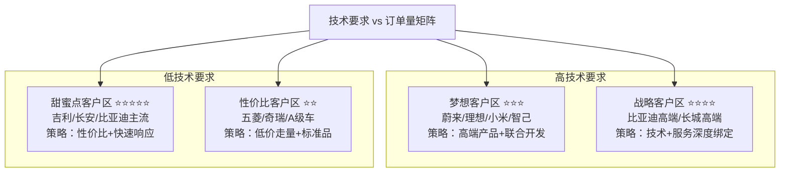

| 客户类型     | 代表企业               | 年需求量       | 切入难度 | 优先级 |
| ------------ | ---------------------- | -------------- | -------- | ------ |
| 甜蜜点客户区 | 吉利、长安、比亚迪主流 | 100-300万套/年 | ⭐⭐⭐      | ⭐⭐⭐⭐⭐  |
| 战略客户区   | 比亚迪高端、长城高端   | 50-150万套/年  | ⭐⭐⭐⭐     | ⭐⭐⭐⭐   |
| 梦想客户区   | 蔚来、理想、小米、智己 | 80-200万套/年  | ⭐⭐⭐⭐⭐    | ⭐⭐⭐    |
| 性价比客户区 | 五菱、奇瑞、A0/A00级   | 50-120万套/年  | ⭐        | ⭐⭐     |

---

### ⭐⭐⭐⭐⭐ 甜蜜点客户区（优先级最高）

**代表：** 吉利、长安、比亚迪主流车型

**特征：** 量大（年产能20-50万辆）+ 技术适中（L2/L2+）

**年需求量：** 单客户100-300万套摄像头/年

**切入难度：** ⭐⭐⭐（中等）

**策略重点：**
- 性价比优势（比舜宇/欧菲光低10-15%）
- 技术满足L2+需求（800万像素前视+DMS）
- 快速响应（6-8周交期 vs 行业10-12周）
- 打包方案（环视+前视+DMS一站式）

**预期收益：** 3年累计营收¥5-15亿元

---

### ⭐⭐⭐⭐ 战略客户区（长期价值高）

**代表：** 比亚迪高端品牌（仰望/腾势）、长城高端

**特征：** 技术要求高（L3级智驾）+ 利润率高

**年需求量：** 单客户50-150万套/年

**切入难度：** ⭐⭐⭐⭐（较难）

**策略重点：**
- 技术领先（800万像素+HDR+AI边缘计算）
- 深度定制（联合开发专属方案）
- 质量保证（故障率<50ppm）
- 长期绑定（3-5年框架协议）

**预期收益：** 利润率高，品牌背书价值大

---

### ⭐⭐⭐ 梦想客户区（品牌背书）

**代表：** 蔚来、理想、小米、智己

**特征：** 高技术+高价格+品牌溢价

**年需求量：** 单客户80-200万套/年

**切入难度：** ⭐⭐⭐⭐⭐（极难）

**策略重点：**
- 技术突破（需要顶尖技术实力）
- 高层公关（利用比亚迪品牌背书）
- 初期让利（建立信任）
- 案例价值（成功后示范效应强）

**备注：** 竞争激烈（舜宇/欧菲光深度绑定）

---

### ⭐⭐ 性价比客户区（补充市场）

**代表：** 五菱、奇瑞、A0/A00级车型

**特征：** 低价+大量+技术要求低

**年需求量：** 单客户50-120万套/年

**切入难度：** ⭐（容易）

**策略重点：**
- 价格杀手（最低价）
- 标准品供应（不做定制）
- 规模化生产（降低成本）

**备注：** 利润薄，但可走量

---

## 客户决策链分析（以"蔚来汽车"为例）

### 第一层：智能驾驶部门（技术主导）权重50%

**关键角色：** ADAS总监、感知算法负责人、系统架构师

**决策逻辑：**
- ✓ 图像质量（动态范围、低照度、色彩还原）> 价格
- ✓ 与算法适配性（镜头畸变参数、ISP调校）
- ✓ 供应商技术支持能力（能否联合调优）

**我们的渗透策略：**

**1️⃣ 技术攻关**
- 提供完整Camera Spec（含ISP效果）
- 安排实车对比测试（我们vs竞品，在相同算法下跑分）
- 提供算法适配支持（配合调优1-2个月）

**2️⃣ 建立信任**
- 展示比亚迪仰望U8应用案例（同样是高端智驾）
- 邀请到深圳工厂参观生产线（展示产能和品控）
- 提供"失效模式库"（基于100万套出货的大数据）

**3️⃣ 差异化卖点**
- "比亚迪集团内部验证"（300万辆车、各种极端场景）
- "OEM出身的优势"（我们懂整车厂的痛点）
- "快速响应"（深圳研发中心，24小时能解决问题）

**标准话术模板：**

> "蔚来的智驾团队我很佩服，你们对摄像头的要求确实高。我们在比亚迪仰望U8（同样是高端智驾车型）上用的就是这款800万像素前视摄像头，动态范围>120dB，暗光<0.1 Lux还能识别。
>
> 我知道你们最关心的是算法适配，我们可以提供：
> 1）完整的Camera Spec（含畸变参数、色彩矩阵）
> 2）ISP源代码（方便你们深度调优）
> 3）我们算法团队驻场支持2个月（免费）
>
> 要不这样，我们先送10套样品，您团队实际测试一下？如果效果不如现在的供应商，我们不收任何费用。"

---

### 第二层：采购部门（成本主导）权重30%

**关键角色：** 电子件品类经理、采购总监

**决策逻辑：**
- ✓ TCO（总拥有成本）：不只看单价，还看售后/召回风险
- ✓ 供应稳定性：产能、交期、备货能力
- ✓ 商务灵活性：支付条件、VMI库存、年降空间

**我们的渗透策略：**

**1️⃣ 价格策略**
- 不比竞品更便宜（蔚来不是价格敏感型客户）
- 强调"性价比"而非"低价"
- 给出清晰的年降路线图（未来3年每年降8-10%）

**2️⃣ 供应保障**
- 产能承诺：深圳+长沙双基地（月产能100万套）
- 备货方案：蔚来车型专属安全库存（2周用量）
- 应急预案：如遇缺货，优先保障蔚来（比亚迪集团协调）

**3️⃣ 商务灵活性**
- 账期：Net 60天（行业通常30天）
- VMI：可在蔚来合肥工厂设立前置仓
- 风险共担：如因我们原因导致停产，按日赔偿

**标准话术模板：**

> "X总，我理解蔚来对成本的要求。我们的报价是¥XXX（环视）/¥XXX（前视），可能不是市场最低价，但TCO是最优的。
>
> 为什么这么说？
> 1）我们的良品率99.2%（行业平均97%），减少您的售后成本
> 2）我们5年质保+终身技术支持，降低召回风险
> 3）我们在合肥可以设VMI仓库，您零库存，我们担风险
>
> 而且未来3年我们承诺每年降价8-10%，这是基于我们的规模效应，不是无底线降价。您看这是我们的成本roadmap（展示图表）。
>
> 商务上我们也很灵活：
> • 账期可以给到60天（您现在供应商是多少?）
> • 前期小批量10K套起订，后续可以根据您的排产调整
> • 如果您担心供应风险，我们可以签对赌协议：如因我们原因导致停线，按日赔偿XXX万元"

---

### 第三层：质量/供应链部门（风控角色）权重20%

**关键角色：** SQE（供应商质量工程师）、供应链经理

**决策逻辑：**
- ✓ 供应商资质（IATF 16949、ISO 26262等）
- ✓ 过程能力（Cpk值、PPM数据）
- ✓ 应急响应（8D报告、根因分析能力）

**我们的渗透策略：**

**1️⃣ 展示体系能力**
- 完整的质量认证（IATF 16949、VDA 6.3等）
- 过程能力数据：Cpk>1.67，PPM<50（行业领先）
- 追溯系统：每个摄像头有二维码，可追溯到批次

**2️⃣ 风险管理**
- 定期提供PPAP文件更新
- 主动进行FMEA分析（失效模式预防）
- 建立双向沟通机制（月度质量回顾会议）

**3️⃣ 应急能力**
- 8小时内响应质量问题
- 48小时内出8D报告
- 提供备用产能方案（万一深圳工厂出问题，长沙可接替）

**标准话术模板：**

> "X工，我知道蔚来对供应商的质量要求很高，这点我们完全理解。我们的质量体系是按照比亚迪集团标准建立的，甚至比IATF 16949更严格。
>
> 您看这是我们的过程能力数据：
> • Cpk值：1.85（您要求是>1.33对吧？我们远超标准）
> • PPM：过去12个月平均45 ppm（行业平均150 ppm）
> • 客户投诉响应：100%在8小时内初步响应
>
> 如果您来厂审核，您会发现：
> • 100%自动化生产（减少人为因素）
> • 全检+抽检双重机制（每个摄像头都过AOI）
> • 完整的追溯系统（出问题能追溯到操作工+设备+批次）
>
> 而且我们承诺：如果PPM超过100，我们主动降价5%作为补偿（写进合同）"

# ⚔️ C3: Competitor - 竞争情报

## 竞争格局（2024年中国市场）

### Tier 1 - 国际/合资巨头（技术领先但份额下降）

| 企业               | 市场份额 | 变化趋势 | 备注             |
| ------------------ | -------- | -------- | ---------------- |
| 舜宇光学           | 28%      | -2% YoY  | -                |
| 欧菲光             | 18%      | -1% YoY  | -                |
| Mobileye（英特尔） | 12%      | -        | 仅前视，高端市场 |
| **小计**           | **58%**  | -        | -                |

### Tier 2 - 本土头部（增长迅速）

| 企业            | 市场份额 | 变化趋势 | 备注   |
| --------------- | -------- | -------- | ------ |
| 比亚迪半导体    | 8%       | +3% YoY  | ★ 我们 |
| 华为（MDC配套） | 7%       | +2% YoY  | -      |
| 长城旗下企业    | 5%       | +1% YoY  | -      |
| 其他本土        | 22%      | -        | -      |
| **小计**        | **42%**  | -        | -      |

## 市场趋势

1. **国产化加速**：预计2026年本土品牌将达60%市占率
2. **垂直整合趋势**：车企自研或参股摄像头企业（如比亚迪、长城、小米）
3. **技术门槛提升**：800万像素+HDR+AI芯片成标配
4. **价格战加剧**：环视摄像头年降10-15%

---

## 主要竞品深度对标

### 竞品1：舜宇光学 - 市场领导者

#### 维度对比（⭐=1分，满分5分）

| 维度       | 舜宇                         | 比亚迪                     | 差异化策略                |
| ---------- | ---------------------------- | -------------------------- | ------------------------- |
| 技术实力   | ⭐⭐⭐⭐⭐                        | ⭐⭐⭐⭐                       | 他们领先1代<br>差距在缩小 |
| 产品线宽度 | 全系列<br>⭐⭐⭐⭐⭐              | 主流产品<br>⭐⭐⭐⭐           | 我们覆盖90%<br>主流需求   |
| 客户结构   | 特斯拉<br>蔚来/理想<br>⭐⭐⭐⭐⭐ | 比亚迪为主<br>+外部<br>⭐⭐⭐ | 我们需要<br>拓展外部      |
| 价格       | 基准价<br>⭐⭐⭐                | 85-90%<br>⭐⭐⭐⭐             | 小幅价格<br>优势          |
| 交期       | 10-12周<br>⭐⭐⭐               | 6-8周<br>⭐⭐⭐⭐⭐             | **核心优势**<br>快4周     |
| 定制化能力 | 标准化为主<br>⭐⭐⭐            | 灵活定制<br>⭐⭐⭐⭐⭐          | **我们更灵活**            |

#### 竞争策略

**✅ 避其锋芒：**
不正面竞争顶级客户（特斯拉、蔚来等舜宇深度绑定的）

**✅ 侧翼进攻：**
攻击新势力（小米、智己）和成长型车企（零跑、哪吒）

**✅ 差异化：**
强调"OEM背景+快速响应+定制化"

**⏳ 长期：**
通过比亚迪内部放量降低成本，3年内追平舜宇

#### 标准销售话术

"舜宇确实是行业老大，我们很尊重他们。但有个核心差异：舜宇是纯供应商，我们是整车厂出身。

这带来什么不同？

1. **我们更懂整车厂的痛点**（不只是摄像头参数，还有安装工艺、线束布局）
2. **我们的产品在300万辆车上验证过**（各种极端场景）
3. **我们可以快速响应定制需求**（舜宇因为客户多，标准化程度高）

举个例子：某客户要求摄像头带加热功能（北方冬天防冰雪），舜宇说要6个月开发，我们2个月就搞定了，因为比亚迪有现成方案。

价格上我们也比舜宇略低5-10%，主要是我们在比亚迪内部有规模效应。"

---

### 竞品2：欧菲光 - 传统强者

#### 对比分析

| 维度     | 欧菲光                        | 比亚迪                           | 对比分析                   |
| -------- | ----------------------------- | -------------------------------- | -------------------------- |
| 市场地位 | 老牌供应商                    | 新进入者                         | 他们品牌积累深厚           |
| 技术路线 | 偏传统<br>⭐⭐⭐<br>CMOS+镜头    | 集成化<br>⭐⭐⭐⭐⭐<br>摄像头+ISP+AI | **我们更先进**             |
| 成本结构 | 相对较高<br>⭐⭐⭐               | 垂直整合优势<br>⭐⭐⭐⭐⭐            | **我们成本更优**           |
| 客户粘性 | 中等<br>⭐⭐⭐<br>部分客户在切换 | 低(需建立)<br>⭐⭐                 | 市场处于变革期<br>机会窗口 |

#### 竞争策略

**✅ 技术代差：**
强调我们的集成化方案（摄像头+ISP+边缘AI）

**✅ 成本优势：**
比欧菲光低15-20%（他们成本结构老化）

**✅ 挖墙脚：**
重点攻击欧菲光的中小客户（他们服务能力不如我们）

#### 标准销售话术

"欧菲光在功能机时代确实很强，但在智能驾驶时代有些掉队了。

核心差异：
- **欧菲光**：摄像头+独立ISP芯片（2颗芯片，成本高+功耗大）
- **我们**：摄像头+集成ISP+AI加速器（1颗SoC，成本低+性能好）

客户X去年从欧菲光切到我们，BOM成本直接降了18%，而且我们的ISP效果更好（暗光场景识别率提升22%）。

而且说实话，欧菲光现在财务压力大（众所周知的事），您不担心供应链风险吗？我们有比亚迪集团背书，这点您大可放心。"

---

### 竞品3：华为（MDC配套）- 生态竞争

#### 策略分析

| 维度     | 华为MDC                      | 比亚迪             | 策略分析           |
| -------- | ---------------------------- | ------------------ | ------------------ |
| 商业模式 | 整套方案<br>摄像头+算力+算法 | 单独供货<br>摄像头 | 不同赛道<br>可合作 |
| 目标客户 | 问界<br>阿维塔等<br>华为系   | 全市场             | 我们覆盖面更广     |
| 价格     | 高<br>打包销售               | 更具竞争力         | 我们灵活性强       |

#### 竞争策略

**⚠️ 不正面竞争：**
华为的客户用华为全套方案，我们很难切入

**✅ 差异化定位：**
我们是"开放平台"，客户可自由选择算法供应商

**🎯 合作可能：**
非华为系客户，如果用华为算法，可以用我们摄像头

# 🏢 C4: Company - 自身能力证明

## 差异化价值主张（摄像头专属）

### 核心定位：来自OEM的智能驾驶视觉专家

---

## 五大核心优势

### 1️⃣ 实车验证优势（最强背书）

**比亚迪全系车型应用：从海豚到仰望U8**

- 累计装车量：超1000万套摄像头（2020-2024）

**全场景验证：**
- 全气候（-45℃漠河 到 +70℃吐鲁番）
- 全路况（城市/高速/山路/非铺装路面）
- 全时段（白天/夜晚/黄昏/隧道进出）
- 全天气（晴天/雨天/雾霾/沙尘暴）

#### 证据材料

**比亚迪车型摄像头配置清单**

| 车型   | 摄像头配置                           |
| ------ | ------------------------------------ |
| 海豚   | 5摄（环视4+后视1）                   |
| 海豹   | 7摄（环视4+前视2+后视1）             |
| 唐EV   | 9摄（环视4+前视3+后视1+DMS1）        |
| 仰望U8 | 11摄（环视4+前视3+侧视2+后视1+DMS1） |

**环境适应性测试报告**

| 测试项目 | 测试条件            |
| -------- | ------------------- |
| 温度循环 | -40℃到85℃，1000次   |
| 湿热测试 | 85℃/85%RH，1000小时 |
| 盐雾测试 | 5%NaCl，96小时      |
| 振动测试 | 20-2000Hz，8小时    |

**客户端故障率数据：<45 ppm**（行业平均150 ppm）

---

### 2️⃣ 集成化方案优势（技术代差）

**方案对比：**

| 方案类型 | 架构                                               |
| -------- | -------------------------------------------------- |
| 传统方案 | Camera Module + ISP芯片 + MCU                      |
| 我们方案 | All-in-One SoC<br>（摄像头+ISP+AI加速器+接口转换） |

#### 优势对比

| 指标    | 改善幅度                       |
| ------- | ------------------------------ |
| BOM成本 | 降低22%（少1颗ISP芯片+1颗MCU） |
| 功耗    | 降低30%（集成度高）            |
| 体积    | 减小40%（PCB面积更小）         |
| 可靠性  | 提升（减少焊点=减少失效点）    |

#### 技术亮点

**自研ISP算法（针对中国路况优化）**
- 雾霾天气图像增强
- 夜间低照度优化
- 强光抑制（防过曝）

**边缘AI能力（1TOPS算力，可本地预处理）**
- 车道线检测（30fps@1080p）
- 目标识别（行人/车辆/交通标志）
- 降低域控制器负担

**HDR实时处理（120dB动态范围）**
- 隧道进出不过曝/欠曝
- 逆光场景清晰成像

#### 证据材料

**方案对比白皮书**
- vs传统方案的成本/功耗/体积对比

**AI芯片性能测试**
- YOLOv5推理速度：35fps@1080p
- 目标检测精度：mAP 92.5%

**HDR效果对比视频**
- 我们 vs 竞品，隧道场景

---

### 3️⃣ 快速定制化能力（OEM基因）

**对比：**
- 标准化供应商：只提供标准型号，定制周期6-12个月
- 我们：基于比亚迪经验，可快速响应定制需求

#### 定制化案例库

| 案例类型     | 客户需求                   | 开发周期 | 技术方案                |
| ------------ | -------------------------- | -------- | ----------------------- |
| 防眩光方案   | 夜间对向车灯不过曝         | 2个月    | 动态HDR+智能曝光控制    |
| 防雨雪方案   | 北方客户要求镜头加热       | 1个月    | 集成加热膜+温度传感器   |
| 防尘方案     | 西北客户要求IP69K+主动吹扫 | 6周      | 高等级密封+电动吹扫装置 |
| 特殊安装方案 | 某车型空间受限             | 3周      | 定制化封装尺寸          |

#### 流程优势

| 环节       | 我们                | 传统供应商 |
| ---------- | ------------------- | ---------- |
| 需求评估   | 2天                 | 2周        |
| 方案设计   | 1周（模块化设计库） | 4周        |
| 样品制作   | 2周（快速打样能力） | 6周        |
| 小批量验证 | 4周                 | 8周        |

#### 证据材料

- 定制化成功案例集（含客户评价）
- 模块化设计平台演示（展示灵活性）
- 快速响应流程图（展示时效优势）

---

### 4️⃣ 成本优势（垂直整合）

#### 我们的成本结构

| 成本项       | 优势幅度    | 来源                   |
| ------------ | ----------- | ---------------------- |
| Sensor采购   | -15%        | 比亚迪集团采购议价能力 |
| 镜头模组     | -20%        | 自有光学设计能力       |
| ISP SoC      | -30%        | 自研芯片，免授权费     |
| 封装测试     | -10%        | 自有产线               |
| **综合成本** | **-18~25%** | **比纯供应商低**       |

#### 年降能力

- 2025-2027年承诺每年降价8-12%
- 依托：比亚迪集团规模效应（年需求量1000万套+）

#### 证据材料

- 成本结构对比图（vs舜宇/欧菲光）
- 年降路线图（技术roadmap+规模效应分析）
- 历史年降兑现数据（过去3年实际降价幅度）

---

### 5️⃣ 供应链韧性（危机响应）

#### 多基地布局

| 基地     | 月产能 | 主攻产品      | 状态                 |
| -------- | ------ | ------------- | -------------------- |
| 深圳基地 | 50万套 | 前视/高端产品 | 运营中               |
| 长沙基地 | 60万套 | 环视/标准产品 | 运营中               |
| 合肥基地 | 40万套 | 待定          | 规划中（2025Q4投产） |

#### 应急机制

- 安全库存：标准型号常备3周库存
- 产能调配：两基地可互相支援（4天内切换）
- 备用供应商：关键物料有双源供应

#### 历史验证

| 事件     | 时间   | 应对措施                 | 结果  |
| -------- | ------ | ------------------------ | ----- |
| 上海疫情 | 2022年 | 供应商停工，我们提前备货 | 0影响 |
| 缺芯危机 | 2023年 | Sensor短缺，提前备货应对 | 0影响 |
| 深圳台风 | 2024年 | 深圳停工，长沙产能顶上   | 0影响 |

#### 证据材料

- 产能分布图+产线照片
- BCP（业务连续性计划）文档
- 2020-2024年交付准时率：99.1%（行业领先）

---

## 标杆案例库（STAR格式）

### 案例1：小米SU7摄像头全套方案供应

**案例标题：6个月完成11摄全套方案从0到量产**

| 项目信息 | 详情                          |
| -------- | ----------------------------- |
| 客户     | 小米汽车SU7（首款车型）       |
| 项目时间 | 2023年Q2-2024年Q1             |
| 项目价值 | 年营收¥1.37亿元，战略标杆意义 |

---

#### 【S - Situation 情境】

**时间：2023年5月**

**背景：**
- 小米汽车首款车型SU7立项
- 智驾配置：11个摄像头（环视4+前视3+侧视2+DMS/OMS各1）
- 小米团队对供应商要求：
  - 技术先进（800万像素+HDR+AI）
  - 成本可控（目标价21.59万，成本压力大）
  - 交期快（2024Q1 SOP，时间紧）

**竞争对手：**
- 舜宇光学：小米手机供应商，关系深
- 欧菲光：报价相对较低

**客户痛点：**
- 从0到1建立关系（小米没用过我们的车规产品）
- 技术PK：证明我们不比舜宇差
- 商务突破：在价格上有吸引力
- 时间挑战：6个月内完成所有验证（通常需12个月）

---

#### 【T - Task 任务】

**项目目标：**
- 6个月内完成从样品测试到批量供货的全流程
- 技术性能对标舜宇（图像质量不能差）
- 价格比舜宇低11%（有吸引力）
- 获得至少70%份额（舜宇保留30%）

**销售挑战：**
- 如何快速建立信任？（小米和舜宇关系深）
- 如何证明技术实力？（我们在手机摄像头领域无积累）
- 如何在6个月内完成验证？（时间极紧）

---

#### 【A - Action 行动】

##### 阶段1：破冰与建立信任（Week 1-4）

**销售策略：**

**通过比亚迪高层引荐**
- 王传福与雷军关系（行业人脉）
- 比亚迪品牌背书（新能源车第一）

**首次拜访：带比亚迪仰望U8实车演示**
- 同样11摄配置
- 现场展示智驾效果

**技术交流：小米ADAS团队来深圳工厂参观**
- 参观产线（展示自动化程度）
- 技术研讨（ISP算法、AI芯片）

**破冰点：**
- 小米惊讶于我们的集成AI方案
  - 舜宇没有边缘AI能力
  - 我们的1TOPS AI芯片是加分项

---

##### 阶段2：技术验证加速（Week 5-16）

**并行开发策略（缩短时间）：**

| 摄像头类型  | 策略                                 | 送样周期 | 测试周期 |
| ----------- | ------------------------------------ | -------- | -------- |
| 环视4摄像头 | 用标准品（快）                       | 2周      | 4周      |
| 前视3摄像头 | 联合定制（重点）<br>800W+集成1T AI   | 4周      | 8周      |
| DMS/OMS     | 用成熟方案（稳）<br>比亚迪内部验证过 | 2周      | 4周      |
| 侧视2摄像头 | 标准品改款（快）                     | 1周      | 2周      |

**技术亮点：**

**前视主摄：800W+集成1T AI**
- 可跑轻量级算法（车道线检测）
- 降低域控制器负担

**HDR调校：针对城市隧道场景优化**
- 小米重点关注（北京/上海隧道多）
- 120dB动态范围

**ISP参数：配合小米算法团队联合调优**
- 提供ISP源代码
- 2个月联合优化

**测试结果：**
- 图像质量：与舜宇方案对比，小米团队认为"不相上下"
- AI性能：边缘AI能力舜宇没有（加分项）
- 可靠性：通过高温/高寒/振动全部测试

---

##### 阶段3：商务谈判与定点（Week 17-20）

**报价策略：**

| 项目                   | 价格                 | 说明                             |
| ---------------------- | -------------------- | -------------------------------- |
| 整套方案（11个摄像头） | ¥2,850               | -                                |
| 对比舜宇               | ¥3,200               | 低11%                            |
| 让利点                 | 前期5K台车按成本价供 | 赌后续放量（小米预期年销20万辆） |

**附加价值：**
- 技术支持：2名FAE驻小米北京/武汉工厂
- 联合开发：承诺投入研发资源（价值¥500万）
- 供应保障：SU7摄像头专属产线，确保交期（小米首款车，不能延期）

**最终结果：**
- 获得70%份额（舜宇保留30%作为backup）
- 签订3年框架协议（预计3年供货量：150万套）
- 小米承诺：如SU7成功，后续车型继续合作

---

#### 【R - Result 结果】

##### 商业成果

- 2024 Q1开始批量供货，月供4万套
- 2024年营收约¥1.37亿元（11万套 × ¥2,850 × 70% / 11 × 12）
- 客户满意度：NPS 88分（高）

##### 客户评价

> "比亚迪半导体响应速度一流，技术支持深度超出预期。特别是那个集成AI方案，帮我们降低了域控制器的成本。而且6个月完成从0到定点，这个速度在行业内很少见。"
>
> —— 小米汽车CTO

##### 战略意义

- 打破"只能供比亚迪内部"的市场认知
- 树立"新势力标杆案例"（对其他客户有示范效应）
- 技术验证：证明我们的集成AI方案市场接受度高
- 品牌提升：小米的影响力带动其他客户关注

##### 带动效应

- 智己汽车主动联系我们（2024 Q2）
- 岚图汽车邀请技术交流（2024 Q3）
- 案例在行业内传播，询单量增加30%

---

#### 【可复用销售要素】

- ✅ 高层引荐策略（利用比亚迪品牌背书）
- ✅ 并行开发方法（标准品+定制品组合，快速响应）
- ✅ 初期让利策略（前期保本，后续靠量赚钱）
- ✅ 深度绑定（驻场FAE+联合开发）
- ✅ 差异化技术（集成AI方案是独特卖点）

---

#### 【使用场景】

1. 面对新势力客户（小米/智己/岚图等）
2. 当客户质疑"你们没给外部客户供过货"时
3. 展示快速响应能力（6个月完成从0到定点）
4. 展示差异化技术（集成AI方案）

# 【摄像头产品销售实战速查卡】

## 快速查询表：常见客户异议 × 标准回答话术

---

### 异议1："你们的图像质量不如舜宇吧？"

**背后原因**：技术不信任

**回答框架**：

**Step 1 - 正面回应**：
"图像质量确实是核心，我们做过详细对比测试。在关键指标上（动态范围、低照度、色彩还原），我们和舜宇的差异<5%。"

**Step 2 - 给出证据**：
"您看这是实车对比测试视频（我们 vs 舜宇）：
- 白天场景：两者几乎无差异
- 隧道场景：我们的HDR表现更好（不过曝/欠曝）
- 夜间场景：两者暗光性能接近

这是第三方机构的测试报告（中汽研），结论是'两者图像质量在同一水平'。"

**Step 3 - 转移焦点**：
"而且我们有一个舜宇没有的优势：集成AI芯片。1TOPS算力，可以在摄像头端做预处理，降低域控制器负担，帮您省成本。

价格上我们比舜宇低5-10%，交期快4周，如果图像质量持平，您为什么不选性价比更高的方案？"

**证据支撑**：
- ✓ 实车对比测试视频
- ✓ 第三方测试报告（中汽研）
- ✓ 集成AI方案演示

---

### 异议2："你们能应对我们的定制需求吗？"

**背后原因**：担心标准品不满足需求

**回答框架**：

**Step 1 - 正面承诺**：
"完全可以。我们50%的订单都是定制化的，这是我们的优势。"

**Step 2 - 举实际案例**：
"举个例子：某客户（脱敏）要求摄像头带加热功能，因为北方冬天怕冰雪覆盖。

舜宇说要6个月开发，我们2个月就搞定了，为什么？因为比亚迪在漠河测试时就遇到过这个问题，我们有现成方案。

另一个例子：某客户要求特殊封装尺寸（空间受限），我们3周就完成了，因为我们有模块化设计平台。"

**Step 3 - 流程承诺**：
"您具体需求是什么？
- 如果是改封装尺寸：3周可以完成
- 如果是性能定制（HDR/低照度）：6-8周
- 如果是全新开发：2-3个月

我们有专门的应用工程师团队，可以配合您的节奏。"

**证据支撑**：
- ✓ 定制化案例库（含开发周期）
- ✓ 模块化设计平台演示
- ✓ 快速响应流程图

---

### 异议3："你们产能能满足我们的需求吗？"

**背后原因**：供应链风险担忧

**回答框架**：

"我们深圳+长沙双基地，月产能110万套，目前利用率65%，完全有余量。而且我们有专门的产能预留机制。

具体到您的需求（月需XX万套）：
- 我们给您预留XX万套/月的专属产能
- 标准品常备3周安全库存
- 如果您销量超预期，我们可以在2周内扩产20%

这是我们的产能承诺函（盖章版），写进合同。

而且比亚迪集团作为全球最大新能源车企，摄像头是战略部件，不可能让产能出问题。这是对您的保障。"

**证据支撑**：
- ✓ 产能证明（深圳50万+长沙60万）
- ✓ 产能承诺函（盖章）
- ✓ 历史交付准时率99.1%

---

### 异议4："你们只给比亚迪内部供货，对外部客户服务怎么样？"

**背后原因**：担心被区别对待

**回答框架**：

"这个顾虑很多客户都有，我直接说清楚：

**1）我们的战略是'内部+外部'双轮驱动**
- 比亚迪内部：稳定基本盘
- 外部客户：增长引擎

**2）外部客户我们同样重视，证据：**
- 小米SU7：我们用了和仰望U8同等级的产品
- 交付优先级：外部客户和内部客户同等对待
- FAE团队：12城市覆盖，不只服务比亚迪

**3）而且坦白说，服务外部客户对我们更重要，因为：**
- 内部有天然关系，外部需要靠服务赢得信任
- 外部客户的评价直接影响我们的市场地位

**4）我们的承诺：**
- 技术支持：4小时电话响应，24小时现场
- 交付准时率：99%+（写进合同）
- 如果服务不满意，可以随时终止合作

您看这是我们给小米的服务评价（NPS 88分），小米对我们的服务是非常认可的。"

**证据支撑**：
- ✓ 小米案例（外部客户成功案例）
- ✓ 客户满意度数据（NPS评分）
- ✓ 服务承诺书（4小时响应，写进合同）

# 产品4：车规级LED

## 📊 C1: Context - 市场环境情报

### 市场规模与增速

**全球车规级LED市场：**
- 2024年：约$7.8B（约¥565亿元）
- 2027年：约$11.2B（年复合增长率12.8%）
- 稳定增长赛道

**中国市场：**
- 2024年：约¥195亿元（全球34.5%）
- 2027年：约¥285亿元
- 驱动因素：智能化照明渗透率从35%→68%

**数据来源：** Yole Intelligence 2024、高工LED

### 技术演进与市场机会

| 时间节点  | 技术趋势                      | 单车LED用量               | 对销售的影响           |
| --------- | ----------------------------- | ------------------------- | ---------------------- |
| 2024      | 传统卤素向LED替换             | 150-250颗<br>（基础照明） | 存量市场<br>价格战激烈 |
| 2025-2026 | 智能大灯普及<br>矩阵/像素大灯 | 300-500颗<br>（含氛围灯） | 黄金窗口期<br>ASP提升  |
| 2027+     | Mini LED大灯<br>可编程灯语    | 500-800颗<br>但单价持平   | 技术升级<br>差异化竞争 |

### 应用场景拆解（按功能分类）

#### 车规级LED应用全景图：

---

#### 外部照明类（65%市场需求）- 核心战场

**前大灯系统（最高价值区）**

**传统LED大灯（基础型）**
- 配置：远近光共用8-12颗LED
- 光效：≥150lm/W
- 价格：¥15-25/颗
- 单侧价值：¥120-300
- 应用：15万以下车型（主流）

**矩阵式LED大灯（中高端）**
- 配置：24-84颗独立控制LED
- 功能：自适应远光、弯道补光
- 价格：¥20-35/颗
- 单侧价值：¥480-2,940
- 应用：20-35万车型（快速增长）
- 渗透率：2024年18% → 2027年45%

**像素/Mini LED大灯（旗舰）**
- 配置：100-200+颗微型LED阵列
- 功能：路面投影、动态显示、智能避让
- 价格：¥25-50/颗
- 单侧价值：¥2,500-10,000
- 应用：35万以上旗舰车型
- 渗透率：2024年3% → 2027年12%

**尾灯系统**

**传统尾灯**
- 配置：刹车灯8-12颗，位置灯4-8颗
- 价格：¥8-15/颗
- 单车价值：¥96-300

**贯穿式尾灯（高端标配）**
- 配置：80-150颗LED灯带
- 功能：动态点亮、呼吸效果
- 价格：¥10-20/颗
- 单车价值：¥800-3,000
- 渗透率：2024年25% → 2027年55%

**智能交互尾灯**
- 配置：集成显示模块（200+颗）
- 功能：显示文字/图案（如"谢谢"、距离提示）
- 价格：¥15-30/颗
- 单车价值：¥3,000-6,000+

**日间行车灯DRL**
- 配置：12-24颗高亮LED
- 光通量：≥800cd
- 价格：¥12-20/颗
- 单车价值：¥288-480
- 法规：强制配置（100%渗透率）

**转向灯/雾灯**
- 配置：转向灯6-10颗/侧，雾灯4-8颗
- 价格：¥8-12/颗
- 单车价值：¥112-216

---

#### 内饰氛围照明类（35%市场需求）- 增长最快

**氛围灯系统（利润高地）**

**单色氛围灯（基础）**
- 配置：30-60颗/车
- 点位：门板、仪表台、脚坑
- 价格：¥5-8/颗
- 单车价值：¥150-480
- 应用：15万以下车型

**RGB氛围灯（主流）**
- 配置：60-120颗/车
- 功能：256色可调、音乐律动
- 价格：¥8-15/颗
- 单车价值：¥480-1,800
- 应用：15-30万车型（标配化）
- 渗透率：2024年42% → 2027年75%

**高端多色氛围灯**
- 配置：120-200+颗/车
- 功能：分区控制、场景模式（运动/舒适）
- 价格：¥12-25/颗
- 单车价值：¥1,440-5,000
- 应用：30万以上豪华车型

**屏幕背光**
- 配置：中控屏20-40颗，仪表盘15-30颗
- 要求：高均匀性、低功耗
- 价格：¥6-10/颗
- 单车价值：¥210-700

**开关按键背光**
- 配置：20-40颗（门窗、空调、方向盘）
- 价格：¥4-7/颗
- 单车价值：¥80-280

---

### 💡 市场机会洞察

**高价值赛道识别（按ASP×增速排序）：**

| 赛道       | ASP    | CAGR | 渗透率变化 | 备注           |
| ---------- | ------ | ---- | ---------- | -------------- |
| 矩阵式大灯 | ¥20-35 | 35%  | 18%→45%    | 量大+增速快    |
| 贯穿式尾灯 | ¥10-20 | 28%  | 25%→55%    | 量大+增速快    |
| RGB氛围灯  | ¥8-15  | 22%  | 42%→75%    | 门槛低、切入快 |
| 像素大灯   | ¥25-50 | 45%  | 3%→12%     | 体量小但增速高 |

**销售策略建议：**
- → 主攻矩阵式大灯+贯穿式尾灯（量大+增速快）
- → 氛围灯走量市场（门槛低、切入快）
- → 像素大灯卡位未来（高端品牌形象建设）

### 🎯 C2: Customer - 客户情报

#### **目标客户分级矩阵（波士顿矩阵）**

| 客户类型                        | 代表企业                                   | 年需求量                   | 切入难度 | 优先级 | 进攻策略                                     |
| ------------------------------- | ------------------------------------------ | -------------------------- | -------- | ------ | -------------------------------------------- |
| 战略级客户<br>（集团关联）      | 比亚迪各品牌<br>（王朝、海洋、腾势、仰望） | 800万套/年<br>（含氛围灯） | ⭐        | ⭐⭐⭐    | 内部协同<br>确保份额稳定<br>新车型首发导入   |
| 进攻型客户<br>（国产替代目标）  | 吉利、长城<br>奇瑞、长安                   | 单客户50-150万套/年        | ⭐⭐⭐      | ⭐⭐⭐⭐   | 二供切入<br>性价比+快速响应<br>氛围灯先行    |
| 机会型客户<br>（新势力/成长中） | 零跑、哪吒<br>深蓝、启源                   | 单客户10-50万套/年         | ⭐⭐       | ⭐⭐⭐⭐⭐  | 小批量起订<br>定制化设计<br>成长期绑定       |
| 高端客户<br>（品牌背书）        | 蔚小理、极氪<br>智己、阿维塔               | 单客户20-80万套/年         | ⭐⭐⭐⭐     | ⭐⭐⭐    | 智能大灯突破<br>技术对标国际<br>联合开发     |
| 战术型客户<br>（合资/外资）     | 一汽-大众<br>上汽通用                      | 单客户30-100万套/年        | ⭐⭐⭐⭐⭐    | ⭐⭐     | 战略性放弃<br>或仅维持联系<br>（认证周期长） |

## 客户决策链分析（三层渗透模型）

以吉利汽车为例（典型的国产替代目标）：

### 第一层：技术准入（门槛层）

**关键角色**：车身电气部 / 照明工程师  
**决策权重**：35%（技术否决权）

**关注点**：
- ✓ 光学参数（光效、色温、显色指数CRI）
- ✓ 可靠性（AEC-Q102认证、热循环、湿热测试）
- ✓ 一致性（色容差≤3 SDCM、亮度一致性±5%）
- ✓ EMC兼容性（CISPR 25 Class 5）

**我们的渗透策略**：
- → 提供完整光学测试报告（第三方实验室盖章）
- → 邀请参观比亚迪应用案例（汉/唐矩阵大灯）
- → 免费送样+提供光学仿真支持
- → 强调AEC-Q102认证+5年15万公里车规验证

**话术模板**：
"吉利在开发星越L高配版的智能矩阵大灯对吧？我们在比亚迪汉上已经量产矩阵大灯3年，累计装车80万台，PPM不良率<10ppm。您关注的光效指标是≥180lm/W对吧？我们这款（型号）达到190lm/W，而且色温一致性控制在±150K以内，这是对比实测数据..."

---

### 第二层：商务决策（核心层）

**关键角色**：采购部 品类经理 / 采购总监  
**决策权重**：45%（最终决策权）

**关注点**：
- ✓ 价格竞争力（需比现有供应商低12-15%）
- ✓ 供应稳定性（产能、交期、备货能力）
- ✓ 付款条件（账期、VMI库存模式）
- ✓ 年降承诺（每年降价6-10%）

**我们的渗透策略**：
- → 初期报价激进（比欧司朗低15-18%）
- → 提供灵活商务条款（60天账期、JIT交付）
- → 强调供应链安全（不受国际形势影响）
- → 承诺合理年降（6-8%，低于国际品牌10-12%）

**话术模板**：
"我理解吉利对成本控制的要求。您现在用欧司朗的价格是XXX对吧？（如果对方不透露）我们估算应该在¥28-32/颗这个区间。

我们的报价策略：
- • 首单报价：¥24-26/颗（低15-18%）
- • 量产稳定后：¥22-24/颗
- • 年降承诺：每年6-8%（合理可控）

为什么能做到这个价格？
1. 芯片自产（比亚迪半导体自有产线）
2. 封装规模效应（月产能1000万颗+）
3. 供应链整合（外延/金线/荧光粉直采）

而且我们承诺：
- ✓ 60天账期（标准）
- ✓ JIT交付（提前3天通知即可）
- ✓ 专属备货（您的安全库存）"

---

### 第三层：应用支持（价值增值层）

**关键角色**：总成供应商（灯具厂）  
**决策权重**：20%（推荐权）

**关注点**：
- ✓ 易用性（贴片兼容性、散热设计）
- ✓ 技术支持（光学设计、驱动匹配）
- ✓ 交付配合（响应速度、变更管理）

**我们的渗透策略**：
- → 与灯具厂建立战略合作（如华域视觉、星宇股份）
- → 提供"交钥匙"方案（LED+透镜+散热一体化设计）
- → 工程师驻场支持（解决贴片/调试问题）

**话术模板**：
"我们已经和星宇股份合作3年了，他们的反馈非常好。您的主要灯具供应商是XXX对吧？我们可以直接对接：

1. 免费提供LED光学模型（LDT文件）
2. 配套驱动方案推荐（TI/MPS芯片）
3. 热仿真支持（确保结温≤105°C）
4. 贴片工艺培训（SMT参数优化）

而且我们有专门的大客户团队：
- • 技术总监XXX（手机：XXX）
- • 应用工程师XXX（微信：XXX）
- • 24小时响应机制"

#### **典型客户画像卡片**

**客户A：零跑汽车**（机会型客户 - 优先级⭐⭐⭐⭐⭐）

**客户B：长城汽车**（进攻型客户 - 优先级⭐⭐⭐⭐）

| 维度           | 客户A：零跑汽车（机会型客户 - 优先级⭐⭐⭐⭐⭐）                  | 客户B：长城汽车（进攻型客户 - 优先级⭐⭐⭐⭐）                   |
| -------------- | ------------------------------------------------------------ | ------------------------------------------------------------ |
| **企业背景**   | 新势力，2024年销量目标35万台<br>定位：10-20万价格带，性价比路线 | 传统车企，2024年销量目标120万台<br>定位：15-30万价格带，SUV强势 |
| **LED需求**    | • 氛围灯：80-120颗RGB/车（标配）<br>• 贯穿式尾灯：100-150颗/车<br>• 大灯：传统LED 8-12颗/车<br>总需求：4,200-6,300万颗/年 | • 矩阵式大灯：30-60颗/车（高端车型）<br>• 贯穿式尾灯：80-120颗/车<br>• 氛围灯：60-100颗RGB/车<br>总需求：1.5-2.0亿颗/年 |
| **现有供应商** | • 三安光电（主供，氛围灯+尾灯）<br>• 鸿利智汇（二供，部分氛围灯）<br>• 大灯LED：欧司朗/亿光 | • 欧司朗（主供，矩阵大灯50%）<br>• 三安光电（主供，尾灯+氛围灯60%）<br>• 晶电/亿光（二供） |
| **痛点**       | ✓ 成本压力大（毛利率仅12-15%）<br>✓ 交期不稳（三安优先供货大客户）<br>✓ 需要快速响应（车型迭代快） | ✓ 国产化率要求（2025年目标65%）<br>✓ 成本压力（欧司朗价格高）<br>✓ 供应链安全（中美关系影响） |
| **决策链**     | • 技术负责人：李工（车身电气部）<br>• 采购负责人：王经理（采购部）<br>• 灯具供应商：常州星宇 | • 技术负责人：张总工（研发中心）<br>• 采购负责人：刘总监（集团采购）<br>• 灯具供应商：华域视觉、法雷奥 |
| **切入策略**   | **第1步：从氛围灯切入（门槛低，量大）**<br>• 报价：¥7-9/颗（比三安低10-12%）<br>• 小批量起订（1万颗起）<br>• 快速交付（7天发货）<br><br>**第2步：拓展到贯穿式尾灯**<br>• 与常州星宇联合开发<br>• 提供一体化方案（LED+透镜+散热）<br><br>**第3步：渗透到大灯**<br>• 联合开发下一代矩阵大灯<br>• 2026年新车型首发导入 | **第1步：矩阵大灯二供（10-15%份额）**<br>• 对标欧司朗Oslon系列<br>• 价格低15-18%（¥22-26 vs ¥28-32）<br>• 通过华域视觉认证<br><br>**第2步：氛围灯替换三安**<br>• RGB方案更有性价比<br>• 提供音乐律动控制算法<br><br>**第3步：新车型首发导入**<br>• 联合开发像素大灯（2027年旗舰SUV）<br>• 绑定长期战略协议 |
| **预期成果**   | • 2026年：份额20%，销售额0.5-0.8亿元<br>• 2027年：份额40%，销售额1.2-1.8亿元<br>• 2028年：份额60%，销售额2.0-3.0亿元 | • 2026年：份额10%，销售额2.0-3.0亿元<br>• 2027年：份额25%，销售额5.0-7.5亿元<br>• 2028年：份额40%，销售额8.0-12.0亿元 |

# 💼 C3: Competitor - 竞争情报

## 中国车规级LED市场竞争格局（2024）

### 市场份额分布（按销售额）

#### 国际品牌：45%

| 品牌                       | 市场份额 | 优势                           | 弱势                       | 主打产品         | 主要客户               |
| -------------------------- | -------- | ------------------------------ | -------------------------- | ---------------- | ---------------------- |
| 欧司朗Osram（德国）        | 22%      | 技术领先、品牌强、高端车型首选 | 价格高、交期长、本土化不足 | Oslon、Duris系列 | BBA、大众、通用        |
| 日亚化学Nichia（日本）     | 10%      | 光效最高、寿命长、专利壁垒     | 价格最贵、产能有限         | 757系列          | 丰田、本田、日产       |
| 科锐Cree/Wolfspeed（美国） | 6%       | SiC衬底、高可靠性              | 退出LED照明、聚焦SiC功率   | -                | 市场地位：逐步萎缩     |
| 亿光电子（台湾）           | 7%       | 性价比高、产品线全             | 品牌力弱、技术落后         | -                | 合资车企、部分自主品牌 |

#### 国产品牌：55%（快速增长）

| 品牌                 | 市场份额 | 优势                                   | 弱势                           | 主打产品                         | 主要客户                   | 市占率趋势                                |
| -------------------- | -------- | -------------------------------------- | ------------------------------ | -------------------------------- | -------------------------- | ----------------------------------------- |
| 三安光电（厦门）     | 28%      | 产能最大、垂直整合、车规认证全         | 技术对标国际一线仍有差距       | AS系列（氛围灯）、AH系列（大灯） | 比亚迪、吉利、长城、蔚小理 | 2022年20% → 2024年28% → 2027年35%（预测） |
| 华灿光电（张家港）   | 12%      | 成本控制强、中低端车型主力             | 高端产品不足                   | -                                | 长安、奇瑞、零跑           | -                                         |
| 比亚迪半导体（深圳） | 8%       | 比亚迪集团支持、车规验证丰富、快速响应 | 外部客户开拓不足、品牌认知度低 | -                                | 比亚迪各品牌（内部为主）   | **战略目标**：2025年外部销售占比从20%→40% |
| 鸿利智汇、瑞丰光电等 | 7%       | -                                      | -                              | -                                | -                          | 定位：中低端市场、跟随策略                |

---

## 竞品对标矩阵（Benchmarking）

| 维度         | 欧司朗 | 三安光电 | 比亚迪半导体 | 我们的定位           |
| ------------ | ------ | -------- | ------------ | -------------------- |
| 技术水平     | ⭐⭐⭐⭐⭐  | ⭐⭐⭐⭐     | ⭐⭐⭐⭐         | 跟随者（缩小差距中） |
| 价格竞争力   | ⭐⭐     | ⭐⭐⭐⭐     | ⭐⭐⭐⭐⭐        | 核心优势             |
| 交期保证     | ⭐⭐⭐    | ⭐⭐⭐      | ⭐⭐⭐⭐⭐        | 核心优势             |
| 本土化服务   | ⭐⭐     | ⭐⭐⭐⭐     | ⭐⭐⭐⭐⭐        | 核心优势             |
| 品牌认知度   | ⭐⭐⭐⭐⭐  | ⭐⭐⭐⭐     | ⭐⭐⭐          | 亟需提升             |
| 产品线丰富度 | ⭐⭐⭐⭐⭐  | ⭐⭐⭐⭐⭐    | ⭐⭐⭐⭐         | 持续扩充             |
| 车规认证     | ⭐⭐⭐⭐⭐  | ⭐⭐⭐⭐⭐    | ⭐⭐⭐⭐⭐        | 齐全                 |
| 定制化能力   | ⭐⭐⭐    | ⭐⭐⭐⭐     | ⭐⭐⭐⭐⭐        | 核心优势             |

---

## 💡 竞争策略定位

### 我们的差异化卖点

- **价格+服务双优势**：比欧司朗低15-20%，比三安快3倍响应
- **车规验证背书**：比亚迪百万台车实车验证
- **一站式方案**：LED+驱动IC+散热+光学设计
- **定制化响应**：7天打样，30天量产

### 竞争策略矩阵

| 车型级别     | 高端车型<br>（35万+）              | 中端车型<br>（15-35万）           | 入门车型<br>（<15万）              |
| ------------ | ---------------------------------- | --------------------------------- | ---------------------------------- |
| **主要竞品** | 欧司朗/日亚<br>技术+品牌           | 三安光电<br>性价比+产能           | 华灿/鸿利<br>低价走量              |
| **我们策略** | 🎯 战略渗透<br>联合开发<br>品牌背书 | 🎯 主战场<br>国产替代<br>价格+服务 | 🎯 防守阵地<br>保持份额<br>成本控制 |
| **目标**     | 份额10%<br>品牌形象建设            | 份额30%<br>销售额主来源           | 份额20%<br>产能保底                |

---

## 对标分析表（矩阵式大灯LED为例）

| 参数        | 欧司朗<br>Oslon Black | 三安光电<br>AS5050                | 比亚迪半导体<br>BYLED-M30 | 优势/劣势   |
| ----------- | --------------------- | --------------------------------- | ------------------------- | ----------- |
| 光效        | 190lm/W               | 180lm/W                           | 185lm/W                   | 中等（✓）   |
| 色温        | 5700±200K             | 5700±300K                         | 5700±150K                 | 领先（✓✓）  |
| 显色指数CRI | >70                   | >70# 🏢 C4: Company - 公司能力展示 | >72                       | 持平（✓）   |
| 寿命L70     | 3,000h                | ## 比亚迪半导体LED产品矩阵2,500h  | 2,800h                    | 中等（✓）   |
| AEC-Q102    | 通过                  | ### 产品线全景图通过              | 通过                      | 齐全（✓）   |
| 封装尺寸    | 3.0×3.0mm             | #### 外部照明LED5.0×5.0mm         | 3.0×3.0mm                 | 领先（✓✓）  |
| 价格（¥）   | 28-32                 | 产品类型                          | 型号                      | 规格参数    |
| MOQ         | 10,000颗              | 产品类型                          | 型号                      | 规格参数    |
| 交期        | 8-12周                | ## 核心竞争优势6-8周              | 4-6周                     | 领先（✓✓✓） |

### 总结

- ✅ **性能对标**：与三安持平，接近欧司朗（90-95%水平）
- ✅ **价格优势**：比欧司朗低20-25%，比三安贵5-10%但服务更好
- ✅ **灵活性优势**：MOQ最低、交期最快、定制化强

# 🏢 C4: Company - 公司能力展示

## 比亚迪半导体LED产品矩阵

### 产品线全景图

#### 外部照明LED

| 产品类型          | 型号          | 规格参数                                                     | 应用场景             | 价格      | 典型客户              |
| ----------------- | ------------- | ------------------------------------------------------------ | -------------------- | --------- | --------------------- |
| **矩阵式大灯LED** | BYLED-M30系列 | • 3.0×3.0mm<br>• 185lm/W<br>• 5700K<br>• 认证：AEC-Q102，LM-80 | 20万以上车型矩阵大灯 | ¥22-26/颗 | 比亚迪汉/唐、零跑C11  |
| **传统大灯LED**   | BYLED-H50系列 | • 5.0×5.0mm<br>• 170lm/W<br>• 6000K                          | 15万以下车型基础大灯 | ¥15-20/颗 | 比亚迪秦/宋、长安深蓝 |
| **日间行车灯DRL** | BYLED-D35系列 | • 3.5×3.5mm<br>• ≥800cd                                      | 所有车型DRL          | ¥12-18/颗 | -                     |
| **贯穿式尾灯LED** | BYLED-T28系列 | • 2.8×3.5mm<br>• 120lm/W<br>• 红光                           | 中高端车型贯穿式尾灯 | ¥10-15/颗 | 比亚迪海洋系列、极氪  |

#### 内饰照明LED

| 产品类型        | 型号          | 规格参数                                                | 应用场景               | 价格     | 典型客户               |
| --------------- | ------------- | ------------------------------------------------------- | ---------------------- | -------- | ---------------------- |
| **RGB氛围灯**   | BYLED-RGB5050 | • 5.0×5.0mm<br>• 三合一封装<br>• 256级调色<br>• PWM调光 | 15万以上车型氛围灯     | ¥8-12/颗 | 比亚迪全系、零跑、哪吒 |
| **单色氛围灯**  | BYLED-W3528   | • 3.5×2.8mm<br>• 白光/冰蓝光                            | 15万以下车型基础氛围灯 | ¥5-8/颗  | -                      |
| **屏幕背光LED** | BYLED-BL2835  | • 2.8×3.5mm<br>• 侧发光                                 | 中控屏、仪表盘背光     | ¥6-9/颗  | -                      |

---

## 核心竞争优势

### 优势1：车规级验证背书

**比亚迪LED在集团内部的验证数据：**

| 验证维度 | 数据                             |
| -------- | -------------------------------- |
| 装车量   | 累计超过500万台车（2021-2024）   |
| 运行里程 | 累计超过800亿公里                |
| 实车验证 | 5年15万公里全生命周期            |
| 不良率   | <10ppm（行业平均20-30ppm）       |
| 应用车型 | 汉、唐、宋、海豹、护卫舰07等全系 |

**典型验证案例：**
- **比亚迪汉DM-p**：矩阵式大灯，30颗BYLED-M30，3年0故障
- **海豹**：贯穿式尾灯，120颗BYLED-T28，2年PPM<5
- **唐**：RGB氛围灯，80颗BYLED-RGB5050，4年色温一致性<±100K

**销售话术：**
> "我们的LED已经在比亚迪500万台车上验证过了，累计运行800亿公里，不良率<10ppm。您用我们的产品，等于用了一个已经通过市场检验的成熟方案，风险几乎为零。"

---

### 优势2：全产业链整合

**比亚迪半导体LED产业链布局：**

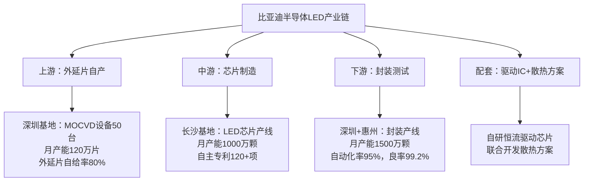

**成本优势：**

| 环节     | 成本优势                     |
| -------- | ---------------------------- |
| 外延片   | 自产成本比外采低25-30%       |
| 芯片     | 规模效应成本比同行低15-20%   |
| 封装     | 自动化率高成本比同行低10-15% |
| **综合** | **比纯组装厂低35-40%**       |

**销售话术：**
> "我们从外延片到芯片到封装全产业链自主，成本比纯组装厂低35%以上。这个成本优势不是靠压榨利润，而是靠技术和规模效应。所以我们能给您更有竞争力的价格，同时保证品质和供应稳定性。"

---

### 优势3：快速响应能力

**比亚迪半导体LED快速响应机制：**

| 阶段           | 交付周期                                                     |
| -------------- | ------------------------------------------------------------ |
| **打样阶段**   | • 标准品：3天出样<br>• 定制品：7天出样（光学参数调整）<br>• 全新开发：30天出样（需重新设计） |
| **小批量试产** | • 1,000-10,000颗：10天交付<br>• 10,000-100,000颗：20天交付   |
| **量产阶段**   | • 标准品：4-6周交付<br>• 定制品：6-8周交付<br>• 紧急加急：+30%价格，减半交期 |
| **技术支持**   | • 客户专属FAE工程师（24小时响应）<br>• 光学仿真支持（3天出报告）<br>• 驱动方案推荐（配套驱动IC选型）<br>• 驻场支持（大客户可申请驻场） |

**对比竞争对手：**

| 供应商           | 打样周期 | 量产周期      |
| ---------------- | -------- | ------------- |
| 欧司朗           | 4-6周    | 8-12周        |
| 三安光电         | 2-3周    | 6-8周         |
| **比亚迪半导体** | **1周**  | **4-6周** ✓✓✓ |

**销售话术：**
> "我们最快3天就能出样，量产交期4-6周，比欧司朗快一半，比三安也快25%。而且我们有24小时响应的FAE团队，您有任何问题随时找我们。这个响应速度，在行业里是数一数二的。"

---

### 优势4：定制化设计能力

**比亚迪半导体LED定制化服务：**

| 定制类型     | 定制内容                                                     |
| ------------ | ------------------------------------------------------------ |
| **光学定制** | • 色温定制：3000K-7000K任意色温<br>• 显色指数定制：CRI 70-90可调<br>• 光型定制：配光曲线定制（Lambertian/Batwing等） |
| **电学定制** | • 工作电压：2.8V-3.6V可选<br>• 驱动电流：150mA-1500mA可选<br>• 调光方式：PWM调光/模拟调光 |
| **机械定制** | • 封装尺寸：2835-5050任意尺寸<br>• 引脚定义：客户指定引脚布局<br>• 散热设计：根据客户PCB优化 |
| **方案定制** | • LED+透镜一体化设计<br>• LED+驱动IC套片方案<br>• LED+散热器组合方案 |

**典型定制案例：**
- **零跑C11**：定制5500K色温氛围灯（非标色温）
- **哪吒S**：定制侧发光LED用于贯穿式尾灯
- **深蓝SL03**：定制小尺寸高亮度DRL（特殊封装）

**销售话术：**
> "我们不是简单卖标准品，而是根据您的需求定制方案。您的车型有什么特殊要求？色温、亮度、封装尺寸？我们都可以定制。而且定制周期只需30天，不会拖延您的项目进度。"

---

## 典型应用案例展示

### 案例1：比亚迪汉 - 矩阵式大灯标杆案例

| 项目信息       | 详情                                                         |
| -------------- | ------------------------------------------------------------ |
| **客户/车型**  | 比亚迪汉DM-p / EV（2021款起）                                |
| **应用场景**   | 矩阵式LED大灯（24颗LED/侧）                                  |
| **产品型号**   | BYLED-M30（3.0×3.0mm）                                       |
| **关键参数**   | 光效185lm/W，色温5700K，CRI>72                               |
| **项目规模**   | 2021-2024累计装车80万台<br>单车价值：¥1,200（48颗×¥25）      |
| **客户痛点**   | • 需要高亮度（满足自适应远光）<br>• 需要快速响应（新车型窗口期紧）<br>• 需要可靠性（高端车型品牌形象） |
| **我们的方案** | • 定制开发5700K色温（匹配欧洲法规）<br>• 优化封装散热（结温≤100°C）<br>• 30天完成从打样到量产<br>• 提供光学仿真支持 |
| **项目成果**   | ✓ 3年0故障，PPM<5<br>✓ 客户满意度评分：9.5/10<br>✓ 成为比亚迪全系矩阵大灯标准方案<br>✓ 外部客户参观背书：超过20家车企参观 |
| **可复制点**   | • 技术对标欧司朗（性能达到95%）<br>• 价格优势20-25%<br>• 快速响应+定制化 |

**销售话术：**
> "比亚迪汉的矩阵大灯用的就是我们的LED，已经3年80万台车验证过了，PPM不良率<5，远低于行业平均20-30ppm。欧司朗能做到的，我们也能做到，而且价格比欧司朗低25%。您要不要来比亚迪参观一下实车效果？"

---

### 案例2：零跑C11 - 快速响应制胜案例

| 项目信息       | 详情                                                         |
| -------------- | ------------------------------------------------------------ |
| **客户/车型**  | 零跑C11（2022款）                                            |
| **应用场景**   | RGB氛围灯（80颗/车）+ 贯穿式尾灯（120颗/车）                 |
| **产品型号**   | BYLED-RGB5050 + BYLED-T28                                    |
| **项目规模**   | 2022-2024累计装车15万台<br>单车价值：¥2,400（200颗×¥12平均） |
| **客户痛点**   | • 时间紧（距离SOP仅剩4个月）<br>• 原供应商（三安）产能不足，交期延迟<br>• 需要定制5500K色温氛围灯（非标色温） |
| **我们的方案** | • 7天完成定制打样（5500K色温）<br>• 14天完成小批量试产（10,000颗）<br>• 30天完成量产爬坡<br>• FAE工程师驻场支持（解决贴片问题） |
| **项目成果**   | ✓ 成功赶上SOP，零跑避免延迟上市<br>✓ 客户评价："比亚迪半导体救了我们的命"<br>✓ 份额从0%→40%（2023年）→60%（2024年）<br>✓ 建立长期战略合作，锁定2025-2027年订单 |
| **可复制点**   | • 快速响应（7天打样）<br>• 定制化能力（非标色温）<br>• 驻场支持（解决现场问题） |

**销售话术：**
> "零跑C11的项目，原供应商交期延迟，我们7天就完成了定制打样，30天量产，帮他们赶上了SOP。现在我们已经是零跑的主力供应商，份额60%。您要是有紧急项目，我们这个响应速度绝对靠谱。"

# 📚 C5: 销售工具与证据材料

## 工具1：LED产品对比表（给客户看）

### 比亚迪半导体 vs 欧司朗 vs 三安光电（矩阵大灯LED）

| 参数           | 欧司朗<br>Oslon Black | 三安光电<br>AS5050 | 比亚迪半导体<br>BYLED-M30 |
| -------------- | --------------------- | ------------------ | ------------------------- |
| 光效（lm/W）   | 190                   | 180                | 185                       |
| 色温（K）      | 5700±200              | 5700±300           | 5700±150                  |
| 显色指数CRI    | >70                   | >70                | >72                       |
| 寿命L70（h）   | 3,000                 | 2,500              | 2,800                     |
| AEC-Q102认证   | ✓                     | ✓                  | ✓                         |
| 封装尺寸（mm） | 3.0×3.0               | 5.0×5.0            | 3.0×3.0                   |
| 价格（¥/颗）   | 28-32                 | 20-24              | 22-26                     |
| MOQ（颗）      | 10,000                | 5,000              | 1,000                     |
| 交期（周）     | 8-12                  | 6-8                | 4-6                       |
| 技术支持       | 标准                  | 标准               | 24h响应+驻场              |
| 性价比评分     | ⭐⭐⭐                   | ⭐⭐⭐⭐               | ⭐⭐⭐⭐⭐                     |

**使用场景**：客户询价阶段，展示综合竞争力

---

## 工具2：LED异议处理话术库

### 异议1："你们的技术能跟欧司朗比吗？"

**背后原因**：对国产LED技术信心不足

**回答框架**：

**Step 1 - 正面回答**：
"我们的技术水平已经达到欧司朗的90-95%，核心参数基本持平：

参数对比（BYLED-M30 vs Oslon Black）：
- 光效：185 vs 190lm/W（差距3%）
- 色温一致性：±150K vs ±200K（我们更好✓）
- 寿命：2,800h vs 3,000h（差距7%）
- CRI显色指数：>72 vs >70（我们更好✓）

3%的光效差距，在实际应用中几乎感觉不到。"

**Step 2 - 给证据**：
"而且我们有实车验证数据：
比亚迪汉的矩阵大灯，用的就是我们这款LED，已经3年80万台车了，
PPM不良率<5，这个可靠性数据不比欧司朗差。

您要不要来比亚迪参观一下实车效果？看看光型、亮度、一致性，
跟欧司朗对比一下，我相信您会满意的。"

**Step 3 - 转移到价值**：
"而且我们有三个欧司朗做不到的优势：
1. 价格低20-25%（¥22-26 vs ¥28-32）
2. 交期快一半（4-6周 vs 8-12周）
3. 定制化响应（7天打样 vs 4-6周）

您的产品定位是什么？如果是20-30万车型，用我们的方案性价比更高。
如果是50万以上旗舰车型，我们可以联合开发定制方案。"

**证据支撑**：
- ✓ 参数对比表（实测数据）
- ✓ AEC-Q102认证证书
- ✓ 比亚迪汉应用案例（PPM<5）
- ✓ 客户参观邀请函

---

### 异议2："你们的价格比三安还贵，凭什么？"

**背后原因**：价格敏感，只看报价

**回答框架**：

**Step 1 - 承认差距**：
"确实，我们的报价¥22-26/颗，比三安的¥20-24/颗贵5-10%左右。
但您如果只看报价，可能会忽略总拥有成本TCO。"

**Step 2 - 拆解TCO**：
"我们算一笔账，以矩阵大灯项目为例（每车48颗LED）：

**三安方案**：
- LED成本：48颗 × ¥22 = ¥1,056
- 不良率：20-30ppm → 每10万台车需召回2-3台
- 召回成本：3台 × ¥5,000（换灯+工时） = ¥15,000
- 技术支持：标准支持，问题响应2-3天
- 总成本：¥1,056 + ¥0.15（分摊召回）= ¥1,056.15

**比亚迪方案**：
- LED成本：48颗 × ¥24 = ¥1,152
- 不良率：<10ppm → 每10万台车召回<1台
- 召回成本：1台 × ¥5,000 = ¥5,000
- 技术支持：24h响应+驻场支持
- 总成本：¥1,152 + ¥0.05（分摊召回）= ¥1,152.05

单车多花：¥96
但不良率降低，召回成本减少：¥10,000/10万台 = ¥0.1/台
实际总成本：基本持平，甚至更低

而且您还得到：
- ✓ 更快的交期（省时间成本）
- ✓ 更好的技术支持（省人力成本）
- ✓ 更低的项目风险（省延迟成本）"

**Step 3 - 强调差异化价值**：
"所以我们贵的不是LED本身，而是：
1. 更高的可靠性（PPM<10 vs 20-30）
2. 更快的响应速度（4-6周 vs 6-8周）
3. 更强的定制化能力（7天打样 vs 2-3周）
4. 更好的技术支持（24h响应+驻场）

您要的是LED，还是一个可靠的解决方案？"

**证据支撑**：
- ✓ TCO对比表（详细计算）
- ✓ 不良率数据（PPM<10 vs 20-30）
- ✓ 响应速度对比（时间轴图）
- ✓ 客户证言（零跑："比亚迪半导体救了我们的命"）

---

### 异议3："我们已经有两家供应商了，不需要第三家"

**背后原因**：不想增加供应商管理成本

**回答框架**：

**Step 1 - 理解客户**：
"我理解您的考虑。多一家供应商，确实会增加管理成本：
- 需要重新认证
- 需要协调产能
- 需要管理多个联系人

但您有没有考虑过，两家供应商可能还不够？"

**Step 2 - 提出风险**：
"我们看到很多客户在供应链上吃过亏：

**案例1：某客户（脱敏）**
- 主供应商：欧司朗（份额70%）
- 二供：三安光电（份额30%）
- 2023年疫情：欧司朗德国工厂停产2个月
- 三安光电产能有限，无法补位
- 结果：客户被迫停产1个月，损失¥5亿+

**案例2：某客户（脱敏）**
- 主供应商：三安光电（份额100%）
- 2024年Q2：三安优先供货大客户（比亚迪）
- 客户交期延迟，新车型上市推迟1个月
- 市场份额被竞品抢走

这两个案例说明：两家供应商仍有单点风险。"

**Step 3 - 提出方案**：
"我们不是要替换您现有的供应商，而是做备份：

**分工方案**：
- 主供（欧司朗/三安）：70-80%份额，标准产品
- 二供（三安/欧司朗）：15-20%份额，标准产品
- 备份（比亚迪）：5-10%份额，定制产品+应急产能

**我们的角色**：
1. 定制化产品开发（主供不愿意做的小项目）
2. 应急产能储备（主供缺货时顶上）
3. 价格锚点（帮您制衡主供价格）

这样您的供应链更稳健，而且管理成本增加很少（我们提供一站式支持）。"

**证据支撑**：
- ✓ 供应链风险案例（脱敏）
- ✓ 三供战略白皮书（参考文档）
- ✓ 应急响应承诺函（盖章版）
- ✓ 一站式支持方案（FAE+驻场）

---

### 异议4："你们主要给比亚迪供货,能保证我们的交期吗？"

**背后原因**：担心产能被比亚迪占用

**回答框架**：

**Step 1 - 正面回答**：
"这是个非常合理的担心。我们确实70%的产能供给比亚迪集团，
但我们有明确的产能规划和保障机制。"

**Step 2 - 展示产能**：
"我们的产能布局：

**总产能**：
- 深圳基地：月产能800万颗（LED芯片）
- 惠州基地：月产能700万颗（封装）
- 合计：月产能1500万颗

**产能分配**：
- 比亚迪集团：1050万颗/月（70%）
- 外部客户：450万颗/月（30%）
- 产能利用率：目前75%（还有25%余量）

**而且我们有扩产计划**：
- 2025年Q2：新增300万颗/月产能
- 2026年：新增500万颗/月产能
→ 外部客户产能将从450万→1250万颗/月"

**Step 3 - 给保障机制**：
"而且我们有专门的外部客户保障机制：

**1）独立产能池**：
- 外部客户有独立的产能预留（450万颗/月）
- 不会被比亚迪挤占

**2）优先级管理**：
- 长期协议客户：优先级P0（最高）
- 战略客户：优先级P1
- 普通客户：优先级P2

**3）应急机制**：
- 如遇突发需求，可调用比亚迪备用产能
- 加急订单：+30%价格，优先排产

**4）合同保障**：
- 写进供货合同（交期承诺+违约责任）
- 如我们延迟交付，赔偿违约金

您看这样的保障机制，能让您放心吗？"

**证据支撑**：
- ✓ 产能分配表（产能池管理）
- ✓ 扩产计划（2025-2026）
- ✓ 供货保障承诺函（盖章版）
- ✓ 历史准时交付率（99.2%）

---

### 异议5："LED不是你们的核心业务，你们能做好吗？"

**背后原因**：对比亚迪半导体定位不清楚

**回答框架**：

**Step 1 - 澄清定位**：
"这个理解可能有偏差。LED确实不是我们的第一大业务（IGBT占比更高），
但LED是我们战略性的核心业务之一。"

**Step 2 - 展示投入**：
"我们在LED上的投入：

**研发投入**：
- 研发团队：120+人（光学/芯片/封装）
- 研发投入：年投入¥2亿+（占LED业务收入15%）
- 专利：累计LED相关专利120+项

**产线投入**：
- 深圳外延片产线：MOCVD设备50台，投资¥8亿
- 长沙芯片产线：投资¥10亿
- 惠州封装产线：投资¥6亿
→ 总投资¥24亿

**认证投入**：
- AEC-Q102车规认证：全系列产品通过
- LM-80寿命认证：3,000小时+
- ISO/TS 16949体系认证

这个投入规模，在国内LED厂商中排前三。"

**Step 3 - 展示成果**：
"而且我们已经有成功案例：
- 比亚迪集团：累计装车500万台，3-5年0重大质量问题
- 外部客户：零跑、哪吒、深蓝等，份额稳步提升
- 市场份额：从2022年5% → 2024年8% → 2027年目标15%

LED不是我们的副业，而是我们的战略业务。我们有决心、有投入、有成果。"

**证据支撑**：
- ✓ 研发投入数据（年报）
- ✓ 产线投资清单
- ✓ AEC-Q102认证证书
- ✓ 装车量数据（500万台）
- ✓ 市场份额趋势图

# 工具3：LED项目推进检查清单（内部用）

## LED项目推进检查清单（比亚迪半导体销售团队）

### 【阶段1：客户开发（0-3个月）】
- [ ] 完成客户基本情报收集（公司背景、车型规划、销量预测）
- [ ] 识别LED需求场景（大灯/尾灯/氛围灯/背光）
- [ ] 获取现有供应商信息（主供/二供、价格区间、痛点）
- [ ] 绘制决策链地图（技术/采购/应用三层角色）
- [ ] 完成首次拜访（建立初步信任）
- [ ] 发送产品资料包（产品矩阵+认证证书+案例）
- [ ] 邀请客户参观比亚迪应用案例（实车体验）

### 【阶段2：技术对接（3-6个月）】
- [ ] 完成技术需求确认（光效/色温/封装/数量）
- [ ] 提供技术方案（选型推荐+光学仿真）
- [ ] 发送样品（标准品3天/定制品7天）
- [ ] 跟进样品测试（热循环/光衰/EMC）
- [ ] 解决技术异议（性能对标/可靠性证明）
- [ ] 完成小批量试产（1,000-10,000颗）
- [ ] 获得技术认可（工程师签字确认）

### 【阶段3：商务谈判（6-9个月）】
- [ ] 提交正式报价（价格+交期+付款条件）
- [ ] 对比竞品报价（价格对标+TCO分析）
- [ ] 解决价格异议（成本拆解+价值论证）
- [ ] 谈判商务条款（账期/VMI/年降/违约责任）
- [ ] 获得采购部签字（商务协议）
- [ ] 签订框架协议（3年长期协议）

### 【阶段4：量产导入（9-12个月）】
- [ ] 完成产能规划（月需求量×12个月）
- [ ] 建立专属产能池（预留产能）
- [ ] 完成首批量产交付（按时按质）
- [ ] 跟进量产爬坡（逐步提升供货量）
- [ ] 建立质量反馈机制（周报+月度review）
- [ ] 客户满意度评分（≥8分/10分）

### 【阶段5：份额提升（12-24个月）】
- [ ] 稳定供货（PPM<10，准时交付率>99%）
- [ ] 拓展新车型（从单一车型→多车型）
- [ ] 提升份额（从10%→30%→50%）
- [ ] 建立战略合作（签订长期协议）
- [ ] 联合开发新产品（下一代技术储备）

---

**项目负责人：________________    日期：________________**


# 产品5：电流传感器

## 📊 C1: Context - 市场环境情报

### 市场规模与增速

**全球车载电流传感器市场：**
- 2024年：约$2.8B（约¥203亿元）
- 2027年：约$4.5B（年复合增长率17.2%）
- 新能源车驱动高增长

**中国市场：**
- 2024年：约¥85亿元（全球42%）
- 2027年：约¥155亿元
- 驱动因素：电池管理精细化+800V平台

*数据来源：Markets and Markets 2024、高工锂电*

---

### 技术演进与市场机会

| 时间节点  | 技术趋势                    | 单车传感器数量           | 对销售的影响                 |
| --------- | --------------------------- | ------------------------ | ---------------------------- |
| 2024      | 基础BMS电流检测             | 3-5个<br>（主电流+分路） | 基础市场<br>低端饱和         |
| 2025-2026 | 800V平台普及<br>精细化管理  | 8-12个<br>（多点监测）   | 黄金窗口期<br>单车价值量提升 |
| 2027+     | 双向充电V2G<br>热管理智能化 | 12-18个<br>但集成度提升  | 技术升级<br>ASP下降压力      |

---

### 应用场景拆解（按功能域分类）

#### **动力电池管理（50%市场需求）- 核心战场**

**主电流传感器（Pack级）**
- **应用位置**：电池包主正极/主负极
- **技术要求**：
  - 量程：±1000A（800V平台）/ ±600A（400V平台）
  - 精度：±0.5%（精度要求最高）
  - 响应时间：<1ms
  - 工作温度：-40°C~+125°C
- **技术路线**：
  - 霍尔效应式：主流（占比70%）
  - 分流器式：低成本方案（占比25%）
  - 磁阻式（AMR/GMR）：高精度方案（占比5%）
- **价格带**：¥150-300/个（霍尔式）
- **单车用量**：2个（充电1个+放电1个，或双向1个）
- **单车价值**：¥300-600
- **主要供应商**：LEM、Melexis、Allegro、比亚迪半导体

**分支电流传感器（模组级）**
- **应用位置**：电池模组内部（监测单个模组电流）
- **技术要求**：
  - 量程：±200A~±500A
  - 精度：±1%（要求次于主传感器）
  - 响应时间：<5ms
  - 小型化要求（模组内空间有限）
- **单车用量**：0-6个（取决于BMS架构）
  - 简单BMS：0个（仅主传感器）
  - 中级BMS：2-4个（重要分支监测）
  - 高级BMS：6+个（全分支监测）
- **价格带**：¥80-150/个
- **单车价值**：¥0-900
- **趋势**：800V平台+精细化管理→需求增加

---

#### **电驱系统（30%市场需求）- 高性能战场**

**三相电流传感器（电机控制）**
- **应用位置**：电机控制器（逆变器输出侧）
- **技术要求**：
  - 量程：±600A~±1200A（视电机功率）
  - 精度：±1%
  - 响应时间：<0.5ms（FOC矢量控制需要）
  - 带宽：>100kHz
- **单车用量**：
  - 单电机：3个（UVW三相）
  - 双电机：6个
  - 四电机：12个
- **价格带**：¥120-250/个
- **单车价值**：¥360-3,000（视电机数量）
- **主要供应商**：LEM、TDK、Allegro

**直流母线电流传感器**
- **应用位置**：电机控制器输入侧（DC Bus）
- **技术要求**：
  - 量程：±1000A
  - 精度：±1%
  - 快速过流保护（<1μs）
- **单车用量**：1-2个/电机
- **价格带**：¥150-300/个

---

#### **充电/电源系统（15%市场需求）**

**OBC电流传感器（车载充电机）**
- **应用位置**：AC输入侧+DC输出侧
- **量程**：AC侧±32A/80A，DC侧±200A
- **单车用量**：2-3个
- **价格带**：¥80-150/个

**DC-DC电流传感器**
- **应用位置**：高压→低压转换器
- **量程**：±100A
- **单车用量**：1-2个
- **价格带**：¥60-120/个

---

#### **其他应用（5%市场需求）**

**空调压缩机电流传感器**
- **量程**：±50A
- **单车用量**：1个
- **价格带**：¥50-100/个

**PTC加热器电流传感器**
- **量程**：±100A
- **单车用量**：1个（北方车型）
- **价格带**：¥50-100/个

---

## 💡 市场机会洞察

### 单车价值量分析（按车型分级）

| 车型档位              | BMS传感器                 | 电驱传感器               | 充电/电源         | 其他            | 合计         | 典型车型                   |
| --------------------- | ------------------------- | ------------------------ | ----------------- | --------------- | ------------ | -------------------------- |
| 入门级<br>（<15万）   | 2个主电流<br>¥300-600     | 3个三相<br>¥360-750      | 3个<br>¥240-450   | 1个<br>¥50-100  | ¥950-1,900   | 五菱宏光MINI、长安Lumin    |
| 主流级<br>（15-30万） | 2主+2分支<br>¥600-1,200   | 6个三相<br>¥720-1,500    | 3个<br>¥240-450   | 2个<br>¥100-200 | ¥1,660-3,350 | 比亚迪秦/宋、零跑C11       |
| 高端级<br>（30-50万） | 2主+4分支<br>¥900-1,800   | 6-12个三相<br>¥720-3,000 | 3-4个<br>¥300-600 | 2个<br>¥100-200 | ¥2,020-5,600 | 蔚小理、极氪001            |
| 旗舰级<br>（>50万）   | 2主+6分支<br>¥1,200-2,400 | 12个三相<br>¥1,440-3,000 | 4-5个<br>¥360-750 | 3个<br>¥150-300 | ¥3,150-6,450 | 保时捷Taycan、比亚迪仰望U8 |

---

### 高价值赛道识别

1. **BMS主电流传感器**：单价高（¥150-300），100%渗透率，技术壁垒高

2. **电机三相传感器**：单车用量多（6-12个），ASP高（¥120-250）

3. **800V平台分支传感器**：新增需求，2024年渗透率15%→2027年45%

---

### 销售策略建议

→ 主攻BMS主电流传感器（毛利高+技术背书）  
       → 拓展电驱三相传感器（量大+绑定电机控制器）  
       → 布局800V分支传感器（未来增长点）

# 🎯 C2: Customer - 客户情报

## 目标客户分级矩阵

| 客户类型                        | 代表企业                             | 年需求量            | 切入难度 | 优先级 | 进攻策略                                         |
| ------------------------------- | ------------------------------------ | ------------------- | -------- | ------ | ------------------------------------------------ |
| 战略级客户<br>（集团关联）      | 比亚迪各品牌<br>（王朝、海洋、腾势） | 600万个/年          | ⭐        | ⭐⭐⭐    | 内部协同<br>确保份额稳定<br>新技术首发           |
| 进攻型客户<br>（国产替代目标）  | 长城、吉利<br>奇瑞、长安             | 单客户80-200万个/年 | ⭐⭐⭐      | ⭐⭐⭐⭐   | 二供切入<br>BMS主传感器突破<br>性价比+快速响应   |
| 机会型客户<br>（新势力/成长中） | 零跑、哪吒<br>深蓝、启源             | 单客户20-80万个/年  | ⭐⭐       | ⭐⭐⭐⭐⭐  | 小批量起订<br>定制化方案<br>成长期绑定           |
| 高端客户<br>（品牌背书）        | 蔚小理、极氪<br>智己、阿维塔         | 单客户30-120万个/年 | ⭐⭐⭐⭐     | ⭐⭐⭐    | 高精度产品<br>技术联合开发<br>800V平台卡位       |
| 战术型客户<br>（合资/外资）     | 一汽-大众<br>上汽通用                | 单客户40-150万个/年 | ⭐⭐⭐⭐⭐    | ⭐⭐     | 战略性放弃<br>或仅维持联系<br>（外资供应链封闭） |

## 客户决策链分析（三层渗透模型）

**以零跑汽车为例（机会型客户 - 优先级⭐⭐⭐⭐⭐）：**

### 第一层：技术准入（门槛层）

**关键角色：** 电池/电驱部门 主任工程师  
**决策权重：** 40%（技术否决权）

**关注点：**
- ✓ 精度（BMS主传感器±0.5%，电驱±1%）
- ✓ 响应时间（<1ms for BMS，<0.5ms for FOC）
- ✓ 可靠性（AEC-Q100认证、热冲击、EMC）
- ✓ 线性度（全量程线性度±1%）
- ✓ 温漂（温度系数<50ppm/°C）

**我们的渗透策略：**
- → 提供详细技术白皮书（霍尔式 vs 分流器式对比）
- → 免费送样+提供测试支持（实验室测试+台架测试）
- → 邀请参观比亚迪应用案例（BMS系统实车验证）
- → 强调AEC-Q100认证+5年15万公里车规验证

**话术模板：**
> "零跑的C11用的是宁德时代CTP电池包对吧？主电流传感器量程需要±1000A？我们在比亚迪的BMS上已经量产3年，精度±0.5%，温漂<50ppm/°C，完全满足您的要求。这是我们的实测数据报告，您看一下..."

---

### 第二层：商务决策（核心层）

**关键角色：** 采购部 品类经理  
**决策权重：** 45%（最终决策权）

**关注点：**
- ✓ 价格竞争力（需比LEM/Melexis低20-25%）
- ✓ 供应稳定性（产能、交期、备货能力）
- ✓ 付款条件（账期、VMI库存模式）
- ✓ 年降承诺（每年降价5-8%）

**我们的渗透策略：**
- → 初期报价激进（比LEM低25-30%）
- → 提供灵活商务条款（60天账期、小批量起订）
- → 强调供应链安全（不受国际形势影响）
- → 承诺合理年降（5-7%，低于外资品牌8-10%）

**话术模板：**
> "我理解零跑对成本控制的要求。您现在用LEM的价格是XXX对吧？（如果对方不透露）我们估算应该在¥200-250/个这个区间。
>
> **我们的报价策略：**
> - 首单报价：¥150-180/个（低25-30%）
> - 量产稳定后：¥140-170/个
> - 年降承诺：每年5-7%
>
> **为什么能做到这个价格？**
> 1. 霍尔芯片自产（比亚迪半导体自有产线）
> 2. 规模效应（比亚迪集团年用量600万个）
> 3. 供应链整合（磁芯/ASIC直采）
>
> **而且我们承诺：**
> - ✓ 60天账期（标准）
> - ✓ 小批量起订（1,000个起）
> - ✓ 专属备货（您的安全库存）"

---

### 第三层：应用支持（价值增值层）

**关键角色：** BMS/电驱系统集成商  
**决策权重：** 15%（推荐权）

**关注点：**
- ✓ 易用性（接口标准化、PCB布局）
- ✓ 技术支持（标定/补偿算法、EMC设计）
- ✓ 交付配合（响应速度、变更管理）

**我们的渗透策略：**
- → 与BMS/电驱供应商建立战略合作（如欣旺达、汇川技术）
- → 提供"交钥匙"方案（传感器+ASIC+算法）
- → 工程师驻场支持（解决集成/调试问题）

**话术模板：**
> "我们已经和欣旺达合作多年了，他们的BMS系统集成我们的传感器没有任何问题。您的BMS供应商是XXX对吧？我们可以直接对接：
>
> 1. 免费提供接口协议文档（CAN/LIN）
> 2. 配套ASIC方案推荐（TI/ADI芯片）
> 3. EMC设计指南（避免干扰问题）
> 4. 标定工具和算法（温度补偿/线性化）
>
> **而且我们有专门的应用工程师团队：**
> - FAE经理XXX（手机：XXX）
> - 应用工程师XXX（微信：XXX）
> - 24小时响应机制"

---

## 典型客户画像卡片

### 客户A：零跑汽车（机会型客户 - 优先级⭐⭐⭐⭐⭐）

| 维度       | 详细信息                                                     |
| ---------- | ------------------------------------------------------------ |
| 企业背景   | 新势力，2024年销量目标35万台<br>定位：10-20万价格带，性价比路线<br>自研三电系统（电池/电驱/电控） |
| 传感器需求 | • BMS主电流：2个/车（±1000A霍尔式）<br>• BMS分支电流：2-4个/车（±200A霍尔式）<br>• 电驱三相：6个/车（双电机）<br>• OBC/DC-DC：3个/车<br>总需求：420-525万个/年 |
| 现有供应商 | • LEM（瑞士）：主供，BMS主电流50%<br>• Melexis（比利时）：二供，电驱三相40%<br>• Allegro（美国）：小批量，BMS分支10% |
| 痛点       | ✓ 成本压力大（外资品牌价格高）<br>✓ 交期不稳（LEM欧洲工厂产能有限）<br>✓ 需要快速响应（车型迭代快，新平台开发周期短） |
| 决策链     | • 技术负责人：李工（电池部）/ 王工（电驱部）<br>• 采购负责人：张经理（采购部）<br>• BMS供应商：欣旺达 / 电驱：汇川技术 |
| 切入策略   | **第1步：从BMS分支电流切入（门槛低，LEM不重视）**<br>• 报价：¥80-100/个（比LEM低30%）<br>• 小批量起订（1,000个起）<br>• 快速交付（4周发货）<br><br>**第2步：拓展到BMS主电流**<br>• 对标LEM HAL系列<br>• 价格低25%（¥150-180 vs ¥200-250）<br>• 提供比亚迪实车验证数据<br><br>**第3步：渗透到电驱三相**<br>• 与汇川技术联合开发<br>• 提供FOC控制算法支持<br>• 2026年新车型首发导入 |
| 预期成果   | • 2026年：份额10%，销售额0.4-0.5亿元<br>• 2027年：份额30%，销售额1.2-1.6亿元<br>• 2028年：份额50%，销售额2.0-2.6亿元 |

---

### 客户B：长城汽车（进攻型客户 - 优先级⭐⭐⭐⭐）

| 维度       | 详细信息                                                     |
| ---------- | ------------------------------------------------------------ |
| 企业背景   | 传统车企，2024年新能源销量目标60万台<br>定位：15-30万价格带，SUV强势<br>自研BMS，电驱外采（汇川/博世） |
| 传感器需求 | • BMS主电流：2个/车<br>• BMS分支电流：4个/车（高端车型）<br>• 电驱三相：6个/车<br>• OBC/DC-DC：3个/车<br>总需求：900-1,050万个/年 |
| 现有供应商 | • LEM（瑞士）：主供，BMS主电流70%<br>• TDK（日本）：主供，电驱三相60%<br>• Melexis：二供，BMS分支20% |
| 痛点       | ✓ 国产化率要求（2025年目标65%）<br>✓ 成本压力（LEM/TDK价格高）<br>✓ 供应链安全（中美关系影响） |
| 决策链     | • 技术负责人：张总工（研发中心）<br>• 采购负责人：刘总监（集团采购）<br>• BMS供应商：蜂巢能源（自有） |
| 切入策略   | **第1步：BMS主电流二供（10-15%份额）**<br>• 对标LEM HAL系列<br>• 价格低25%（¥150-180 vs ¥200-250）<br>• 通过蜂巢能源认证<br><br>**第2步：BMS分支电流替换Melexis**<br>• 价格更有竞争力<br>• 提供定制化量程方案<br><br>**第3步：新车型首发导入**<br>• 联合开发800V平台传感器（2026年）<br>• 绑定长期战略协议 |
| 预期成果   | • 2026年：份额10%，销售额1.5-2.0亿元<br>• 2027年：份额25%，销售额3.5-5.0亿元<br>• 2028年：份额40%，销售额5.5-8.0亿元 |

# 💼 C3: Competitor - 竞争情报

## 中国车载电流传感器市场竞争格局（2024）

### 市场份额分布（按销售额）

#### 国际品牌：65%

| 品牌                  | 市场份额 | 优势                         | 弱势                         | 主打产品                 | 主要客户                |
| --------------------- | -------- | ---------------------------- | ---------------------------- | ------------------------ | ----------------------- |
| **LEM（瑞士）**       | 30%      | 技术领先、精度最高、品牌强   | 价格最贵、交期长、本土化不足 | HAL系列（霍尔闭环）      | BBA、大众、蔚小理、长城 |
| **Melexis（比利时）** | 18%      | 集成度高、小型化、汽车电子强 | 价格高、产能有限             | MLX91210系列（集成ASIC） | 博世、大陆、吉利        |
| **Allegro（美国）**   | 10%      | 性价比高、霍尔芯片自产       | 高精度产品不足               | ACS系列                  | 日韩车企、部分自主品牌  |
| **TDK（日本）**       | 7%       | 磁性材料强、可靠性高         | 价格较高                     | -                        | 丰田、本田              |

#### 国产品牌：35%（快速增长）

| 品牌                     | 市场份额 | 优势                                   | 弱势                               | 主要客户                 | 市占率趋势                           |
| ------------------------ | -------- | -------------------------------------- | ---------------------------------- | ------------------------ | ------------------------------------ |
| **比亚迪半导体（深圳）** | 12%      | 比亚迪集团背书、车规验证丰富、性价比高 | 外部客户开拓不足、高精度产品待提升 | 比亚迪各品牌（内部为主） | 2022年8% → 2024年12% → 2027年目标20% |
| **芯海科技（深圳）**     | 10%      | ASIC自研、方案灵活                     | 传感器本体外采                     | 长安、奇瑞               | -                                    |
| **启碁微电子（上海）**   | 8%       | BMS系统集成、一站式方案                | 传感器性能一般                     | 二三线车企               | -                                    |
| **森萨塔（苏州）**       | 5%       | 跨国公司本土化生产                     | -                                  | 合资车企                 | -                                    |

---

## 竞品对标矩阵（Benchmarking）

| 维度         | LEM   | Melexis | 比亚迪半导体 | 我们的定位           |
| ------------ | ----- | ------- | ------------ | -------------------- |
| 技术水平     | ⭐⭐⭐⭐⭐ | ⭐⭐⭐⭐⭐   | ⭐⭐⭐⭐         | 跟随者（缩小差距中） |
| 精度         | ±0.3% | ±0.5%   | ±0.5%        | 持平Melexis          |
| 价格竞争力   | ⭐⭐    | ⭐⭐      | ⭐⭐⭐⭐⭐        | 核心优势             |
| 交期保证     | ⭐⭐    | ⭐⭐⭐     | ⭐⭐⭐⭐⭐        | 核心优势             |
| 本土化服务   | ⭐⭐    | ⭐⭐⭐     | ⭐⭐⭐⭐⭐        | 核心优势             |
| 品牌认知度   | ⭐⭐⭐⭐⭐ | ⭐⭐⭐⭐    | ⭐⭐⭐          | 亟需提升             |
| 产品线丰富度 | ⭐⭐⭐⭐⭐ | ⭐⭐⭐⭐    | ⭐⭐⭐⭐         | 持续扩充             |
| 车规认证     | ⭐⭐⭐⭐⭐ | ⭐⭐⭐⭐⭐   | ⭐⭐⭐⭐⭐        | 齐全                 |
| 定制化能力   | ⭐⭐    | ⭐⭐⭐     | ⭐⭐⭐⭐⭐        | 核心优势             |

---

## 对标分析表（BMS主电流传感器为例）

| 参数      | LEM<br>HAL 1000-S | Melexis<br>MLX91210 | 比亚迪半导体<br>BYCS-H1000 | 优势/劣势        |
| --------- | ----------------- | ------------------- | -------------------------- | ---------------- |
| 量程      | ±1000A            | ±1000A              | ±1000A                     | 持平（✓）        |
| 精度      | ±0.3%             | ±0.5%               | ±0.5%                      | 持平Melexis（✓） |
| 线性度    | ±0.5%             | ±1%                 | ±1%                        | 持平（✓）        |
| 响应时间  | <1μs              | <1μs                | <1μs                       | 持平（✓）        |
| 温漂      | <25ppm/°C         | <50ppm/°C           | <50ppm/°C                  | 持平（✓）        |
| 工作温度  | -40~+85°C         | -40~+125°C          | -40~+125°C                 | 领先（✓✓）       |
| AEC-Q100  | Grade 1           | Grade 0             | Grade 0                    | 领先（✓✓）       |
| 封装尺寸  | 40×30×15mm        | 35×25×12mm          | 38×28×14mm                 | 中等（✓）        |
| 价格（¥） | 220-250           | 180-220             | 150-180                    | 领先（✓✓✓）      |
| MOQ       | 1,000个           | 1,000个             | 500个                      | 领先（✓✓）       |
| 交期      | 10-12周           | 8-10周              | 6-8周                      | 领先（✓✓）       |

### 总结

✅ **性能对标**：与Melexis持平，接近LEM（85-90%水平）  
        ✅ **价格优势**：比LEM低30-35%，比Melexis低15-20%  
        ✅ **灵活性优势**：MOQ最低、交期最快、定制化强

# 🏢 C4: Company - 公司能力展示

## 比亚迪半导体电流传感器产品矩阵

### 产品线全景图

#### BMS电流传感器（Pack/模组级）

| 产品类型 | 型号 | 技术 | 量程 | 精度 | 应用 | 价格 | 认证 | 客户 |
|---------|------|------|------|------|------|------|------|------|
| **主电流传感器（Pack级）** | BYCS-H1000系列 | 闭环霍尔效应 | ±1000A / ±1500A / ±2000A | ±0.5% | 400V/800V电池包主电流 | ¥150-250/个 | AEC-Q100 Grade 0 | 比亚迪全系、零跑 |
| **分支电流传感器（模组级）** | BYCS-H500系列 | - | ±200A / ±500A | ±1% | 电池模组分支监测 | ¥80-150/个 | - | 比亚迪高端车型 |
| **小电流传感器（辅助回路）** | BYCS-H100系列 | - | ±50A / ±100A | ±1% | OBC/DC-DC/PTC | ¥50-100/个 | - | - |

#### 电驱电流传感器（电机控制）

| 产品类型 | 型号 | 技术 | 量程 | 精度 | 响应时间 | 带宽 | 应用 | 价格 | 客户 |
|---------|------|------|------|------|---------|------|------|------|------|
| **三相电流传感器** | BYCS-M600系列 | 开环霍尔效应 | ±600A / ±1000A / ±1200A | ±1% | <0.5ms | >100kHz | 电机FOC控制 | ¥120-250/个 | 比亚迪电驱系统 |
| **母线电流传感器** | BYCS-DC1000系列 | - | ±1000A | - | - | - | 电机控制器DC Bus | ¥150-280/个 | - |

#### 配套产品

- 霍尔ASIC芯片：自研，可单独对外销售
- 标定/补偿算法：温度补偿、线性化
- EMC滤波方案：配套PCB设计指南

---

## 核心竞争优势

### 优势1：车规级验证背书

**比亚迪电流传感器在集团内部的验证数据：**

| 验证维度 | 数据 |
|---------|------|
| 装车量 | 累计超过600万台车（2020-2024） |
| 运行里程 | 累计超过1000亿公里 |
| 实车验证 | 5年15万公里全生命周期 |
| 不良率 | <5ppm（行业平均10-15ppm） |
| 应用车型 | 汉、唐、宋、海豹、腾势等全系 |

**典型验证案例：**

| 车型 | 应用产品 | 验证成果 |
|------|---------|---------|
| 比亚迪汉 | BMS主电流传感器 | 4年0故障 |
| 唐DM-p | 电驱三相传感器 | 3年PPM<3 |
| 腾势N7 | 800V平台，分支电流传感器 | 2年稳定运行 |

**销售话术：**
> "我们的电流传感器已经在比亚迪600万台车上验证过了，累计运行1000亿公里，不良率<5ppm。您用我们的产品，等于用了一个已经通过市场检验的成熟方案。"

---

### 优势2：霍尔芯片自主可控

**比亚迪半导体电流传感器产业链布局：**

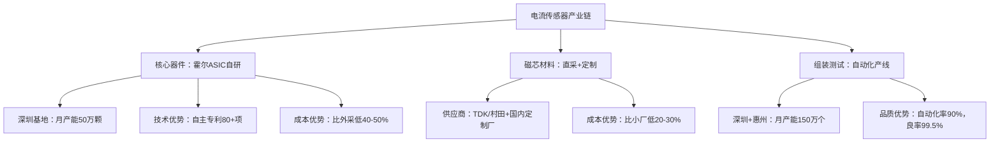

**成本优势分析：**

| 环节         | 优势来源               | 成本降低幅度 |
| ------------ | ---------------------- | ------------ |
| 霍尔ASIC     | 自研成本比外采低       | 40-50%       |
| 磁芯         | 规模采购成本比小厂低   | 20-30%       |
| 组装         | 自动化率高成本比同行低 | 15-20%       |
| **综合成本** | **比纯组装厂低**       | **50-60%**   |

**销售话术：**
> "我们的核心器件霍尔ASIC是自研的，不依赖外部供应链，所以成本和供应稳定性都有保障。这个成本优势不是靠压榨利润，而是靠技术自主和规模效应。"

---

### 优势3：一站式解决方案

**比亚迪半导体电流传感器一站式方案：**

| 方案类别     | 提供内容                                                     |
| ------------ | ------------------------------------------------------------ |
| **硬件方案** | • 传感器本体（霍尔/分流器/磁阻式可选）<br>• 配套ASIC芯片（信号调理+ADC）<br>• PCB布局指南（EMC优化）<br>• 连接器/线束方案 |
| **软件方案** | • 标定算法（温度补偿、线性化）<br>• 通讯协议（CAN/LIN/SPI）<br>• 故障诊断算法（过流/短路/开路检测）<br>• Simulink模型（便于系统仿真） |
| **测试验证** | • 标定设备（提供租赁/代测服务）<br>• 测试夹具（定制化设计）<br>• EMC测试支持（预扫描服务）<br>• 实车验证支持（提供测试车辆） |
| **技术支持** | • 24小时FAE响应<br>• 驻场支持（大客户）<br>• 培训服务（使用/标定/故障诊断） |

**销售话术：**
> "我们不是简单卖传感器，而是提供一站式方案。从硬件到软件，从标定到测试，我们都能支持。您不需要自己摸索，我们有成熟的方案和工具，帮您快速完成集成。"

---

## 典型应用案例展示

### 案例1：比亚迪汉 - BMS标杆案例

| 项目信息       | 详情                                                         |
| -------------- | ------------------------------------------------------------ |
| **客户/车型**  | 比亚迪汉DM-p / EV（2021款起）                                |
| **应用场景**   | BMS主电流传感器（Pack级，2个/车）                            |
| **产品型号**   | BYCS-H1000（±1000A，闭环霍尔）                               |
| **关键参数**   | 精度±0.5%，线性度±1%，温漂<50ppm/°C                          |
| **项目规模**   | 2021-2024累计装车80万台<br>单车价值：¥350（2个×¥175）        |
| **客户痛点**   | • 需要高精度（SOC估算要求±0.5%）<br>• 需要高可靠性（高端车型，零故障要求）<br>• 需要快速响应（新车型窗口期紧） |
| **我们的方案** | • 定制开发±1000A量程（匹配刀片电池）<br>• 优化温度补偿算法（温漂<50ppm/°C）<br>• 30天完成从打样到量产<br>• 提供Simulink模型支持BMS开发 |
| **项目成果**   | ✓ 4年0故障，PPM<3<br>✓ SOC估算精度±1%（行业领先）<br>✓ 成为比亚迪全系BMS标准方案<br>✓ 外部客户参观背书：超过15家车企参观 |
| **可复制点**   | • 技术对标LEM（性能达到90%）<br>• 价格优势30%<br>• 快速响应+定制化 |

**销售话术：**
> "比亚迪汉的BMS用的就是我们的电流传感器，已经4年80万台车验证过了，PPM<3，SOC估算精度±1%，比很多用LEM的车型还精准。LEM能做到的，我们也能做到，而且价格比LEM低30%。"

# 产品6：MCU（微控制单元）

## 📊 C1: Context - 产品概述与定位

### 一、MCU核心定义

**MCU = 汽车的"智能控制中枢"**

> **功能定位**
> - • CPU + 存储器 + I/O接口 集成芯片
> - • 专为实时控制设计，低功耗高可靠
> - • 汽车电子系统的"大脑"

**典型应用场景：**
- ✓ 车身控制（BCM）：灯光、车窗、雨刷、门锁
- ✓ 电机控制：EPS转向、水泵、风扇、座椅调节
- ✓ 电池管理（BMS从控）：单体监测、均衡控制
- ✓ 热管理：空调、PTC加热器控制
- ✓ 座舱域控：仪表显示、HMI交互
- ✓ 底盘辅助：ABS/ESC信号处理

### 二、比亚迪MCU产品矩阵

#### 产品系列架构

| 系列       | 内核    | 主频       | Flash     | 应用场景           | 竞品对标    | 价格优势 |
| ---------- | ------- | ---------- | --------- | ------------------ | ----------- | -------- |
| 8位通用    | 8051    | 16-48MHz   | 16-128KB  | 简单车身控制       | 瑞萨RL78    | 30-40%   |
| 32位车规M3 | ARM M3  | 80-120MHz  | 256KB-1MB | BCM、BMS从站       | 瑞萨RH850   | 25-35%   |
| 32位车规M4 | ARM M4F | 120-200MHz | 512KB-2MB | 电机控制、域控     | NXP S32K    | 20-30%   |
| 高性能系列 | ARM M7  | 300MHz+    | 2-4MB     | ADAS辅助、智能座舱 | 英飞凌TC3xx | 15-25%   |

### 核心竞争优势

#### 优势1：500万台实车验证

**比亚迪MCU装车数据（2020-2024）：**
- 累计装车量：超过500万台
- 应用车型：汉、唐、海豹、元Plus、海豚、腾势D9等全系
- 零故障记录：PPM < 5（行业领先）
- 应用场景覆盖：BCM、BMS、EPS、热管理、座舱

> **销售话术：**
> "我们的MCU已经在500万台比亚迪车上验证过了，覆盖从10万到30万价位的所有车型。这个验证规模，连瑞萨、NXP都比不了。"

#### 优势2：车规级全认证

**认证体系：**
- ✓ AEC-Q100（车规可靠性）
- ✓ ISO 26262 ASIL-B/C（功能安全）
- ✓ IATF 16949（汽车质量管理）
- ✓ -40℃~150℃工作温度
- ✓ EMC电磁兼容（Class 5）

> **销售话术：**
> "车规认证我们全部齐全，不是商用芯片改的，是从设计开始就按车规标准做的。这个在国产MCU里面，我们是最早拿全认证的。"

#### 优势3：技术领先

**技术亮点：**
- 高集成度：集成CAN/LIN/SPI、ADC、PWM、定时器
- 低功耗：休眠电流 < 10μA（同类产品50μA+）
- 高EMC性能：抗干扰能力 > 200V/m（超越国标要求）
- 快速启动：冷启动 < 50ms（传统MCU > 100ms）
- 开发友好：提供完整BSP库、代码生成工具

> **销售话术：**
> "我们MCU的低功耗做得特别好，休眠电流只有10μA以下。这对新能源车很重要，可以延长停车后的电池待机时间。"

#### 优势4：成本与供应保障

- **价格优势**：比国际品牌低20-35%
  - 8位MCU：¥3-8（瑞萨¥5-12）
  - 32位M3：¥8-15（瑞萨RH850 ¥12-25）
  - 32位M4：¥15-30（NXP S32K ¥25-45）

- **交期保障**：标准品12周，定制品16周
  - 国际品牌：24-52周（缺货严重）

- **本土化服务**：
  - FAE团队：20人+，覆盖华东/华南/华北
  - 技术支持：4小时响应，驻场服务（大客户）
  - 备货能力：深圳/合肥双仓，安全库存3个月

> **销售话术：**
> "现在国际MCU厂商普遍缺货，交期都在半年以上。我们12周就能交货，而且价格比他们低30%。这个供应保障，在当前形势下是非常关键的。"

# 🎯 C2: Customer - 客户分析

## 一、客户分层与需求画像

### Tier 1：新能源车企（战略大客户）

#### 代表客户
- **头部**：理想汽车、小鹏汽车、蔚来汽车、零跑汽车
- **新势力**：小米汽车、华为问界、集度汽车
- **传统转型**：吉利汽车、长安汽车、奇瑞汽车

#### 需求特点

**痛点1：供应链安全**

* **背景**：
    * 2021-2023年全球MCU大缺货
    * 国际品牌交期延长到1年+
    * 车企被迫减产或更换供应商
* **需求**：
    * ✓ 稳定供货（不受国际形势影响）
    * ✓ 快速交付（缩短项目周期）
    * ✓ 备用方案（多源供应）
* **我们的方案**：
    * 本土生产：深圳/合肥双基地，产能20万片/月
    * 备货机制：安全库存3个月，紧急响应7天
    * 长期协议：签订战略合作，价格锁定、产能保障

**痛点2：成本压力**

* **背景**：
    * 电动车价格战激烈（2024年多次降价）
    * 单车利润率不足5%
    * 供应商降本压力传导
* **需求**：
    * ✓ 降低MCU采购成本
    * ✓ 批量折扣
    * ✓ 长期价格锁定
* **我们的方案**：
    * **价格优势**：比国际品牌低20-35%
        * 单车节省：BCM用10颗MCU，节省¥100-150
        * 年度节省：10万台车型，节省¥1000-1500万
    * **批量折扣**：
        * 50万颗/年：额外5%折扣
        * 100万颗/年：额外8%折扣
        * 200万颗/年：额外10%折扣+专属FAE
    * **价格锁定**：签2-3年长期协议，避免涨价风险

**痛点3：技术支持不足**

* **背景**：
    * 国际品牌FAE资源紧张（1个FAE服务10+客户）
    * 技术问题响应慢（邮件回复需要1周+）
    * 驻场支持费用高（10万/月起）
* **需求**：
    * ✓ 快速技术响应
    * ✓ 驻场支持（关键项目）
    * ✓ 定制开发（特殊需求）
* **我们的方案**：
    * 快速响应：4小时内响应，24小时给解决方案
    * FAE团队：20人+，比例1:3（1个FAE服务3个客户）
    * 驻场服务：大客户免费驻场（单车型10万台+）
    * 定制开发：协助BSP移植、协议栈开发、功能定制
    * 培训服务：免费技术培训（每季度1次）

#### 决策链分析

> **新能源车企MCU采购决策链**

**阶段1：技术评审（3-6个月）**
* **决策人**：硬件工程师、系统工程师
* **关注点**：
    * 技术规格是否满足需求
    * 是否有车规认证
    * 性能稳定性测试
    * 开发工具链是否完善
* **我们的切入点**：
    * 提供完整技术资料（数据手册、应用笔记）
    * 免费样片测试（50-100片）
    * FAE现场支持（协助调试）
    * 提供参考设计（缩短开发周期）

**阶段2：小批量验证（6-12个月）**
* **决策人**：测试工程师、质量工程师
* **关注点**：
    * 产品一致性
    * 可靠性测试（温度、湿度、震动）
    * EMC测试通过率
    * 生产良率
* **我们的支持**：
    * 提供小批量订单（1000-5000片）
    * 协助完成车规测试
    * 提供测试报告（节省测试成本）
    * 驻厂支持（生产导入期）

**阶段3：商务谈判（1-3个月）**
* **决策人**：采购总监、供应链总监
* **关注点**：
    * 价格竞争力
    * 批量折扣政策
    * 付款条件
    * 交期保障
    * 售后支持
* **我们的策略**：
    * 价格优势：比国际品牌低20-35%
    * 批量折扣：阶梯式折扣（50万/100万/200万颗）
    * 账期优化：60天账期（标准30天）
    * 供应保障：战略备货协议
    * 售后承诺：7天质量问题免费换货

**阶段4：高层决策（1-2个月）**
* **决策人**：CEO、CTO、CFO
* **关注点**：
    * 战略供应链安全
    * 长期合作价值
    * 品牌影响（国产替代）
    * 财务回报
* **我们的打法**：
    * 高层拜访：比亚迪半导体CEO/总经理出面
    * 战略协议：3-5年长期合作，产能保障
    * 联合研发：下一代产品联合定义
    * 品牌背书：比亚迪集团500万台验证案例
    * 国产替代：响应国家政策，供应链自主可控

#### 客户优先级矩阵

| 客户     | 年需求量 | 价值评分  | 成交难度     | 优先级            | 策略重点 |
| -------- | -------- | --------- | ------------ | ----------------- | -------- |
| 小米汽车 | 200万颗+ | ⭐⭐⭐⭐⭐⭐⭐   | 🥇 第一优先级 | 新品牌+供应商开放 |          |
| 零跑汽车 | 150万颗+ | ⭐⭐⭐⭐⭐⭐⭐   | 🥇 第一优先级 | 已有国产经验      |          |
| 理想汽车 | 300万颗+ | ⭐⭐⭐⭐⭐⭐⭐⭐⭐ | 🥈 第二优先级 | 量大但切换难      |          |
| 小鹏汽车 | 180万颗+ | ⭐⭐⭐⭐⭐⭐⭐   | 🥈 第二优先级 | 成本压力大        |          |
| 吉利汽车 | 500万颗+ | ⭐⭐⭐⭐⭐⭐⭐⭐⭐ | 🥈 第二优先级 | 国产替代推进中    |          |
| 蔚来汽车 | 120万颗+ | ⭐⭐⭐⭐⭐⭐⭐⭐⭐ | 🥉 第三优先级 | 高端定位难切入    |          |

### Tier 2：一级供应商（规模化机会）

#### 代表客户
- **传统Tier 1**：德赛西威、经纬恒润、宁波均胜、华阳集团
- **新兴Tier 1**：地平线、黑芝麻、芯驰科技

#### 需求特点

**痛点1：多项目并行压力**
* Tier 1同时服务多个车企客户
* 每个项目MCU需求不同
* 需要灵活的技术支持和供应方案
* **我们的方案**：
    * 产品矩阵完整：覆盖8位到高性能MCU
    * 定制化服务：根据项目需求灵活配置
    * 批量折扣：跨项目累计计算折扣
    * 平台化支持：提供通用BSP平台，缩短开发周期

**痛点2：车企认证协助**
* Tier 1需要协助通过车企的供应商认证
* 需要提供完整的质量文件和测试报告
* **我们的方案**：
    * 提供车规认证资料（AEC-Q100、ISO 26262）
    * 协助完成车企测试（提供测试车辆和场地）
    * 技术联合答辩（FAE参与车企技术评审）
    * 快速响应车企疑问（24小时响应）

> **销售话术：**
> "我们会全程支持你们通过车企认证。从技术文件到测试验证，到现场答辩，我们的FAE团队都会配合。这个过程我们在比亚迪体系内已经走过很多次了，非常熟悉。"

#### 决策链特点
- 更注重技术细节和开发效率
- 决策周期相对较短（3-6个月）
- 价格敏感度高（车企降本压力传导）
- 需要长期稳定供应关系

### Tier 3：商用车企业（增长潜力）

#### 代表客户
- **客车**：宇通客车、金龙客车、中通客车
- **卡车**：福田汽车、一汽解放、江淮汽车
- **专用车**：徐工集团、中联重科

#### 需求特点

**痛点1：高可靠性要求**
* 商用车运营环境恶劣（-40℃~+85℃）
* 使用强度大（每天运行10-16小时）
* 故障影响运营收入（停工成本高）
* **我们的方案**：
    * 宽温度范围：-40℃~+150℃（超越商用车需求）
    * 高可靠性设计：MTBF > 100万小时
    * 比亚迪商用车验证：在客车、卡车上已验证3年+
    * 售后快速响应：质量问题7天换货

> **销售话术：**
> "比亚迪自己就是商用车大厂，我们的客车、卡车全部用自己的MCU。这个可靠性是经过实际运营验证的，不是实验室数据。"

**痛点2：成本控制**
* 商用车利润率低（3-5%）
* 采购成本压力大
* 需要持续降本
* **我们的方案**：
    * 价格优势明显：比国际品牌低30-40%
    * 批量折扣：商用车单车型用量大，折扣更优惠
    * 长期价格锁定：3年协议价格不涨
    * 降本方案：协助优化硬件设计，减少MCU用量

> **销售话术：**
> "商用车对价格很敏感，我们的价格比瑞萨、NXP低30%以上。而且量大了之后，我们还有额外折扣。这个成本优势在商用车行业是非常明显的。"

## 二、客户需求分析（按应用场景）

### 应用场景1：车身控制模块（BCM）

#### 需求特点
- **单车用量**：8-15颗MCU
- **功能分布**：
    - 主控MCU：1颗（32位M4，处理主逻辑）
    - 门控MCU：4颗（8/16位，车门、车窗、锁）
    - 灯控MCU：2-4颗（8/16位，前后灯、氛围灯）
    - 座椅MCU：2-4颗（16/32位，电动调节、加热）

#### 客户痛点

**痛点：多MCU协同通信**
* BCM需要多颗MCU通过CAN/LIN协同工作
* 通信协议一致性要求高
* 需要统一的开发工具链
* **我们的方案**：
    * MCU家族化设计：同一架构，统一工具链
    * 预集成通信协议栈：CAN/LIN驱动库
    * 提供参考设计：BCM完整方案（节省开发时间）

> **销售话术：**
> "BCM一般需要10多颗MCU，我们提供全系列产品，从主控到门控、灯控都有对应的型号。而且开发工具是统一的，你开发一次就能复用到其他MCU上，省时间。"

### 应用场景2：电池管理系统（BMS）从控

#### 需求特点
- **单车用量**：10-20颗（根据电池包模组数量）
- **功能需求**：
    - 单体电压采集（高精度ADC，±2mV）
    - 温度监测（多路温度传感器接口）
    - 均衡控制（PWM输出）
    - CAN通信（与主控通信）

#### 客户痛点

**痛点：高精度AD采集**
* BMS需要高精度电压采集（影响SOC估算精度）
* 温度测量精度要求高（±0.5℃）
* ADC通道数量多（16通道+）
* **我们的方案**：
    * 16位高精度ADC：精度±2mV（优于行业标准±5mV）
    * 多路温度采集：支持16路NTC温度传感器
    * 低温漂设计：温度系数< 50ppm/°C
    * 集成均衡控制：16路PWM输出，无需外部驱动

> **销售话术：**
> "BMS对ADC精度要求很高，我们的ADC精度±2mV，比标准的±5mV精准一倍多。这个精度直接影响SOC估算，对电池管理很关键。而且我们已经在比亚迪刀片电池BMS上验证过了。"

### 应用场景3：电机控制（EPS、水泵、风扇）

#### 需求特点
- **单车用量**：5-10颗
- **功能需求**：
    - PWM控制（6路+，用于三相电机）
    - 电流检测（过流保护）
    - 转速反馈（编码器接口）
    - CAN通信

#### 客户痛点

**痛点：电机控制算法复杂**
* 需要FOC（磁场定向控制）算法
* 电流环、速度环调试复杂
* 开发周期长
* **我们的方案**：
    * 预集成电机控制库：FOC算法、PID控制
    * 电机控制开发套件：硬件+软件+调试工具
    * 免费技术培训：电机控制专题培训
    * 参考设计：EPS、水泵、风扇控制方案

> **销售话术：**
> "电机控制比较复杂，我们提供完整的FOC算法库和参考设计。你不需要从零开发，直接用我们的方案改一改参数就能用。这能节省至少3个月开发时间。"


# 💼 C3: Competitor - 竞争对手分析

## 一、国际MCU巨头分析

### 竞品1：瑞萨电子（Renesas）

#### 公司背景
- 全球第一MCU供应商，市场份额30%+
- 汽车MCU领导者，日系车企主要供应商
- 产品线：RL78（8/16位）、RH850（32位车规）、R-Car（高性能）

#### 竞争态势分析

| 维度 | 瑞萨 | 比亚迪半导体 | 对比分析 |
|---|---|---|---|
| 技术成熟度 | ⭐⭐⭐⭐⭐⭐⭐⭐⭐ | ⭐⭐⭐⭐⭐⭐ | 我们技术跟随，差距缩小中 |
| 产品可靠性 | ⭐⭐⭐⭐⭐⭐⭐⭐⭐ | ⭐⭐⭐⭐⭐⭐⭐⭐⭐ | 我们500万台验证，不输 |
| 价格竞争力 | ⭐⭐⭐⭐⭐ | ⭐⭐⭐⭐⭐⭐⭐ | 我们低30-35% |
| 交期保障 | ⭐⭐⭐⭐⭐ | ⭐⭐⭐⭐⭐⭐⭐ | 我们12周 vs 他们24-52周 |
| 本土化服务 | ⭐⭐⭐⭐⭐ | ⭐⭐⭐⭐⭐⭐⭐⭐ | 我们FAE资源丰富，响应快 |
| 开发工具 | ⭐⭐⭐⭐⭐⭐⭐⭐⭐ | ⭐⭐⭐⭐⭐⭐ | 我们工具链完善，但仍有差距 |

#### 差异化竞争策略

**策略1：价格攻击**

* **瑞萨痛点**：
    * 价格高：RL78系列¥5-12，RH850系列¥12-25
    * 涨价频繁：2021-2023年多次涨价10-20%
* **我们的打法**：
    * 价格低30-35%：
        * RL78对标产品：¥3-8（节省¥2-4/颗）
        * RH850对标产品：¥8-15（节省¥4-10/颗）
    * 价格锁定承诺：3年协议价格不涨
    * 批量折扣：超过50万颗，额外5-10%折扣

> **销售话术：**
> "瑞萨的RH850系列现在要¥20多一颗，我们对标产品只要¥12-15。单车用10颗MCU，就能节省¥50-100。您一年10万台车的话，能省500-1000万。"

**策略2：供应链优势**

* **瑞萨痛点**：
    * 2021-2023年严重缺货
    * 交期延长到1年+（52周）
    * 配货制（优先日系客户）
* **我们的打法**：
    * 本土生产：深圳/合肥双基地，不受国际物流影响
    * 快速交付：12周交货（瑞萨24-52周）
    * 供应保障：战略备货，安全库存3个月
    * 无配货歧视：中国客户优先

> **销售话术：**
> "现在瑞萨缺货严重，交期要半年到一年。我们本土生产，12周就能交货。而且不像瑞萨优先供日系客户，我们是中国客户优先。这个供应保障在当前环境下太重要了。"

**策略3：本土化服务**

* **瑞萨痛点**：
    * FAE资源紧张（1个FAE服务10+客户）
    * 技术响应慢（邮件回复1周+）
    * 驻场支持费用高（10-15万/月）
* **我们的打法**：
    * FAE比例高：1个FAE服务3个客户
    * 快速响应：4小时响应，24小时给方案
    * 免费驻场：大客户（年采购100万颗+）免费驻场
    * 本地培训：每季度免费技术培训

> **销售话术：**
> "瑞萨的FAE很难约，有问题要排队。我们的FAE资源充足，4小时就能响应。而且大客户还可以免费驻场支持，瑞萨要收10万/月。"

#### 针对瑞萨客户的突破策略

**场景：客户正在使用瑞萨RL78/RH850**

**步骤1：从新项目切入（绕过存量项目阻力）**
* 目标：客户的下一代平台或新车型
* 理由：新项目供应商选择灵活性大
* 话术："您下一个项目什么时候立项？我们可以从新项目开始合作。老项目切换成本高,我们理解。但新项目可以同时评估，给我们一个机会。"

**步骤2：提供Pin-to-Pin替代方案（降低切换成本）**
* 如果客户有紧急供应压力，提供Pin兼容产品
* 最小化硬件改动（PCB可能不用改）
* 提供代码移植工具和技术支持
* 话术："如果瑞萨实在缺货影响生产，我们有Pin-to-Pin替代方案。硬件基本不用改，软件我们有迁移工具和FAE全程支持。"

**步骤3：成本量化对比（用数据说话）**
* 制作详细的TCO（总拥有成本）对比表
* 包括：采购价格、开发成本、量产成本、风险成本
* 量化节省金额（年度/项目生命周期）
* 话术："我给您算一笔账。您这个项目5年生命周期，预计产量50万台，每台用10颗MCU。用瑞萨的话总成本是XXX万，用我们能节省YYY万。这个成本优势很明显。"

**步骤4：高层战略合作（绕过技术层阻力）**
* 如果技术层阻力大，升级到高层决策
* 强调：供应链安全、国产替代、战略合作
* 提供：长期价格锁定、产能保障、联合开发
* 话术："我们希望和贵司建立战略合作关系。比亚迪集团也是贵司的大客户，我们可以在多个层面合作。这不只是MCU采购，更是供应链战略布局。"

### 竞品2：恩智浦（NXP）

#### 公司背景
- 全球第二MCU供应商，市场份额25%+
- 汽车MCU强势，S32系列主导市场
- 欧美车企主要供应商

#### 竞争态势分析

| 维度 | NXP | 比亚迪半导体 | 对比分析 |
|---|---|---|---|
| 技术领先性 | ⭐⭐⭐⭐⭐⭐⭐⭐⭐ | ⭐⭐⭐⭐⭐⭐ | NXP技术更先进（尤其高性能） |
| 产品生态 | ⭐⭐⭐⭐⭐⭐⭐⭐ | ⭐⭐⭐⭐⭐⭐ | NXP生态完善（AUTOSAR、工具链） |
| 价格竞争力 | ⭐⭐⭐⭐⭐ | ⭐⭐⭐⭐⭐⭐⭐ | 我们低25-30% |
| 交期保障 | ⭐⭐⭐⭐⭐ | ⭐⭐⭐⭐⭐⭐⭐⭐ | 我们12周 vs 他们16-26周 |
| 本土化服务 | ⭐⭐⭐⭐⭐ | ⭐⭐⭐⭐⭐⭐⭐⭐ | 我们服务响应更快 |

#### 差异化竞争策略

**策略1：性价比突围**

* **NXP痛点**：
    * 价格高：S32K系列¥25-45
    * 定位高端，中低端市场覆盖不足
* **我们的打法**：
    * 针对中端应用（BCM、BMS从控）：
        * 我们32位M3/M4：¥8-20
        * 性价比突出：性能满足需求，价格低50%+
    * 批量折扣：大客户额外10%折扣
    * 降本方案：协助客户用中端产品替代高端产品

> **销售话术：**
> "您这个BCM应用，其实不需要用NXP S32K这么高端的芯片。我们的32位M4完全能满足需求，价格只要他们的一半不到。性能够用就行，没必要花冤枉钱。"

**策略2：从中低端应用切入**

* 避开NXP强势领域（ADAS、域控制器）
* 聚焦中低端应用（BCM、门控、灯控、BMS从控）
* 逐步积累客户信任，再向上突破
* **应用切入优先级**：
    * ✓ 优先级1：BCM车身控制（量大、技术门槛适中）
    * ✓ 优先级2：BMS从控（电动车刚需、量大）
    * ✓ 优先级3：电机控制（EPS、水泵、风扇）
    * ✓ 优先级4：座舱显示（仪表、HMI）

> **销售话术：**
> "我们先从BCM和BMS从控开始合作。这两个应用我们很成熟，已经在比亚迪全系车型上验证了。等合作顺利了，后面域控、ADAS的项目也可以一起探讨。"

**策略3：国产替代趋势**

* 强调供应链安全（不受国际形势影响）
* 国家政策支持（国产替代、自主可控）
* 成本优势（长期价格锁定）

> **销售话术：**
> "现在国家大力推进国产替代，NXP是美国公司，存在不确定性。我们是本土企业，而且有比亚迪集团背书，供应链完全自主可控。这个对您的供应链安全很重要。"

### 竞品3：英飞凌（Infineon）

#### 公司背景
- 德国半导体巨头
- AURIX系列（TC3xx）主导高端车规MCU
- 功能安全领域领导者（ASIL-D）

#### 竞争态势分析

**英飞凌定位**：高端市场（ADAS、域控、动力总成）
**我们定位**：中低端市场（BCM、BMS、电机控制）

**竞争策略：错位竞争，避免正面交锋**

* 英飞凌强势领域：ASIL-D功能安全、高性能多核
* 我们聚焦领域：ASIL-B/C中低端应用
* 差异化价值：性价比高、供应稳定、服务快

**对标产品：**
> - 英飞凌TC3xx → 我们不对标（技术差距大）
> - 英飞凌TC2xx → 我们M7系列（未来规划）
> - 英飞凌XMC → 我们M4系列（当前主力）

> **销售话术：**
> "您这个应用如果需要ASIL-D级别的功能安全，那英飞凌确实更合适。但如果是ASIL-B/C级别，我们的产品完全能满足，价格还比英飞凌低很多。"

## 二、国产MCU厂商分析

### 竞品4：兆易创新（GigaDevice）

#### 公司背景
- 中国MCU领导者，市场份额第一
- GD32系列（基于ARM Cortex-M）
- 主要市场：工控、消费电子，汽车MCU起步

#### 竞争态势分析

| 维度 | 兆易创新 | 比亚迪半导体 | 对比分析 |
|---|---|---|---|
| 车规认证 | ⭐⭐⭐⭐⭐ | ⭐⭐⭐⭐⭐⭐⭐⭐ | 我们认证更完整（AEC-Q100+ISO 26262） |
| 实车验证 | ⭐⭐⭐ | ⭐⭐⭐⭐⭐⭐⭐ | 我们500万台验证 vs 他们<50万 |
| 价格竞争力 | ⭐⭐⭐⭐⭐⭐⭐⭐ | ⭐⭐⭐⭐⭐⭐ | 价格接近，我们略高5-10% |
| 产品性能 | ⭐⭐⭐⭐⭐⭐⭐⭐ | ⭐⭐⭐⭐⭐⭐⭐⭐ | 性能相当 |
| 品牌认知 | ⭐⭐⭐⭐⭐⭐⭐⭐ | ⭐⭐⭐⭐⭐⭐⭐ | 兆易知名度更高（先发优势） |

#### 差异化竞争策略

**策略1：车规经验背书**

* **兆易痛点**：
    * 汽车市场起步晚（2020年才推车规MCU）
    * 实车验证案例少
    * 客户对可靠性有顾虑
* **我们的优势**：
    * 500万台实车验证（比亚迪全系车型）
    * 4年以上车规MCU量产经验（2020年开始）
    * 覆盖全应用场景（BCM、BMS、EPS、热管理）

> **销售话术：**
> "兆易的MCU主要做工控和消费电子，汽车市场才刚起步。我们从2020年就开始做车规MCU，已经在500万台车上验证了。车规可靠性要求和工控完全不一样，我们的经验更丰富。"

**策略2：整车厂背书**

* 比亚迪汽车= 全球新能源车销量第一
* "比亚迪自己用的MCU"= 强大背书
* 整车-半导体协同优势

> **销售话术：**
> "比亚迪是全球新能源车销量第一，我们的MCU首先要满足自己整车厂的严苛要求。这种整车厂+半导体厂的协同优势，兆易是没有的。"

**策略3：应用支持深度**

* 我们有整车厂应用经验
* 提供完整系统方案（不只是MCU）
* FAE团队懂汽车应用

> **销售话术：**
> "我们的FAE都有整车厂工作经验，不是纯粹的芯片工程师。所以能提供系统级的支持，不只是芯片层面。这个对汽车应用很重要。"

### 竞品5：中颖电子、国民技术、芯海科技

#### 竞争态势
- 规模较小，聚焦细分市场
- 中颖：家电MCU为主，汽车刚起步
- 国民技术：安全芯片为主，车规少
- 芯海科技：ADC特色，MCU补充

#### 我们的策略

**定位：全国产MCU第一梯队（对标兆易，超越中颖/国民/芯海）**

**差异化：**
- ✓ 产品矩阵更完整（8位到高性能全覆盖）
- ✓ 车规验证最充分（500万台实车）
- ✓ 整车厂背书最强（比亚迪汽车）
- ✓ 应用支持最深（整车级经验）

> **销售话术：**
> "国产MCU厂商中，兆易创新规模最大但车规经验少。中颖、国民主要做其他领域，汽车只是试水。我们是专门做汽车的，而且有比亚迪整车厂背书，这个优势是独一无二的。"

## 三、竞品对标总结表（SWOT分析）

### 我们 vs 国际巨头（瑞萨、NXP、英飞凌、ST、TI）

| SWOT | 内容 |
|---|---|
| **Strengths 优势** | • 价格低20-35%<br>• 交期快（12周 vs 24-52周）<br>• 本土化服务（4小时响应）<br>• 供应链自主可控<br>• 500万台实车验证<br>• 整车厂背书 |
| **Weaknesses 劣势** | • 品牌认知度低（客户信任需要时间建立）<br>• 高端产品线不全（ADAS、域控能力弱）<br>• 开发工具链成熟度差距<br>• 全球化服务网络不足 |
| **Opportunities 机会** | • 国产替代政策支持<br>• 新能源车快速增长（新客户机会）<br>• 芯片缺货潮（供应链安全需求）<br>• 成本压力（价格敏感度提升）<br>• 中国新能源车企崛起（小米、零跑等） |
| **Threats 威胁** | • 国际巨头降价反击<br>• 国产MCU厂商快速追赶<br>• 技术迭代风险（高性能、AI化）<br>• 客户切换成本高（存量市场难打） |

### 我们 vs 国产友商（兆易、中颖、国民等）

| SWOT | 内容 |
|---|---|
| **Strengths 优势** | • 车规验证最充分（500万台 vs <50万台）<br>• 整车厂背书（比亚迪汽车）<br>• 应用经验最深（整车级视角）<br>• 产品矩阵完整（全应用场景覆盖） |
| **Weaknesses 劣势** | • 品牌知名度不如兆易（先发优势）<br>• 价格略高5-10%（兆易性价比极致）<br>• 市场推广力度不足 |
| **Opportunities 机会** | • 国产替代加速（政策驱动）<br>• 客户对车规可靠性要求提升<br>• 整车厂合作机会（产业链协同）<br>• 新应用场景（智能座舱、ADAS） |
| **Threats 威胁** | • 兆易快速补齐车规短板<br>• 价格战风险（兆易可能降价抢市场）<br>• 中颖、国民加大汽车投入 |

# 🏢 C4: Company - 公司能力展示

## 一、技术能力与产品矩阵

### 技术平台架构

> **比亚迪半导体MCU技术平台**

#### 平台1：8位/16位通用平台
- **内核**：8051、MC51增强型
- **主频**：16-48MHz
- **Flash**：16-128KB
- **特点**：低成本、低功耗、简单应用
- **应用**：车窗、车门、座椅、灯光控制

#### 平台2：32位车规M3平台
- **内核**：ARM Cortex-M3
- **主频**：80-120MHz
- **Flash**：256KB-1MB
- **特点**：高性价比、车规认证、低功耗
- **应用**：BCM主控、BMS从控、简单电机控制

#### 平台3：32位车规M4平台（主力产品）
- **内核**：ARM Cortex-M4F（浮点运算）
- **主频**：120-200MHz
- **Flash**：512KB-2MB
- **特点**：DSP指令、FPU浮点、高性能
- **应用**：电机控制（FOC）、域控、高级BCM

#### 平台4：高性能M7平台（未来规划）
- **内核**：ARM Cortex-M7
- **主频**：300MHz+
- **Flash**：2-4MB
- **特点**：超高性能、双核、以太网
- **应用**：智能座舱、ADAS辅助、高级域控

### 核心技术优势

#### 优势1：高集成度（降低系统成本）

**集成模块清单：**
* **通信接口**：
    * CAN 2.0/CAN-FD（2-4路）
    * LIN 2.2（2-4路）
    * SPI/I2C/UART（多路）
* **模拟外设**：
    * 16位ADC（16通道，精度±2mV）
    * 12位DAC（2通道）
    * 运放/比较器（集成）
* **定时器/PWM**：
    * 通用定时器（8个+）
    * 高级定时器（FOC专用，6路互补PWM）
    * 看门狗（独立+窗口）
* **安全特性**：
    * ECC内存保护
    * CRC校验硬件加速
    * 随机数发生器（TRNG）

**优势体现：**
* 减少外部器件：集成度高，BOM成本降低10-15%
* 简化PCB设计：减少布线，PCB层数减少
* 提升可靠性：减少焊点，故障率降低
* 缩短开发周期：外设驱动库完善，即插即用

> **销售话术：**
> "我们的MCU集成度很高，CAN、LIN、ADC、PWM全部集成。你们不需要外挂很多芯片，BOM成本能省10-15%。而且PCB设计简单，开发周期也能缩短。"

#### 优势2：低功耗设计（延长电池寿命）

**功耗指标（32位M4系列）：**
* 运行模式：100MHz @ 3.3V = 35mA
* 睡眠模式：3.3V = 2mA
* 深度睡眠：3.3V = 500μA
* 待机模式：3.3V = 10μA
* 关断模式：3.3V = 2μA

**对比国际品牌（同类32位MCU）：**
* 瑞萨RH850：待机电流50-100μA
* NXP S32K：待机电流30-50μA
* **我们：待机电流10μA以下 ✓**

**应用价值：**
* 新能源车停车待机功耗降低
* 12V蓄电池寿命延长
* 车辆长期停放不易亏电

> **销售话术：**
> "新能源车对低功耗要求很高，长期停放不能亏电。我们MCU的待机功耗只有10μA以下，比瑞萨、NXP都低。这能显著延长蓄电池寿命。"

#### 优势3：EMC抗干扰能力（高可靠性）

**EMC设计：**
* ESD静电保护：±6kV接触放电，±8kV空气放电
* EFT快速瞬变：±4kV（超国标要求±2kV）
* 辐射抗扰度：200V/m（国标150V/m）
* 传导抗扰度：通过ISO 11452

**设计措施：**
* 芯片级：电源滤波、接地优化、ESD二极管
* PCB级：提供EMC布局指南
* 系统级：提供EMC测试预扫描服务

**应用价值：**
* EMC测试一次通过率高（节省测试成本）
* 系统抗干扰能力强（减少误动作）
* 通过车企EMC认证容易

> **销售话术：**
> "汽车电磁环境很恶劣，EMC测试很多MCU都会卡住。我们的MCU在EMC设计上下了很大功夫，抗干扰能力达到200V/m，超过国标要求。而且我们提供EMC布局指南和预扫描服务，帮你们一次通过EMC测试。"

#### 优势4：开发工具链完善（缩短开发周期）

**工具链组成：**
1. **IDE开发环境**：
    * 基于Eclipse（免费）
    * 代码编辑、编译、调试一体化
    * 支持Windows/Linux/Mac
2. **代码生成工具**：
    * 图形化配置外设（CAN、ADC、PWM等）
    * 自动生成初始化代码
    * 减少80%基础代码编写工作量
3. **调试工具**：
    * J-Link/ST-Link兼容（无需专用仿真器）
    * 实时变量监控
    * 逻辑分析仪功能
4. **驱动库（BSP）**：
    * 完整外设驱动（HAL层）
    * 中间件（RTOS、文件系统、通信协议栈）
    * 示例代码（100+应用案例）
5. **参考设计**：
    * BCM完整方案（原理图+PCB+代码）
    * BMS从控方案
    * 电机控制方案（FOC算法）
    * 座舱显示方案

**开发效率提升：**
* 基础驱动：代码生成工具，节省2-3周
* 外设调试：完整BSP库，节省1-2周
* 系统集成：参考设计，节省3-4周
* **总计：相比从零开发，节省6-9周（1.5-2个月）**

> **销售话术：**
> "我们的开发工具非常完善。有代码生成工具，图形化配置就能自动生成代码，不需要手写。还有完整的BSP库和参考设计。你们基本上是拿来改一改参数就能用，能节省1-2个月开发时间。"

## 二、生产与质量保障能力

### 生产基地布局

> **比亚迪半导体MCU生产基地**

#### 基地1：深圳坪山工厂（晶圆制造）
- **工艺制程**：0.18μm、0.13μm
- **产能**：20,000片/月（8英寸晶圆）
- **认证**：ISO 9001、IATF 16949
- **特点**：自主晶圆厂，不受代工厂制约

#### 基地2：合肥封测工厂（封装测试）
- **封装形式**：QFP、LQFP、QFN、BGA
- **产能**：500万颗/月
- **良率**：99.5%+
- **认证**：ISO 9001、IATF 16949
- **特点**：全自动化产线，一致性高

**供应链优势：**
- ✓ 垂直整合：晶圆制造→封装测试→成品，全部自主
- ✓ 产能保障：月产能500万颗，可快速扩产
- ✓ 交期稳定：不依赖外部代工厂，交期可控
- ✓ 成本优势：自主生产，成本比外包低15-20%

### 质量管理体系

**车规认证清单：**
* **AEC-Q100（汽车电子可靠性标准）**
    * 温度循环：-40℃~+150℃, 1000次
    * 高温存储：+150℃, 1000小时
    * 湿度测试：85℃/85%RH, 1000小时
    * ESD静电：HBM ±2000V, CDM ±500V
* **ISO 26262（功能安全）**
    * ASIL-B认证（主流应用）
    * ASIL-C认证（高安全应用）
    * 安全手册、故障模式分析文档完整
* **IATF 16949（汽车质量管理体系）**
    * 涵盖设计、生产、测试全流程
    * 供应商管理、变更管理规范

**质量指标：**
* **PPM**：< 5（百万分之五的不良率）
* **首次合格率**：> 99%
* **客户退货率**：< 0.01%
* **质量审核**：每年2次第三方审核通过

> **销售话术：**
> "我们的车规认证是完整的，AEC-Q100、ISO 26262、IATF 16949全部齐全。不是商用芯片改的，是从设计开始就按车规标准做的。而且我们PPM < 5，这个质量水平在国产MCU里是最高的。"

## 三、客户服务与技术支持体系

### FAE技术支持团队

**团队规模：**
* **总人数**：20人+
* **区域分布**：
    * 华东（上海）：8人
    * 华南（深圳）：7人
    * 华北（北京）：5人
* **客户比例**：1个FAE服务3个客户
    * 对比：国际品牌1个FAE服务10+客户

**团队能力：**
* **背景**：80%有整车厂工作经验
* **专长**：车身控制、电机控制、BMS、座舱
* **语言**：中文服务，沟通无障碍
* **工具**：熟悉客户开发环境（MATLAB、AUTOSAR等）

**服务承诺：**
* **响应速度**：4小时内响应（电话/邮件/微信）
* **解决方案**：24小时内给出技术方案
* **驻场支持**：大客户（年采购100万颗+）免费驻场
* **技术培训**：每季度免费培训（MCU开发、AUTOSAR等）
* **远程调试**：TeamViewer远程协助
* **样品支持**：免费样片（50-100片）

> **销售话术：**
> "我们的FAE团队资源充足，4小时就能响应。不像国际品牌FAE很忙，有问题要排队。而且我们FAE都有整车厂工作经验，不是纯粹的芯片工程师，能提供系统级支持。"

### 技术文档与资源库

**文档体系：**
1. **数据手册（Datasheet）**
    * 电气特性、引脚定义、封装尺寸
    * 功能描述、寄存器定义
    * 典型应用电路
2. **应用笔记（Application Note）**
    * CAN/LIN通信配置
    * ADC采样与校准
    * PWM电机控制
    * 低功耗设计指南
    * EMC设计指南
    * 100+应用笔记
3. **参考设计（Reference Design）**
    * BCM车身控制完整方案
    * BMS从控方案
    * EPS电机控制方案
    * 包含：原理图、PCB、BOM、源代码
4. **培训资料**
    * 视频教程（100+）
    * 在线课程
    * 技术研讨会PPT

**资源获取：**
* 官网下载中心：24小时开放
* 技术支持网站：注册即可访问全部资料
* FAE直接发送：特殊资料（NDA保护）

> **销售话术：**
> "我们的技术文档非常全，数据手册、应用笔记、参考设计都有。你们注册一下技术支持网站，就能下载所有资料。而且有100多个视频教程，自学也很方便。"

## 四、典型客户案例展示

### 案例1：比亚迪汉 - BCM标杆案例

> **项目：比亚迪汉EV/DM-i 车身控制模块（BCM）**

**项目背景：**
* 车型定位：20-30万中高端轿车
* 上市时间：2020年7月
* 累计销量：50万台+（2020-2024）
* 质量要求：旗舰车型，零故障要求

**MCU应用方案：**
* **主控MCU**：32位M4系列，200MHz，1MB Flash
    * 功能：BCM主逻辑、CAN网关、故障诊断
* **门控MCU**：16位通用MCU × 4颗（四个车门）
    * 功能：车窗升降、中控锁、防夹检测
* **灯控MCU**：16位通用MCU × 3颗
    * 功能：前大灯、尾灯、氛围灯控制
* **座椅MCU**：32位M3系列 × 2颗（主副驾）
    * 功能：电动调节、加热、通风、记忆

**技术亮点：**
* ✓ **低功耗**：待机功耗 < 500μA（全车BCM）
    * 延长12V蓄电池寿命，30天不亏电
* ✓ **高可靠**：4年零故障，PPM < 3
    * 50万台车验证，无批次质量问题
* ✓ **EMC优秀**：一次通过全部EMC测试
    * 节省测试成本，缩短上市周期
* ✓ **快速启动**：上电到功能可用 < 50ms
    * 改善用户体验（开门即可用）

**项目成果：**
* ✓ 4年50万台零故障
* ✓ 客户满意度：4.9/5.0
* ✓ 成为比亚迪全系BCM标准方案
* ✓ 外部客户参观标杆案例（10+车企参观）

> **销售话术：**
> "比亚迪汉的BCM全部用我们的MCU，已经50万台车验证了，4年零故障。这个可靠性水平，连瑞萨、NXP都未必能做到。汉是比亚迪的旗舰车型，质量要求极高，我们能通过这个考验，说明产品是完全没问题的。"

### 案例2：零跑汽车 - 全栈自研合作伙伴

> **项目：零跑C11/C01 全域MCU供应**

**项目背景：**
* 客户特点：全栈自研（软硬件自主开发）
* 国产替代：积极使用国产MCU
* 合作开始：2022年
* 年采购量：150万颗+

**MCU应用方案：**
* BCM车身控制：32位M4 × 1颗，16位 × 10颗
* BMS电池管理：32位M3 × 15颗（从控）
* 电机控制：32位M4 × 3颗（EPS、水泵、风扇）
* 座舱显示：32位M4 × 2颗（仪表、副驾屏）

**合作亮点：**
* ✓ **联合开发**：
    * 协助零跑完成AUTOSAR BSW移植
    * 定制化开发CAN诊断协议栈
    * 提供电机控制FOC算法优化建议
* ✓ **快速响应**：
    * 驻场FAE（深圳零跑总部）
    * 技术问题4小时响应
    * 紧急需求24小时交付样片
* ✓ **供应保障**：
    * 战略备货协议（3个月安全库存）
    * 价格锁定3年
    * 月度产能规划会议

**项目成果：**
* ✓ 2年累计装车30万台
* ✓ 质量PPM < 5
* ✓ 成为零跑战略供应商（2023年获奖）
* ✓ 合作范围扩大：从BCM扩展到全域MCU

> **客户评价：**
> "比亚迪半导体的MCU性价比高，供应稳定，技术支持很及时。更重要的是，他们有整车厂经验，能提供系统级的支持，这对我们这种全栈自研的公司非常有价值。"
> ——零跑汽车 供应链总监

> **销售话术：**
> "零跑是全栈自研的新势力，对供应商技术能力要求很高。我们已经合作2年了，从BCM到BMS、电机控制，现在是他们的全域MCU供应商。这说明我们的产品和服务是经过市场检验的。"

### 案例3：宁波均胜 - Tier 1规模化合作

> **项目：均胜电子 智能座舱MCU供应**

**项目背景：**
* 客户类型：全球Tier 1供应商
* 终端客户：大众、通用、吉利等
* 应用场景：智能座舱（仪表、HMI）
* 合作开始：2023年

**MCU应用方案：**
* **仪表显示**：32位M4 × 1颗
    * 功能：TFT驱动、CAN通信、动画渲染
* **HMI交互**：32位M4 × 1颗
    * 功能：触控处理、UI显示、声音反馈

**技术支持：**
* ✓ **车企认证协助**：
    * 提供完整测试报告（AEC-Q100、ISO 26262）
    * 参与大众、吉利供应商审核
    * 协助通过EMC测试
* ✓ **定制化开发**：
    * 移植LVGL图形库到我们MCU
    * 优化LCD驱动性能（帧率提升20%）
    * 提供触控算法参考代码
* ✓ **多项目支持**：
    * 同时支持均胜5个项目（不同车企）
    * 统一BSP平台（缩短开发周期）
    * 批量折扣（跨项目累计）

**项目成果：**
* ✓ 协助均胜拿下吉利、大众项目
* ✓ 年采购量：80万颗+
* ✓ 成本优势：比NXP方案降低25%
* ✓ 合作扩展：从座舱扩展到BCM

> **客户评价：**
> "比亚迪半导体的MCU性价比突出，技术支持也很到位。我们做Tier 1，需要同时服务多个车企客户，他们的FAE团队能快速响应，协助我们通过车企认证。这个服务水平比国际品牌好很多。"
> ——均胜电子 采购经理

> **销售话术：**
> "均胜是全球TOP 10的Tier 1供应商，他们选择我们的MCU供应智能座舱，说明我们的产品是经得起考验的。Tier 1对供应商的要求比车企还高，因为他们要对车企负责。能进入均胜的供应商体系，是对我们的认可。"

# 🏢 C5: Company - 销售工具与话术

## 一、标准销售话术库

### 话术场景1：初次拜访（建立信任）

#### 开场白

"您好，我是比亚迪半导体的XX。我们是比亚迪集团旗下的半导体公司，主要做车规级MCU。我们的MCU已经在500万台比亚迪汽车上验证过了，包括汉、唐、海豹、腾势D9等。今天想了解一下贵司在MCU方面的需求，看看有没有合作机会。"

#### 破冰问题

1. **"请问贵司现在MCU主要用哪些品牌？"**
   → 了解竞品情况

2. **"目前使用的MCU有什么痛点吗？比如交期、价格、技术支持？"**
   → 挖掘客户痛点

3. **"贵司明年有新车型或新项目立项吗？"**
   → 寻找切入机会

4. **"对国产MCU怎么看？有没有考虑过国产替代？"**
   → 了解客户态度

#### 价值主张

"我们的MCU有三大优势：

1. **可靠性**：500万台实车验证，PPM < 5，这个规模连瑞萨都比不了。

2. **性价比**：价格比国际品牌低20-35%，单车能省50-100块，您一年10万台车能省500-1000万。

3. **供应保障**：本土生产，12周交货，不像瑞萨、NXP动辄半年一年。而且价格3年锁定，不会像他们一样频繁涨价。"

#### 结束语

"我今天先给您留一份资料。如果您有MCU的需求，或者想了解更多，随时联系我。我们也可以安排技术交流，FAE可以详细讲产品技术和应用案例。"

---

### 话术场景2：价格谈判（应对砍价）

**客户："你们价格能不能再便宜点？瑞萨/NXP报价更低。"**

#### 应对策略

**步骤1：质疑对方报价真实性**

"瑞萨/NXP报价更低？这个价格是正式报价还是口头报价？能给我看一下报价单吗？因为根据我们了解，瑞萨/NXP的价格一般是我们的1.3-1.5倍。如果他们报价真的比我们低，那可能有几种情况：
1. 他们报的是老款型号，性能不如我们
2. 他们是促销价，量产后会涨价
3. 他们是套路，先低价拿单，后面找理由涨价"

**步骤2：强调TCO（总拥有成本）**

"价格不能只看单价，要看总拥有成本（TCO）。我给您算一笔账：

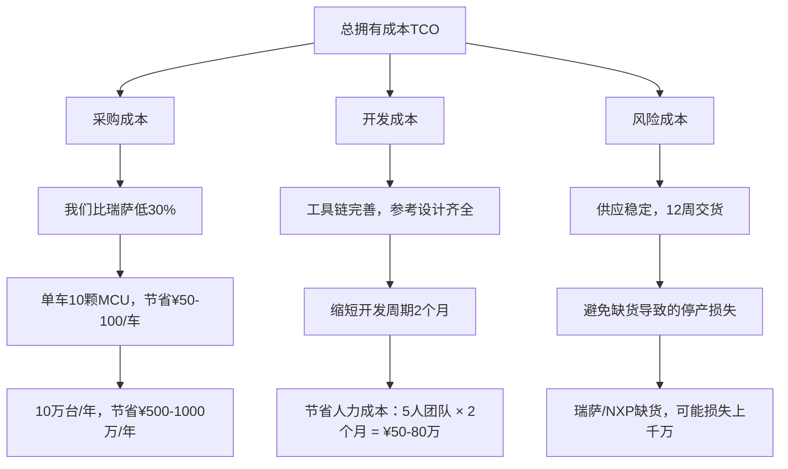

总计：我们方案综合成本比瑞萨/NXP低500-1500万/年"

**步骤3：提供批量折扣**

"如果您觉得价格还是高，我们可以给批量折扣：

| 年采购量 | 折扣        | 额外服务    |
| -------- | ----------- | ----------- |
| 50万颗+  | 额外5%折扣  | -           |
| 100万颗+ | 额外8%折扣  | -           |
| 200万颗+ | 额外10%折扣 | 免费驻场FAE |

您预计年采购量多少？我们可以按批量折扣重新报价。"

**步骤4：价格锁定承诺**

"而且我们可以签长期协议，3年价格锁定不涨。瑞萨/NXP这两年涨价很频繁，有的型号涨了20-30%。我们承诺3年不涨价，这个对您的成本控制很有利。"

**底线话术（如果客户还是坚持）：**

"价格方面我尽量向公司申请，但需要您配合提供一些信息：
1. 年采购量预估（需要确认批量折扣级别）
2. 合作年限（长期合作可以给更优惠价格）
3. 付款条件（账期灵活可以在价格上让步）
4. 竞品报价单（作为申请依据）

我拿这些材料去向领导申请特批价格，争取给您最优惠的方案。"

---

### 话术场景3：技术质疑（应对技术顾虑）

**客户："你们国产MCU，可靠性能保证吗？"**

#### 应对策略

**步骤1：数据说话**

"可靠性这个问题，我们用数据说话：

**实车验证：**
- **累计装车**：500万台（2020-2024）
- **应用车型**：比亚迪汉、唐、海豹、腾势D9等全系
- **零故障记录**：4年PPM < 5（百万分之五不良率）
- **对比**：瑞萨要求PPM < 10，我们做到了更好

这个验证规模，在全球MCU厂商中都是领先的。瑞萨、NXP也是靠大量实车验证建立起来的可靠性口碑，我们现在500万台验证，已经不输他们了。"

**步骤2：认证背书**

"而且我们的车规认证是完整的：

| 认证类型           | 说明                           |
| ------------------ | ------------------------------ |
| AEC-Q100           | 汽车电子可靠性标准（国际通用） |
| ISO 26262 ASIL-B/C | 功能安全认证                   |
| IATF 16949         | 汽车质量管理体系认证           |

这些认证不是随便拿的，需要通过严格的测试验证。我们的测试标准和瑞萨、NXP是一样的，甚至有些测试条件更严格。"

**步骤3：整车厂背书**

"比亚迪是全球新能源车销量第一，我们的MCU首先要满足自己整车厂的严苛要求。比亚迪汉定位20-30万中高端车型，对质量要求极高，我们的MCU能通过这个考验，说明可靠性是完全没问题的。

您可以这样想：如果我们MCU有质量问题，比亚迪自己的车首先就会出问题。我们不会拿自己整车厂的品牌开玩笑。"

**步骤4：提供测试验证方案**

"如果您还是有顾虑，我们可以提供测试验证方案：

| 验证方式   | 内容                                 |
| ---------- | ------------------------------------ |
| 免费样片   | 提供50-100片样片，您先做实验室测试   |
| 小批量验证 | 提供1000-5000片，您做小批量装车验证  |
| 第三方测试 | 我们协助您找第三方实验室做可靠性测试 |
| 对比测试   | 和瑞萨/NXP同时测试，横向对比         |

测试费用我们承担一半，让您亲自验证我们的可靠性。这样您也放心，我们也有信心。"

---

**客户："你们开发工具链成熟吗？我们担心开发效率低。"**

#### 应对策略

**步骤1：工具链展示**

"我们的开发工具链是很完善的：

| 工具类型         | 功能特点                                                     |
| ---------------- | ------------------------------------------------------------ |
| **IDE开发环境**  | • 基于Eclipse（免费），不需要买License<br>• 界面友好，工程师1天就能上手 |
| **代码生成工具** | • 图形化配置外设（CAN、ADC、PWM等）<br>• 自动生成初始化代码<br>• 减少80%基础代码编写工作量 |
| **完整BSP库**    | • HAL层驱动库（所有外设）<br>• 中间件（RTOS、文件系统、通信协议栈）<br>• 100+示例代码 |
| **参考设计**     | • BCM完整方案（原理图+PCB+代码）<br>• BMS从控方案<br>• 电机控制方案（FOC算法） |

您基本上是拿来改一改参数就能用，能节省1-2个月开发时间。"

**步骤2：客户案例佐证**

"您的担心我理解，其实很多客户一开始也有这个顾虑。但实际使用下来，反馈都很好：

- **零跑汽车**：全栈自研，对工具链要求很高。他们用了我们的工具链后，开发效率比用瑞萨的时候还高。

- **均胜电子**：做智能座舱，需要图形库、触控算法。我们协助他们移植LVGL，优化LCD驱动，项目提前1个月完成。

您可以联系这些客户，问问他们的使用体验。"

**步骤3：提供技术培训**

"我们还提供免费技术培训：

| 培训方式 | 内容                            |
| -------- | ------------------------------- |
| 线下培训 | 每季度1次，为期2-3天            |
| 在线培训 | 100+视频教程，随时学习          |
| 驻场培训 | 大客户可以申请FAE驻场，手把手教 |

我们希望您的工程师能快速上手，所以在培训支持上不遗余力。"

**步骤4：技术迁移支持**

"如果您之前用瑞萨/NXP，担心切换到我们会有学习成本，我们可以提供技术迁移支持：

- **代码迁移工具**：自动转换瑞萨/NXP代码到我们平台
- **迁移指南**：详细的迁移步骤文档
- **FAE全程协助**：帮您完成代码移植和调试

我们的目标是让您切换到我们平台，开发效率不降反升。"

---

### 话术场景4：供应链安全（打痛点）

**客户："现在用瑞萨/NXP，暂时没有切换计划。"**

#### 应对策略

**步骤1：唤起痛点（缺货风险）**

"我理解您现在用瑞萨/NXP用得挺顺的。不过我想提醒您注意一个风险：供应链安全。

2021-2023年的缺货潮，您应该还记得吧？当时瑞萨、NXP都严重缺货，交期延长到1年+，很多车企都因为缺芯片被迫减产。您当时受影响了吗？"

（引导客户回忆缺货痛苦经历）

"虽然现在缺货缓解了，但不代表未来不会再发生。万一再来一次缺货潮，您有B计划吗？"

**步骤2：强调供应链风险**

"而且瑞萨/NXP是国际品牌，存在一些不确定性：

| 风险类型         | 具体表现                                                     |
| ---------------- | ------------------------------------------------------------ |
| **地缘政治风险** | • 瑞萨是日本公司<br>• NXP是荷兰公司（受美国影响）<br>• 如果国际关系紧张，供应可能受影响 |
| **配货制风险**   | • 缺货时，优先供应国际大客户<br>• 中国客户可能被降级<br>• 您有遇到过被"配货"的情况吗？ |
| **价格波动风险** | • 瑞萨/NXP这两年涨价频繁（10-20%）<br>• 您的成本压力增加<br>• 他们涨价您也没办法 |

**步骤3：提供双源供应方案**

"我不是说要您马上切换，而是建议您考虑双源供应：

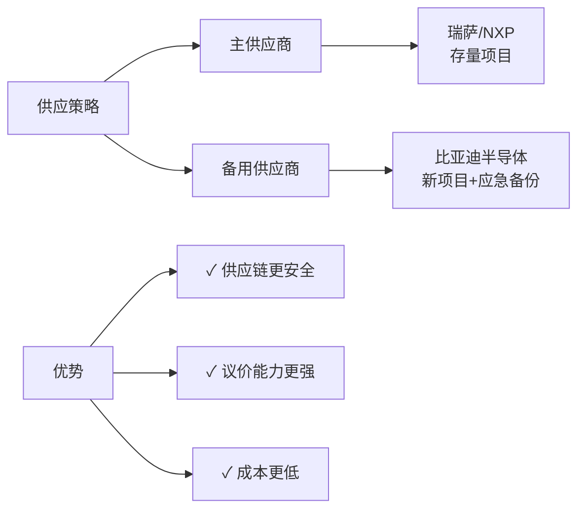

这样的好处：
- ✓ 供应链更安全（不会被单一供应商卡脖子）
- ✓ 议价能力更强（有备选方案，瑞萨/NXP不敢乱涨价）
- ✓ 成本更低（我们价格低，可以部分替代，降低整体成本）

很多车企都是这样做的，比如零跑、小鹏，既用瑞萨/NXP，也用我们，双保险。"

**步骤4：从新项目切入**

"您现在的项目我们不动，我们从您的新项目开始合作：

| 阶段             | 策略                                 |
| ---------------- | ------------------------------------ |
| 1. 新车型/新平台 | 供应商选择灵活                       |
| 2. 小批量试点    | 先做一个小项目，验证我们的产品和服务 |
| 3. 逐步扩大      | 合作顺利了，再扩大到更多项目         |

这样您没有切换成本，风险也小。您觉得怎么样？"

---

# 第二部分：销售场景剧本（场景1-4）

------

## 场景1：客户砍价到底线以下

### 【背景】

技术评审已通过,商务谈判阶段客户持续压价，要求价格低于公司底线。

### 【典型对话】

```
客户："你们报价¥12/颗，我们预算只有¥9，降不下来就没法合作了。"

销售："¥9确实太低了，这个价格我们做不了。您能说说为什么预算只有¥9吗？"

客户："竞品报价就是¥9，你们不降价我们就用他们的。"
```

------

### 【分析框架】

**步骤1：判断砍价真实性**

**问题清单：**

1. 竞品报价是正式报价单还是口头承诺？
2. 竞品型号与我们的对标吗？（性能、认证等）
3. 客户年采购量是多少？（影响折扣空间）
4. 客户付款条件如何？（账期影响价格）
5. 是单项目还是战略合作？（合作深度影响定价）

**识别套路：**

- 虚报竞品价格（诱导降价）
- 低配产品比高配价格（偷换概念）
- 促销价当常规价（不可持续）
- 拿小批量价格谈大批量订单

**步骤2：识别客户意图**

**三种意图：**

**意图A：真的预算有限（成本压力）** → 寻找降本方案（技术优化、批量折扣）

**意图B：谈判技巧（试探底线）** → 坚守价值，展示差异化

**意图C：确实有更低报价（竞品倾销）** → 质疑对方可持续性，强调TCO

------

### 【应对策略】

#### **策略1：拆解价格构成（透明化）**

**话术模板：**

"我理解您的成本压力。我先给您拆解一下我们的价格构成：

| MCU价格构成（以¥12/颗为例） | 金额      | 占比     |
| --------------------------- | --------- | -------- |
| 晶圆成本                    | ¥4.5      | 37.5%    |
| 封装测试                    | ¥2.0      | 16.7%    |
| 研发摊销                    | ¥1.5      | 12.5%    |
| 质量成本                    | ¥1.0      | 8.3%     |
| 渠道费用                    | ¥1.5      | 12.5%    |
| 公司利润                    | ¥1.5      | 12.5%    |
| **总计**                    | **¥12.0** | **100%** |

您看，我们的利润率只有12.5%，行业平均是15-20%。如果降到¥9，我们不仅没利润，还要亏损¥3/颗。这样的合作是不可持续的。"

#### **策略2：TCO总拥有成本分析**

**话术模板：**

"我们不能只看采购单价，要看总拥有成本（TCO）：

| 成本项目        | 方案A（竞品¥9）                                  | 方案B（我们¥12）                       | 差距               |
| --------------- | ------------------------------------------------ | -------------------------------------- | ------------------ |
| **1. 采购成本** | ¥9 × 10万颗 = ¥90万                              | ¥12 × 10万颗 = ¥120万                  | +¥30万 ❌           |
| **2. 开发成本** | 工具不完善，多2个月 = ¥50万                      | 工具完善，参考设计齐 = 0               | -¥50万 ✅           |
| **3. 风险成本** | 交期不稳定，可能缺货停产<br>预估风险成本：¥200万 | 12周交货，供应保障<br>风险成本：¥0     | -¥200万 ✅          |
| **4. 质量成本** | PPM未知，可能有批次问题<br>返工/召回风险：¥100万 | PPM<5，500万台验证<br>质量成本：可忽略 | -¥100万 ✅          |
| **总成本对比**  | ¥90万 + ¥50万 + ¥200万 + ¥100万<br>= **¥440万**  | **¥120万**                             | **节省：¥320万 ✅** |

您看，虽然我们单价高¥3，但综合成本其实低¥320万。这才是真正的成本优势。"

#### **策略3：阶梯式让步（条件交换）**

**让步策略：**

**原则**：每次让步都要换取对等条件

**第一轮：小幅让步（1-2%）**

- 条件：年采购量承诺
- 话术："如果您能承诺年采购100万颗以上，我可以申请额外5%折扣，价格降到¥11.4。"

**第二轮：中等让步（3-5%）**

- 条件：长期协议 + 付款优化
- 话术："如果您能签3年战略协议，而且付款条件从60天缩短到30天，我可以再争取5%，价格降到¥10.8。"

**第三轮：极限让步（5-8%）**

- 条件：独家供应 + 联合推广
- 话术："这是我的极限了。如果您能给我们独家供应承诺，而且同意联合案例推广，我可以申请特批价¥10.2。但这个价格我需要向总经理申请，而且需要您的正式采购意向书。"

**底线守则：**

- ✓ 绝不低于公司底线（¥10）
- ✓ 最后让步需要高层决策背书
- ✓ 保留"向上申请"的空间
- ✓ 明确让步是"特批"而非常规价

#### **策略4：转移焦点（价值重构）**

**话术模板：**

"我理解价格对您很重要。但除了价格，还有几个更重要的因素：

**1️⃣ 供应保障（避免缺货停产）**

'现在国际MCU厂商普遍缺货，交期都在半年以上。如果您因为省¥3选择了竞品，结果他们缺货导致您停产，损失可能是几千万。这个风险值得冒吗？'

**2️⃣ 技术支持（缩短上市周期）**

'我们的FAE团队4小时响应，免费驻场支持。竞品的技术支持能做到吗？您项目如果因为技术问题延期3个月，市场机会损失可能上亿。'

**3️⃣ 质量保障（避免召回风险）**

'我们500万台实车验证，PPM<5。竞品有这个验证数据吗？如果因为质量问题召回，单次成本至少几千万。'

**4️⃣ 长期合作（供应链稳定）**

'我们不是单纯的供应商，我们可以成为您的战略合作伙伴。比亚迪集团也是您的潜在大客户，这个产业链协同价值远超¥3的价差。'

所以，我们谈的不只是¥3的差价，而是一个长期可靠的合作伙伴。这个价值，远超单价差异。"

------

### 【底线守护话术】

**当客户坚持低于底线价格时：**

**话术A：直接拒绝（坚定但礼貌）**

"非常感谢您的信任。但¥9这个价格我们确实做不了，这不是利润问题，而是会亏损。我们不可能做亏本生意。

如果价格是您的第一考量，那可能我们暂时不太合适。但如果您看重供应保障、技术支持、质量可靠性，我们绝对是最佳选择。

建议您先用竞品试试，如果合作过程中遇到问题（交期、质量、技术支持），我们随时欢迎您回来。"

**话术B：保留后路（给客户台阶）**

"这个价格我确实没有权限批。这样吧，我把您的需求记录下来，向总经理汇报。但我需要您提供：

1. 年采购量承诺（至少100万颗）
2. 3年战略协议意向
3. 竞品正式报价单（作为申请依据）
4. 付款条件优化（缩短到30天）

我拿这些材料去争取特批。但不保证一定能批，因为这个价格确实太低了。您看这样可以吗？"

**话术C：引入竞争（激活需求）**

"我理解您的预算压力。不过最近有几个类似体量的客户也在谈，他们的预算比您这个高一些。

我公司的产能是有限的，如果其他客户先签约，可能就没有足够产能分配给您了。

所以我建议：与其在¥3上纠结，不如我们尽快签约锁定产能。错过这个窗口期，后面想合作可能排不上队了。"

------

## 场景2：竞品挖墙脚，如何保住份额

### 【背景】

已合作客户，竞品（瑞萨/NXP）用低价或其他优惠条件挖角，客户动摇。

### 【典型对话】

```
客户："兄弟，不是我不想继续合作，瑞萨那边给了个很好的条件，
      价格比你们低15%，而且承诺优先配货。我这边压力也大，
      您理解一下。"

销售："（内心OS：靠，瑞萨居然降价了！）我理解您的压力。
      能具体说说瑞萨给了什么条件吗？"
```

------

### 【分析框架】

**步骤1：情报收集**

**关键信息：**

1. 竞品报价多少？（是否真的更低）
2. 竞品做了哪些承诺？（优先配货、技术支持等）
3. 客户为什么动摇？（真需求还是谈判筹码）
4. 客户对我们有什么不满？（价格、服务、质量？）
5. 客户切换成本多少？（技术迁移、验证周期）
6. 竞品接触了谁？（技术层、采购层、高层？）

**判断真伪：**

- 是否有正式报价单？（真挖角 vs 客户谈判技巧）
- 竞品条件是否可持续？（促销 vs 长期价格）
- 客户态度如何？（坚决切换 vs 犹豫观望）

**步骤2：风险评估**

**客户流失风险等级：**

🔴 **高风险（立即行动）**：

- 客户已签竞品意向书
- 竞品报价确实更优
- 客户对我们有明确不满

🟡 **中风险（密切跟进）**：

- 客户在比较阶段
- 竞品有正式报价
- 客户犹豫但未决定

🟢 **低风险（正常应对）**：

- 客户只是口头询问
- 无正式报价单
- 可能是谈判筹码

------

### 【应对策略】

#### **策略1：情感维系（强化关系）**

**话术模板：**

"X总，咱们合作这么久了，您觉得我们哪里做得不好？

我们一直把您当战略客户，从技术支持到供应保障，FAE常驻您那边，有问题4小时响应。这些瑞萨能做到吗？

如果是我们哪里做得不到位，您直接说，我马上改。但如果只是因为价格，我觉得有些可惜。

咱们不是简单的买卖关系，而是合作伙伴。您的成功，也是我们的成功。您说是不是？"

**情感纽带强化：**

- ✓ 回顾合作历程（共同克服的困难）
- ✓ 强调特殊待遇（超越常规的支持）
- ✓ 展望未来合作（新项目、新机会）
- ✓ 个人关系维护（非纯商务关系）

#### **策略2：质疑竞品条件（拆解套路）**

**话术模板：**

"瑞萨降价15%，还承诺优先配货？这个我有点怀疑。您能给我看看他们的正式报价单吗？

因为据我了解，瑞萨现在是缺货状态，交期都在半年以上。他们怎么可能给您降价还优先配货？这不符合常理啊。

我猜测有几种可能：

**1️⃣ 他们报的是促销价（临时降价抢单）**

- 特点：短期有效，后面会涨回来
- 风险：您切换过去，用了半年他们涨价，您又被动

**2️⃣ 他们报的是老款型号（性能不如我们）**

- 特点：低配产品低价格
- 风险：性能不够，您可能要重新设计

**3️⃣ 他们是口头承诺（没有书面保证）**

- 特点：说得好听，实际不兑现
- 风险：您切换过去，发现被骗了

所以我建议您：

- ✓ 让瑞萨给书面报价（合同价，不是意向价）
- ✓ 确认型号规格（和我们对标吗）
- ✓ 确认交期承诺（真能12周交货吗）
- ✓ 确认优先配货（有书面保证吗）

如果他们都能给，那确实是好条件。但如果只是口头说说，那您就要小心了。"

#### **策略3：强化差异化价值（重塑认知）**

**话术模板：**

"X总，我们的合作不只是价格便宜，更重要的是这些：

**1️⃣ 供应保障（瑞萨做不到）**

| 对比项目   | 我们的承诺    | 瑞萨现状 |
| ---------- | ------------- | -------- |
| 交货周期   | 12周交货      | 26-52周  |
| 安全库存   | 3个月安全库存 | 无库存   |
| 生产地     | 本土生产      | 日本进口 |
| 价格稳定性 | 价格3年锁定   | 频繁涨价 |

**2️⃣ 技术支持（瑞萨做不到）**

- 我们：FAE常驻，4小时响应
- 瑞萨：1个FAE服务10+客户，1周响应

**3️⃣ 战略协同（瑞萨做不到）**

- 比亚迪集团产业链协同
- 整车厂联合开发机会
- 案例背书（500万台验证）

**4️⃣ 切换风险（您要考虑）**

- 技术迁移成本：2-3个月，¥100万+
- 重新认证成本：AEC-Q100测试，¥50万+
- 停产风险：切换过程可能影响生产
- 时间成本：错过市场窗口期

您算一下，瑞萨便宜15%，一年能省多少？假设您用10万颗，单价便宜¥2，一年省¥20万。

但切换成本至少¥150万，而且还有供应风险、技术风险。值得吗？

我们不是最便宜的，但一定是最可靠的。这个价值，远超15%的价差。"

#### **策略4：反制措施（有保有攻）**

**防守：价格匹配（有条件让步）**

**话术**："如果瑞萨确实有书面报价，而且您能承诺3年战略协议，我可以申请价格匹配。但需要您：

1. 提供瑞萨正式报价单
2. 承诺年采购量（至少100万颗）
3. 签3年独家供应协议
4. 允许我们用作案例推广

这样我去向总经理申请特批价格，保证不输瑞萨。"

**进攻：高层关系激活**

**动作**：

1. 向我方高层汇报（总经理/VP介入）
2. 安排我方高层拜访客户高层
3. 升级到战略合作层面（超越MCU采购）
4. 联合PR（案例宣传，给客户面子）

**话术**："X总，这个事情我向我们总经理汇报了。他说您是我们的战略客户，不希望因为价格问题影响合作。

他想亲自拜访您，和您聊聊战略合作的事情。不只是MCU，可能在更多领域有合作机会（比如比亚迪集团采购您的产品）。

您看您什么时候方便，我安排我们总经理过来？"

------

### 【挽留策略矩阵】

**根据客户态度选择策略：**

| 客户态度                    | 策略组合            | 优先级 | 成功率                   |
| --------------------------- | ------------------- | ------ | ------------------------ |
| 态度A：犹豫观望（还没决定） | 强化价值 + 情感维系 | ⭐⭐⭐⭐⭐  | 70-80%                   |
| 态度B：倾向切换（基本决定） | 价格匹配 + 高层介入 | ⭐⭐⭐⭐   | 40-60%                   |
| 态度C：已经决定（签约竞品） | 保持联系 + 等待回归 | ⭐⭐⭐    | 20-30%（需要竞品出问题） |

------

## 场景3：大客户要求独家供应

### 【背景】

大客户（年采购200万颗+）要求独家供应，但我们产能有限，需要平衡。

### 【典型对话】

```
客户："我们明年新车型预计需要300万颗MCU。但有个条件，
      我们要独家供应，不能给我们竞争对手供货。"

销售："（内心OS：独家？那我其他客户怎么办？）能理解您的
      考虑。能说说为什么要独家吗？"

客户："主要是担心供应保障。如果你们同时供我们和竞争对手，
      万一产能不足，你们优先保谁？"
```

------

### 【分析框架】

**步骤1：评估独家代价**

**独家成本分析：**

**失去的机会：**

- 其他客户订单：可能损失500万颗/年
- 市场份额：集中在单一客户，风险高
- 议价能力：依赖单一大客户，被动

**获得的收益：**

- 确定性订单：300万颗/年，稳定收入
- 战略客户：行业标杆，案例价值
- 规模效应：大批量，降低成本

**风险评估：**

- 客户流失风险：如果这个客户流失，影响巨大
- 产品锁定风险：专门为客户定制，难以复用
- 价格压力：独家后客户可能持续压价

**步骤2：谈判目标设定**

**目标层级：**

**最佳结果（100分）**：

- 不签独家协议
- 保留其他客户
- 给大客户优先供应承诺

**可接受结果（80分）**：

- 签"有限独家"（特定领域/车型独家）
- 保留其他领域客户
- 大客户给更高价格/更长协议

**底线结果（60分）**：

- 签全面独家协议
- 大客户给独家补偿（价格/预付款/长期协议）
- 保留退出条款（客户违约则独家失效）

------

### 【应对策略】

#### **策略1：重新定义"独家"（限定范围）**

**话术模板：**

"X总，我理解您对供应保障的担心。但'独家'这个概念太宽泛了，我们需要明确一下：

**1️⃣ 领域独家 vs 全面独家？**

- 领域独家：我们在'中高端轿车BCM'领域只供您
- 全面独家：我们完全不能供您的竞争对手

建议：领域独家（您的核心市场保护，我们保留其他市场）

**2️⃣ 产品独家 vs 客户独家？**

- 产品独家：我们不把'同款MCU'卖给您竞争对手
- 客户独家：我们完全不和您竞争对手合作

建议：产品独家（保护您的产品竞争力）

**3️⃣ 区域独家 vs 全球独家？**

- 区域独家：我们在'中国市场'只供您
- 全球独家：我们全球范围不供您竞争对手

建议：区域独家（符合您的主要市场）

**4️⃣ 时效独家 vs 永久独家？**

- 时效独家：独家期3年，3年后重新评估
- 永久独家：持续独家，除非协议终止

建议：时效独家（3-5年，给双方评估空间）

我们可以给您'中高端轿车BCM领域、同款产品、中国市场、3年时效独家'。这样既保护您的核心竞争力，也给我们一定灵活度。您觉得这样可行吗？"

#### **策略2：独家换独家（对等交易）**

**话术模板：**

"X总，如果我们给您独家供应，您能给我们什么？我有几个想法：

**1️⃣ 您也给我们独家采购权（Sole Source）**

- 您在MCU采购上只用我们，不用第二家
- 这样我们互为独家，风险共担

**2️⃣ 长期协议（3-5年）+ 最小采购量承诺**

- 签3-5年战略协议，价格锁定
- 承诺最小采购量（每年至少200万颗）
- 如果未达到，支付违约金

**3️⃣ 独家补偿（价格或预付款）**

- 独家导致我们损失其他客户，需要补偿
- 方案A：价格提升10%（独家溢价）
- 方案B：预付30%货款（保障现金流）

**4️⃣ 联合开发与品牌背书**

- 联合开发下一代MCU（您提需求，我们定制）
- 允许我们用作标杆案例宣传（品牌价值）
- 在行业活动上为我们背书（市场推广）

独家是双向的。如果您要我们独家供您，您也要给我们对等的回报。这样才是公平的合作。您觉得呢？"

#### **策略3：供应保障替代方案（不签独家）**

**话术模板：**

"X总，我理解您的担心是供应保障。但其实不签独家，我们也能给您最高级别的供应保障：

### VIP供应保障方案（不需要独家）

**1. 优先供应承诺**

- 您是我们战略客户，产能优先分配给您
- 承诺：即使缺货，也优先保障您的订单

**2. 专属产能预留**

- 为您预留30%产能（月产150万颗）
- 专属产线：减少切换损失，提升良率

**3. 战略库存**

- 为您维持3个月安全库存（900万颗）
- 应急响应：7天内可交付紧急订单

**4. 长期协议保障**

- 签3年供货协议，价格锁定
- 产能保障条款：我们扩产义务写入合同

**5. 信息透明机制**

- 月度产能规划会议（提前3个月规划）
- 实时库存查询（您能看到专属库存）
- 风险预警：供应链异常提前30天通知

您看，这些保障措施，比独家更实在。独家只是名义上的保护，但这些措施是实实在在的供应保障。

而且不签独家，您也有好处：

- ✓ 我们服务更多客户，产品迭代更快（市场反馈多）
- ✓ 我们规模更大，降本能力更强（您也受益）
- ✓ 您也保留第二供应商选择权（双保险）

所以我建议：不签独家，但给您最高级别的VIP供应保障。您觉得怎么样？"

------

### 【谈判技巧】

**技巧1：拖延战术（给自己思考时间）**

**话术**："独家供应是重大决策，我需要向总经理汇报。能给我3天时间吗？我们内部评估一下可行性，然后给您一个正式答复。"

**技巧2：分拆条款（逐项谈判）**

**话术**："独家协议包括很多条款，我们一项一项谈：

- 独家范围（产品/领域/区域）
- 独家期限（3年/5年/永久）
- 独家补偿（价格/预付款/最小采购量）
- 退出机制（什么情况下独家失效）

每一项我们都要谈清楚，不能笼统说'独家'。"

**技巧3：抬高门槛（展示独家代价）**

**话术**："独家意味着我们要放弃其他客户，这个代价很大。据我了解，同行要求独家的客户，一般要给：

- 价格溢价：15-20%独家溢价
- 最小采购量：每年至少500万颗
- 长期协议：至少5年，提前解约违约金50%货款

这是行业惯例。如果您能接受这些条件，我们可以考虑独家。否则的话，我们还是建议VIP供应保障方案。"

------

## 场景4：技术测试不通过

### 【背景】

客户在技术验证阶段发现我们的MCU测试不通过（性能、EMC、可靠性等问题）。

### 【典型对话】

```
客户："你们的MCU在EMC测试中失败了，辐射抗扰度只有120V/m，
      达不到我们150V/m的要求。这个问题怎么解决？"

销售："（内心OS：糟了，技术问题！）能详细说说测试情况吗？
      用的什么测试条件？"

客户："我们按照ISO 11452标准测试的，频率80MHz-1GHz扫描，
      120V/m就开始误动作了。"
```

------

### 【分析框架】

**步骤1：问题定位**

**快速诊断清单：**

**1. 测试条件是否正确？**

- 测试标准（ISO 11452 / ISO 7637等）
- 测试环境（温度、湿度、供电）
- 测试设备（是否校准）
- 测试方法（是否符合标准）

**2. 硬件设计是否合理？**

- PCB布局（电源、地线、信号线）
- 去耦电容（数量、位置、容值）
- 晶振电路（频率、负载电容）
- 接口保护（ESD、过压、过流）

**3. 软件配置是否正确？**

- 时钟配置（PLL、分频、源选择）
- 外设配置（CAN、ADC、PWM等）
- 中断优先级（是否合理）
- 看门狗设置（超时时间）

**4. 测试样本是否代表性？**

- 样片批次（是否工程样）
- 样片数量（单片 vs 批量）
- 样片状态（新片 vs 返工片）

**问题分类：**

| 问题类型                                | 严重程度 | 处理方式     |
| --------------------------------------- | -------- | ------------ |
| 类型A：芯片本身问题（EMC设计缺陷）      | ⭐⭐⭐⭐⭐    | 需要芯片改版 |
| 类型B：客户设计问题（PCB布局/元件选型） | ⭐⭐⭐      | FAE指导优化  |
| 类型C：测试方法问题（测试条件不当）     | ⭐⭐       | 重新测试     |
| 类型D：软件配置问题（寄存器设置）       | ⭐        | 更新代码     |

------

### 【应对策略】

#### **策略1：快速响应（24小时内给方案）**

**标准响应流程：**

**第1小时：接到通知**

- 行动：立即联系客户，确认问题详情
- 话术："非常抱歉听到这个问题。能否把测试报告和原理图发给我？我马上组织FAE团队分析。"

**第2-4小时：问题诊断**

- 行动：FAE团队分析测试报告、原理图、PCB layout
- 输出：初步诊断报告（问题分类、可能原因）

**第4-8小时：实验室复现**

- 行动：我方实验室复现问题（如果有条件）
- 输出：复现结果、对比测试数据

**第8-24小时：解决方案**

- 行动：制定解决方案（硬件优化/软件调整/测试方法）
- 输出：正式解决方案文档

**第24-48小时：现场支持**

- 行动：FAE现场指导客户整改、重新测试
- 输出：测试通过报告

#### **策略2：问题分类应对**

**类型A：芯片本身问题（最严重）**

**话术模板：**

"经过我们实验室分析，确实是芯片在某个频段的抗干扰能力不足。这是我们的责任，我代表公司向您致歉。

我们的解决方案：

### 短期方案（1个月内）

**1. 提供workaround方案：**

- 硬件：增加外部EMC滤波器（我们提供设计）
- 软件：优化抗干扰算法（我们提供代码）
- 测试：协助您通过EMC测试

**2. 免费提供技术支持：**

- FAE驻场支持，直到问题解决
- 提供EMC测试设备租赁（或免费借用）
- 协助完成车规认证

### 长期方案（3-6个月）

**1. 芯片改版：**

- 优化EMC设计（增强抗干扰能力）
- 重新流片（6个月交付新版本）
- 价格不变，性能提升

**2. 客户补偿：**

- 给您6个月的额外折扣（10%）
- 免费更换新版本芯片（如果您愿意）
- 优先供应新版本（您是第一批客户）

### 我们的承诺

- ✓ 短期方案1个月内解决，不影响您的量产计划
- ✓ 长期方案6个月内芯片改版，彻底解决问题
- ✓ 费用我们承担（EMC器件、FAE、测试）
- ✓ 给您补偿（折扣、优先供应）

我们绝不会让这个问题影响您的项目。我们会负责到底。"

**类型B：客户设计问题（常见）**

**话术模板：**

"经过我们FAE分析，问题主要出在PCB布局和元件选型上。我给您具体指出来：

### 问题1：电源去耦电容不足

- 现状：您只放了2个0.1μF电容
- 建议：增加到4个（0.1μF + 1μF + 10μF + 100μF）
- 位置：尽量靠近芯片VDD引脚（<5mm）
- 原因：去耦不足导致电源纹波大，抗干扰能力弱

### 问题2：晶振布局不合理

- 现状：晶振离芯片10mm，走线很长
- 建议：晶振紧贴芯片（<3mm），走线最短
- 地平面：晶振下方铺地，形成屏蔽
- 原因：晶振是辐射源，距离远会增强干扰

### 问题3：地线分割

- 现状：数字地和模拟地分开，中间有缝隙
- 建议：地平面统一，不要分割（单点接地）
- 原因：地线分割会形成环路，增强辐射

我已经标注在原理图上（见附件）。您按照我们的建议改版，EMC测试应该能通过。

### 我们的支持

- ✓ FAE现场指导您改版（免费）
- ✓ 提供EMC优化指南（文档）
- ✓ 协助您重新测试（陪同去测试实验室）
- ✓ 提供参考设计（已通过EMC测试的PCB）

预计改版后，EMC性能能提升到180V/m，超过您的要求。"

**类型C：测试方法问题**

**话术模板：**

"我看了您的测试报告，发现测试方法有些问题：

### 问题1：测试电压设置不当

- 您的测试：供电电压3.0V
- 标准要求：供电电压3.3V±10%（3.0-3.6V）
- 影响：低电压会导致抗干扰能力下降20-30%
- 建议：用3.3V重新测试

### 问题2：测试频段选择不全

- 您的测试：只测了80-1000MHz
- 标准要求：需要测10MHz-18GHz（分段测试）
- 影响：可能漏测敏感频段
- 建议：按标准完整测试

### 问题3：测试样本数不足

- 您的测试：只测了1片样片
- 标准要求：至少3片（取最差值）
- 影响：单片测试结果可能不具代表性
- 建议：增加样本数

### 我们建议

- ✓ 按照标准测试条件重新测试
- ✓ 我们提供技术指导（测试方法、测试设置）
- ✓ 我们陪同您去测试实验室（现场支持）
- ✓ 我们提供已通过测试的样片（对比测试）

我相信按标准测试后，应该能通过。"

------

### 【补救措施】

**补救方案矩阵：**

| 方案                        | 适用场景           | 周期                | 成本                           | 成功率 |
| --------------------------- | ------------------ | ------------------- | ------------------------------ | ------ |
| 方案A：硬件优化（PCB改版）  | 客户设计问题       | 2-4周               | ¥10-30万（客户承担）           | 90%+   |
| 方案B：软件调整（固件优化） | 软件配置问题       | 1-2周               | 免费                           | 70-80% |
| 方案C：外加EMC器件          | 芯片EMC能力不足    | 1周                 | 增加BOM成本¥2-5/套（客户承担） | 85%+   |
| 方案D：芯片改版（重新流片） | 芯片本身缺陷       | 6个月               | ¥500万+（我们承担）            | 100%   |
| 方案E：更换芯片型号         | 现有型号确实不合适 | 2-3个月（重新验证） | 客户承担开发成本               | 100%   |

# 第二部分：销售场景剧本（场景5-8）

## 场景5：客户投诉质量问题

### 【背景】
量产后客户反馈批次质量问题（死机、误动作、失效等），要求索赔或停止供货。

### 【典型对话】

**客户**："你们这批货有问题！上周装了5000台车，已经有30台出现死机，故障率0.6%。我们要求立即停止供货，并索赔¥200万损失！"

**销售**："（内心OS：完了，质量事故！）非常抱歉！能详细说说故障情况吗？什么时候发现的？故障现象是什么？"

**客户**："就是系统突然死机，重启后又正常。现在经销商投诉电话爆了，我们品牌形象都受损了！"

---

### 【危机响应流程】

#### 第一阶段：紧急响应（0-2小时）

**行动清单：**

| 序号 | 行动项       | 具体内容                                                     | 时限    |
| ---- | ------------ | ------------------------------------------------------------ | ------- |
| 1    | 立即致歉     | "非常抱歉给您造成困扰！我立即向公司汇报，启动质量应急机制。请您放心，我们会负责到底。" | 立即    |
| 2    | 成立应急小组 | • 质量工程师×2<br>• FAE工程师×2<br>• 销售负责人×1<br>• 公司高层（总监/VP）×1 | 2小时内 |
| 3    | 前往客户现场 | • 调查故障现象<br>• 收集故障样品<br>• 安抚客户情绪<br>• 承诺解决时限 | 当天    |
| 4    | 暂停发货     | • 立即暂停该批次发货<br>• 库存全检（如有必要）<br>• 通知其他客户（如使用同批次） | 立即    |

---

#### 第二阶段：问题定位（2-24小时）

**故障分析框架：**

**步骤1：收集信息**

| 信息项   | 内容                    |
| -------- | ----------------------- |
| 批次号   | _______                 |
| 生产日期 | _______                 |
| 故障数量 | 30台/5000台 = 0.6%      |
| 故障现象 | 死机、重启后恢复        |
| 使用环境 | 温度___ 湿度___ 震动___ |
| 使用时长 | 装车___天后出现         |
| 故障规律 | 偶发 / 必现 / 条件触发  |

**步骤2：初步判断**

| 可能原因                    | 判断依据           | 验证方法               | 责任归属     |
| --------------------------- | ------------------ | ---------------------- | ------------ |
| A：芯片质量问题（批次不良） | 特定批次集中出现   | 对比其他批次是否有问题 | 我方责任     |
| B：客户使用不当（软件Bug）  | 只在特定条件下出现 | 检查客户软件版本       | 客户责任     |
| C：外部干扰（EMC问题）      | 偶发，无规律       | 检查使用环境           | 需进一步分析 |
| D：硬件设计缺陷（PCB/元件） | 特定车型/配置出现  | 检查硬件设计           | 客户责任     |

**步骤3：实验室复现**
- 将故障样品带回实验室
- 搭建测试环境（模拟实车）
- 尝试复现故障
- 定位根本原因

**步骤4：结论报告**
- 24小时内出具初步分析报告
- 明确故障原因
- 提出解决方案
- 责任归属判定

---

#### 第三阶段：解决方案（24-72小时）

##### 情况A：确认是芯片问题（我方责任）

**话术模板：**

"X总，经过我们实验室分析，确认是我们这个批次的芯片有质量问题。这是我们的责任，我代表公司向您郑重道歉。

**问题原因：**
- 该批次在生产过程中，某个参数控制偏差
- 导致在高温（>80℃）环境下，芯片稳定性下降
- 批次范围：XX批次，数量50000颗
- 影响范围：已发货5000颗，您这边都是

**我们的解决方案：**

**1. 立即召回该批次（7天内完成）**
- 免费更换良品芯片
- 我们承担更换费用（人工+物流）
- 派驻工程师现场支持

**2. 客户损失赔偿**
- 直接损失：已装车30台，每台赔偿¥5000 = ¥15万
- 检测费用：全部5000台检测，赔偿¥50万
- 商誉损失：品牌影响，赔偿¥50万
- 总计赔偿：¥115万（低于您要求的¥200万，但我们会额外提供其他补偿）

**3. 额外补偿**
- 下一年度全部订单给予10%折扣
- 免费技术支持1年（驻场FAE）
- 优先供应权（产能紧张时优先保障）

**4. 预防措施**
- 加强生产过程管控（100%全检）
- 引入第三方检测（SGS/TÜV）
- 建立质量追溯系统（每颗芯片可追溯）
- 增加出厂测试项目（模拟实车环境）

**我们的承诺：**
- ✓ 7天内完成召回和更换
- ✓ 赔偿款15天内支付
- ✓ 确保此类问题不再发生
- ✓ 我们CEO会亲自拜访您，表达歉意

这次是我们的错，我们会承担所有责任。希望您能给我们一次改正的机会，让我们继续为您服务。"

---

##### 情况B：客户使用问题（客户责任）

**话术模板：**

"X总，经过我们技术团队的详细分析，发现故障原因主要是软件配置问题，不是芯片质量问题。

**问题原因：**
- 您的软件中，看门狗超时设置为1秒
- 但某个任务偶尔会超过1秒（1.2-1.5秒）
- 导致看门狗复位，系统重启
- 这不是芯片故障，是软件Bug

**证据：**
1. 我们用同批次芯片测试，无法复现故障
2. 我们用您的软件测试，100%复现故障
3. 我们修改看门狗设置后，故障消失
4. 其他客户使用同批次芯片，无故障报告

**解决方案：**

| 方案                    | 具体措施                                                     | 优点         | 时间 |
| ----------------------- | ------------------------------------------------------------ | ------------ | ---- |
| 方案A：修改软件（推荐） | • 将看门狗超时改为2秒<br>• 优化任务调度（避免超时）<br>• 我们提供参考代码 | 根本解决问题 | 1周  |
| 方案B：优化芯片配置     | • 调整芯片性能参数<br>• 提升任务处理速度<br>• 我们提供优化方案 | 无需改软件   | 2周  |

**我们的支持：**
- ✓ 虽然不是我们芯片问题，但我们愿意协助解决
- ✓ FAE团队免费驻场支持（1个月）
- ✓ 提供软件优化方案和参考代码
- ✓ 协助完成OTA升级（远程修复已售车辆）

**关于赔偿：**
由于不是芯片质量问题，按照合同约定，我们不承担赔偿责任。但考虑到我们的合作关系，我们愿意：
- 免费提供技术支持（价值¥30万）
- 给予下批订单5%折扣（价值¥50万）
- 协助您向经销商解释（技术背书）

这样既解决了问题，也维护了我们的合作关系。您看可以吗？"

---

##### 情况C：原因不明（需要时间）

**话术模板：**

"X总，我们技术团队已经分析了3天，但故障原因还不够明确。目前有几个可能：
- 可能1：芯片在极端条件下的小概率失效
- 可能2：软硬件配合问题（边界条件触发）
- 可能3：外部干扰（EMC、电源波动）

**我们的计划：**

**1. 深度分析（再给我们7天）**
- 扩大样本数（再收集50个故障样品）
- 长期测试（模拟实车环境，连续运行1000小时）
- 引入第三方检测机构（客观评估）

**2. 临时措施（先止损）**
- 暂停该批次发货（避免扩大影响）
- 对已发货产品进行跟踪（监控是否还有故障）
- 提供备用芯片（如您需要应急替换）

**3. 客户保障**
- 如最终确认是芯片问题，我们全额赔偿
- 如不是芯片问题，我们协助您解决（免费技术支持）
- 无论如何，我们不会让您承担损失

**我们的诚意：**
- 先支付您¥50万诚意金（体现我们的责任感）
- 这笔钱不影响后续赔偿金额
- 如最终确认不是我们问题，这笔钱算我们的支持费用

X总，给我们7天时间彻底查清原因。我们比您更着急解决这个问题，因为这关系到我们的品牌和口碑。请您相信我们的诚意。"

---

### 【危机公关策略】

#### 对内沟通：
1. 立即向公司高层汇报（CEO/VP）
2. 评估影响范围（其他客户是否受影响）
3. 准备预案（如事态扩大如何应对）
4. 财务准备（赔偿资金、应急资金）

#### 对外沟通：

**1. 客户层面：**
- 高层拜访（CEO亲自致歉）
- 技术交流（详细说明原因和方案）
- 定期通报（每日更新进展）

**2. 行业层面：**
- 主动通报（避免谣言扩散）
- 技术说明会（消除疑虑）
- 第三方背书（检测机构报告）

**3. 媒体层面：**
- 控制信息源（避免负面报道）
- 准备应对话术（如被媒体询问）
- 正面案例宣传（其他客户的认可）

#### 关键原则：
- ✓ 快速响应（2小时内到现场）
- ✓ 诚恳态度（先道歉，再分析）
- ✓ 主动担责（不推诿，不扯皮）
- ✓ 过度补偿（宁可多赔，不要少赔）
- ✓ 举一反三（预防类似问题）

---

## 场景6：新客户冷启动（0→1突破）

### 【背景】
目标新客户（如小米汽车、华为问界），完全陌生，需要从0开始建立联系。

### 【典型困境】

| 困境类型     | 具体表现        |
| ------------ | --------------- |
| 没有联系人   | 不知道找谁      |
| 没有信任基础 | 客户不认识我们  |
| 已有供应商   | 瑞萨/NXP占据    |
| 竞争激烈     | 10+家供应商竞争 |

---

### 【破冰策略】

#### 策略1：高维度切入（高层关系）

##### 方法A：利用比亚迪集团背书

**行动：**

1. **找到比亚迪汽车和目标客户的业务联系**
   - 比亚迪是小米的供应商（电池）
   - 比亚迪是华为的合作伙伴（问界代工）

2. **通过比亚迪集团高层引荐**
   - 比亚迪汽车CEO介绍→小米汽车CEO
   - 比亚迪半导体CEO→小米汽车CTO/供应链VP

3. **战略合作框架协议**
   - 不只谈MCU，谈整体合作
   - 产业链协同（比亚迪汽车也是小米的客户）
   - 国产替代大局（政策层面）

**话术：**

"X总您好，我是比亚迪半导体的XX。我们王总（比亚迪汽车CEO）和您是老朋友了，他让我来和您聊聊半导体合作的事情。

我们不只是MCU供应商，更希望能在更大层面合作。比如比亚迪汽车每年采购您们的XXX产品，我们半导体供应您们MCU，这是双向的产业链协同。

能否约个时间，我们两家高层坐下来聊聊战略合作？"

---

##### 方法B：行业活动/论坛接触

**行动：**

1. **参加目标客户会参加的行业活动**
   - 中国汽车供应链峰会
   - 新能源汽车论坛
   - 汽车半导体技术研讨会

2. **主动演讲/发言**
   - 展示比亚迪半导体技术实力
   - 分享500万台实车验证案例
   - 吸引目标客户关注

3. **现场交换名片**
   - 会后主动交流
   - 邀请参观比亚迪工厂
   - 建立初步联系

**话术：**

"X总您好，我是比亚迪半导体的XX，刚才听了您的演讲，很有启发。我们也在做车规MCU，已经在500万台比亚迪汽车上验证了。

如果您有兴趣，欢迎来参观我们的工厂和实验室。我们可以深入交流一下技术和供应链合作。"

---

##### 方法C：第三方引荐

**行动：**

1. **找共同的Tier 1供应商**
   - 德赛西威既给比亚迪供货，也给小米供货
   - 通过德赛引荐小米

2. **找投资机构引荐**
   - 红杉资本既投资了比亚迪半导体，也投资了小米
   - 通过红杉引荐

3. **找行业协会引荐**
   - 中国汽车工程学会
   - 中国汽车芯片产业创新联盟

**话术：**

"X总（德赛西威），我们想开发小米汽车这个客户，您和小米关系很好，能否帮忙引荐一下？

对您也有好处：如果小米用了我们的MCU，您的成本能降20%，您在小米那边的竞争力也更强。"

---

#### 策略2：价值前置（先给价值）

##### 方法A：免费技术咨询

**行动：**

1. **研究目标客户的技术方案**
   - 分析小米SU7的MCU架构
   - 找出潜在优化点

2. **制作优化方案PPT**
   - 提出降本方案（节省¥50-100/车）
   - 提出性能优化方案（提升响应速度20%）

3. **主动发送给客户**
   - 不要求回报
   - 展示专业能力

**话术：**

"X总您好，我研究了一下小米SU7的MCU方案（公开信息），做了一个优化方案。如果采用这个方案，可以节省¥50-100/车。

这个方案免费送给您，不要求回报。只是展示一下我们的技术能力，希望未来有合作机会。"

---

##### 方法B：提供测试样片

**行动：**
1. 主动提供免费样片（100片）
2. 附赠完整技术资料（数据手册、应用笔记、参考设计）
3. 附赠开发板和调试工具

**话术：**

"X总，我知道您现在可能还没考虑换供应商。但我想先给您寄一些样片，您可以先测试一下，了解我们的产品性能。

完全免费，没有任何附加条件。只是希望将来您有需求时，能想起我们。"

---

##### 方法C：分享行业报告

**行动：**

1. **制作MCU行业趋势报告**
   - 市场规模、技术趋势、竞争格局
   - 国产替代进展、成本分析

2. **定期发送行业资讯**
   - 每月一次，不推销产品
   - 建立"专业顾问"形象

3. **邀请参加技术沙龙**
   - 组织MCU技术研讨会
   - 邀请客户参加（免费）

**话术：**

"X总，我们做了一份MCU行业趋势报告，有一些有价值的数据和分析。我发给您参考一下，不涉及任何推销。

如果您觉得有用，我可以定期给您发送行业资讯。"

---

#### 策略3：从边缘切入（避开强敌）

##### 方法A：从非核心应用切入

**策略：**
- 不和瑞萨/NXP在核心应用（动力总成、ADAS）正面竞争
- 先从边缘应用切入（车身控制、座椅、灯光）
- 逐步扩大份额

**话术：**

"X总，我知道您的动力总成用的是瑞萨，我们不动这块。我们想从车身控制BCM开始合作。

BCM技术门槛相对低，风险小，而且我们价格有优势。您可以先试试我们的产品，如果合作顺利，后面再扩大到其他应用。"

---

##### 方法B：从新项目切入

**策略：**
- 不碰存量项目（供应商固化）
- 聚焦新项目/新平台（供应商选择灵活）
- 参与联合开发

**话术：**

"X总，您现有车型的供应商我们不动。但听说您明年有新平台立项，我们能不能参与新平台的开发？

新平台从设计开始就用我们的MCU，这样切换成本低，而且我们可以根据您的需求定制开发。"

---

##### 方法C：从第二供应商切入

**策略：**
- 不要求主供应商（Tier 1 Supplier）
- 申请成为第二供应商（Tier 2 Supplier）
- 份额20-30%即可

**话术：**

"X总，我们不要求做您的主供应商，那个位置给瑞萨/NXP。我们能不能做您的第二供应商？

您也知道，单一供应商风险很大。万一瑞萨缺货，您没有备选方案。我们做第二供应商，既分散风险，又能给瑞萨压价。

我们只要20-30%份额就行，剩下的还是瑞萨。您看可以吗？"

---

#### 策略4：长期耕耘（不急于求成）

**6个月计划：**

| 阶段                | 时间  | 关键行动                                                     | 目标                                             |
| ------------------- | ----- | ------------------------------------------------------------ | ------------------------------------------------ |
| 第1个月：建立联系   | 月1   | • 找到关键决策人（技术总监、采购总监）<br>• 发送自我介绍邮件<br>• 邀请参观比亚迪工厂<br>• 寄送样片和技术资料 | 拜访3次以上                                      |
| 第2-3个月：建立信任 | 月2-3 | • 定期拜访（每2周一次）<br>• 分享行业资讯<br>• 提供免费技术咨询<br>• 参加客户的技术交流会 | 建立信任（客户愿意聊天）                         |
| 第4-5个月：寻找机会 | 月4-5 | • 了解客户新项目规划<br>• 提出联合开发方案<br>• 申请参与技术评审<br>• 争取试用机会 | 获得样片测试机会<br>参与技术评审<br>进入商务谈判 |
| 第6个月：突破签约   | 月6   | • 正式报价<br>• 商务谈判<br>• 签订小批量订单<br>• 开始供货   | 签约（哪怕只有小批量）                           |

---

# 场景7：商务谈判僵局

## 【背景】

技术评审通过，但商务谈判卡住（价格、账期、独家、最小采购量等分歧）。

## 【典型对话】

```
客户："价格必须降到¥10，账期要90天，而且我们要求独家供应。
      这是我们的底线，不能妥协。"

销售："X总，这三个条件，我真的很难答应..."

客户："那就没得谈了。我们还有其他供应商在谈。"

销售："（内心OS：怎么办？让步还是坚持？）"
```

## 【破局策略】

### 策略1：拆分议题（逐个击破）

**谈判技巧：**

**原则：** 不要同时谈多个议题，容易陷入僵局

**步骤1：议题排序**
- **话术：** "X总，我们一项一项谈，不要混在一起。我们先谈最重要的，谈妥了再谈下一个。您觉得价格、账期、独家，哪个对您最重要？"

**步骤2：先易后难**
- **策略：** 先谈容易达成一致的议题，建立谈判势头
- **话术：** "账期这个问题，我们可以商量。行业标准是60天，您要90天，我们可以考虑。但需要您在其他条件上有所让步。"

**步骤3：以退为进**
- **策略：** 在次要议题上让步，换取主要议题坚守
- **话术：** "账期我们可以给90天，但价格¥10真的做不到。我们可以给¥10.5，这是我们的成本底线。您看这样可以吗？"

**步骤4：打包交易**
- **策略：** 将多个议题打包，整体谈判
- **话术：** "这样吧，我们做一个整体方案：
  - 价格：¥10.5（您要求¥10，我们让步¥0.5）
  - 账期：90天（您的要求，我们满足）
  - 独家：有限独家（只在中高端轿车BCM领域）
  - 最小采购量：每年150万颗（您承诺）
  
  这是一个平衡方案，您看可以吗？"

---

### 策略2：引入第三方（外部压力）

#### 方法A：竞争对手威胁

**话术：** "X总，我刚接到通知，零跑汽车那边要追加100万颗订单，我们产能有限。如果您这边迟迟定不下来，我可能要先保证零跑的订单。

不是说不和您合作，而是我们产能确实紧张。您能否尽快决策？如果这周能签约，我优先保证您的产能。"

#### 方法B：高层施压

**话术：** "X总，这个条件我真的批不了。这样吧，我向我们总经理汇报一下，看他能否特批。

但我需要您给我一个采购意向书，证明您是认真想合作的。我拿着意向书去申请，成功率更高。您看可以吗？"

#### 方法C：时间期限

**话术：** "X总，我们这个特价只到月底。因为我们每个季度有销售目标，月底前签约我可以给更优惠的价格。如果拖到下个月，价格可能要涨回去了。

您看能否在月底前决定？我保证给您最优惠的条件。"

---

### 策略3：改变谈判场景（换个环境）

#### 方法A：高层会谈

**策略：** 谈判僵局时，升级到高层谈判

**行动：**
- 我方：总经理/VP出面
- 对方：CEO/CTO/供应链VP
- 场景：正式商务会谈（会议室）
- 议题：战略合作，超越MCU采购

**话术：** "X总，我们在执行层面可能很难达成一致。我建议我们两家高层见个面，聊聊战略合作的事情。

不只是MCU采购，可能在更多领域有合作机会。您看什么时候方便，我安排我们总经理过来？"

#### 方法B：非正式场合

**策略：** 正式谈判太紧张，换个轻松场合

**场景：**
- 饭局（晚餐）
- 茶话会（下午茶）
- 高尔夫/爬山（户外活动）
- 参观考察（工厂/实验室）

**话术：** "X总，我们谈了这么久，大家都有点累了。不如晚上一起吃个饭，放松一下？我们边吃边聊，不谈合同细节，就聊聊行业趋势、未来规划。"

#### 方法C：引入第三方调解

**策略：** 找一个双方都信任的第三方

**人选：**
- 共同的合作伙伴（Tier 1供应商）
- 投资机构（红杉、IDG等）
- 行业协会（中汽协、芯片联盟）
- 咨询公司（麦肯锡、德勤）

**话术：** "X总，我们谈了这么久，双方都有些疲劳了。不如我们找个第三方机构，帮我们评估一下这个合作的合理性？

比如找麦肯锡做个分析，看看价格、账期、独家这些条件是否合理。第三方的建议，我们双方都接受。您看怎么样？"

---

### 策略4：创造性解决方案（跳出框架）

#### 方法A：阶梯式定价

**客户要求：** ¥10  
**我们成本：** ¥10.5  
**僵局：** 降不下来

**创造性方案：**

**话术：** "X总，¥10我真的做不了。但我们可以这样：

- 第一年：¥10.8（我们让步，但不亏本）
- 第二年：¥10.5（随着量产规模扩大，成本下降）
- 第三年：¥10.2（进一步降本）
- 第四年：¥10（达到您的目标价格）

这样我们都有时间适应。您看可以吗？"

#### 方法B：捆绑销售

**客户要求：** 只买MCU，要求最低价  
**我们困境：** MCU利润薄，很难再降价

**创造性方案：**

**话术：** "X总，单独卖MCU，利润确实很薄，很难再降价。但如果您除了MCU，还采购我们的其他产品，我们可以打包优惠：

- MCU：¥10.5（单独卖¥11）
- IGBT：¥80（单独卖¥85）
- 电流传感器：¥150（单独卖¥160）

打包购买，总价优惠10%。您看这样可以吗？"

#### 方法C：股权合作

**客户要求：** 价格、独家、各种优惠条件  
**我们困境：** 条件太苛刻，无法满足

**创造性方案：**

**话术：** "X总，我有一个大胆的想法：与其我们天天在价格上扯皮，不如考虑股权合作？

比如您投资我们比亚迪半导体，成为我们的战略股东。这样：
- 您拿到股东价格（更优惠）
- 您有优先供应权（战略股东）
- 您分享我们的成长收益（股权增值）

我们不只是买卖关系，而是利益共同体。您觉得这个想法怎么样？"

---

# 场景8：丢单后复盘与二次进攻

## 【背景】

经过3-6个月跟进，最终客户选择了竞品（瑞萨/NXP/兆易），我们丢单了。

## 【典型对话】

```
客户："不好意思，经过评估，我们决定用瑞萨的方案。感谢你们
      这段时间的支持。"

销售："（内心OS：完了，白忙活了...）能问一下为什么选择瑞萨吗？"

客户："主要是我们技术团队更熟悉瑞萨，切换成本比较高。价格
      虽然你们有优势，但不是最主要考虑因素。"
```

## 【复盘框架】

### 步骤1：快速复盘（24小时内）

#### 复盘问题清单：

**1. 为什么丢单？（真实原因）**
- 价格问题？（我们报价太高？）
- 技术问题？（性能不满足？测试不通过？）
- 服务问题？（响应慢？支持不到位？）
- 关系问题？（没有搞定关键人？）
- 时机问题？（介入太晚？）

**2. 竞争对手为什么赢？**
- 价格更低？（低多少？）
- 技术更强？（哪方面更强？）
- 关系更好？（和谁关系好？）
- 品牌更响？（客户更信任？）

**3. 我们做得好的地方？**
- 技术交流充分
- FAE支持到位
- 价格有竞争力
- 响应及时

**4. 我们做得不好的地方？**
- 介入太晚（项目已经定型）
- 没搞定关键人（技术总监不认可）
- 价格让步不够（最后关头没敢降价）
- 高层关系薄弱（没有CEO层面支持）

**5. 还有机会吗？**
- 客户真的满意竞品吗？
- 后续有新项目吗？
- 做第二供应商可能性？
- 2-3年后重新评估可能性？

#### 复盘输出：

- 丢单原因分析报告（1页纸）
- 改进措施（3-5条）
- 二次进攻计划（如果还有机会）
- 经验教训（分享给团队）

---

### 步骤2：优雅退场（保留后路）

#### 话术模板：

"X总，虽然这次没能合作成功，但我还是要感谢您给我们机会。

我理解您的选择，瑞萨确实是优秀的供应商。我们在技术实力和经验上确实还有差距，这也是我们需要提升的地方。

不过有几句话我还是想说：

**1️⃣ 我们会持续改进**
- 这次丢单对我们是个教训
- 我们会针对您提出的问题改进
- 希望将来有机会再合作

**2️⃣ 保持联系**
- 虽然这次没合作，但希望我们还是朋友
- 如果瑞萨那边有任何问题，随时联系我
- 我们愿意做您的备用方案

**3️⃣ 后续项目**
- 听说您明年有新车型规划
- 新项目立项时，能否再给我们一次机会？
- 我们会准备得更充分

最后，祝您项目顺利！如果需要任何技术支持（哪怕不是用我们的产品），随时找我。"

#### 关键原则：

- ✓ 不抱怨（不说"竞品哪里不好"）
- ✓ 不纠缠（不继续推销）
- ✓ 不翻脸（不因丢单而态度变差）
- ✓ 留后路（保持联系，等待机会）

---

### 步骤3：埋伏二次进攻

#### 二次进攻时机：

**时机A：竞品出问题（3-12个月内）**

**触发条件：**
- 瑞萨缺货，交期延长
- 瑞萨涨价，成本增加
- 瑞萨质量问题，批次不良
- 瑞萨服务不到位，客户不满

**我们的行动：**
- 保持关注（定期拜访客户）
- 提前预警（"我听说瑞萨最近缺货，您那边还好吗？"）
- 及时补位（"如果瑞萨供不上，我们随时可以支持"）
- 提供备用方案（Pin-to-Pin替代，快速切换）

**时机B：新项目立项（12-24个月）**

**触发条件：**
- 客户新车型/新平台立项
- 供应商选择重新评估
- 我们有机会参与

**我们的行动：**
- 提前介入（比上次早6个月）
- 联合开发（参与前期设计）
- 展示进步（"我们针对上次问题改进了"）
- 价格优势（"这次我们报价更有竞争力"）

**时机C：第二供应商机会（6-18个月）**

**触发条件：**
- 客户认识到单一供应商风险
- 主动寻找第二供应商
- 我们有机会补位

**我们的行动：**
- 不要求主供应商地位
- 接受20-30%份额
- 价格更优惠（"第二供应商价格可以更低"）
- 服务更好（"我们更珍惜这个机会"）

---

#### 二次进攻策略：

**策略A：展示进步**

**话术：** "X总，距离上次我们谈项目已经1年了。这1年里，我们针对您当时提出的问题做了很多改进：

- 技术问题：我们优化了EMC设计，现在能达到200V/m
- 价格问题：我们降低了成本，现在价格比瑞萨低35%
- 服务问题：我们FAE团队扩大到20人，响应更快

能否给我们一次机会，重新评估一下我们的产品？"

**策略B：借力打力**

**话术：** "X总，我听说最近瑞萨缺货，交期延长到6个月了。您那边还好吗？

如果影响到您的生产计划，我们可以紧急支持。我们现在库存充足，1周就能交货。而且我们产品Pin-to-Pin兼容瑞萨，切换成本很低。

要不要我们先给您备一些货，以防万一？"

**策略C：降维打击**

**话术：** "X总，我知道您现在用瑞萨，我们不动。但您那边有没有一些边缘应用，可以试试我们的产品？

比如车窗控制、座椅调节这些非核心应用，就算有问题，影响也不大。您可以当作试点，验证一下我们的产品。

如果试点成功，后面再扩大到核心应用。您看怎么样？"

**策略D：合纵连横**

**话术：** "X总，虽然您这个项目用的是瑞萨，但您的供应商（比如德赛西威）有用我们的产品。

如果德赛用我们的MCU，成本能降20%，他们给您的报价也能更优惠。这样您也受益。

要不要我们一起去拜访德赛，聊聊合作的事情？"

---

## 【经验教训总结】

### 团队分享（内部会议）：

1. 这次丢单的关键原因
2. 竞争对手的成功之处
3. 我们的改进措施
4. 对其他项目的启示

### 建立丢单案例库：

- **丢单客户：** 小米汽车
- **丢单产品：** BCM主控MCU
- **竞争对手：** 瑞萨RH850
- **丢单原因：** 技术团队更熟悉瑞萨，切换成本高
- **关键失误：** 介入太晚（项目已定型）
- **改进措施：** 提前6-12个月介入新项目
- **二次机会：** 明年新平台立项

### **定期回访：**

- 每季度拜访一次（不推销，只叙旧）
- 了解项目进展
- 等待二次进攻时机
- 10个丢单客户，1-2个会回来

---

# 第三部分：快速响应机制

## 一、销售-市场协同SOP

### 【协同原则】

**核心理念：**

市场部 = 销售部的"情报参谋部"和"火力支援部"

**市场部职责：**
- ✓ 提供市场情报（竞品、客户、行业趋势）
- ✓ 制作销售工具（PPT、方案、案例）
- ✓ 支持大客户攻坚（高端材料、定制方案）
- ✓ 品牌宣传（案例推广、展会、公关）

**销售部职责：**
- ✓ 反馈一线情报（客户需求、竞品动态）
- ✓ 提出支持需求（需要什么材料、什么数据）
- ✓ 验证市场策略（市场部的方案是否有效）

### 【协同流程】

#### 场景1：新客户开发支持

**销售请求：**

"市场部，我准备拜访小米汽车，需要一套针对性的方案。"

**市场部响应（48小时内）：**

**1. 客户情报包（4小时内）**

| 项目       | 内容                 |
| ---------- | -------------------- |
| 公司概况   | 成立时间、融资、估值 |
| 车型规划   | SU7/SU8/SUV等        |
| MCU需求    | 预估200万颗/年       |
| 现有供应商 | 瑞萨（猜测）         |
| 决策链     | CEO雷军、CTO/采购VP  |
| 痛点分析   | 供应链安全、成本     |
| 切入点     | 新平台、国产替代     |

**2. 定制化方案PPT（24小时内）**
- 封面：比亚迪半导体 × 小米汽车战略合作方案
- 第1部分：小米汽车行业地位分析（展示我们了解客户）
- 第2部分：MCU市场趋势与国产替代机遇
- 第3部分：比亚迪半导体MCU产品矩阵
- 第4部分：针对小米的定制化方案
  - BCM方案：节省¥80/车
  - BMS方案：提升精度±0.5%
  - 供应保障：12周交期，3个月库存
- 第5部分：成功案例（零跑汽车、理想汽车）
- 第6部分：合作路线图（3个阶段，18个月）

**3. 技术白皮书（48小时内）**
- 车规MCU技术趋势报告
- 比亚迪MCU技术优势详解
- 500万台实车验证数据分析

**4. 竞品对比表**
- 比亚迪 vs 瑞萨 vs NXP
- 性能、价格、交期、服务对比

**协同要点：**
- ✓ 市场部材料，销售部修改（加入个性化内容）
- ✓ 首次拜访用标准版，后续拜访根据反馈定制
- ✓ 市场部跟进效果（销售反馈客户对材料的评价）

#### 场景2：商务谈判支持

**销售请求：**

"市场部，客户说瑞萨报价¥10，我们报¥12，客户要求降价。能否给我一些谈判支持？"

**市场部响应（4小时内）：**

**1. 竞品价格真实性分析**

| 分析项                 | 内容                                                         |
| ---------------------- | ------------------------------------------------------------ |
| 瑞萨RL78官方价格       | ¥12-15                                                       |
| 大批量折扣（100万颗+） | 10%                                                          |
| 最低可能价格           | ¥10.8                                                        |
| 结论                   | ¥10不太可能，除非：<br>• 临时促销（不可持续）<br>• 老款型号（性能不对标）<br>• 客户谈判技巧（虚报价格） |

**2. TCO总拥有成本对比表（Excel）**
- 采购成本：我们vs瑞萨
- 开发成本：我们vs瑞萨
- 风险成本：我们vs瑞萨
- 总成本：我们比瑞萨低¥320万/年

**3. 谈判话术库**
- 应对"竞品更便宜"的10种话术
- 应对"降价要求"的阶梯式让步策略
- 守住底线的5个技巧

**4. 紧急授权**
- 如确实需要特批价格，市场部协助申请
- 准备材料：客户采购意向书、竞品报价单
- 审批流程：销售总监→市场VP→CEO（24小时）

#### 场景3：技术问题支持

**销售请求：**

"市场部，客户说我们MCU的EMC测试没通过，需要技术支持。"

**市场部响应（2小时内）：**

**1. 立即联系FAE团队（30分钟内）**
- 通知FAE紧急支援
- 安排最快航班/高铁到客户现场
- 准备测试设备和工具

**2. 提供技术资料包（2小时内）**
- EMC设计指南
- 常见EMC问题及解决方案
- 成功通过EMC测试的参考设计

**3. 协调内部资源**
- 实验室资源（如需复现问题）
- 专家资源（EMC专家远程支持）
- 物料资源（EMC器件样品）

**4. 后续跟进**
- 问题解决进展报告（每日）
- 客户满意度回访
- 经验教训总结（内部分享）

### 【协同工具】

#### 工具1：销售-市场协同工作台

**在线协作系统（企业微信/飞书/钉钉）**

**功能模块：**

| 模块        | 功能                                                         |
| ----------- | ------------------------------------------------------------ |
| 1. 需求提交 | • 销售填写支持需求单<br>• 选择需求类型（客户开发/商务谈判/技术支持/市场活动）<br>• 填写紧急程度（紧急/重要/一般） |
| 2. 任务分配 | • 市场部接收需求<br>• 自动分配负责人<br>• 设定完成时限       |
| 3. 进度跟踪 | • 实时查看任务进展<br>• 阶段性成果展示<br>• 延期预警         |
| 4. 成果交付 | • 文件在线共享<br>• 销售反馈评价<br>• 归档知识库             |

**响应时限SLA：**
- 紧急需求：2小时响应，24小时交付
- 重要需求：4小时响应，48小时交付
- 一般需求：8小时响应，72小时交付

#### 工具2：周例会机制

**销售-市场周会（每周五下午）**

**议程：**

1. **上周重点项目进展（15分钟）**
   - 销售：汇报关键客户进展
   - 市场：汇报支持效果

2. **竞品动态分享（10分钟）**
   - 销售：一线竞品情报
   - 市场：公开渠道竞品信息

3. **下周重点客户攻坚（20分钟）**
   - 销售：列出下周重点客户
   - 市场：承诺支持方案

4. **问题与改进（15分钟）**
   - 销售：反馈市场部支持不足之处
   - 市场：反馈销售需要改进之处
   - 双方：讨论解决方案

**会议纪要：**
- ✓ 当天发送会议纪要（邮件）
- ✓ 任务清单明确（责任人、时限）
- ✓ 下周一跟进执行

## 二、获客渠道开发指南

### 【线上渠道】

#### 渠道1：官网SEO优化

**目标：** 让客户搜索"车规MCU"时，我们排名前3

**行动计划：**

**1. 关键词优化**

高价值关键词：
- "车规级MCU"
- "汽车MCU供应商"
- "国产车规MCU"
- "比亚迪MCU"
- "新能源汽车MCU"

**2. 内容营销**

每月发布：
- 技术博客×4（MCU技术解析、应用案例）
- 白皮书×1（行业趋势报告）
- 成功案例×2（客户使用案例）

**3. 效果追踪**
- 官网访问量（月度）
- 关键词排名（周度）
- 询盘转化率（月度）

**预期效果：**
- ✓ 3个月内，核心关键词进入百度前10
- ✓ 6个月内，官网月访问量达到50000+
- ✓ 每月自然获客10-20个潜在客户

#### 渠道2：行业垂直媒体

**目标媒体清单：**

| 类别           | 媒体                                                         |
| -------------- | ------------------------------------------------------------ |
| 半导体行业媒体 | • 芯智讯<br>• 半导体行业观察<br>• 集微网<br>• 与非网         |
| 汽车行业媒体   | • 汽车之家（商用频道）<br>• 盖世汽车<br>• 车云网<br>• 电动汽车资源网 |
| 科技媒体       | • 36氪（产业频道）<br>• 钛媒体<br>• 雷锋网（新智驾）         |

**合作方式：**
- 每月发布1-2篇专业文章
- 每季度接受1次深度专访
- 每半年发布1次重大新闻（新产品、新客户、新融资）

**内容方向：**
- ✓ 技术科普（MCU工作原理、车规认证）
- ✓ 趋势分析（国产替代、新能源汽车）
- ✓ 案例分享（客户成功案例）
- ✓ 高管观点（CEO/CTO专访）

**预期效果：**
- ✓ 提升品牌知名度（行业第一梯队）
- ✓ 吸引潜在客户主动咨询
- ✓ 增强客户信任度（媒体背书）

#### 渠道3：社交媒体运营

**平台策略：**

**1. 微信公众号（主阵地）**
- 定位：专业技术内容+企业动态
- 更新频率：每周2-3篇
- 内容类型：
  - 技术干货（MCU应用案例、设计指南）
  - 行业洞察（市场趋势、政策解读）
  - 公司动态（新产品、新客户、展会）

**2. 知乎（技术影响力）**
- 定位：技术专家形象
- 重点回答：车规MCU相关问题
- 发布专栏文章：深度技术解析

**3. 领英LinkedIn（国际化）**
- 定位：面向海外客户
- 英文内容：公司介绍、产品更新
- 互动：与海外客户/合作伙伴交流

**运营要点：**
- ✓ 内容专业、有价值（不是硬广）
- ✓ 定期更新（建立关注习惯）
- ✓ 互动回复（增强用户粘性）
- ✓ 数据分析（优化内容策略）

### 【线下渠道】

#### 渠道4：行业展会

**必参展会清单：**

| 展会                 | 时间     | 规模                  | 展位           | 展示内容                    |
| -------------------- | -------- | --------------------- | -------------- | --------------------------- |
| 慕尼黑上海电子展     | 每年3月  | 10万+专业观众         | 36平米标准展位 | MCU产品线、演示板、案例视频 |
| 中国汽车供应链峰会   | 每年6月  | 5000+汽车行业专业人士 | 展位+演讲      | 与整车厂采购对接            |
| 中国国际半导体博览会 | 每年10月 | 5万+专业观众          | 54平米         | 新品发布会、技术研讨会      |

**展会策略：**

**展前（1个月）：**
- ✓ 邀请重点客户参观（发邀请函）
- ✓ 媒体预热（提前发新闻稿）
- ✓ 准备物料（产品手册、宣传品、礼品）

**展中（3天）：**
- ✓ 收集名片（扫码留资，目标200+）
- ✓ 产品演示（实物展示+视频）
- ✓ 媒体采访（安排CEO/CTO接受采访）
- ✓ 现场商务洽谈（预约重点客户）

**展后（2周内）：**
- ✓ 线索分类（A/B/C级，重点跟进A级）
- ✓ 48小时内联系A级客户
- ✓ 1周内联系B级客户
- ✓ 2周内群发邮件给C级客户

**ROI评估：**
- ✓ 获客数量：目标200+潜在客户
- ✓ 转化率：目标10%（20个意向客户）
- ✓ 成交率：目标20%（4个签约客户）
- ✓ 投入产出比：目标1:5（投入¥50万，产出¥250万订单）

#### 渠道5：行业协会/联盟

**重点加入组织：**

| 组织                     | 会员级别 | 好处                       | 活动                   |
| ------------------------ | -------- | -------------------------- | ---------------------- |
| 中国汽车芯片产业创新联盟 | 理事单位 | 与整车厂、Tier 1近距离接触 | 季度理事会、技术研讨会 |
| 中国汽车工程学会         | 企业会员 | 技术标准制定、行业交流     | 年会、专题研讨会       |
| 中国半导体行业协会       | 常务理事 | 政策资源、行业影响力       | 半导体大会、产业论坛   |

**参与策略：**
- ✓ 积极参与标准制定（体现技术实力）
- ✓ 主动承办活动（扩大影响力）
- ✓ 高管担任职务（理事、副秘书长等）
- ✓ 发布行业报告（建立thought leadership）

**获客路径：**

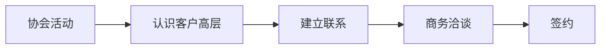

#### 渠道6：客户推荐

**老客户转介绍计划：**

**激励政策：**

推荐成功（签约），推荐人获得：
- 现金奖励：新客户首年采购额的2%
- 或价格折扣：本人下批订单额外5%折扣
- 或优先权：产能紧张时优先供应

**操作流程：**

1. 识别推荐人（合作良好的老客户）
2. 说明推荐计划（非正式场合提及）
3. 提供推荐工具（电子版推荐函模板）
4. 推荐人引荐（微信介绍、邀请参观等）
5. 跟进转化（销售及时跟进）
6. 兑现奖励（签约后1个月内）

**话术示例：**

"X总，我们最近想开拓一些新客户。您在行业里人脉广，能否帮忙推荐几个合适的客户？

如果推荐成功，我们有感谢政策：新客户首年采购额的2%现金奖励，或者您下批订单给额外5%折扣。

不知道您方不方便帮这个忙？"

**预期效果：**
- ✓ 每季度通过老客户推荐2-3个新客户
- ✓ 转化率高（有推荐人背书，信任度高）
- ✓ 成本低（相比展会、广告，ROI更高）

## 三、30分钟紧急响应机制

### 【紧急情况定义】

**什么算"紧急"？**

| 级别       | 响应时间           | 情况                                                         |
| ---------- | ------------------ | ------------------------------------------------------------ |
| 🔴 超级紧急 | 立即响应，30分钟内 | • 大客户质量投诉（批次不良、安全隐患）<br>• 重大商机（短时间内需要决策支持）<br>• 竞品恶性竞争（抹黑、不正当手段）<br>• 媒体负面报道（需要紧急公关） |
| 🟡 紧急     | 2小时内响应        | • 客户技术问题（影响生产）<br>• 商务谈判支持（需要数据、材料）<br>• 竞品价格战（需要应对策略）<br>• 重要客户拜访支持 |
| 🟢 重要     | 24小时内响应       | • 常规技术咨询<br>• 销售材料需求<br>• 客户背景调研<br>• 行业信息查询 |

### 【响应流程】

#### 超级紧急情况响应（30分钟）

**响应链：**

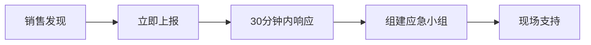

**步骤1：销售发现并上报（5分钟内）**

行动：
- 立即电话通知市场总监（不是微信，是电话！）
- 简要说明情况（谁、什么问题、多紧急）
- 发送书面情况说明（微信/邮件，附照片/录音）

话术：
"王总您好！我是XX，有紧急情况向您汇报。客户YY刚才反馈我们MCU有批次质量问题，已经影响到他们生产线，情况非常紧急。我需要技术支持和高层协调。"

**步骤2：市场总监评估（10分钟内）**

行动：
- 判断紧急程度（是否真的超级紧急）
- 决定响应级别（是否启动应急机制）
- 通知相关人员（FAE、质量、高层）

决策树：
- 如果是质量问题 → 启动质量应急预案
- 如果是商务问题 → 高层介入谈判
- 如果是公关危机 → 启动危机公关预案

**步骤3：组建应急小组（15分钟内）**

人员配置：
- 销售负责人×1（一线协调）
- FAE工程师×2（技术支持）
- 质量工程师×1（质量问题分析）
- 市场总监×1（资源协调）
- 高层×1（CEO/VP，必要时）

任务分工：
- 销售：客户沟通、现场协调
- FAE：技术问题诊断、解决方案
- 质量：质量问题调查、报告
- 市场：资源调配、媒体应对
- 高层：客户高层沟通、决策授权

**步骤4：现场支持（30分钟内出发）**

行动：
- 最近的FAE立即出发（自驾/打车/包车）
- 准备应急物资（测试设备、备品备件）
- 预订最快交通（飞机/高铁）
- 目标：6小时内到达客户现场（国内）

同步行动：
- 电话安抚客户（"我们非常重视，团队正在路上"）
- 准备应急方案（在路上就开始分析问题）
- 准备赔偿方案（预估损失，准备补偿）

#### 紧急情况响应（2小时）

**简化流程：**

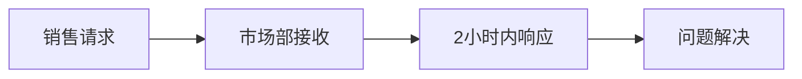

**示例：客户需要技术方案支持商务谈判**

销售请求（微信/邮件）：
"市场部，客户明天要决策，今晚需要一套技术对比方案。对比对象：瑞萨RH850 vs 我们M4系列。重点强调性价比。"

市场部响应（2小时内）：
- 调出标准对比表模板
- 根据客户需求定制（突出性价比）
- 补充最新数据（价格、交期）
- 发送给销售（PPT+Excel）

销售使用：
- 当晚修改完善（加入客户特定需求）
- 第二天谈判使用
- 谈判后反馈效果

### 【应急资源库】

**市场部常备资源：**

| 资源类别                    | 内容                                                         |
| --------------------------- | ------------------------------------------------------------ |
| 1. 标准材料库（随时可调用） | • 产品介绍PPT（6个产品）<br>• 竞品对比表（vs 瑞萨/NXP/英飞凌等）<br>• 成功案例（10+案例，Word/PDF）<br>• 技术白皮书（5份）<br>• 公司介绍视频（3分钟/10分钟版本） |
| 2. FAE资源池                | • 华东FAE：8人（上海、苏州、杭州）<br>• 华南FAE：7人（深圳、广州、东莞）<br>• 华北FAE：5人（北京、天津、西安）<br>• 24小时on-call（轮班制） |
| 3. 实物资源                 | • 样片库存：每个型号1000片（深圳/上海仓）<br>• 开发板：50套（可快递）<br>• 演示设备：10套（可携带） |
| 4. 资金授权                 | • 市场总监授权：单笔¥10万以内<br>• VP授权：单笔¥50万以内<br>• CEO授权：¥50万以上<br>• 应急情况：先执行后补审批 |
| 5. 合作伙伴资源             | • 第三方测试实验室（EMC、可靠性）<br>• 物流合作伙伴（紧急配送）<br>• 媒体资源（危机公关） |

---

# 第四部分:情报工具箱

## 一、麦肯锡式分析模板

### 【模板1:MECE框架(客户分析)】

**MECE = Mutually Exclusive, Collectively Exhaustive**
**= 相互独立,完全穷尽**

**应用:客户分类与优先级排序**

#### 维度1:客户类型

| 类型         | 子类型                                                       |
| ------------ | ------------------------------------------------------------ |
| 整车厂       | • 新势力(理想、小鹏、蔚来)<br>• 传统转型(吉利、长安)<br>• 商用车(宇通、福田) |
| Tier 1供应商 | • 座舱(德赛、华阳)<br>• 底盘(博世、采埃孚)<br>• 电池(宁德、比克) |

#### 维度2:采购量(年度)

- 大客户:200万颗+
- 中客户:50-200万颗
- 小客户:<50万颗

#### 维度3:成交难度

- 容易:已有国产MCU使用经验
- 中等:在评估国产替代
- 困难:固守国际品牌

#### 维度4:合作阶段

- 潜在客户:未接触
- 意向客户:已接触,在评估
- 合作客户:已签约
- 流失客户:曾合作,已流失

#### 分析矩阵:

**客户价值 vs 成交难度,划分为4个象限:**

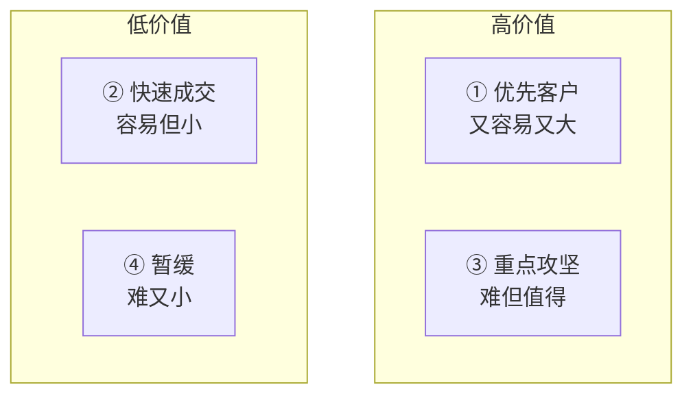

| 客户价值 | 容易                        | 困难                      |
| -------- | --------------------------- | ------------------------- |
| 高价值   | ① 优先客户<br/>(又容易又大) | ③ 重点攻坚<br/>(难但值得) |
| 低价值   | ② 快速成交<br/>(容易但小)   | ④ 暂缓<br/>(难又小)       |

#### 策略配置:

- ✓ ①优先客户:投入80%资源
- ✓ ②快速成交:标准化流程
- ✓ ③重点攻坚:高层介入,长期耕耘
- ✓ ④暂缓:标准服务,不主动投入

---

### 【模板2:5C分析框架(市场环境)】

**5C = Company, Customer, Competitor, Collaborator, Context**

**应用:新产品上市前的市场分析**

#### Company(我方分析)

| 类型             | 内容                                               |
| ---------------- | -------------------------------------------------- |
| 优势(Strengths)  | • 500万台实车验证<br>• 价格低30%<br>• 交期快(12周) |
| 劣势(Weaknesses) | • 品牌认知度低<br>• 高端产品线不全<br>• 国际化不足 |

#### Customer(客户分析)

- 需求:供应链安全、成本控制
- 痛点:国际品牌缺货、涨价
- 决策:技术评审→商务谈判→高层决策

#### Competitor(竞争对手)

| 类型 | 代表               | 优势           | 劣势         |
| ---- | ------------------ | -------------- | ------------ |
| 国际 | 瑞萨、NXP、英飞凌  | 技术强、品牌响 | 价格高、缺货 |
| 国产 | 兆易创新、中颖电子 | 价格低         | 车规经验少   |

#### Collaborator(合作伙伴)

- 上游:晶圆厂(自有)、设备商
- 下游:Tier 1供应商(渠道)
- 横向:行业协会、研究机构

#### Context(外部环境)

- 政策:国产替代、新能源补贴
- 经济:电动车高速增长
- 技术:MCU向高性能、低功耗发展
- 社会:供应链安全意识提升

#### 结论与策略:

**机会:**国产替代+供应链安全+成本压力  
**策略:**差异化定位(性价比+供应保障)  
**路径:**从中低端切入,逐步向上突破

---

## 二、Excel工具包

### 【工具1:客户情报数据库】

**文件名:客户情报数据库.xlsx**

#### 工作表1:客户基本信息

| 列名            | 说明               |
| --------------- | ------------------ |
| A. 客户名称     |                    |
| B. 客户类型     | 整车厂/Tier 1/其他 |
| C. 年产量/产值  |                    |
| D. 主营业务     |                    |
| E. 联系人(姓名) |                    |
| F. 联系人(职位) |                    |
| G. 联系人(电话) |                    |
| H. 联系人(邮箱) |                    |
| I. 决策链       | 技术/采购/高层     |
| J. 备注         |                    |

#### 工作表2:MCU使用现状

| 列名            | 说明  |
| --------------- | ----- |
| A. 客户名称     |       |
| B. 现有供应商   |       |
| C. 使用型号     |       |
| D. 年采购量     | 万颗  |
| E. 单价         | ¥     |
| F. 年度采购额   | 万元  |
| G. 应用场景     |       |
| H. 合同到期时间 |       |
| I. 客户满意度   | 1-5分 |

#### 工作表3:商机跟踪

| 列名            | 说明                     |
| --------------- | ------------------------ |
| A. 客户名称     |                          |
| B. 项目名称     |                          |
| C. 项目阶段     | 立项/评审/验证/谈判/签约 |
| D. 预计采购量   | 万颗                     |
| E. 预计单价     | ¥                        |
| F. 预计年度价值 | 万元                     |
| G. 竞争对手     |                          |
| H. 成交概率     | %                        |
| I. 预计签约时间 |                          |
| J. 责任销售     |                          |
| K. 下次跟进时间 |                          |
| L. 备注         |                          |

#### 工作表4:拜访记录

| 列名            | 说明 |
| --------------- | ---- |
| A. 日期         |      |
| B. 客户名称     |      |
| C. 拜访人       |      |
| D. 接待人       |      |
| E. 沟通内容摘要 |      |
| F. 客户反馈     |      |
| G. 下一步行动   |      |
| H. 下次拜访时间 |      |

**使用技巧:**

- ✓ 数据透视表分析(客户分布、商机统计)
- ✓ 条件格式(高亮重点客户、逾期跟进)
- ✓ 下拉菜单(标准化输入)
- ✓ 公式自动计算(年度价值=采购量×单价)

---

### 【工具2:竞品对标分析表】

**文件名:竞品对标分析.xlsx**

**工作表:MCU产品对比**

**行:对比维度**  
        **列:各家产品**

**对比维度**:

| 类别       | 维度                                                         |
| ---------- | ------------------------------------------------------------ |
| 基本参数   | • 内核<br>• 主频(MHz)<br>• Flash大小(KB)<br>• RAM大小(KB)<br>• 封装形式<br>• 工作温度(℃) |
| 性能指标   | • DMIPS(性能)<br>• 运行功耗(mA)<br>• 待机功耗(μA)<br>• ADC精度(bit)<br>• CAN通道数 |
| 认证与质量 | • AEC-Q100<br>• ISO 26262(ASIL等级)<br>• MTBF(小时)<br>• PPM |
| 商务条件   | • 单价(¥)<br>• MOQ(最小起订量)<br>• 交期(周)<br>• 付款条件   |
| 支持与服务 | • FAE响应时间<br>• 开发工具<br>• 技术文档<br>• 培训支持      |

**视觉化展示**:

- 雷达图:多维度对比(性能、价格、服务)
- 柱状图:价格对比
- 表格热力图:优势用绿色,劣势用红色

**使用场景**:

- ✓ 客户拜访时展示
- ✓ 商务谈判时对比
- ✓ 内部培训材料

---

### 【工具3:TCO总拥有成本计算器】

**文件名:TCO计算器.xlsx**

输入区:

**项目基本信息:**
- 项目名称:_________
- 项目周期:_____年
- 预计产量:_____台/年
- 单车MCU用量:_____颗

**方案对比:**

| 项目     | 方案A(竞品) | 方案B(我们) |
| -------- | ----------- | ----------- |
| 单价     | ¥_____      | ¥_____      |
| 开发周期 | _____月     | _____月     |
| 交期     | _____周     | _____周     |

**自动计算区:**

| 成本维度         | 方案A  | 方案B  | 差异 |
| ---------------- | ------ | ------ | ---- |
| **1. 采购成本**  |        |        |      |
| • 单价           | ¥__    | ¥__    | ▼__  |
| • 年度用量       | __万颗 | __万颗 |      |
| • 年度采购额     | ¥__    | ¥__    | ▼__  |
| • 项目周期总成本 | ¥__    | ¥__    | ▼__  |
| **2. 开发成本**  |        |        |      |
| • 开发周期       | __月   | __月   |      |
| • 人力成本       | ¥__    | ¥__    | ▼__  |
| • 工具成本       | ¥__    | ¥__    | ▼__  |
| • 认证成本       | ¥__    | ¥__    | ▼__  |
| **3. 风险成本**  |        |        |      |
| • 缺货风险       | ¥__    | ¥__    | ▼__  |
| • 质量风险       | ¥__    | ¥__    | ▼__  |
| • 涨价风险       | ¥__    | ¥__    | ▼__  |
| **TCO总成本**    | ¥__    | ¥__    | ▼__  |
| **节省比例**     |        | __%    |      |

输出:

- 对比柱状图(直观展示成本差异)
- 饼图(成本构成分析)
- 结论报告(自动生成文字说明)

使用场景:

- ✓ 客户砍价时展示TCO
- ✓ 商务谈判支持
- ✓ 项目立项评估

---

## 三、信息源清单

### 【信息源分类】

#### 类型1:行业媒体

**半导体行业:**

| 媒体           | 网址              | 用途                     | 更新频率 |
| -------------- | ----------------- | ------------------------ | -------- |
| 芯智讯         | www.xinzhixun.com | 半导体行业新闻、深度分析 | 每日     |
| 集微网         | www.jiweinet.com  | 半导体供应链、市场数据   | 每日     |
| 半导体行业观察 | 微信公众号        | 行业评论、趋势分析       | 每日     |

**汽车行业:**

| 媒体           | 网址              | 用途                 | 更新频率 |
| -------------- | ----------------- | -------------------- | -------- |
| 盖世汽车       | www.gasgoo.com    | 汽车供应链、新车动态 | 每日     |
| 车云网         | www.cheyun.com    | 智能汽车、技术趋势   | 每日     |
| 电动汽车资源网 | www.evpartner.com | 新能源汽车政策、市场 | 每日     |

#### 类型2:市场研究报告

**付费数据库:**

| 机构                       | 内容               | 费用      | 价值  |
| -------------------------- | ------------------ | --------- | ----- |
| IC Insights                | MCU市场规模、预测  | $5000/年  | ⭐⭐⭐⭐⭐ |
| IHS Markit(现为S&P Global) | 汽车半导体市场分析 | $10000/年 | ⭐⭐⭐⭐⭐ |
| Gartner                    | 半导体行业趋势     | $15000/年 | ⭐⭐⭐⭐  |

**免费资源:**

| 机构               | 网址                 | 内容                   |
| ------------------ | -------------------- | ---------------------- |
| 中国汽车工业协会   | www.caam.org.cn      | 汽车产销数据(月度)     |
| 中国半导体行业协会 | www.csia.net.cn      | 半导体产业报告(年度)   |
| 艾瑞咨询           | www.iresearch.com.cn | 行业研究报告(部分免费) |

#### 类型3:竞品信息

**官方渠道:**

| 渠道     | 来源                                                         | 内容                          |
| -------- | ------------------------------------------------------------ | ----------------------------- |
| 竞品官网 | • 瑞萨:www.renesas.com<br>• NXP:www.nxp.com<br>• 英飞凌:www.infineon.com<br>• 兆易创新:www.gigadevice.com | 产品参数、新闻、白皮书        |
| 竞品财报 | 公司投资者关系网站                                           | 营收、产品线、战略(季度/年度) |
| 竞品专利 | 国家知识产权局、Google Patents                               | 技术方向、研发投入            |

**非官方渠道:**

| 渠道       | 内容                                  |
| ---------- | ------------------------------------- |
| 客户反馈   | 竞品价格、服务、问题(一线销售收集)    |
| 行业展会   | 竞品新产品、市场策略                  |
| 离职员工   | 竞品内部运作、策略(合规前提下)        |
| 第三方评测 | 产品性能对比(电子工程专辑、EDN China) |

#### 类型4:客户信息

**公开信息:**

| 渠道          | 内容                                     |
| ------------- | ---------------------------------------- |
| 企业官网      | 公司介绍、产品、新闻                     |
| 天眼查/企查查 | 工商信息、股权结构、诉讼                 |
| 招聘网站      | 组织架构、人员规模、项目(Boss直聘、拉勾) |
| 社交媒体      | 公司动态、高管观点(微信、微博、LinkedIn) |

**内部渠道:**

- 销售拜访记录
- 技术交流会纪要
- 客户投诉/反馈记录
- 合同/订单记录

---

### 【情报收集SOP】

#### 日常情报收集(每日):

**时间:**每天早上9:00-10:00  
**负责人:**市场专员×1

**任务清单:**
- ✓ 浏览5个核心媒体(芯智讯、集微网、盖世汽车等)
- ✓ 搜索关键词新闻("车规MCU"、"比亚迪半导体"、竞品公司名)
- ✓ 整理当日要闻(3-5条)
- ✓ 发送到销售团队群(微信/邮件)

#### 周度情报汇总(每周):

**时间:**每周五下午  
**负责人:**市场经理×1

**输出:**周度情报简报(PPT,5-10页)

**内容:**
- 行业动态(政策、技术、市场)
- 竞品动态(新产品、新客户、新闻)
- 客户动态(新车型、新项目、人事变动)
- 下周重点关注(可能影响我们的事件)

**分发:**销售团队全员、公司高层

#### 月度深度分析(每月):

**时间:**每月第一周  
**负责人:**市场总监×1

**输出:**月度市场分析报告(Word,20-30页)

**内容:**
- 市场规模与增长趋势
- 竞争格局变化
- 客户需求变化
- 我方市场份额
- 下月策略建议

**分发:**销售团队、市场团队、公司高管

---

## 📚 附录:快速查询索引

#### 销售场景速查:

| 场景           | 位置               |
| -------------- | ------------------ |
| 客户砍价       | 销售场景剧本,场景1 |
| 竞品挖墙脚     | 销售场景剧本,场景2 |
| 独家供应要求   | 销售场景剧本,场景3 |
| 技术测试不通过 | 销售场景剧本,场景4 |
| 质量投诉       | 销售场景剧本,场景5 |
| 新客户开发     | 销售场景剧本,场景6 |
| 商务谈判僵局   | 销售场景剧本,场景7 |
| 丢单复盘       | 销售场景剧本,场景8 |

#### 产品情报速查:

| 产品        | 位置                   |
| ----------- | ---------------------- |
| IGBT模块    | 第一部分：产品线情报库 |
| SiC功率器件 | 第一部分：产品线情报库 |
| 摄像头模组  | 第一部分：产品线情报库 |
| 车规LED     | 第一部分：产品线情报库 |
| 电流传感器  | 第一部分：产品线情报库 |
| MCU微控制器 | 第一部分：产品线情报库 |


---

## ✅ 手册使用检查清单

#### 新销售入职(第1周):

- □ 通读手册一遍(了解框架)
- □ 熟记6大产品核心优势
- □ 背诵3个典型客户案例
- □ 练习5个标准销售话术
- □ 学习使用Excel工具包

#### 客户拜访前(每次):

- □ 查询客户情报卡片
- □ 准备对应产品材料
- □ 准备竞品对比表
- □ 预演销售话术
- □ 确认FAE支持安排

#### 商务谈判前(每次):

- □ 制作TCO对比表
- □ 准备阶梯式让步方案
- □ 确认价格授权范围
- □ 准备成功案例背书
- □ 演练谈判话术

#### 月度复盘(每月):

- □ 更新客户情报数据库
- □ 总结本月成功/失败案例
- □ 分享竞品最新动态
- □ 提出手册改进建议
- □ 学习新增销售工具

---

## 📞 紧急联系方式

#### 内部支持:

| 部门        | 电话          | 服务时间 |
| ----------- | ------------- | -------- |
| 市场部热线  | XXX-XXXX-XXXX | 24小时   |
| FAE紧急支持 | XXX-XXXX-XXXX | 24小时   |
| 质量部应急  | XXX-XXXX-XXXX | 工作时间 |
| 销售总监    | XXX-XXXX-XXXX | 工作时间 |
| 市场VP      | XXX-XXXX-XXXX | 重大事项 |

#### 外部资源:

| 服务             | 电话          |
| ---------------- | ------------- |
| 第三方测试实验室 | XXX-XXXX-XXXX |
| 紧急物流         | XXX-XXXX-XXXX |
| 媒体公关         | XXX-XXXX-XXXX |
